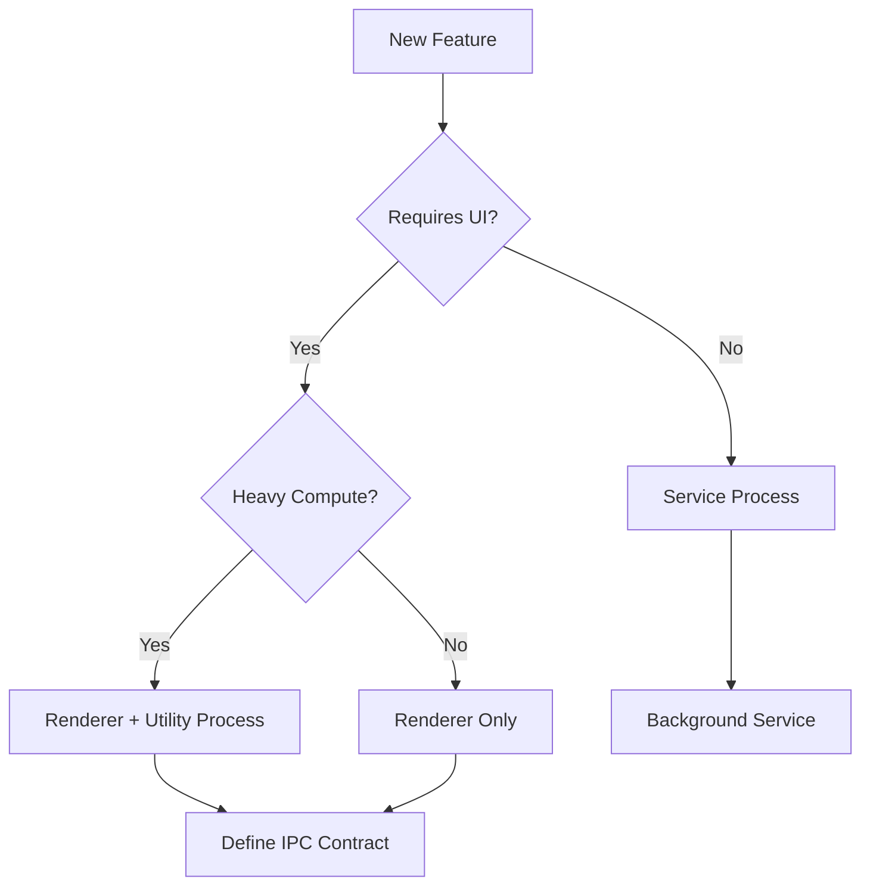

# Electron Decision Gates & Quick Reference

## 🚦 Automated Decision Checkpoints

### Gate 1: Architecture Selection
**Trigger**: Starting new feature/module



**Validation Questions**:
1. Will this run in renderer or main process?
2. Does it need direct file system access?
3. Will it handle >10MB data?
4. Does it interact with extensions?

**Memory Check**: `aim_search_nodes({context: "alphanumeric", query: "ProcessIsolation"})`

---

### Gate 2: IPC Strategy Selection
**Trigger**: Any inter-process communication

| Data Volume | Frequency | Pattern | Implementation |
|------------|-----------|---------|----------------|
| <1KB | <10/sec | Request-Response | Simple async IPC |
| <10KB | <100/sec | Streaming | Batched IPC (50ms) |
| >10KB | Any | Bulk Transfer | SharedArrayBuffer |
| >100KB | Any | File Transfer | File path + streaming |

**Anti-Pattern Alert**: 
```javascript
// ❌ NEVER DO THIS
const result = ipcRenderer.sendSync('getData') // BLOCKS UI!

// ✅ ALWAYS DO THIS
ipcRenderer.send('getData')
ipcRenderer.once('getData-reply', (event, result) => {})
```

---

### Gate 3: Performance Optimization
**Trigger**: Performance issue detected

```
Performance Issue Detected
    ↓
1. Measure: Use Chrome DevTools Performance tab
2. Identify: Check against known patterns
3. Apply: Use optimization from guide
4. Validate: Confirm improvement
5. Document: Update memory graph
```

**Quick Fixes**:
- **Slow Startup** → Check V8 snapshot implementation
- **Memory Growth** → Audit event listeners and closures
- **UI Jank** → Profile renderer process, move to worker
- **IPC Delays** → Implement batching strategy

---

### Gate 4: Security Review
**Trigger**: Before any release

| Component | Security Check | Implementation |
|-----------|---------------|----------------|
| Renderer | Context Isolation? | `contextIsolation: true` |
| Preload | Context Bridge Only? | No Node.js APIs exposed |
| IPC | Input Validation? | Validate all IPC messages |
| Extensions | Sandboxed? | Run in utility process |
| Web Content | CSP Headers? | Strict CSP policy |

---

## 🚀 Quick Decision Matrix

### "Should I use..." Decisions

**Electron vs Web App?**
- Need file system access? → Electron
- Need system tray? → Electron  
- Need native menus? → Electron
- Just UI? → Consider web-first

**Native Module vs WebAssembly?**
- Platform-specific optimization? → Native
- Cross-platform compute? → WebAssembly
- Complex algorithms? → WebAssembly
- System APIs? → Native

**Worker Thread vs Utility Process?**
- Shared memory needed? → Worker Thread
- Complete isolation? → Utility Process
- Extension code? → Utility Process
- Data processing? → Worker Thread

---

## ⚡ Performance Quick Reference

### Startup Optimization Checklist
```
□ V8 snapshot configured
□ Lazy loading implemented  
□ Code splitting active
□ Preload optimized
□ require() calls minimized
```

### Memory Optimization Checklist
```
□ Event listeners cleaned up
□ Large data streamed
□ Virtual scrolling for lists
□ WeakMaps for caches
□ Proper dispose() methods
```

### IPC Optimization Checklist
```
□ No synchronous IPC
□ Messages batched
□ Large data passed by reference
□ Unnecessary updates filtered
□ MessagePorts for direct communication
```

---

## 🔧 Common Patterns Library

### Pattern: Large File Handling
```javascript
// Stream processing approach
const stream = fs.createReadStream(filePath)
stream.on('data', chunk => {
  // Process chunk, don't load all
  processChunk(chunk)
})
```

### Pattern: Extension Communication
```javascript
// Utility process isolation
const extensionProcess = utilityProcess.fork('extension.js')
extensionProcess.on('message', (msg) => {
  // Handle sandboxed extension message
})
```

### Pattern: Performance Monitoring
```javascript
// Production profiling
if (process.env.NODE_ENV === 'production') {
  performance.mark('feature-start')
  // ... feature code ...
  performance.measure('feature', 'feature-start')
}
```

---

## 📊 Metrics Thresholds

| Metric | Excellent | Good | Needs Work | Critical |
|--------|-----------|------|------------|----------|
| Startup | <1s | <2s | <3s | >3s |
| Memory (idle) | <100MB | <200MB | <300MB | >300MB |
| Frame Rate | 60fps | 30fps | 20fps | <20fps |
| IPC Latency | <8ms | <16ms | <33ms | >33ms |
| Crash Rate | <0.01% | <0.1% | <1% | >1% |

---

## 🔄 Continuous Improvement Loop

1. **Weekly Performance Review**
   ```javascript
   aim_search_nodes({context: "alphanumeric", query: "optimization"})
   // Review what patterns were applied
   ```

2. **Pattern Success Tracking**
   ```javascript
   aim_add_observations({
     context: "alphanumeric",
     observations: [{
       entityName: "V8Snapshots",
       contents: ["Reduced startup by 0.8s in voice-terminal"]
     }]
   })
   ```

3. **Anti-Pattern Discovery**
   ```javascript
   aim_create_entities({
     context: "alphanumeric",
     entities: [{
       name: "NewAntiPattern",
       entityType: "anti_pattern",
       observations: ["Description of what not to do"]
     }]
   })
   ```

---

**Remember**: These gates are checkpoints, not roadblocks. They ensure we build on solid foundations. When a gate triggers, it's an opportunity to apply our research and build better.