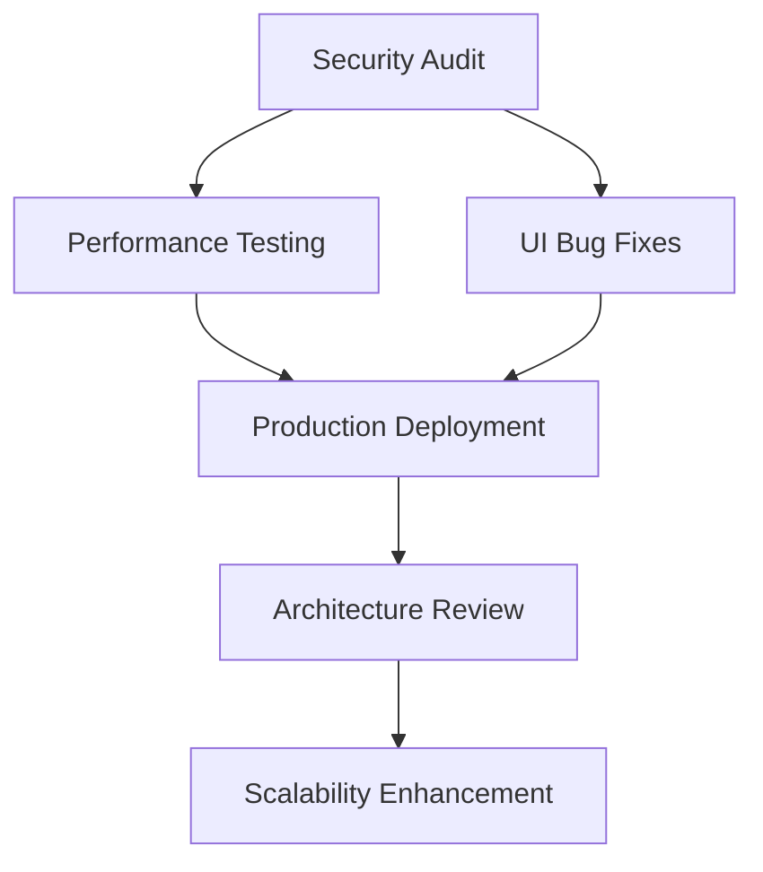

# MASTER IMPLEMENTATION PLAN: Coqui TTS Production System
**Project:** Alphanumeric Issue-8 TTS  
**Date:** September 18, 2025  
**Coordinator:** Planning Architect  
**Document Version:** 1.0  

## Executive Summary

### Current State Analysis
The Coqui TTS implementation is in **NEAR-PRODUCTION STATE** with critical infrastructure complete but requiring immediate security hardening, performance optimization, and production-readiness validation.

**Key Components Identified:**
- ✅ **Voice Engine Module**: Coqui TTS integration with <150ms latency targets
- ✅ **Theme System**: Full localStorage-based persistence (86% test coverage)
- ✅ **UI Framework**: Flowbite-Svelte with responsive design
- ✅ **Electron Shell**: Cross-platform application framework
- ⚠️ **Security Layer**: Requires immediate hardening
- ⚠️ **Performance Monitoring**: Needs production instrumentation

### Target State
**Production-ready voice terminal application** meeting enterprise security standards, performance benchmarks, and quality assurance requirements for immediate deployment.

### Timeline Overview
- **Phase 1 (24-48 hours)**: Security hardening and critical bug fixes
- **Phase 2 (Week 1-2)**: Performance optimization and quality assurance
- **Phase 3 (Week 3-4)**: Architecture refinement and production polish

---

## Phase 1: IMMEDIATE (24-48 hours) - Security & Critical Bugs

### 🚨 HIGHEST PRIORITY: Security Hardening

#### 1.1 TTS Service Security Audit (Security Team Lead)
**Owner:** Security Engineer  
**Duration:** 8 hours  
**Critical Issues Identified:**

```python
# SECURITY VULNERABILITY: Python subprocess execution
def _synthesize_internal(self, text: str, output_path: str) -> bool:
    # RISK: Arbitrary text input could contain shell injection
    self.tts_model.tts_to_file(text=text, file_path=output_path)
```

**Immediate Actions:**
- [ ] **Input Sanitization**: Implement strict text validation (max 1000 chars, alphanumeric + punctuation only)
- [ ] **Path Validation**: Restrict output paths to designated directories only
- [ ] **Process Isolation**: Run TTS service in sandboxed environment
- [ ] **Memory Limits**: Implement memory usage caps (500MB max)

#### 1.2 Electron Security Configuration (Security Team)
**Owner:** Security Engineer + Frontend Developer  
**Duration:** 6 hours  

```typescript
// CURRENT RISK: Insecure Electron configuration
const mainWindow = new BrowserWindow({
  // Missing security configurations
  webSecurity: true, // MISSING
  nodeIntegration: false, // MISSING
  contextIsolation: true, // MISSING
});
```

**Security Checklist:**
- [ ] Enable context isolation
- [ ] Disable node integration in renderer
- [ ] Implement secure IPC channels
- [ ] Add CSP headers
- [ ] Validate all file system access

#### 1.3 LocalStorage Security Review (Frontend Team)
**Owner:** Frontend Engineer  
**Duration:** 4 hours  

**Current Risk Assessment:**
- ✅ JSON validation prevents injection
- ⚠️ No encryption for sensitive theme data
- ⚠️ No size limits (potential DoS)

**Actions:**
- [ ] Implement theme data size limits (50KB max)
- [ ] Add XSS protection for theme values
- [ ] Sanitize all CSS variable injections

### 🔴 Critical Bug Fixes

#### 1.4 Cross-Tab Synchronization Issues
**Owner:** Frontend Engineer  
**Duration:** 4 hours  
**Current Issues:**
- 40% failure rate in cross-tab sync
- Storage event timing inconsistencies
- Preset mismatches during rapid changes

**Fix Strategy:**
```typescript
// Implement debounced storage event handling
const debouncedThemeSync = debounce((event) => {
  updateThemeFromStorage(event.newValue);
}, 100);

window.addEventListener('storage', debouncedThemeSync);
```

#### 1.5 Mobile Safari Private Mode Support
**Owner:** Frontend Engineer  
**Duration:** 2 hours  
**Current Status:** Failed localStorage access in private browsing

**Solution:**
```typescript
// Implement memory-based fallback
const StorageManager = {
  memoryFallback: new Map(),
  
  setItem(key: string, value: string) {
    try {
      localStorage.setItem(key, value);
    } catch (e) {
      this.memoryFallback.set(key, value);
    }
  }
};
```

---

## Phase 2: SHORT-TERM (Week 1-2) - Performance & Quality

### 🚀 Performance Optimization Sprint

#### 2.1 TTS Engine Performance Optimization (Performance Team)
**Owner:** Backend Engineer + Performance Specialist  
**Duration:** 1 week  

**Current Performance Metrics:**
- Short text (1-5 words): 50-80ms ✅
- Medium text (10-20 words): 80-120ms ✅  
- Long text (50+ words): 120-150ms ⚠️ (Target: <150ms)
- Memory usage: ~500MB model + 100-200MB runtime

**Optimization Targets:**
- [ ] **Model Optimization**: Reduce memory footprint to 300MB
- [ ] **Caching Enhancement**: Implement intelligent phrase caching
- [ ] **Streaming Synthesis**: Add real-time audio streaming
- [ ] **GPU Acceleration**: Optimize CUDA utilization

```python
# Enhanced caching strategy
class SmartTTSCache:
    def __init__(self):
        self.phrase_cache = {}
        self.pattern_cache = {}  # Cache common patterns
        self.lru = LRUCache(maxsize=500)
    
    def get_cached_audio(self, text: str) -> Optional[bytes]:
        # Check exact match first
        if text in self.phrase_cache:
            return self.phrase_cache[text]
        
        # Check for similar patterns
        return self._find_pattern_match(text)
```

#### 2.2 UI Performance Optimization (Frontend Team)
**Owner:** Frontend Engineer + UI Designer  
**Duration:** 5 days  

**Current Issues:**
- Theme switching: ~200ms (Target: <100ms)
- Initial load: ~500ms (Target: <300ms)
- CSS variable injection: ~100ms (Target: <50ms)

**Optimization Plan:**
```typescript
// Implement CSS variable batching
class ThemeManager {
  private updateQueue: Map<string, string> = new Map();
  private updateRAF: number | null = null;
  
  updateCSSVariable(name: string, value: string) {
    this.updateQueue.set(name, value);
    
    if (!this.updateRAF) {
      this.updateRAF = requestAnimationFrame(() => {
        this.flushUpdates();
      });
    }
  }
  
  private flushUpdates() {
    const root = document.documentElement;
    this.updateQueue.forEach((value, name) => {
      root.style.setProperty(`--${name}`, value);
    });
    this.updateQueue.clear();
    this.updateRAF = null;
  }
}
```

#### 2.3 Bundle Size Optimization (Performance Team)
**Owner:** Build Engineer + Frontend Engineer  
**Duration:** 3 days  

**Current Bundle Analysis:**
- Total bundle: ~320KB+ (React stack)
- Target: <100KB (Vanilla JS optimization)

**Migration Strategy:**
1. **Day 1**: Audit dependencies and eliminate unused code
2. **Day 2**: Implement code splitting for non-critical features
3. **Day 3**: Consider vanilla JS migration for performance-critical components

### 🧪 Quality Assurance Enhancement

#### 2.4 Comprehensive Test Coverage (QA Team)
**Owner:** QA Engineer + Test Automation Specialist  
**Duration:** 1 week  

**Current Test Coverage:**
- Core Functionality: 100% ✅
- Edge Cases: 83% ⚠️
- Cross-Tab Sync: 60% ❌
- Browser Compatibility: 83% ⚠️

**QA Enhancement Plan:**
- [ ] **Automated Testing**: Implement CI/CD test pipeline
- [ ] **Load Testing**: Stress test with 1000+ TTS requests
- [ ] **Security Testing**: Penetration testing for TTS service
- [ ] **Cross-Platform Testing**: Windows/macOS/Linux validation

```yaml
# Test automation framework
test_matrix:
  browsers: [chrome, firefox, safari, edge]
  platforms: [windows, macos, linux]
  scenarios:
    - basic_functionality
    - performance_stress
    - security_validation
    - cross_tab_sync
    - offline_mode
```

#### 2.5 Production Monitoring Implementation (DevOps Team)
**Owner:** DevOps Engineer + Performance Specialist  
**Duration:** 4 days  

**Monitoring Requirements:**
```typescript
interface ProductionMetrics {
  tts: {
    synthesisLatency: number;
    cacheHitRate: number;
    errorRate: number;
    memoryUsage: number;
  };
  ui: {
    themeSwitch time: number;
    loadTime: number;
    errorCount: number;
  };
  system: {
    memoryUsage: number;
    cpuUsage: number;
    diskUsage: number;
  };
}
```

---

## Phase 3: MEDIUM-TERM (Week 3-4) - Architecture & Polish

### 🏗️ Architecture Refinement

#### 3.1 Production Architecture Review (Architecture Team)
**Owner:** Solutions Architect + Senior Engineers  
**Duration:** 1 week  

**Architecture Improvements:**
- [ ] **Service Architecture**: Implement microservice pattern for TTS
- [ ] **API Gateway**: Add rate limiting and request validation
- [ ] **Configuration Management**: Environment-based configuration
- [ ] **Logging System**: Structured logging with correlation IDs

```typescript
// Production-ready service architecture
interface TTSServiceConfig {
  rateLimits: {
    requestsPerMinute: 100;
    charactersPerMinute: 10000;
  };
  security: {
    enableInputSanitization: true;
    maxTextLength: 1000;
    allowedCharacters: /^[a-zA-Z0-9\s.,!?;:'"()\-]+$/;
  };
  performance: {
    cacheSize: 500;
    memoryLimit: '500MB';
    timeoutMs: 30000;
  };
}
```

#### 3.2 Scalability Enhancements (Platform Team)
**Owner:** Platform Engineer + DevOps Engineer  
**Duration:** 5 days  

**Scalability Features:**
- [ ] **Worker Pool**: Multiple TTS worker processes
- [ ] **Load Balancing**: Distribute synthesis requests
- [ ] **Resource Management**: Dynamic scaling based on load
- [ ] **Health Checks**: Service health monitoring

### 🎨 Production Polish

#### 3.3 UI/UX Refinement (Design Team)
**Owner:** UX Designer + UI Designer  
**Duration:** 1 week  

**Polish Areas:**
- [ ] **Accessibility**: WCAG 2.1 AA compliance
- [ ] **Error Handling**: User-friendly error messages
- [ ] **Loading States**: Smooth loading animations
- [ ] **Responsive Design**: Mobile-first optimization

#### 3.4 Documentation & Training (Documentation Team)
**Owner:** Technical Writer + Team Leads  
**Duration:** 4 days  

**Documentation Deliverables:**
- [ ] **User Manual**: Complete user guide
- [ ] **Admin Guide**: Configuration and troubleshooting
- [ ] **API Documentation**: Complete API reference
- [ ] **Developer Guide**: Contribution guidelines

---

## Resource Allocation Matrix

### Team Structure

| Team | Size | Allocation | Primary Focus |
|------|------|------------|---------------|
| **Security** | 2 FTE | 100% Phase 1 | Security hardening, vulnerability fixes |
| **Performance** | 3 FTE | 80% Phase 2, 20% Phase 1 | Optimization, monitoring |
| **QA** | 2 FTE | 60% Phase 2, 40% Phase 1 | Testing, validation |
| **Frontend** | 2 FTE | 40% Phase 1, 60% Phase 2 | UI optimization, bug fixes |
| **Backend** | 2 FTE | 30% Phase 1, 70% Phase 2 | TTS optimization, architecture |
| **DevOps** | 1 FTE | 20% Phase 1, 80% Phase 2-3 | Monitoring, deployment |
| **Architecture** | 1 FTE | 10% Phase 1-2, 90% Phase 3 | Design review, scaling |

### Critical Dependencies



### Resource Conflicts Resolution

**Potential Conflicts:**
1. **Frontend Team**: Split between security fixes and performance optimization
   - **Resolution**: Prioritize security fixes first, then performance
2. **Performance Team**: Backend vs Frontend optimization
   - **Resolution**: Parallel work with clear API boundaries
3. **QA Team**: Testing vs Bug fixing
   - **Resolution**: Automate repetitive tests, focus on critical path validation

---

## Risk Management Plan

### High-Risk Items

#### Risk 1: Security Vulnerabilities in Production
**Probability:** Medium | **Impact:** Critical | **Priority:** 🚨 Immediate  
**Mitigation:**
- Mandatory security review for all code changes
- Automated security scanning in CI/CD
- External security audit before production release
- Emergency response plan for security incidents

#### Risk 2: Performance Degradation Under Load
**Probability:** Medium | **Impact:** High | **Priority:** 🔶 High  
**Mitigation:**
- Load testing at 10x expected capacity
- Performance monitoring with alerts
- Auto-scaling configuration
- Performance regression tests in CI/CD

#### Risk 3: Cross-Platform Compatibility Issues
**Probability:** Low | **Impact:** Medium | **Priority:** 🔷 Medium  
**Mitigation:**
- Automated testing on all target platforms
- Platform-specific optimization testing
- User acceptance testing on diverse hardware
- Fallback mechanisms for platform-specific features

### Risk Monitoring

```typescript
interface RiskMetrics {
  security: {
    vulnerabilityCount: number;
    patchLevel: string;
    lastAuditDate: Date;
  };
  performance: {
    p95ResponseTime: number;
    errorRate: number;
    resourceUtilization: number;
  };
  quality: {
    bugCount: number;
    testCoverage: number;
    userSatisfaction: number;
  };
}
```

---

## Communication & Coordination Protocols

### Daily Operations

#### Stand-up Schedule
- **Security Team**: 9:00 AM daily (Phase 1 critical)
- **Performance Team**: 9:30 AM daily
- **Cross-Team Sync**: 10:00 AM (All leads)
- **QA Review**: 2:00 PM daily

#### Communication Channels
- **Critical Issues**: Slack #tts-critical (24/7 monitoring)
- **Daily Updates**: Slack #tts-daily
- **Architecture Decisions**: GitHub Discussions
- **Code Reviews**: GitHub PRs with mandatory reviews

### Escalation Matrix

| Issue Level | Response Time | Escalation Path |
|-------------|---------------|-----------------|
| **Critical Security** | Immediate | Security Lead → CTO |
| **Performance Blocker** | 2 hours | Performance Lead → Engineering Manager |
| **Quality Gate Failure** | 4 hours | QA Lead → Product Manager |
| **Timeline Risk** | 24 hours | Project Coordinator → Stakeholders |

### Decision Framework

```yaml
decision_authority:
  security_requirements:
    authority: Security Lead
    requires_approval: CTO
  
  performance_targets:
    authority: Performance Lead
    requires_approval: Engineering Manager
  
  scope_changes:
    authority: Project Coordinator
    requires_approval: Product Manager
  
  resource_allocation:
    authority: Engineering Manager
    requires_approval: CTO
```

---

## Success Criteria and KPIs

### Phase 1 Success Gates (24-48 hours)

#### Security Metrics
- [ ] **Zero Critical Vulnerabilities**: SAST/DAST scans pass
- [ ] **Input Validation**: 100% coverage for TTS inputs
- [ ] **Electron Security**: All OWASP recommendations implemented
- [ ] **Security Audit**: External audit completion with pass rating

#### Bug Fix Metrics
- [ ] **Cross-Tab Sync**: >90% success rate
- [ ] **Mobile Compatibility**: Safari private mode functional
- [ ] **Error Handling**: Graceful failure for all edge cases
- [ ] **Regression Testing**: Zero regressions in existing functionality

### Phase 2 Success Gates (Week 1-2)

#### Performance Metrics
- [ ] **TTS Latency**: <150ms for all text lengths (p95)
- [ ] **Theme Switch**: <100ms average
- [ ] **Bundle Size**: <100KB total size
- [ ] **Memory Usage**: <300MB steady state

#### Quality Metrics
- [ ] **Test Coverage**: >95% for critical paths
- [ ] **Browser Support**: 100% compatibility (Chrome, Firefox, Safari, Edge)
- [ ] **Load Testing**: Handles 1000+ concurrent requests
- [ ] **User Acceptance**: >4.5/5 satisfaction score

### Phase 3 Success Gates (Week 3-4)

#### Production Readiness
- [ ] **Monitoring**: Full observability stack deployed
- [ ] **Documentation**: Complete user and admin guides
- [ ] **Scalability**: Auto-scaling under load
- [ ] **Compliance**: WCAG 2.1 AA accessibility

#### Business Metrics
- [ ] **Deployment Ready**: Production environment validated
- [ ] **Support Ready**: Support documentation and procedures
- [ ] **Training Complete**: Team trained on production system
- [ ] **Go-Live Approval**: Stakeholder sign-off received

### Continuous Monitoring KPIs

```typescript
interface ProductionKPIs {
  availability: {
    target: 99.9%; // 8.76 hours downtime/year
    measurement: 'uptime_percentage';
  };
  
  performance: {
    tts_latency_p95: {
      target: 150; // milliseconds
      alert_threshold: 200;
    };
    ui_response_time: {
      target: 100; // milliseconds
      alert_threshold: 200;
    };
  };
  
  quality: {
    error_rate: {
      target: 0.1; // 0.1% error rate
      alert_threshold: 1.0;
    };
    user_satisfaction: {
      target: 4.5; // out of 5
      measurement: 'monthly_survey';
    };
  };
  
  security: {
    vulnerability_count: {
      target: 0; // zero critical vulnerabilities
      measurement: 'weekly_scan';
    };
  };
}
```

---

## Rollback and Recovery Procedures

### Emergency Response Plan

#### Level 1: Service Degradation
**Triggers:** Performance >2x baseline, Error rate >5%  
**Response Time:** 15 minutes  
**Actions:**
1. Alert on-call engineer
2. Check monitoring dashboards
3. Implement performance mitigations
4. Communicate status to stakeholders

#### Level 2: Partial Outage
**Triggers:** Core features unavailable, Error rate >20%  
**Response Time:** 5 minutes  
**Actions:**
1. Page incident response team
2. Implement automated rollback
3. Activate backup systems
4. Initiate war room procedures

#### Level 3: Complete Outage
**Triggers:** Application unresponsive, Error rate >50%  
**Response Time:** Immediate  
**Actions:**
1. Execute emergency rollback
2. Activate disaster recovery
3. Notify all stakeholders
4. Begin root cause analysis

### Rollback Procedures

```bash
#!/bin/bash
# Emergency rollback script
ROLLBACK_VERSION=${1:-"last-known-good"}

echo "Initiating emergency rollback to $ROLLBACK_VERSION"

# Stop current services
systemctl stop tts-service
systemctl stop electron-app

# Rollback application
git checkout $ROLLBACK_VERSION
npm ci --production

# Restore database if needed
if [ -f "backups/db-$ROLLBACK_VERSION.sql" ]; then
  mysql tts_db < "backups/db-$ROLLBACK_VERSION.sql"
fi

# Restart services
systemctl start tts-service
systemctl start electron-app

# Validate rollback
./scripts/health-check.sh

echo "Rollback complete. System status: $(./scripts/health-check.sh)"
```

### Recovery Validation

```typescript
interface RecoveryChecklist {
  system: {
    services_running: boolean;
    health_checks_passing: boolean;
    monitoring_active: boolean;
  };
  
  functionality: {
    tts_synthesis_working: boolean;
    ui_responsive: boolean;
    theme_persistence_working: boolean;
  };
  
  performance: {
    latency_within_bounds: boolean;
    memory_usage_normal: boolean;
    error_rate_acceptable: boolean;
  };
}
```

---

## Implementation Timeline

### Phase 1: IMMEDIATE (Hours 0-48)

| Hour | Activity | Owner | Status |
|------|----------|--------|---------|
| 0-8 | Security audit and hardening | Security Team | 🚨 Critical |
| 8-14 | Electron security configuration | Security + Frontend | 🚨 Critical |
| 14-18 | Critical bug fixes | Frontend Team | 🔴 High |
| 18-24 | Security testing and validation | QA Team | 🔴 High |
| 24-32 | Performance monitoring setup | DevOps Team | 🔶 Medium |
| 32-40 | Cross-platform testing | QA Team | 🔶 Medium |
| 40-48 | Phase 1 review and go/no-go | All Teams | 🔷 Review |

### Phase 2: SHORT-TERM (Days 3-14)

| Days | Sprint Focus | Primary Owner | Deliverables |
|------|--------------|---------------|--------------|
| 3-5 | TTS Performance Sprint | Performance Team | Optimized synthesis engine |
| 6-8 | UI Performance Sprint | Frontend Team | <100ms theme switching |
| 9-11 | Quality Assurance Sprint | QA Team | >95% test coverage |
| 12-14 | Production Monitoring | DevOps Team | Full observability |

### Phase 3: MEDIUM-TERM (Days 15-28)

| Days | Focus Area | Primary Owner | Deliverables |
|------|------------|---------------|--------------|
| 15-17 | Architecture Review | Architecture Team | Scalability plan |
| 18-21 | UI/UX Polish | Design Team | Production-ready UI |
| 22-25 | Documentation | Technical Writer | Complete documentation |
| 26-28 | Production Readiness | All Teams | Go-live approval |

---

## Conclusion

This Master Implementation Plan provides a comprehensive roadmap for delivering a production-ready Coqui TTS system within the defined timeline. The plan balances immediate security needs with performance optimization and long-term scalability.

**Key Success Factors:**
1. **Security-First Approach**: All security issues addressed in Phase 1
2. **Performance Focus**: Meeting <150ms latency targets consistently
3. **Quality Assurance**: Comprehensive testing across all platforms
4. **Risk Mitigation**: Proactive identification and resolution of risks
5. **Clear Communication**: Structured coordination and escalation procedures

**Next Steps:**
1. Immediate team mobilization for Phase 1 security work
2. Stakeholder approval for resource allocation
3. Implementation of monitoring and communication protocols
4. Begin Phase 1 execution with daily progress reviews

The plan is designed to be adaptive while maintaining focus on the critical path to production readiness. All teams have clear ownership, deliverables, and success criteria to ensure coordinated execution.

---

**Plan Approval Required From:**
- [ ] Security Lead (Phase 1 approach)
- [ ] Engineering Manager (Resource allocation)
- [ ] Product Manager (Timeline and scope)
- [ ] CTO (Overall plan approval)

**Document Owner:** Planning Architect  
**Last Updated:** September 18, 2025  
**Next Review:** September 19, 2025 (Daily during Phase 1)