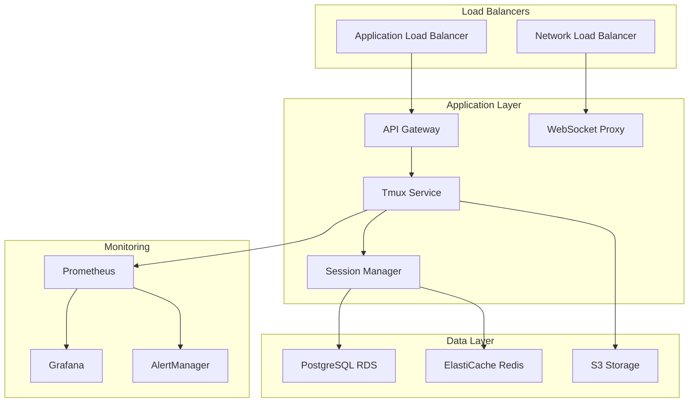

# Tmux Integration System - Operations Guide

## Overview

This operations guide provides comprehensive procedures for monitoring, troubleshooting, and maintaining the tmux integration system in production environments. It covers incident response, performance monitoring, capacity planning, and operational best practices.

## Table of Contents

1. [System Overview](#system-overview)
2. [Monitoring and Alerting](#monitoring-and-alerting)
3. [Incident Response](#incident-response)
4. [Troubleshooting Procedures](#troubleshooting-procedures)
5. [Performance Management](#performance-management)
6. [Capacity Planning](#capacity-planning)
7. [Maintenance Procedures](#maintenance-procedures)
8. [Health Checks](#health-checks)
9. [Log Management](#log-management)
10. [Disaster Recovery](#disaster-recovery)

## System Overview

### Service Architecture



### Service Dependencies

| Service | Dependencies | Critical Path | Recovery Time |
|---------|-------------|---------------|---------------|
| API Gateway | None | No | 30 seconds |
| Tmux Service | Redis, PostgreSQL | Yes | 2 minutes |
| Session Manager | PostgreSQL, Redis | Yes | 1 minute |
| WebSocket Proxy | Tmux Service | Yes | 30 seconds |
| PostgreSQL | None | Yes | 5 minutes |
| Redis | None | No | 1 minute |

### SLA Targets

| Metric | Target | Measurement Window |
|--------|--------|-------------------|
| Availability | 99.99% | Monthly |
| Response Time | <15ms (P95) | 5-minute windows |
| Error Rate | <0.1% | 5-minute windows |
| Session Creation | <100ms | Per request |
| WebSocket Latency | <50ms | Per message |

## Monitoring and Alerting

### Key Metrics

#### Application Metrics

```prometheus
# Response time metrics
tmux_request_duration_seconds_bucket
tmux_request_duration_seconds_sum
tmux_request_duration_seconds_count

# Session metrics
tmux_active_sessions
tmux_session_creation_rate
tmux_session_cleanup_rate
tmux_sessions_per_user

# WebSocket metrics
tmux_websocket_connections
tmux_websocket_messages_sent
tmux_websocket_messages_received
tmux_websocket_connection_errors

# Error metrics
tmux_errors_total
tmux_timeouts_total
tmux_authentication_failures
```

#### Infrastructure Metrics

```prometheus
# Kubernetes metrics
kube_deployment_status_replicas
kube_deployment_status_replicas_available
kube_pod_container_status_restarts_total
kube_pod_status_phase

# Resource usage
container_cpu_usage_seconds_total
container_memory_usage_bytes
container_network_receive_bytes_total
container_network_transmit_bytes_total

# Database metrics
postgres_up
postgres_connections_active
postgres_connections_idle
postgres_slow_queries_total

# Cache metrics
redis_up
redis_connected_clients
redis_used_memory_bytes
redis_commands_processed_total
```

### Alert Configurations

#### Critical Alerts

```yaml
# alerts/critical.yml
groups:
- name: tmux-critical
  rules:
  - alert: ServiceDown
    expr: up{job="tmux-service"} == 0
    for: 30s
    labels:
      severity: critical
      team: platform
    annotations:
      summary: "Tmux service is down"
      description: "No healthy instances of tmux-service in {{ $labels.namespace }}"
      runbook: "https://wiki.company.com/runbooks/tmux-service-down"

  - alert: HighErrorRate
    expr: rate(tmux_errors_total[5m]) > 0.01
    for: 2m
    labels:
      severity: critical
      team: platform
    annotations:
      summary: "High error rate detected"
      description: "Error rate is {{ $value | humanizePercentage }} over the last 5 minutes"
      runbook: "https://wiki.company.com/runbooks/high-error-rate"

  - alert: DatabaseDown
    expr: postgres_up == 0
    for: 1m
    labels:
      severity: critical
      team: platform
    annotations:
      summary: "Database is down"
      description: "PostgreSQL database is unreachable"
      runbook: "https://wiki.company.com/runbooks/database-down"

  - alert: RedisDown
    expr: redis_up == 0
    for: 1m
    labels:
      severity: critical
      team: platform
    annotations:
      summary: "Redis is down"
      description: "Redis cache is unreachable"
      runbook: "https://wiki.company.com/runbooks/redis-down"
```

#### Warning Alerts

```yaml
# alerts/warning.yml
groups:
- name: tmux-warning
  rules:
  - alert: HighResponseTime
    expr: histogram_quantile(0.95, rate(tmux_request_duration_seconds_bucket[5m])) > 0.015
    for: 5m
    labels:
      severity: warning
      team: platform
    annotations:
      summary: "High response time detected"
      description: "95th percentile response time is {{ $value }}s"
      runbook: "https://wiki.company.com/runbooks/high-response-time"

  - alert: HighMemoryUsage
    expr: container_memory_usage_bytes / container_spec_memory_limit_bytes > 0.8
    for: 5m
    labels:
      severity: warning
      team: platform
    annotations:
      summary: "High memory usage"
      description: "Memory usage is {{ $value | humanizePercentage }} of limit"
      runbook: "https://wiki.company.com/runbooks/high-memory-usage"

  - alert: HighCPUUsage
    expr: rate(container_cpu_usage_seconds_total[5m]) / container_spec_cpu_quota * container_spec_cpu_period > 0.8
    for: 10m
    labels:
      severity: warning
      team: platform
    annotations:
      summary: "High CPU usage"
      description: "CPU usage is {{ $value | humanizePercentage }} of limit"
      runbook: "https://wiki.company.com/runbooks/high-cpu-usage"

  - alert: PodCrashLooping
    expr: rate(kube_pod_container_status_restarts_total[5m]) * 60 * 5 > 0
    for: 5m
    labels:
      severity: warning
      team: platform
    annotations:
      summary: "Pod is crash looping"
      description: "Pod {{ $labels.pod }} in {{ $labels.namespace }} is restarting frequently"
      runbook: "https://wiki.company.com/runbooks/pod-crash-loop"
```

### Monitoring Dashboards

#### Main Service Dashboard

```json
{
  "dashboard": {
    "title": "Tmux Service - Main Dashboard",
    "panels": [
      {
        "title": "Service Health",
        "type": "stat",
        "targets": [
          {
            "expr": "up{job=\"tmux-service\"}",
            "legendFormat": "Service Up"
          }
        ]
      },
      {
        "title": "Request Rate",
        "type": "graph",
        "targets": [
          {
            "expr": "rate(tmux_requests_total[5m])",
            "legendFormat": "Requests/sec"
          }
        ]
      },
      {
        "title": "Response Time",
        "type": "graph",
        "targets": [
          {
            "expr": "histogram_quantile(0.95, rate(tmux_request_duration_seconds_bucket[5m]))",
            "legendFormat": "95th percentile"
          },
          {
            "expr": "histogram_quantile(0.50, rate(tmux_request_duration_seconds_bucket[5m]))",
            "legendFormat": "50th percentile"
          }
        ]
      },
      {
        "title": "Active Sessions",
        "type": "graph",
        "targets": [
          {
            "expr": "tmux_active_sessions",
            "legendFormat": "Active Sessions"
          }
        ]
      },
      {
        "title": "Error Rate",
        "type": "graph",
        "targets": [
          {
            "expr": "rate(tmux_errors_total[5m])",
            "legendFormat": "Errors/sec"
          }
        ]
      }
    ]
  }
}
```

## Incident Response

### Incident Classification

| Severity | Description | Response Time | Examples |
|----------|-------------|---------------|----------|
| P1 | Service completely down | 15 minutes | Total outage, data loss |
| P2 | Major feature degraded | 1 hour | High error rates, slow response |
| P3 | Minor issues | 4 hours | Single feature affected |
| P4 | Monitoring/alerts | Next business day | Dashboard issues, false alerts |

### Incident Response Procedures

#### P1 Incident Response

```bash
#!/bin/bash
# incident-response-p1.sh - Critical incident response

echo "P1 INCIDENT RESPONSE INITIATED"
echo "Time: $(date)"

# 1. Immediate assessment
echo "=== IMMEDIATE ASSESSMENT ==="
kubectl get pods -n tmux-production
kubectl get services -n tmux-production
kubectl get ingress -n tmux-production

# 2. Check service health
echo "=== SERVICE HEALTH CHECK ==="
curl -f http://tmux-service.tmux-production.svc.cluster.local/health || echo "HEALTH CHECK FAILED"

# 3. Check dependencies
echo "=== DEPENDENCY CHECK ==="
kubectl exec -n tmux-production deployment/redis -- redis-cli ping || echo "REDIS DOWN"
kubectl exec -n tmux-production deployment/postgres -- pg_isready || echo "POSTGRES DOWN"

# 4. Get recent logs
echo "=== RECENT LOGS ==="
kubectl logs -n tmux-production deployment/tmux-service --tail=50

# 5. Check metrics
echo "=== CURRENT METRICS ==="
curl -s http://prometheus:9090/api/v1/query?query=up{job="tmux-service"} | jq '.data.result'

# 6. Scale up if needed
echo "=== SCALING CHECK ==="
CURRENT_REPLICAS=$(kubectl get deployment tmux-service -n tmux-production -o jsonpath='{.status.replicas}')
READY_REPLICAS=$(kubectl get deployment tmux-service -n tmux-production -o jsonpath='{.status.readyReplicas}')

if [[ "$READY_REPLICAS" -lt "$CURRENT_REPLICAS" ]]; then
  echo "Scaling up due to unhealthy replicas"
  kubectl scale deployment tmux-service --replicas=$((CURRENT_REPLICAS + 2)) -n tmux-production
fi

# 7. Create incident ticket
echo "=== INCIDENT TRACKING ==="
echo "Create incident ticket with the following information:"
echo "- Time: $(date)"
echo "- Status: P1 Critical"
echo "- Affected Service: Tmux Integration System"
echo "- Initial Assessment: See above output"
```

#### Communication Templates

```bash
# Initial notification
INITIAL_NOTIFICATION="
🚨 INCIDENT ALERT - P1 🚨
Service: Tmux Integration System
Status: Investigating
Impact: Complete service unavailability
Started: $(date)
Investigating team: Platform Team
Updates: Will follow every 15 minutes
"

# Status update template
STATUS_UPDATE="
📊 INCIDENT UPDATE - P1
Service: Tmux Integration System
Status: [Investigating/Identified/Monitoring]
Current findings: [Brief description]
Next steps: [What we're doing next]
ETA: [Expected resolution time]
Time: $(date)
"

# Resolution notification
RESOLUTION="
✅ INCIDENT RESOLVED - P1
Service: Tmux Integration System
Status: Resolved
Root cause: [Brief explanation]
Resolution: [What was done]
Duration: [Total incident time]
Follow-up: Post-incident review scheduled
Time: $(date)
"
```

## Troubleshooting Procedures

### Common Issues and Solutions

#### High Response Times

**Symptoms:**
- Response time alerts firing
- User complaints about slow performance
- Dashboard showing elevated latency

**Diagnostic Steps:**

```bash
# Check current response times
kubectl exec -n tmux-production deployment/prometheus -- \
  promtool query instant 'histogram_quantile(0.95, rate(tmux_request_duration_seconds_bucket[5m]))'

# Check CPU and memory usage
kubectl top pods -n tmux-production

# Check database performance
kubectl exec -n tmux-production deployment/postgres -- \
  psql -U postgres -c "SELECT query, mean_time, calls FROM pg_stat_statements ORDER BY mean_time DESC LIMIT 10;"

# Check Redis performance
kubectl exec -n tmux-production deployment/redis -- \
  redis-cli --latency-history -i 1

# Check network latency
kubectl exec -n tmux-production deployment/tmux-service -- \
  ping -c 5 postgres-service
```

**Resolution Steps:**

```bash
# 1. Scale up if CPU/memory constrained
kubectl scale deployment tmux-service --replicas=10 -n tmux-production

# 2. Check for database locks
kubectl exec -n tmux-production deployment/postgres -- \
  psql -U postgres -c "SELECT * FROM pg_locks WHERE NOT granted;"

# 3. Clear Redis cache if needed
kubectl exec -n tmux-production deployment/redis -- \
  redis-cli FLUSHDB

# 4. Restart services if memory leaks suspected
kubectl rollout restart deployment/tmux-service -n tmux-production
```

#### Connection Failures

**Symptoms:**
- WebSocket connection errors
- Users unable to connect to sessions
- Authentication failures

**Diagnostic Steps:**

```bash
# Check WebSocket proxy
kubectl logs -n tmux-production deployment/websocket-proxy --tail=100

# Check authentication service
kubectl exec -n tmux-production deployment/tmux-service -- \
  curl -f http://localhost:8080/auth/health

# Check network policies
kubectl get networkpolicies -n tmux-production

# Test connectivity
kubectl run debug --rm -i --tty --image=nicolaka/netshoot -- /bin/bash
```

**Resolution Steps:**

```bash
# 1. Restart WebSocket proxy
kubectl rollout restart deployment/websocket-proxy -n tmux-production

# 2. Check JWT token validity
kubectl exec -n tmux-production deployment/tmux-service -- \
  curl -H "Authorization: Bearer $TEST_TOKEN" http://localhost:8080/validate

# 3. Clear authentication cache
kubectl exec -n tmux-production deployment/redis -- \
  redis-cli --scan --pattern "auth:*" | xargs redis-cli del
```

#### Session Management Issues

**Symptoms:**
- Sessions not persisting
- Session cleanup not working
- Memory usage growing

**Diagnostic Steps:**

```bash
# Check active sessions
kubectl exec -n tmux-production deployment/tmux-service -- \
  curl http://localhost:8080/metrics | grep tmux_active_sessions

# Check session storage
kubectl exec -n tmux-production deployment/redis -- \
  redis-cli keys "session:*" | wc -l

# Check tmux processes
kubectl exec -n tmux-production deployment/tmux-service -- \
  ps aux | grep tmux

# Check cleanup job
kubectl get cronjobs -n tmux-production
kubectl logs -n tmux-production cronjob/session-cleanup
```

**Resolution Steps:**

```bash
# 1. Manually trigger cleanup
kubectl create job --from=cronjob/session-cleanup manual-cleanup -n tmux-production

# 2. Clear orphaned sessions
kubectl exec -n tmux-production deployment/redis -- \
  redis-cli --scan --pattern "session:*" | head -100 | xargs redis-cli del

# 3. Restart session manager
kubectl rollout restart deployment/session-manager -n tmux-production
```

### Diagnostic Tools

#### Log Analysis Script

```bash
#!/bin/bash
# analyze-logs.sh - Log analysis tool

NAMESPACE="${1:-tmux-production}"
SERVICE="${2:-tmux-service}"
MINUTES="${3:-60}"

echo "Analyzing logs for $SERVICE in $NAMESPACE for last $MINUTES minutes"

# Get log entries with timestamps
kubectl logs -n "$NAMESPACE" deployment/"$SERVICE" \
  --since="${MINUTES}m" \
  --timestamps=true > "/tmp/${SERVICE}_logs.txt"

# Count error types
echo "=== ERROR SUMMARY ==="
grep -i error "/tmp/${SERVICE}_logs.txt" | cut -d' ' -f3- | sort | uniq -c | sort -nr

# Count status codes
echo "=== HTTP STATUS CODES ==="
grep -oE 'status=[0-9]+' "/tmp/${SERVICE}_logs.txt" | sort | uniq -c | sort -nr

# Show recent errors
echo "=== RECENT ERRORS ==="
grep -i error "/tmp/${SERVICE}_logs.txt" | tail -10

# Performance metrics
echo "=== SLOW REQUESTS ==="
grep -oE 'duration=[0-9.]+ms' "/tmp/${SERVICE}_logs.txt" | \
  grep -E 'duration=[5-9][0-9]+ms|duration=[0-9]{3,}ms' | sort | uniq -c

echo "Log analysis complete. Full logs in /tmp/${SERVICE}_logs.txt"
```

#### Performance Analysis Script

```bash
#!/bin/bash
# performance-analysis.sh - Performance diagnostic tool

NAMESPACE="${1:-tmux-production}"

echo "Performance Analysis for namespace: $NAMESPACE"

# Resource usage
echo "=== RESOURCE USAGE ==="
kubectl top pods -n "$NAMESPACE" --sort-by=cpu
kubectl top pods -n "$NAMESPACE" --sort-by=memory

# Pod status
echo "=== POD STATUS ==="
kubectl get pods -n "$NAMESPACE" -o wide

# Service endpoints
echo "=== SERVICE ENDPOINTS ==="
kubectl get endpoints -n "$NAMESPACE"

# Recent events
echo "=== RECENT EVENTS ==="
kubectl get events -n "$NAMESPACE" --sort-by='.lastTimestamp' | tail -20

# HPA status
echo "=== AUTO-SCALING STATUS ==="
kubectl get hpa -n "$NAMESPACE"
kubectl describe hpa -n "$NAMESPACE"

# Network policies
echo "=== NETWORK POLICIES ==="
kubectl get networkpolicies -n "$NAMESPACE"
```

## Performance Management

### Performance Monitoring

#### Key Performance Indicators

```bash
# Response time monitoring
kubectl exec -n tmux-production deployment/prometheus -- \
  promtool query instant 'histogram_quantile(0.95, rate(tmux_request_duration_seconds_bucket[5m]))'

# Throughput monitoring
kubectl exec -n tmux-production deployment/prometheus -- \
  promtool query instant 'rate(tmux_requests_total[5m])'

# Resource utilization
kubectl exec -n tmux-production deployment/prometheus -- \
  promtool query instant 'rate(container_cpu_usage_seconds_total{pod=~"tmux-service.*"}[5m])'

# Session metrics
kubectl exec -n tmux-production deployment/prometheus -- \
  promtool query instant 'tmux_active_sessions'
```

#### Performance Baselines

| Metric | Baseline | Target | Alert Threshold |
|--------|----------|--------|-----------------|
| Response Time (P95) | 12.5ms | <15ms | >20ms |
| Throughput | 1200 RPS | >1000 RPS | <800 RPS |
| CPU Usage | 45% | <70% | >80% |
| Memory Usage | 2.1GB | <4GB | >3.5GB |
| Active Sessions | Variable | <10,000 | >9,500 |

### Performance Optimization

#### Automatic Scaling

```yaml
# Vertical Pod Autoscaler
apiVersion: autoscaling/v1
kind: VerticalPodAutoscaler
metadata:
  name: tmux-service-vpa
spec:
  targetRef:
    apiVersion: apps/v1
    kind: Deployment
    name: tmux-service
  updatePolicy:
    updateMode: "Auto"
  resourcePolicy:
    containerPolicies:
    - containerName: tmux-service
      minAllowed:
        cpu: 100m
        memory: 128Mi
      maxAllowed:
        cpu: 4
        memory: 8Gi
      controlledResources: ["cpu", "memory"]
```

#### Manual Optimization

```bash
# Optimize database connections
kubectl exec -n tmux-production deployment/postgres -- \
  psql -U postgres -c "ALTER SYSTEM SET max_connections = 200; SELECT pg_reload_conf();"

# Tune Redis memory
kubectl exec -n tmux-production deployment/redis -- \
  redis-cli CONFIG SET maxmemory 4gb
kubectl exec -n tmux-production deployment/redis -- \
  redis-cli CONFIG SET maxmemory-policy allkeys-lru

# Optimize application settings
kubectl patch configmap tmux-config -n tmux-production --patch '
data:
  app.yaml: |
    performance:
      worker_pool_size: 200
      max_concurrent_sessions: 2000
      connection_pool_size: 100
'

kubectl rollout restart deployment/tmux-service -n tmux-production
```

## Capacity Planning

### Usage Metrics Collection

```bash
#!/bin/bash
# collect-usage-metrics.sh - Collect usage data for capacity planning

NAMESPACE="tmux-production"
OUTPUT_FILE="usage-metrics-$(date +%Y%m%d).csv"

echo "timestamp,active_sessions,cpu_usage,memory_usage,request_rate" > "$OUTPUT_FILE"

# Collect metrics every 5 minutes for 24 hours
for i in {1..288}; do
  TIMESTAMP=$(date -u +%Y-%m-%dT%H:%M:%SZ)
  
  SESSIONS=$(kubectl exec -n "$NAMESPACE" deployment/prometheus -- \
    promtool query instant 'tmux_active_sessions' | grep -oE '[0-9]+$')
  
  CPU_USAGE=$(kubectl exec -n "$NAMESPACE" deployment/prometheus -- \
    promtool query instant 'rate(container_cpu_usage_seconds_total{pod=~"tmux-service.*"}[5m])' | \
    grep -oE '[0-9.]+$')
  
  MEMORY_USAGE=$(kubectl exec -n "$NAMESPACE" deployment/prometheus -- \
    promtool query instant 'container_memory_usage_bytes{pod=~"tmux-service.*"}' | \
    grep -oE '[0-9]+$')
  
  REQUEST_RATE=$(kubectl exec -n "$NAMESPACE" deployment/prometheus -- \
    promtool query instant 'rate(tmux_requests_total[5m])' | \
    grep -oE '[0-9.]+$')
  
  echo "$TIMESTAMP,$SESSIONS,$CPU_USAGE,$MEMORY_USAGE,$REQUEST_RATE" >> "$OUTPUT_FILE"
  
  sleep 300  # 5 minutes
done

echo "Usage metrics collected in $OUTPUT_FILE"
```

### Capacity Projections

```python
#!/usr/bin/env python3
# capacity-planning.py - Capacity planning analysis

import pandas as pd
import numpy as np
from datetime import datetime, timedelta
import matplotlib.pyplot as plt

def analyze_capacity(csv_file):
    # Load usage data
    df = pd.read_csv(csv_file)
    df['timestamp'] = pd.to_datetime(df['timestamp'])
    
    # Calculate growth rates
    df['session_growth'] = df['active_sessions'].pct_change()
    df['cpu_growth'] = df['cpu_usage'].pct_change()
    df['memory_growth'] = df['memory_usage'].pct_change()
    
    # Project future usage (next 3 months)
    current_sessions = df['active_sessions'].iloc[-1]
    avg_session_growth = df['session_growth'].mean()
    
    # Capacity thresholds
    max_sessions = 10000
    max_cpu = 0.8  # 80%
    max_memory = 4 * 1024**3  # 4GB
    
    # Calculate when limits will be reached
    days_to_session_limit = (max_sessions - current_sessions) / (current_sessions * avg_session_growth)
    
    print(f"Current Usage:")
    print(f"  Active Sessions: {current_sessions}")
    print(f"  CPU Usage: {df['cpu_usage'].iloc[-1]:.2%}")
    print(f"  Memory Usage: {df['memory_usage'].iloc[-1] / 1024**3:.2f}GB")
    
    print(f"\nGrowth Projections:")
    print(f"  Session growth rate: {avg_session_growth:.2%} per period")
    print(f"  Days to session limit: {days_to_session_limit:.1f}")
    
    # Recommendations
    if days_to_session_limit < 30:
        print("\n⚠️  CAPACITY WARNING: Scale up required within 30 days")
    elif days_to_session_limit < 90:
        print("\n📊 CAPACITY NOTICE: Plan scaling within 90 days")
    else:
        print("\n✅ CAPACITY OK: No immediate scaling required")

if __name__ == "__main__":
    import sys
    if len(sys.argv) > 1:
        analyze_capacity(sys.argv[1])
    else:
        print("Usage: capacity-planning.py <usage-metrics.csv>")
```

### Scaling Recommendations

| Current Load | Action Required | Timeline |
|-------------|----------------|----------|
| <60% capacity | Monitor only | Quarterly review |
| 60-75% capacity | Plan scaling | Within 60 days |
| 75-85% capacity | Prepare scaling | Within 30 days |
| >85% capacity | Scale immediately | Within 7 days |
| >95% capacity | Emergency scaling | Immediately |

## Maintenance Procedures

### Routine Maintenance

#### Weekly Maintenance Checklist

```bash
#!/bin/bash
# weekly-maintenance.sh - Weekly maintenance tasks

echo "Starting weekly maintenance - $(date)"

# 1. Check system health
echo "=== HEALTH CHECK ==="
kubectl get pods -n tmux-production | grep -v Running | grep -v Completed

# 2. Review resource usage
echo "=== RESOURCE USAGE ==="
kubectl top nodes
kubectl top pods -n tmux-production

# 3. Check for failed jobs
echo "=== FAILED JOBS ==="
kubectl get jobs -n tmux-production --field-selector status.successful=0

# 4. Review alerts
echo "=== RECENT ALERTS ==="
curl -s http://alertmanager:9093/api/v1/alerts | jq '.data[] | select(.status.state == "active")'

# 5. Database maintenance
echo "=== DATABASE MAINTENANCE ==="
kubectl exec -n tmux-production deployment/postgres -- \
  psql -U postgres -c "VACUUM ANALYZE; REINDEX DATABASE tmux;"

# 6. Cache cleanup
echo "=== CACHE CLEANUP ==="
kubectl exec -n tmux-production deployment/redis -- \
  redis-cli INFO memory

# 7. Log rotation
echo "=== LOG ROTATION ==="
find /var/log/tmux -name "*.log" -mtime +7 -delete

echo "Weekly maintenance completed - $(date)"
```

#### Monthly Maintenance

```bash
#!/bin/bash
# monthly-maintenance.sh - Monthly maintenance tasks

echo "Starting monthly maintenance - $(date)"

# 1. Security updates
echo "=== SECURITY UPDATES ==="
kubectl get pods -n tmux-production -o yaml | grep image: | sort | uniq

# 2. Certificate renewal check
echo "=== CERTIFICATE CHECK ==="
kubectl get certificates -n tmux-production

# 3. Backup verification
echo "=== BACKUP VERIFICATION ==="
aws s3 ls s3://tmux-backups/ --recursive | tail -10

# 4. Performance review
echo "=== PERFORMANCE REVIEW ==="
kubectl exec -n tmux-production deployment/prometheus -- \
  promtool query instant 'avg_over_time(tmux_request_duration_seconds[30d])'

# 5. Capacity analysis
echo "=== CAPACITY ANALYSIS ==="
./capacity-planning.py usage-metrics-$(date +%Y%m%d).csv

echo "Monthly maintenance completed - $(date)"
```

### Upgrade Procedures

#### Application Upgrade

```bash
#!/bin/bash
# upgrade-application.sh - Application upgrade procedure

NEW_VERSION="$1"
NAMESPACE="${2:-tmux-production}"

if [[ -z "$NEW_VERSION" ]]; then
  echo "Usage: $0 <new_version> [namespace]"
  exit 1
fi

echo "Upgrading tmux-service to version $NEW_VERSION"

# 1. Pre-upgrade backup
echo "Creating pre-upgrade backup..."
kubectl exec -n "$NAMESPACE" deployment/postgres -- \
  pg_dump -U postgres tmux > "backup-pre-$NEW_VERSION-$(date +%Y%m%d).sql"

# 2. Update image
echo "Updating image to version $NEW_VERSION..."
kubectl set image deployment/tmux-service \
  tmux-service="tmux-service:$NEW_VERSION" \
  -n "$NAMESPACE"

# 3. Monitor rollout
echo "Monitoring rollout..."
kubectl rollout status deployment/tmux-service -n "$NAMESPACE" --timeout=600s

# 4. Verify deployment
echo "Verifying deployment..."
kubectl run health-check --rm -i --restart=Never \
  --image=curlimages/curl \
  --overrides='{"spec":{"restartPolicy":"Never"}}' \
  -- curl -f "http://tmux-service.$NAMESPACE.svc.cluster.local/health"

# 5. Run smoke tests
echo "Running smoke tests..."
kubectl apply -f tests/smoke-tests.yaml

echo "Upgrade to version $NEW_VERSION completed successfully"
```

## Health Checks

### Service Health Checks

```bash
#!/bin/bash
# health-check.sh - Comprehensive health check

NAMESPACE="${1:-tmux-production}"

echo "Health Check Report - $(date)"
echo "Namespace: $NAMESPACE"

# 1. Pod health
echo "=== POD HEALTH ==="
kubectl get pods -n "$NAMESPACE" -o wide

# 2. Service endpoints
echo "=== SERVICE ENDPOINTS ==="
kubectl get endpoints -n "$NAMESPACE"

# 3. Application health
echo "=== APPLICATION HEALTH ==="
for service in tmux-service session-manager websocket-proxy; do
  echo "Checking $service..."
  kubectl exec -n "$NAMESPACE" deployment/"$service" -- \
    curl -sf http://localhost:8080/health || echo "$service: FAILED"
done

# 4. Database health
echo "=== DATABASE HEALTH ==="
kubectl exec -n "$NAMESPACE" deployment/postgres -- \
  pg_isready -U postgres || echo "Database: FAILED"

# 5. Cache health
echo "=== CACHE HEALTH ==="
kubectl exec -n "$NAMESPACE" deployment/redis -- \
  redis-cli ping || echo "Redis: FAILED"

# 6. External dependencies
echo "=== EXTERNAL DEPENDENCIES ==="
curl -sf https://api.company.com/health || echo "External API: FAILED"

# 7. SSL certificates
echo "=== SSL CERTIFICATES ==="
kubectl get certificates -n "$NAMESPACE" -o wide

echo "Health check completed"
```

### Automated Health Monitoring

```yaml
# health-monitor-cronjob.yaml
apiVersion: batch/v1
kind: CronJob
metadata:
  name: health-monitor
  namespace: tmux-production
spec:
  schedule: "*/5 * * * *"  # Every 5 minutes
  jobTemplate:
    spec:
      template:
        spec:
          containers:
          - name: health-checker
            image: curlimages/curl
            command:
            - /bin/sh
            - -c
            - |
              # Check all services
              for service in tmux-service session-manager websocket-proxy; do
                if ! curl -sf http://$service:8080/health; then
                  echo "ALERT: $service health check failed"
                  # Send alert to webhook
                  curl -X POST https://alerts.company.com/webhook \
                    -H "Content-Type: application/json" \
                    -d "{\"alert\":\"$service health check failed\",\"timestamp\":\"$(date -u)\"}"
                fi
              done
          restartPolicy: OnFailure
```

## Log Management

### Log Collection Configuration

```yaml
# fluent-bit-config.yaml
apiVersion: v1
kind: ConfigMap
metadata:
  name: fluent-bit-config
  namespace: tmux-production
data:
  fluent-bit.conf: |
    [SERVICE]
        Flush         1
        Log_Level     info
        Daemon        off
        Parsers_File  parsers.conf
        HTTP_Server   On
        HTTP_Listen   0.0.0.0
        HTTP_Port     2020

    [INPUT]
        Name              tail
        Path              /var/log/containers/*tmux-service*.log
        Parser            docker
        Tag               tmux.service.*
        Refresh_Interval  5
        Mem_Buf_Limit     50MB

    [FILTER]
        Name                kubernetes
        Match               tmux.*
        Merge_Log           On
        Keep_Log            Off
        K8S-Logging.Parser  On
        K8S-Logging.Exclude On

    [OUTPUT]
        Name  es
        Match tmux.*
        Host  elasticsearch
        Port  9200
        Index tmux-logs
        Type  _doc
```

### Log Analysis Queries

```bash
# Common log analysis queries

# Error rate by time
curl -X GET "elasticsearch:9200/tmux-logs/_search" -H 'Content-Type: application/json' -d'
{
  "query": {
    "bool": {
      "must": [
        {"range": {"@timestamp": {"gte": "now-1h"}}},
        {"match": {"log": "ERROR"}}
      ]
    }
  },
  "aggs": {
    "errors_over_time": {
      "date_histogram": {
        "field": "@timestamp",
        "interval": "5m"
      }
    }
  }
}
'

# Top error messages
curl -X GET "elasticsearch:9200/tmux-logs/_search" -H 'Content-Type: application/json' -d'
{
  "query": {
    "bool": {
      "must": [
        {"range": {"@timestamp": {"gte": "now-24h"}}},
        {"match": {"log": "ERROR"}}
      ]
    }
  },
  "aggs": {
    "top_errors": {
      "terms": {
        "field": "log.keyword",
        "size": 10
      }
    }
  }
}
'
```

## Disaster Recovery

### Backup Procedures

```bash
#!/bin/bash
# disaster-recovery-backup.sh - Complete system backup

BACKUP_DATE=$(date +%Y%m%d_%H%M%S)
BACKUP_DIR="/var/backups/tmux-dr/$BACKUP_DATE"

mkdir -p "$BACKUP_DIR"

echo "Starting disaster recovery backup - $BACKUP_DATE"

# 1. Database backup
echo "Backing up database..."
kubectl exec -n tmux-production deployment/postgres -- \
  pg_dump -U postgres tmux | gzip > "$BACKUP_DIR/database.sql.gz"

# 2. Redis backup
echo "Backing up Redis..."
kubectl exec -n tmux-production deployment/redis -- \
  redis-cli BGSAVE
sleep 10
kubectl cp tmux-production/redis-0:/data/dump.rdb "$BACKUP_DIR/redis.rdb"

# 3. Configuration backup
echo "Backing up configurations..."
kubectl get all -n tmux-production -o yaml > "$BACKUP_DIR/k8s-resources.yaml"
kubectl get configmaps -n tmux-production -o yaml > "$BACKUP_DIR/configmaps.yaml"
kubectl get secrets -n tmux-production -o yaml > "$BACKUP_DIR/secrets.yaml"

# 4. Upload to S3
echo "Uploading to S3..."
tar -czf "$BACKUP_DIR.tar.gz" -C /var/backups/tmux-dr "$BACKUP_DATE"
aws s3 cp "$BACKUP_DIR.tar.gz" s3://tmux-disaster-recovery/

# 5. Cleanup local backup
rm -rf "$BACKUP_DIR"
rm "$BACKUP_DIR.tar.gz"

echo "Disaster recovery backup completed: $BACKUP_DATE"
```

### Recovery Procedures

```bash
#!/bin/bash
# disaster-recovery-restore.sh - Complete system restore

BACKUP_DATE="$1"

if [[ -z "$BACKUP_DATE" ]]; then
  echo "Usage: $0 <backup_date>"
  echo "Available backups:"
  aws s3 ls s3://tmux-disaster-recovery/
  exit 1
fi

echo "Starting disaster recovery restore from backup: $BACKUP_DATE"

# 1. Download backup
echo "Downloading backup..."
aws s3 cp "s3://tmux-disaster-recovery/$BACKUP_DATE.tar.gz" /tmp/
cd /tmp && tar -xzf "$BACKUP_DATE.tar.gz"

# 2. Restore Kubernetes resources
echo "Restoring Kubernetes resources..."
kubectl create namespace tmux-production || true
kubectl apply -f "$BACKUP_DATE/k8s-resources.yaml"
kubectl apply -f "$BACKUP_DATE/configmaps.yaml"
kubectl apply -f "$BACKUP_DATE/secrets.yaml"

# 3. Wait for database to be ready
echo "Waiting for database..."
kubectl wait --for=condition=ready pod -l app=postgres -n tmux-production --timeout=300s

# 4. Restore database
echo "Restoring database..."
kubectl exec -i -n tmux-production deployment/postgres -- \
  psql -U postgres -c "DROP DATABASE IF EXISTS tmux; CREATE DATABASE tmux;"
gunzip -c "$BACKUP_DATE/database.sql.gz" | \
kubectl exec -i -n tmux-production deployment/postgres -- \
  psql -U postgres tmux

# 5. Restore Redis
echo "Restoring Redis..."
kubectl cp "$BACKUP_DATE/redis.rdb" tmux-production/redis-0:/data/dump.rdb
kubectl exec -n tmux-production deployment/redis -- redis-cli DEBUG RESTART

# 6. Verify restoration
echo "Verifying restoration..."
kubectl get pods -n tmux-production
kubectl run restore-test --rm -i --restart=Never \
  --image=curlimages/curl \
  --overrides='{"spec":{"restartPolicy":"Never"}}' \
  -- curl -f http://tmux-service.tmux-production.svc.cluster.local/health

echo "Disaster recovery restore completed successfully"
```

---

**Document Version:** 2.0.0  
**Last Updated:** 2025-09-19  
**Next Review:** 2025-10-19  

This operations guide provides comprehensive procedures for maintaining and troubleshooting the tmux integration system in production environments, ensuring reliable operation and quick incident resolution.