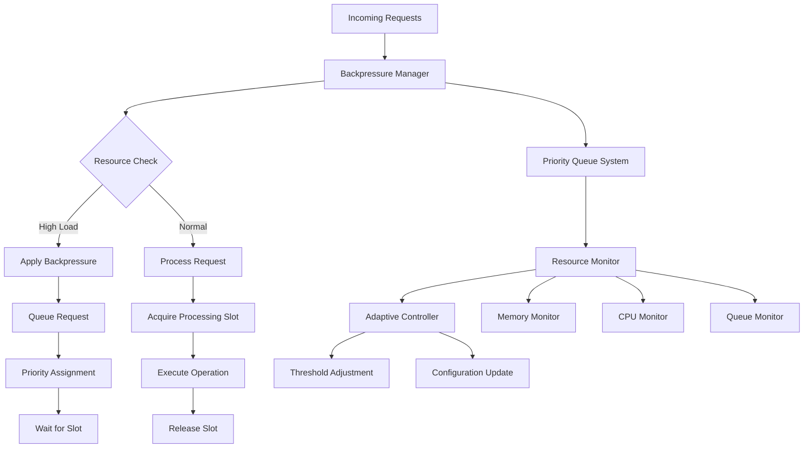

# Backpressure Management System

## Overview

Comprehensive backpressure management system designed to handle queue-based backpressure for voice processing pipeline, API request queuing, database connection pool management, memory pressure detection, and CPU throttling with intelligent load balancing.

## Architecture Design

### System Components



### Core Principles

1. **Fair Resource Allocation**: Priority-based queue management
2. **Adaptive Response**: Dynamic threshold adjustment based on system conditions
3. **Graceful Degradation**: Intelligent request shedding during overload
4. **Predictive Management**: Proactive backpressure application

## Implementation Architecture

### Backpressure Manager Core

```typescript
interface BackpressureConfig {
  maxQueueSize: number;          // 1000 - maximum queue capacity
  processingTimeout: number;      // 30000ms - request processing timeout
  priorityLevels: number;        // 5 - number of priority levels
  memoryThreshold: number;       // 0.8 - 80% memory usage threshold
  cpuThreshold: number;          // 0.7 - 70% CPU usage threshold
  enableAdaptive: boolean;       // true - enable adaptive management
  drainStrategy: 'fifo' | 'lifo' | 'priority'; // queue draining strategy
}
```

### Priority Queue System

#### Queue Structure
```typescript
interface QueueItem<T = any> {
  id: string;
  data: T;
  priority: number;              // 0-4 (4 = highest priority)
  timestamp: number;
  timeout: number;
  retries: number;
  maxRetries: number;
}

// Priority Level Definitions
enum Priority {
  CRITICAL = 4,    // Emergency operations
  HIGH = 3,        // Real-time voice processing
  NORMAL = 2,      // Standard API requests
  LOW = 1,         // Background tasks
  BULK = 0         // Batch operations
}
```

#### Queue Management Strategies

##### FIFO (First In, First Out)
```typescript
private getOldestItem(): QueueItem | null {
  let oldest: QueueItem | null = null;
  
  for (const queue of this.queues.values()) {
    for (const item of queue) {
      if (!oldest || item.timestamp < oldest.timestamp) {
        oldest = item;
      }
    }
  }
  
  return oldest;
}
```

##### Priority-Based Processing
```typescript
private getHighestPriorityItem(): QueueItem | null {
  // Process highest priority queues first
  for (let priority = this.config.priorityLevels - 1; priority >= 0; priority--) {
    const queue = this.queues.get(priority)!;
    if (queue.length > 0) {
      return queue[0];
    }
  }
  return null;
}
```

## Voice Processing Pipeline Backpressure

### Voice Stream Management

```typescript
interface VoiceProcessingRequest {
  id: string;
  audioData: ArrayBuffer;
  priority: Priority;
  timestamp: number;
  userId?: string;
  sessionId?: string;
  processingHints?: {
    language: string;
    domain: string;
    urgency: 'low' | 'normal' | 'high' | 'realtime';
  };
}

class VoiceProcessingBackpressure extends BackpressureManager {
  async processVoiceRequest(request: VoiceProcessingRequest): Promise<void> {
    // Check if system can handle new voice processing request
    if (this.shouldApplyBackpressure()) {
      // Apply intelligent request shedding
      if (request.priority < Priority.HIGH) {
        throw new BackpressureError('Voice processing overloaded, request rejected');
      }
      
      // Queue high priority requests with timeout
      await this.queueVoiceRequest(request);
    }
    
    await this.acquire(request.priority);
    // Process voice request
    // Release processing slot when done
  }
  
  private async queueVoiceRequest(request: VoiceProcessingRequest): Promise<void> {
    const queueItem: QueueItem<VoiceProcessingRequest> = {
      id: request.id,
      data: request,
      priority: request.priority,
      timestamp: request.timestamp,
      timeout: this.getVoiceProcessingTimeout(request),
      retries: 0,
      maxRetries: 2
    };
    
    const queue = this.queues.get(request.priority)!;
    queue.push(queueItem);
    
    // Emit queue metrics for monitoring
    this.emit('voice_queue_updated', {
      priority: request.priority,
      queueSize: queue.length,
      totalQueued: this.getTotalQueueSize()
    });
  }
  
  private getVoiceProcessingTimeout(request: VoiceProcessingRequest): number {
    // Dynamic timeout based on processing hints
    const baseTimeout = 5000; // 5 seconds base
    
    switch (request.processingHints?.urgency) {
      case 'realtime': return baseTimeout * 0.5;  // 2.5s
      case 'high': return baseTimeout;            // 5s
      case 'normal': return baseTimeout * 2;      // 10s
      case 'low': return baseTimeout * 4;         // 20s
      default: return baseTimeout;
    }
  }
}
```

## API Request Queuing

### Request Priority Classification

```typescript
interface APIRequest {
  endpoint: string;
  method: string;
  userId: string;
  sessionId: string;
  size: number;
  expectedProcessingTime: number;
}

class APIBackpressureManager extends BackpressureManager {
  classifyRequestPriority(request: APIRequest): Priority {
    // Real-time endpoints get high priority
    if (request.endpoint.includes('/voice/') || request.endpoint.includes('/stream/')) {
      return Priority.HIGH;
    }
    
    // User management operations get normal priority
    if (request.endpoint.includes('/user/') || request.endpoint.includes('/auth/')) {
      return Priority.NORMAL;
    }
    
    // Analytics and reporting get low priority
    if (request.endpoint.includes('/analytics/') || request.endpoint.includes('/report/')) {
      return Priority.LOW;
    }
    
    // Health checks and metrics get critical priority
    if (request.endpoint.includes('/health') || request.endpoint.includes('/metrics')) {
      return Priority.CRITICAL;
    }
    
    return Priority.NORMAL;
  }
  
  async handleAPIRequest(request: APIRequest): Promise<void> {
    const priority = this.classifyRequestPriority(request);
    
    // Check system load and apply backpressure if needed
    if (this.shouldApplyBackpressure()) {
      // Implement intelligent request shedding
      await this.applyAPIBackpressure(request, priority);
    }
    
    await this.acquire(priority);
    // Process API request
  }
  
  private async applyAPIBackpressure(request: APIRequest, priority: Priority): Promise<void> {
    // Different strategies based on request type and priority
    if (priority <= Priority.LOW) {
      // Reject low priority requests during high load
      throw new BackpressureError('System overloaded, please retry later', {
        retryAfter: this.calculateRetryDelay(),
        queueSize: this.getTotalQueueSize()
      });
    }
    
    if (priority === Priority.NORMAL) {
      // Queue normal priority requests with timeout
      const timeout = this.calculateDynamicTimeout(request);
      await this.queueWithTimeout(request, priority, timeout);
    }
    
    // High and critical priority requests always get processed
  }
}
```

## Memory Pressure Detection and Response

### Memory Monitoring System

```typescript
interface MemoryMetrics {
  heapUsed: number;
  heapTotal: number;
  external: number;
  rss: number;
  freeMemory: number;
  totalMemory: number;
}

class MemoryPressureManager {
  private memoryHistory: MemoryMetrics[] = [];
  private pressureThresholds = {
    low: 0.6,      // 60% memory usage
    medium: 0.75,  // 75% memory usage
    high: 0.85,    // 85% memory usage
    critical: 0.95 // 95% memory usage
  };
  
  getCurrentMemoryPressure(): 'none' | 'low' | 'medium' | 'high' | 'critical' {
    const metrics = this.getCurrentMemoryMetrics();
    const usage = metrics.heapUsed / metrics.heapTotal;
    
    if (usage >= this.pressureThresholds.critical) return 'critical';
    if (usage >= this.pressureThresholds.high) return 'high';
    if (usage >= this.pressureThresholds.medium) return 'medium';
    if (usage >= this.pressureThresholds.low) return 'low';
    return 'none';
  }
  
  private getCurrentMemoryMetrics(): MemoryMetrics {
    const nodeMemory = process.memoryUsage();
    const osMemory = require('os');
    
    return {
      heapUsed: nodeMemory.heapUsed,
      heapTotal: nodeMemory.heapTotal,
      external: nodeMemory.external,
      rss: nodeMemory.rss,
      freeMemory: osMemory.freemem(),
      totalMemory: osMemory.totalmem()
    };
  }
  
  async handleMemoryPressure(pressureLevel: string): Promise<void> {
    switch (pressureLevel) {
      case 'low':
        // Start gentle garbage collection
        this.triggerGentleGC();
        break;
        
      case 'medium':
        // Reduce cache sizes and trigger GC
        await this.reduceCacheSizes(0.8);
        this.triggerGC();
        break;
        
      case 'high':
        // Aggressive cache cleanup and request throttling
        await this.reduceCacheSizes(0.5);
        this.triggerGC();
        this.enableRequestThrottling();
        break;
        
      case 'critical':
        // Emergency measures: reject new requests, force cleanup
        await this.emergencyMemoryCleanup();
        this.rejectNewRequests();
        break;
    }
  }
  
  private triggerGentleGC(): void {
    // Suggest garbage collection without forcing
    if (global.gc) {
      setTimeout(() => global.gc(), 100);
    }
  }
  
  private triggerGC(): void {
    // Force garbage collection
    if (global.gc) {
      global.gc();
    }
  }
  
  private async reduceCacheSizes(factor: number): Promise<void> {
    // Reduce various cache sizes by the given factor
    this.emit('reduce_cache_sizes', { factor });
  }
  
  private async emergencyMemoryCleanup(): Promise<void> {
    // Emergency cleanup procedures
    await this.reduceCacheSizes(0.1); // Reduce to 10%
    this.clearNonEssentialBuffers();
    this.triggerGC();
  }
}
```

## CPU Throttling and Load Balancing

### CPU Load Management

```typescript
interface CPUMetrics {
  usage: number;        // Current CPU usage (0-1)
  loadAverage: number[]; // System load averages
  activeRequests: number;
  processingCapacity: number;
}

class CPUThrottlingManager {
  private cpuHistory: number[] = [];
  private throttleThresholds = {
    start: 0.7,    // Begin throttling at 70%
    aggressive: 0.85, // Aggressive throttling at 85%
    emergency: 0.95   // Emergency throttling at 95%
  };
  
  getCurrentCPULoad(): number {
    const cpuUsage = process.cpuUsage();
    const totalCpu = cpuUsage.user + cpuUsage.system;
    
    // Convert to percentage (simplified calculation)
    const percentage = Math.min(totalCpu / 1000000 / 100, 1);
    
    this.cpuHistory.push(percentage);
    if (this.cpuHistory.length > 60) {
      this.cpuHistory.shift(); // Keep last 60 measurements
    }
    
    return percentage;
  }
  
  shouldThrottleRequests(): boolean {
    const currentLoad = this.getCurrentCPULoad();
    const averageLoad = this.cpuHistory.reduce((sum, val) => sum + val, 0) / this.cpuHistory.length;
    
    return currentLoad > this.throttleThresholds.start || 
           averageLoad > this.throttleThresholds.start;
  }
  
  calculateThrottleDelay(priority: Priority): number {
    const currentLoad = this.getCurrentCPULoad();
    let baseDelay = 0;
    
    if (currentLoad > this.throttleThresholds.emergency) {
      baseDelay = 1000; // 1 second base delay
    } else if (currentLoad > this.throttleThresholds.aggressive) {
      baseDelay = 500;  // 500ms base delay
    } else if (currentLoad > this.throttleThresholds.start) {
      baseDelay = 100;  // 100ms base delay
    }
    
    // Adjust delay based on priority
    const priorityMultiplier = [2.0, 1.5, 1.0, 0.5, 0.1]; // Lower priority = higher delay
    return baseDelay * priorityMultiplier[priority];
  }
  
  async throttleRequest(priority: Priority): Promise<void> {
    if (!this.shouldThrottleRequests()) return;
    
    const delay = this.calculateThrottleDelay(priority);
    if (delay > 0) {
      await new Promise(resolve => setTimeout(resolve, delay));
    }
  }
}
```

## Adaptive Backpressure Control

### Learning-Based Adaptation

```typescript
class AdaptiveBackpressureController {
  private performanceHistory: PerformanceSnapshot[] = [];
  private learningRate = 0.1;
  private adaptationInterval = 10000; // 10 seconds
  
  interface PerformanceSnapshot {
    timestamp: number;
    latency: number;
    throughput: number;
    memoryUsage: number;
    cpuUsage: number;
    queueSize: number;
    errorRate: number;
    performanceScore: number;
  }
  
  startAdaptation(): void {
    setInterval(() => {
      this.adaptConfiguration();
    }, this.adaptationInterval);
  }
  
  private adaptConfiguration(): void {
    const currentSnapshot = this.capturePerformanceSnapshot();
    this.performanceHistory.push(currentSnapshot);
    
    // Keep only recent history
    if (this.performanceHistory.length > 100) {
      this.performanceHistory.shift();
    }
    
    // Analyze performance trends
    const trend = this.analyzePerformanceTrend();
    
    // Adjust thresholds based on trend
    if (trend.deteriorating) {
      this.makeMoreAggressive();
    } else if (trend.improving) {
      this.makeMoreLenient();
    }
  }
  
  private analyzePerformanceTrend(): { deteriorating: boolean; improving: boolean; stable: boolean } {
    if (this.performanceHistory.length < 10) {
      return { deteriorating: false, improving: false, stable: true };
    }
    
    const recent = this.performanceHistory.slice(-5);
    const previous = this.performanceHistory.slice(-10, -5);
    
    const recentScore = recent.reduce((sum, s) => sum + s.performanceScore, 0) / recent.length;
    const previousScore = previous.reduce((sum, s) => sum + s.performanceScore, 0) / previous.length;
    
    const scoreDiff = recentScore - previousScore;
    const threshold = 0.05; // 5% threshold
    
    return {
      deteriorating: scoreDiff < -threshold,
      improving: scoreDiff > threshold,
      stable: Math.abs(scoreDiff) <= threshold
    };
  }
  
  private makeMoreAggressive(): void {
    // Reduce thresholds to be more aggressive with backpressure
    this.adjustThresholds(0.9); // Reduce by 10%
  }
  
  private makeMoreLenient(): void {
    // Increase thresholds to be more lenient
    this.adjustThresholds(1.05); // Increase by 5%
  }
  
  private adjustThresholds(factor: number): void {
    const config = this.backpressureManager.getConfig();
    
    const newConfig = {
      memoryThreshold: Math.min(0.95, Math.max(0.5, config.memoryThreshold * factor)),
      cpuThreshold: Math.min(0.9, Math.max(0.4, config.cpuThreshold * factor)),
      maxQueueSize: Math.floor(config.maxQueueSize * factor)
    };
    
    this.backpressureManager.updateConfig(newConfig);
  }
}
```

## Integration with Voice-Terminal Application

### Voice Processing Pipeline Integration

```typescript
export class HardenedVoiceEngine extends VoiceEngine {
  private backpressureManager: VoiceProcessingBackpressure;
  
  async processVoice(request: VoiceProcessingRequest): Promise<VoiceProcessingResponse> {
    const startTime = Date.now();
    
    try {
      // Apply backpressure management
      await this.backpressureManager.processVoiceRequest(request);
      
      // Process with acquired slot
      const result = await this.performVoiceProcessing(request);
      
      return {
        ...result,
        queueTime: Date.now() - startTime - result.processingTime
      };
      
    } finally {
      // Always release the processing slot
      this.backpressureManager.release();
    }
  }
}
```

### Terminal Output Stream Integration

```typescript
export class TerminalStreamProcessor extends StreamProcessor {
  private backpressureManager: BackpressureManager;
  
  async processChunk(chunk: Buffer): Promise<Buffer | Buffer[]> {
    // Check for terminal output backpressure
    if (this.isOutputBufferFull()) {
      await this.backpressureManager.acquire(Priority.NORMAL);
    }
    
    return super.processChunk(chunk);
  }
  
  private isOutputBufferFull(): boolean {
    return this.outputBuffer.length > this.maxBufferSize;
  }
}
```

## Monitoring and Metrics

### Key Performance Indicators

```typescript
interface BackpressureMetrics {
  queueSize: number;
  maxQueueSize: number;
  droppedRequests: number;
  processedRequests: number;
  averageWaitTime: number;
  memoryPressure: number;
  cpuPressure: number;
  adaptiveThrottling: boolean;
  throughputReduction: number;
}
```

### Monitoring Dashboard Metrics

1. **Queue Health**
   - Queue size by priority level
   - Average wait time per priority
   - Queue utilization percentage

2. **Resource Pressure**
   - Memory usage trends
   - CPU utilization patterns
   - Disk I/O pressure

3. **Request Patterns**
   - Request acceptance rate
   - Rejection reasons
   - Priority distribution

4. **Adaptive Behavior**
   - Threshold adjustment frequency
   - Performance score trends
   - Configuration change history

## Performance Targets

### Service Level Objectives

| Metric | Target | Measurement |
|--------|--------|-------------|
| Queue Wait Time (P95) | <100ms | All priority levels |
| Memory Pressure Response | <5s | From detection to action |
| CPU Throttling Activation | <1s | From threshold breach |
| Request Processing Rate | >1000 req/s | Normal conditions |
| Queue Utilization | <80% | Peak load conditions |

### Backpressure Response Times

| Pressure Level | Response Time | Action |
|----------------|---------------|---------|
| Low | <100ms | Gentle throttling |
| Medium | <500ms | Moderate throttling |
| High | <1000ms | Aggressive throttling |
| Critical | <2000ms | Emergency shedding |

## Failure Scenarios and Recovery

### Common Failure Patterns

1. **Memory Leak Detection**
   - Continuous memory growth pattern
   - Automatic cache eviction triggers
   - Emergency memory cleanup procedures

2. **CPU Spike Handling**
   - Sudden CPU usage increase
   - Immediate request throttling
   - Gradual system recovery

3. **Queue Overflow Management**
   - Queue size exceeding limits
   - Intelligent request shedding
   - Priority-based queue draining

### Recovery Strategies

```typescript
class BackpressureRecoveryManager {
  async handleSystemOverload(): Promise<void> {
    // Emergency procedures
    await this.activateEmergencyMode();
    
    // Gradual recovery
    await this.executeGradualRecovery();
    
    // System stabilization
    await this.stabilizeSystem();
  }
  
  private async activateEmergencyMode(): Promise<void> {
    // Reject all non-critical requests
    this.rejectNonCriticalRequests();
    
    // Force garbage collection
    this.forceGarbageCollection();
    
    // Reduce all cache sizes
    await this.reduceCachesToMinimum();
  }
  
  private async executeGradualRecovery(): Promise<void> {
    // Gradually increase processing capacity
    const recoverySteps = 10;
    for (let i = 1; i <= recoverySteps; i++) {
      const capacity = (i / recoverySteps) * this.maxCapacity;
      await this.adjustProcessingCapacity(capacity);
      await this.waitForStabilization(5000); // 5 second intervals
    }
  }
}
```

## Best Practices

### Configuration Guidelines

1. **Memory Thresholds**
   - Set conservative memory thresholds (70-80%)
   - Monitor heap growth patterns
   - Implement proactive garbage collection

2. **CPU Thresholds**
   - Configure CPU thresholds based on system capacity
   - Account for CPU spike patterns
   - Implement gradual throttling increases

3. **Queue Management**
   - Size queues based on processing capacity
   - Implement timeout-based queue cleanup
   - Monitor queue health metrics

### Implementation Guidelines

1. **Priority Assignment**
   - Use business logic to assign priorities
   - Document priority classification rules
   - Regular review of priority effectiveness

2. **Adaptive Behavior**
   - Start with conservative settings
   - Monitor adaptation effectiveness
   - Implement manual override capabilities

3. **Error Handling**
   - Graceful degradation patterns
   - Clear error messages with retry guidance
   - Comprehensive error logging

## Future Enhancements

### Planned Improvements

1. **Machine Learning Integration**
   - Predictive backpressure application
   - Anomaly detection for unusual load patterns
   - Automated threshold optimization

2. **Distributed Backpressure**
   - Cross-service backpressure coordination
   - Global load balancing
   - Service mesh integration

3. **Advanced Queue Management**
   - Weighted fair queuing
   - Deadline-aware scheduling
   - Quality of Service guarantees

### Roadmap

- **Q1**: Implement predictive backpressure
- **Q2**: Add cross-service coordination
- **Q3**: Integrate with service mesh
- **Q4**: Advanced analytics and optimization

## Conclusion

This comprehensive backpressure management system provides intelligent load management across all system components. The adaptive nature ensures optimal performance under varying load conditions while maintaining system stability and user experience quality.