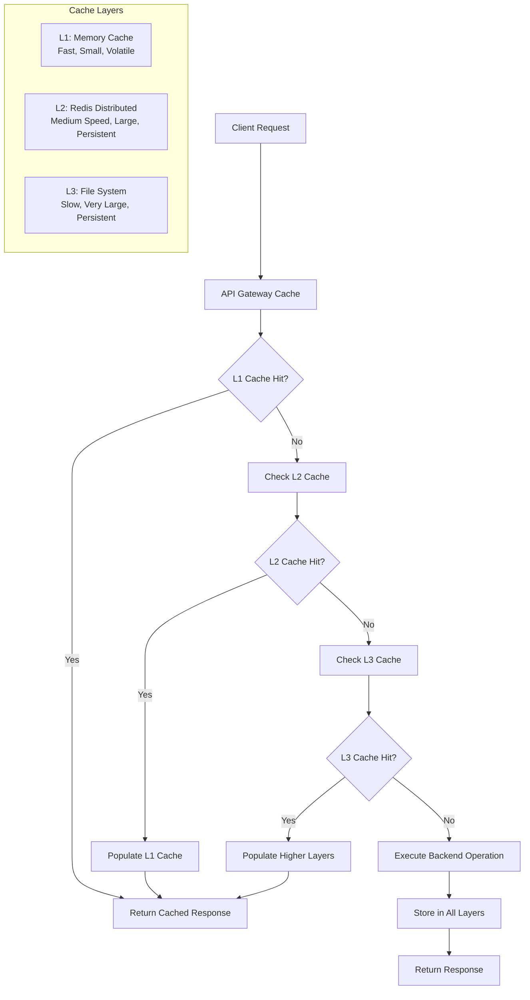

# Multi-Layer Caching Strategy

## Overview

Comprehensive multi-layer caching implementation providing Redis distributed caching with encryption, application-level caching with security controls, database query result caching, API response caching with proper invalidation, and voice processing result caching for the voice-terminal-hybrid application.

## Architecture Design

### Caching Hierarchy



### Cache Layer Characteristics

| Layer | Storage | Speed | Size | TTL | Use Case |
|-------|---------|-------|------|-----|----------|
| L1 (Memory) | RAM | <1ms | 50MB | 1-5 min | Hot data, frequent access |
| L2 (Redis) | Network RAM | 1-5ms | 500MB | 5-60 min | Shared data, session state |
| L3 (File) | Disk | 10-50ms | 10GB | 1-24 hours | Large objects, cold data |

## Implementation Architecture

### Cache Manager Core

```typescript
interface CacheConfig {
  ttl: number;                    // Default TTL in milliseconds
  maxSize: number;               // Maximum cache size in bytes
  enableCompression: boolean;     // Enable compression for large values
  enableEncryption: boolean;     // Enable encryption for sensitive data
  compressionThreshold: number;  // Minimum size for compression
  layers: CacheLayerConfig[];    // Layer configurations
}

interface CacheLayerConfig {
  name: string;                  // Layer identifier
  type: 'memory' | 'redis' | 'file'; // Cache layer type
  priority: number;              // Processing priority (1 = highest)
  ttl: number;                  // Layer-specific TTL
  maxSize: number;              // Layer maximum size
  connectionString?: string;     // Connection details for distributed caches
  enabled: boolean;             // Layer enable/disable flag
}
```

### Multi-Layer Cache Implementation

#### Memory Cache Layer (L1)
```typescript
export class MemoryCacheLayer extends CacheLayer {
  private cache: Map<string, CacheItem> = new Map();
  private timers: Map<string, NodeJS.Timeout> = new Map();

  async get<T>(key: string): Promise<T | null> {
    const startTime = Date.now();
    
    const item = this.cache.get(key);
    if (!item) {
      this.updateStats('miss', Date.now() - startTime);
      return null;
    }

    // Check expiration
    if (Date.now() > item.timestamp + item.ttl) {
      await this.delete(key);
      this.updateStats('miss', Date.now() - startTime);
      return null;
    }

    item.hits++;
    this.updateStats('hit', Date.now() - startTime);
    return item.value as T;
  }

  async set<T>(key: string, value: T, ttl?: number): Promise<void> {
    const itemTtl = ttl || this.config.ttl;
    const serializedSize = this.estimateSize(value);

    // Ensure capacity before storing
    await this.ensureCapacity(serializedSize);

    const item: CacheItem<T> = {
      key,
      value,
      timestamp: Date.now(),
      ttl: itemTtl,
      hits: 0,
      size: serializedSize,
      compressed: false,
      encrypted: false
    };

    this.cache.set(key, item);
    this.stats.totalSize += serializedSize;
    this.stats.itemCount++;

    // Set expiration timer
    const timer = setTimeout(() => {
      this.delete(key);
    }, itemTtl);
    
    this.timers.set(key, timer);
  }

  // LRU eviction for capacity management
  private async ensureCapacity(newItemSize: number): Promise<void> {
    const maxSize = this.config.maxSize;
    
    while (this.stats.totalSize + newItemSize > maxSize && this.cache.size > 0) {
      // Find least recently used item
      let lruKey = '';
      let lruTimestamp = Date.now();
      
      for (const [key, item] of this.cache) {
        const lastAccess = item.timestamp + (item.hits * 1000);
        if (lastAccess < lruTimestamp) {
          lruTimestamp = lastAccess;
          lruKey = key;
        }
      }
      
      if (lruKey) {
        await this.delete(lruKey);
        this.updateStats('eviction');
      } else {
        break;
      }
    }
  }
}
```

#### Redis Distributed Cache Layer (L2)
```typescript
export class RedisCacheLayer extends CacheLayer {
  private client: Redis;
  private encryptionHelper: EncryptionHelper;

  constructor(config: CacheLayerConfig) {
    super(config);
    this.client = new Redis(config.connectionString);
    this.encryptionHelper = new EncryptionHelper();
  }

  async get<T>(key: string): Promise<T | null> {
    const startTime = Date.now();
    
    try {
      const encryptedData = await this.client.get(key);
      if (!encryptedData) {
        this.updateStats('miss', Date.now() - startTime);
        return null;
      }

      // Decrypt and deserialize
      const decrypted = await this.encryptionHelper.decrypt(encryptedData);
      const result = JSON.parse(decrypted);
      
      this.updateStats('hit', Date.now() - startTime);
      return result as T;
      
    } catch (error) {
      this.emit('error', error);
      this.updateStats('miss', Date.now() - startTime);
      return null;
    }
  }

  async set<T>(key: string, value: T, ttl?: number): Promise<void> {
    try {
      const itemTtl = Math.floor((ttl || this.config.ttl) / 1000); // Redis TTL in seconds
      
      // Serialize and encrypt
      const serialized = JSON.stringify(value);
      const encrypted = await this.encryptionHelper.encrypt(serialized);
      
      await this.client.setex(key, itemTtl, encrypted);
      
      this.stats.itemCount++;
      this.stats.totalSize += encrypted.length;
      
    } catch (error) {
      this.emit('error', error);
      throw error;
    }
  }

  // Batch operations for performance
  async mget<T>(keys: string[]): Promise<(T | null)[]> {
    try {
      const encryptedValues = await this.client.mget(...keys);
      const results: (T | null)[] = [];
      
      for (const encryptedValue of encryptedValues) {
        if (encryptedValue) {
          const decrypted = await this.encryptionHelper.decrypt(encryptedValue);
          results.push(JSON.parse(decrypted) as T);
        } else {
          results.push(null);
        }
      }
      
      return results;
    } catch (error) {
      this.emit('error', error);
      return keys.map(() => null);
    }
  }

  async mset<T>(items: Array<{key: string, value: T, ttl?: number}>): Promise<void> {
    const pipeline = this.client.pipeline();
    
    for (const item of items) {
      const ttl = Math.floor((item.ttl || this.config.ttl) / 1000);
      const serialized = JSON.stringify(item.value);
      const encrypted = await this.encryptionHelper.encrypt(serialized);
      
      pipeline.setex(item.key, ttl, encrypted);
    }
    
    await pipeline.exec();
  }
}
```

## Voice Processing Result Caching

### Voice Processing Cache Strategy

```typescript
interface VoiceProcessingCacheConfig {
  enableSTTCaching: boolean;
  enableTTSCaching: boolean;
  audioHashingAlgorithm: 'md5' | 'sha256' | 'xxhash';
  maxAudioCacheSize: number;
  sttCacheTTL: number;
  ttsCacheTTL: number;
  enableCompressionForAudio: boolean;
}

export class VoiceProcessingCache {
  private cacheManager: CacheManager;
  private audioHasher: AudioHasher;
  
  constructor(config: VoiceProcessingCacheConfig) {
    this.cacheManager = new CacheManager({
      layers: [
        {
          name: 'voice-memory',
          type: 'memory',
          priority: 1,
          ttl: 30000, // 30 seconds for hot voice data
          maxSize: 10 * 1024 * 1024, // 10MB
          enabled: true
        },
        {
          name: 'voice-redis',
          type: 'redis',
          priority: 2,
          ttl: config.sttCacheTTL,
          maxSize: 100 * 1024 * 1024, // 100MB
          enabled: true
        }
      ]
    });
    
    this.audioHasher = new AudioHasher(config.audioHashingAlgorithm);
  }

  // STT (Speech-to-Text) Caching
  async cacheSTTResult(audioData: ArrayBuffer, result: STTResult): Promise<void> {
    const audioHash = await this.audioHasher.hash(audioData);
    const cacheKey = `stt:${audioHash}`;
    
    const cacheValue = {
      result,
      audioMetadata: {
        size: audioData.byteLength,
        hash: audioHash,
        timestamp: Date.now()
      }
    };
    
    await this.cacheManager.set(cacheKey, cacheValue, this.config.sttCacheTTL);
  }

  async getSTTResult(audioData: ArrayBuffer): Promise<STTResult | null> {
    const audioHash = await this.audioHasher.hash(audioData);
    const cacheKey = `stt:${audioHash}`;
    
    const cached = await this.cacheManager.get(cacheKey);
    return cached ? cached.result : null;
  }

  // TTS (Text-to-Speech) Caching
  async cacheTTSResult(text: string, voiceConfig: TTSConfig, audioData: ArrayBuffer): Promise<void> {
    const textHash = this.hashText(text, voiceConfig);
    const cacheKey = `tts:${textHash}`;
    
    // Compress audio data for storage
    const compressedAudio = await this.compressAudioData(audioData);
    
    const cacheValue = {
      audioData: compressedAudio,
      originalSize: audioData.byteLength,
      voiceConfig,
      text,
      timestamp: Date.now()
    };
    
    await this.cacheManager.set(cacheKey, cacheValue, this.config.ttsCacheTTL);
  }

  async getTTSResult(text: string, voiceConfig: TTSConfig): Promise<ArrayBuffer | null> {
    const textHash = this.hashText(text, voiceConfig);
    const cacheKey = `tts:${textHash}`;
    
    const cached = await this.cacheManager.get(cacheKey);
    if (!cached) return null;
    
    // Decompress audio data
    return await this.decompressAudioData(cached.audioData);
  }

  private hashText(text: string, voiceConfig: TTSConfig): string {
    const combined = `${text}:${JSON.stringify(voiceConfig)}`;
    return require('crypto').createHash('md5').update(combined).digest('hex');
  }

  private async compressAudioData(audioData: ArrayBuffer): Promise<Buffer> {
    // Implement audio compression (e.g., using opus, mp3, or generic compression)
    return Buffer.from(audioData); // Placeholder
  }

  private async decompressAudioData(compressedData: Buffer): Promise<ArrayBuffer> {
    // Implement audio decompression
    return compressedData.buffer; // Placeholder
  }
}
```

## Database Query Result Caching

### Query Cache Implementation

```typescript
interface QueryCacheConfig {
  enableQueryCaching: boolean;
  defaultQueryTTL: number;
  maxQueryCacheSize: number;
  queryHashingStrategy: 'sql' | 'parameters' | 'both';
  enableSelectiveCaching: boolean;
  cacheableOperations: string[];
}

export class DatabaseQueryCache {
  private cacheManager: CacheManager;
  private queryAnalyzer: QueryAnalyzer;
  
  constructor(config: QueryCacheConfig) {
    this.cacheManager = new CacheManager({
      layers: [
        {
          name: 'query-memory',
          type: 'memory',
          priority: 1,
          ttl: 60000, // 1 minute for hot queries
          maxSize: 50 * 1024 * 1024, // 50MB
          enabled: true
        },
        {
          name: 'query-redis',
          type: 'redis',
          priority: 2,
          ttl: config.defaultQueryTTL,
          maxSize: 200 * 1024 * 1024, // 200MB
          enabled: true
        }
      ]
    });
    
    this.queryAnalyzer = new QueryAnalyzer(config);
  }

  async cacheQueryResult(
    sql: string, 
    parameters: any[], 
    result: any,
    customTTL?: number
  ): Promise<void> {
    if (!this.queryAnalyzer.isCacheable(sql)) {
      return; // Skip non-cacheable queries
    }

    const queryHash = this.generateQueryHash(sql, parameters);
    const cacheKey = `query:${queryHash}`;
    
    const cacheValue = {
      result,
      sql,
      parameters,
      resultMetadata: {
        rowCount: Array.isArray(result) ? result.length : 1,
        size: this.estimateResultSize(result),
        timestamp: Date.now()
      }
    };
    
    const ttl = customTTL || this.calculateQueryTTL(sql);
    await this.cacheManager.set(cacheKey, cacheValue, ttl);
  }

  async getQueryResult(sql: string, parameters: any[]): Promise<any | null> {
    if (!this.queryAnalyzer.isCacheable(sql)) {
      return null;
    }

    const queryHash = this.generateQueryHash(sql, parameters);
    const cacheKey = `query:${queryHash}`;
    
    const cached = await this.cacheManager.get(cacheKey);
    return cached ? cached.result : null;
  }

  // Invalidate cache based on table changes
  async invalidateTableQueries(tableName: string): Promise<void> {
    // Get all cached queries that might be affected by this table
    const affectedQueries = await this.findQueriesForTable(tableName);
    
    for (const queryKey of affectedQueries) {
      await this.cacheManager.delete(queryKey);
    }
  }

  private generateQueryHash(sql: string, parameters: any[]): string {
    const normalized = this.queryAnalyzer.normalizeQuery(sql);
    const combined = `${normalized}:${JSON.stringify(parameters)}`;
    return require('crypto').createHash('sha256').update(combined).digest('hex');
  }

  private calculateQueryTTL(sql: string): number {
    // Different TTL strategies based on query type
    if (sql.toLowerCase().includes('select count(*)')) {
      return 300000; // 5 minutes for count queries
    }
    
    if (sql.toLowerCase().includes('user') || sql.toLowerCase().includes('session')) {
      return 60000; // 1 minute for user data
    }
    
    if (sql.toLowerCase().includes('config') || sql.toLowerCase().includes('setting')) {
      return 3600000; // 1 hour for configuration data
    }
    
    return 300000; // 5 minutes default
  }

  private async findQueriesForTable(tableName: string): Promise<string[]> {
    // Implementation would scan cache keys and identify queries affecting the table
    // This is a simplified version
    const pattern = `query:*`;
    // Would use Redis SCAN or similar to find matching keys
    return []; // Placeholder
  }
}
```

## API Response Caching with Invalidation

### API Cache Strategy

```typescript
interface APICacheConfig {
  enableResponseCaching: boolean;
  defaultResponseTTL: number;
  cacheableStatusCodes: number[];
  cacheableHttpMethods: string[];
  enableConditionalRequests: boolean;
  enableVaryHeaderSupport: boolean;
  maxResponseSize: number;
}

export class APIResponseCache {
  private cacheManager: CacheManager;
  private invalidationRules: Map<string, InvalidationRule[]> = new Map();
  
  constructor(config: APICacheConfig) {
    this.cacheManager = new CacheManager({
      layers: [
        {
          name: 'api-memory',
          type: 'memory',
          priority: 1,
          ttl: 30000, // 30 seconds for hot API responses
          maxSize: 25 * 1024 * 1024, // 25MB
          enabled: true
        },
        {
          name: 'api-redis',
          type: 'redis',
          priority: 2,
          ttl: config.defaultResponseTTL,
          maxSize: 100 * 1024 * 1024, // 100MB
          enabled: true
        }
      ]
    });
  }

  async cacheResponse(
    request: APIRequest,
    response: APIResponse,
    customTTL?: number
  ): Promise<void> {
    if (!this.isCacheableResponse(request, response)) {
      return;
    }

    const cacheKey = this.generateResponseCacheKey(request);
    
    const cacheValue = {
      statusCode: response.statusCode,
      headers: response.headers,
      body: response.body,
      metadata: {
        size: this.estimateResponseSize(response),
        timestamp: Date.now(),
        etag: this.generateETag(response),
        lastModified: response.headers['last-modified'] || new Date().toISOString()
      }
    };
    
    const ttl = customTTL || this.calculateResponseTTL(request, response);
    await this.cacheManager.set(cacheKey, cacheValue, ttl);
    
    // Register for invalidation
    this.registerForInvalidation(request, cacheKey);
  }

  async getCachedResponse(request: APIRequest): Promise<APIResponse | null> {
    if (!this.isCacheableRequest(request)) {
      return null;
    }

    const cacheKey = this.generateResponseCacheKey(request);
    const cached = await this.cacheManager.get(cacheKey);
    
    if (!cached) return null;

    // Check conditional request headers
    if (this.hasConditionalHeaders(request)) {
      if (this.isNotModified(request, cached)) {
        return {
          statusCode: 304,
          headers: { 'etag': cached.metadata.etag },
          body: null
        };
      }
    }

    return {
      statusCode: cached.statusCode,
      headers: {
        ...cached.headers,
        'x-cache': 'HIT',
        'x-cache-age': Math.floor((Date.now() - cached.metadata.timestamp) / 1000).toString()
      },
      body: cached.body
    };
  }

  // Cache invalidation strategies
  async invalidateByPattern(pattern: string): Promise<void> {
    // Invalidate all cache entries matching pattern
    const keys = await this.findCacheKeysByPattern(pattern);
    for (const key of keys) {
      await this.cacheManager.delete(key);
    }
  }

  async invalidateByTags(tags: string[]): Promise<void> {
    // Invalidate cache entries by tags
    for (const tag of tags) {
      const rules = this.invalidationRules.get(tag) || [];
      for (const rule of rules) {
        await this.applyInvalidationRule(rule);
      }
    }
  }

  // Smart invalidation based on resource changes
  async invalidateResourceCache(resourceType: string, resourceId: string): Promise<void> {
    const patterns = [
      `api:/${resourceType}/${resourceId}*`,
      `api:/${resourceType}*`,
      `api:/search*`, // Invalidate search results
      `api:/list*`    // Invalidate list endpoints
    ];
    
    for (const pattern of patterns) {
      await this.invalidateByPattern(pattern);
    }
  }

  private generateResponseCacheKey(request: APIRequest): string {
    const url = new URL(request.url);
    const keyComponents = [
      request.method,
      url.pathname,
      url.search,
      request.headers['accept'] || '',
      request.headers['accept-language'] || '',
      request.userId || 'anonymous'
    ];
    
    const combined = keyComponents.join(':');
    const hash = require('crypto').createHash('md5').update(combined).digest('hex');
    return `api:${hash}`;
  }

  private calculateResponseTTL(request: APIRequest, response: APIResponse): number {
    // Extract TTL from Cache-Control header
    const cacheControl = response.headers['cache-control'];
    if (cacheControl) {
      const maxAgeMatch = cacheControl.match(/max-age=(\d+)/);
      if (maxAgeMatch) {
        return parseInt(maxAgeMatch[1]) * 1000;
      }
    }

    // Default TTL based on endpoint type
    const url = new URL(request.url);
    
    if (url.pathname.includes('/user/')) {
      return 30000; // 30 seconds for user data
    }
    
    if (url.pathname.includes('/config/') || url.pathname.includes('/settings/')) {
      return 300000; // 5 minutes for configuration
    }
    
    if (url.pathname.includes('/search/')) {
      return 60000; // 1 minute for search results
    }
    
    return 180000; // 3 minutes default
  }

  private isCacheableResponse(request: APIRequest, response: APIResponse): boolean {
    // Only cache successful responses
    if (!this.config.cacheableStatusCodes.includes(response.statusCode)) {
      return false;
    }
    
    // Don't cache responses that are too large
    const responseSize = this.estimateResponseSize(response);
    if (responseSize > this.config.maxResponseSize) {
      return false;
    }
    
    // Check Cache-Control header
    const cacheControl = response.headers['cache-control'];
    if (cacheControl && (cacheControl.includes('no-cache') || cacheControl.includes('no-store'))) {
      return false;
    }
    
    return true;
  }
}
```

## Cache Security Controls

### Encryption and Access Control

```typescript
export class EncryptionHelper {
  private encryptionKey: Buffer;
  private algorithm = 'aes-256-gcm';
  
  constructor(encryptionKey?: string) {
    this.encryptionKey = encryptionKey 
      ? Buffer.from(encryptionKey, 'hex')
      : require('crypto').randomBytes(32);
  }

  async encrypt(data: string): Promise<string> {
    const iv = require('crypto').randomBytes(16);
    const cipher = require('crypto').createCipher(this.algorithm, this.encryptionKey);
    cipher.setAAD(Buffer.from('cache-data', 'utf8'));
    
    let encrypted = cipher.update(data, 'utf8', 'hex');
    encrypted += cipher.final('hex');
    
    const authTag = cipher.getAuthTag();
    
    // Combine IV, auth tag, and encrypted data
    const result = {
      iv: iv.toString('hex'),
      authTag: authTag.toString('hex'),
      data: encrypted
    };
    
    return JSON.stringify(result);
  }

  async decrypt(encryptedData: string): Promise<string> {
    const parsed = JSON.parse(encryptedData);
    const iv = Buffer.from(parsed.iv, 'hex');
    const authTag = Buffer.from(parsed.authTag, 'hex');
    
    const decipher = require('crypto').createDecipher(this.algorithm, this.encryptionKey);
    decipher.setAAD(Buffer.from('cache-data', 'utf8'));
    decipher.setAuthTag(authTag);
    
    let decrypted = decipher.update(parsed.data, 'hex', 'utf8');
    decrypted += decipher.final('utf8');
    
    return decrypted;
  }
}

// Access control for sensitive cache data
export class CacheAccessControl {
  private permissions: Map<string, CachePermission[]> = new Map();
  
  interface CachePermission {
    userId: string;
    role: string;
    allowedKeyPatterns: string[];
    deniedKeyPatterns: string[];
    operations: ('read' | 'write' | 'delete')[];
  }

  async checkPermission(
    userId: string,
    operation: 'read' | 'write' | 'delete',
    cacheKey: string
  ): Promise<boolean> {
    const userPermissions = this.permissions.get(userId) || [];
    
    for (const permission of userPermissions) {
      // Check if operation is allowed
      if (!permission.operations.includes(operation)) {
        continue;
      }
      
      // Check key patterns
      const isAllowed = permission.allowedKeyPatterns.some(pattern => 
        this.matchesPattern(cacheKey, pattern)
      );
      
      const isDenied = permission.deniedKeyPatterns.some(pattern => 
        this.matchesPattern(cacheKey, pattern)
      );
      
      if (isAllowed && !isDenied) {
        return true;
      }
    }
    
    return false;
  }

  private matchesPattern(key: string, pattern: string): boolean {
    // Convert glob pattern to regex
    const regexPattern = pattern
      .replace(/\*/g, '.*')
      .replace(/\?/g, '.');
    
    return new RegExp(`^${regexPattern}$`).test(key);
  }
}
```

## Performance Optimization

### Cache Warming Strategies

```typescript
export class CacheWarmingService {
  private cacheManager: CacheManager;
  private warmingScheduler: CacheWarmingScheduler;
  
  constructor(cacheManager: CacheManager) {
    this.cacheManager = cacheManager;
    this.warmingScheduler = new CacheWarmingScheduler();
  }

  // Pre-populate cache with frequently accessed data
  async warmCache(): Promise<void> {
    const warmingTasks = [
      this.warmUserProfiles(),
      this.warmConfigurationData(),
      this.warmVoiceModels(),
      this.warmFrequentQueries()
    ];
    
    await Promise.allSettled(warmingTasks);
  }

  private async warmUserProfiles(): Promise<void> {
    // Load active user profiles into cache
    const activeUsers = await this.getActiveUsers();
    
    for (const user of activeUsers) {
      const profile = await this.loadUserProfile(user.id);
      await this.cacheManager.set(`user:${user.id}`, profile, 300000); // 5 minutes
    }
  }

  private async warmVoiceModels(): Promise<void> {
    // Pre-load voice processing models
    const voiceModels = await this.getVoiceModels();
    
    for (const model of voiceModels) {
      const modelData = await this.loadVoiceModel(model.id);
      await this.cacheManager.set(`voice:model:${model.id}`, modelData, 3600000); // 1 hour
    }
  }

  // Predictive cache warming based on usage patterns
  async predictiveWarming(): Promise<void> {
    const usagePatterns = await this.analyzeUsagePatterns();
    
    for (const pattern of usagePatterns) {
      if (pattern.confidence > 0.8) {
        await this.preloadData(pattern.resource, pattern.expectedAccessTime);
      }
    }
  }
}
```

## Monitoring and Analytics

### Cache Performance Metrics

```typescript
interface CacheMetrics {
  layerStats: Record<string, CacheStats>;
  overallStats: CacheStats;
  memoryPressure: number;
  performanceMetrics: {
    averageGetTime: number;
    averageSetTime: number;
    errorRate: number;
  };
  hitRateByPattern: Record<string, number>;
  evictionStats: EvictionStats;
}

interface EvictionStats {
  totalEvictions: number;
  evictionsByLayer: Record<string, number>;
  evictionReasons: Record<string, number>;
  averageItemLifetime: number;
}

export class CacheAnalytics {
  private metricsCollector: MetricsCollector;
  private alertManager: AlertManager;
  
  constructor() {
    this.metricsCollector = new MetricsCollector();
    this.alertManager = new AlertManager();
  }

  analyzePerformance(): CachePerformanceReport {
    const metrics = this.metricsCollector.getMetrics();
    
    return {
      hitRateAnalysis: this.analyzeHitRates(metrics),
      memoryEfficiency: this.analyzeMemoryUsage(metrics),
      latencyAnalysis: this.analyzeLatency(metrics),
      recommendations: this.generateRecommendations(metrics)
    };
  }

  private analyzeHitRates(metrics: CacheMetrics): HitRateAnalysis {
    const overallHitRate = metrics.overallStats.hitRate;
    
    return {
      overallHitRate,
      layerBreakdown: metrics.layerStats,
      trends: this.calculateHitRateTrends(),
      inefficientPatterns: this.identifyInefficientPatterns(metrics)
    };
  }

  // Automated optimization suggestions
  generateOptimizationSuggestions(metrics: CacheMetrics): OptimizationSuggestion[] {
    const suggestions: OptimizationSuggestion[] = [];
    
    // Low hit rate suggestions
    if (metrics.overallStats.hitRate < 0.7) {
      suggestions.push({
        type: 'hit_rate_improvement',
        priority: 'high',
        description: 'Hit rate below target (70%)',
        action: 'Increase cache TTL for frequently accessed data',
        expectedImprovement: '15-25% hit rate increase'
      });
    }
    
    // Memory pressure suggestions
    if (metrics.memoryPressure > 0.8) {
      suggestions.push({
        type: 'memory_optimization',
        priority: 'medium',
        description: 'High memory pressure detected',
        action: 'Enable compression for large cache items',
        expectedImprovement: '30-50% memory reduction'
      });
    }
    
    // High eviction rate suggestions
    if (metrics.evictionStats.totalEvictions > 1000) {
      suggestions.push({
        type: 'capacity_optimization',
        priority: 'high',
        description: 'High eviction rate indicates insufficient capacity',
        action: 'Increase cache capacity or implement smarter eviction policies',
        expectedImprovement: 'Reduced evictions and improved hit rates'
      });
    }
    
    return suggestions;
  }
}
```

## Integration Examples

### Voice Engine Integration

```typescript
export class CachedVoiceEngine extends VoiceEngine {
  private voiceCache: VoiceProcessingCache;
  
  constructor(config: VoiceConfig) {
    super(config);
    this.voiceCache = new VoiceProcessingCache({
      enableSTTCaching: true,
      enableTTSCaching: true,
      sttCacheTTL: 300000, // 5 minutes
      ttsCacheTTL: 3600000, // 1 hour
      maxAudioCacheSize: 100 * 1024 * 1024 // 100MB
    });
  }

  async processVoice(audioData: ArrayBuffer): Promise<VoiceResult> {
    // Try cache first
    const cachedResult = await this.voiceCache.getSTTResult(audioData);
    if (cachedResult) {
      return {
        ...cachedResult,
        fromCache: true,
        processingTime: 0
      };
    }
    
    // Process and cache result
    const result = await super.processVoice(audioData);
    await this.voiceCache.cacheSTTResult(audioData, result);
    
    return {
      ...result,
      fromCache: false
    };
  }
}
```

### API Integration

```typescript
export class CachedAPIController {
  private apiCache: APIResponseCache;
  
  constructor() {
    this.apiCache = new APIResponseCache({
      enableResponseCaching: true,
      defaultResponseTTL: 300000,
      cacheableStatusCodes: [200, 301, 302],
      cacheableHttpMethods: ['GET', 'HEAD']
    });
  }

  async handleRequest(request: APIRequest): Promise<APIResponse> {
    // Check cache first
    const cachedResponse = await this.apiCache.getCachedResponse(request);
    if (cachedResponse) {
      return cachedResponse;
    }
    
    // Process request
    const response = await this.processRequest(request);
    
    // Cache successful responses
    if (response.statusCode >= 200 && response.statusCode < 300) {
      await this.apiCache.cacheResponse(request, response);
    }
    
    return {
      ...response,
      headers: {
        ...response.headers,
        'x-cache': 'MISS'
      }
    };
  }
}
```

## Best Practices

### Configuration Guidelines

1. **Layer Configuration**
   - Size L1 cache for hot data (10-50MB)
   - Configure L2 for shared data (100-500MB)
   - Use L3 for cold data and large objects (1-10GB)

2. **TTL Strategy**
   - Short TTL for dynamic data (30s-5min)
   - Medium TTL for semi-static data (5min-1hour)
   - Long TTL for static data (1hour-24hours)

3. **Security Configuration**
   - Always encrypt sensitive data
   - Implement proper access controls
   - Use secure key management

### Performance Guidelines

1. **Cache Key Design**
   - Use hierarchical key structures
   - Include relevant context (user, tenant, etc.)
   - Avoid key collisions

2. **Invalidation Strategy**
   - Implement smart invalidation rules
   - Use tags for related data
   - Monitor invalidation effectiveness

3. **Monitoring**
   - Track hit rates by layer and pattern
   - Monitor memory usage and evictions
   - Set up alerting for performance degradation

## Conclusion

This comprehensive multi-layer caching strategy provides high-performance, secure, and intelligent caching across all application components. The adaptive nature ensures optimal resource utilization while maintaining data consistency and security requirements essential for production voice-terminal applications.