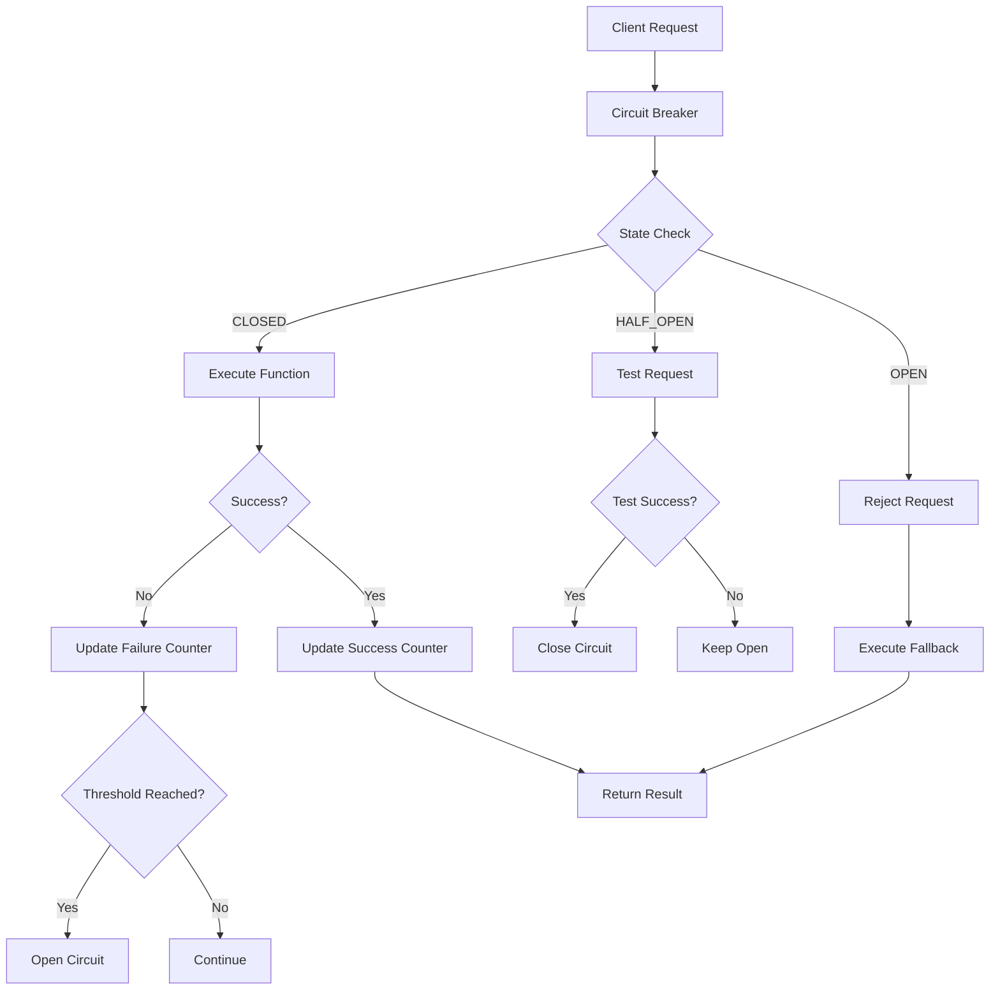

# Circuit Breaker Implementation

## Overview

Production-grade circuit breaker implementation providing service-level protection for all external dependencies in the voice-terminal-hybrid application. This implementation follows the circuit breaker pattern to prevent cascading failures and provide graceful degradation.

## Architecture Design

### Core Components



### State Management

#### Circuit States
- **CLOSED**: Normal operation, requests flow through
- **OPEN**: Circuit is open, requests are rejected or redirected to fallback
- **HALF_OPEN**: Testing state, allowing limited requests to test service recovery

#### State Transitions
```typescript
interface StateTransition {
  from: CircuitState;
  to: CircuitState;
  trigger: string;
  condition: string;
}

const transitions: StateTransition[] = [
  {
    from: CircuitState.CLOSED,
    to: CircuitState.OPEN,
    trigger: 'failure_threshold_exceeded',
    condition: 'failures >= failureThreshold && volume >= volumeThreshold'
  },
  {
    from: CircuitState.OPEN,
    to: CircuitState.HALF_OPEN,
    trigger: 'timeout_expired',
    condition: 'current_time >= next_attempt_time'
  },
  {
    from: CircuitState.HALF_OPEN,
    to: CircuitState.CLOSED,
    trigger: 'success_threshold_met',
    condition: 'successes >= successThreshold'
  },
  {
    from: CircuitState.HALF_OPEN,
    to: CircuitState.OPEN,
    trigger: 'failure_detected',
    condition: 'any failure in half-open state'
  }
];
```

## Implementation Details

### Circuit Breaker Configuration

```typescript
interface CircuitBreakerConfig {
  failureThreshold: number;      // 5 - failures before opening
  successThreshold: number;      // 2 - successes to close from half-open
  timeout: number;              // 30000ms - request timeout
  resetTimeout: number;         // 60000ms - time before retry
  monitoringWindow: number;     // 60000ms - window for failure rate
  volumeThreshold: number;      // 10 - minimum requests before evaluation
  onStateChange?: (state: CircuitState, error?: Error) => void;
  onFallback?: (error: Error) => any;
}
```

### Service-Level Circuit Breakers

#### Voice Processing Services
```typescript
// STT (Speech-to-Text) Circuit Breaker
const sttBreaker = circuitBreakerManager.getBreaker('voice-stt', {
  failureThreshold: 5,
  resetTimeout: 60000,
  timeout: 5000,
  onFallback: (error) => {
    console.warn('STT service failed, using fallback:', error.message);
    return performCloudSTT(); // Fallback to cloud service
  }
});

// TTS (Text-to-Speech) Circuit Breaker
const ttsBreaker = circuitBreakerManager.getBreaker('voice-tts', {
  failureThreshold: 5,
  resetTimeout: 60000,
  timeout: 3000,
  onFallback: (error) => {
    console.warn('TTS service failed, using silent fallback');
    return Promise.resolve(); // Silent fallback
  }
});
```

#### Database Circuit Breakers
```typescript
// Primary Database Circuit Breaker
const dbBreaker = circuitBreakerManager.getBreaker('database-primary', {
  failureThreshold: 3,
  resetTimeout: 120000,
  timeout: 10000,
  onFallback: (error) => {
    console.warn('Primary database failed, switching to read replica');
    return executeOnReadReplica();
  }
});

// Redis Cache Circuit Breaker
const cacheBreaker = circuitBreakerManager.getBreaker('cache-redis', {
  failureThreshold: 5,
  resetTimeout: 30000,
  timeout: 2000,
  onFallback: (error) => {
    console.warn('Redis cache failed, using memory cache');
    return executeWithMemoryCache();
  }
});
```

#### External API Circuit Breakers
```typescript
// Cloud Voice Services Circuit Breaker
const cloudVoiceBreaker = circuitBreakerManager.getBreaker('voice-cloud', {
  failureThreshold: 3,
  resetTimeout: 120000,
  timeout: 10000,
  onFallback: (error) => {
    console.warn('Cloud voice service failed, using local processing');
    return executeLocalVoiceProcessing();
  }
});

// AI Service Circuit Breaker
const aiServiceBreaker = circuitBreakerManager.getBreaker('ai-service', {
  failureThreshold: 5,
  resetTimeout: 180000,
  timeout: 15000,
  onFallback: (error) => {
    console.warn('AI service failed, using rule-based fallback');
    return executeRuleBasedProcessing();
  }
});
```

## Usage Patterns

### Basic Usage
```typescript
import { circuitBreakerManager } from '../modules/circuit-breaker';

// Execute with circuit breaker protection
const result = await circuitBreakerManager.execute(
  'voice-stt',
  async () => {
    return await performSTTProcessing(audioData);
  },
  async () => {
    // Fallback: use cloud STT
    return await performCloudSTT(audioData);
  }
);
```

### Advanced Usage with Custom Configuration
```typescript
const customBreaker = circuitBreakerManager.getBreaker('custom-service', {
  failureThreshold: 10,
  successThreshold: 3,
  timeout: 5000,
  resetTimeout: 30000,
  monitoringWindow: 120000,
  volumeThreshold: 20,
  onStateChange: (state, error) => {
    console.log(`Custom service circuit breaker: ${state}`);
    if (error) {
      logger.error('Circuit breaker error:', error);
    }
  },
  onFallback: (error) => {
    metrics.recordFallback('custom-service');
    return handleServiceFallback(error);
  }
});

const result = await customBreaker.execute(
  () => callCustomService(),
  () => provideDefaultResponse()
);
```

## Performance Characteristics

### Target Metrics
- **Response Time**: <10ms circuit breaker overhead
- **Memory Usage**: <1MB per circuit breaker instance
- **Throughput**: >10,000 requests/second per breaker
- **Failure Detection**: <100ms detection time

### Monitoring and Metrics

#### Circuit Breaker Metrics
```typescript
interface CircuitBreakerMetrics {
  totalRequests: number;
  successfulRequests: number;
  failedRequests: number;
  timeouts: number;
  rejectedRequests: number;
  lastFailureTime?: number;
  lastSuccessTime?: number;
  state: CircuitState;
  uptime: number;
}
```

#### Health Monitoring
```typescript
// Get health status of all circuit breakers
const healthStatus = circuitBreakerManager.getHealthStatus();
// Returns: { 'voice-stt': true, 'voice-tts': false, ... }

// Get detailed metrics
const allMetrics = circuitBreakerManager.getAllMetrics();
```

## Failure Scenarios and Handling

### Service Failure Scenarios

#### Voice Engine Failures
1. **Local STT Service Down**
   - Circuit breaker opens after 5 failures
   - Fallback to cloud STT service
   - Monitor cloud service with separate breaker

2. **TTS Service Latency**
   - Timeout after 3 seconds
   - Switch to faster voice model
   - Implement silent fallback for non-critical responses

#### Database Failures
1. **Primary Database Unavailable**
   - Switch to read replica immediately
   - Queue write operations for retry
   - Implement eventual consistency

2. **Connection Pool Exhaustion**
   - Reject new requests with backpressure
   - Scale connection pool dynamically
   - Implement request prioritization

### Fallback Strategies

#### Graceful Degradation
```typescript
const fallbackStrategies = {
  'voice-stt': {
    primary: 'local-whisper',
    fallback1: 'cloud-google-stt',
    fallback2: 'cloud-azure-stt',
    ultimate: 'text-input-mode'
  },
  'voice-tts': {
    primary: 'local-coqui',
    fallback1: 'cloud-tts',
    fallback2: 'silent-mode',
    ultimate: 'text-output-only'
  },
  'database': {
    primary: 'postgresql-primary',
    fallback1: 'postgresql-replica',
    fallback2: 'cache-only-mode',
    ultimate: 'offline-mode'
  }
};
```

## Configuration Management

### Environment-Based Configuration
```typescript
const config = {
  development: {
    failureThreshold: 10,     // More lenient in dev
    resetTimeout: 30000,      // Faster recovery
    timeout: 10000           // Longer timeouts
  },
  staging: {
    failureThreshold: 7,
    resetTimeout: 45000,
    timeout: 7000
  },
  production: {
    failureThreshold: 5,      // Strict in production
    resetTimeout: 60000,      // Conservative recovery
    timeout: 5000            // Fast timeouts
  }
};
```

### Dynamic Configuration Updates
```typescript
// Update circuit breaker configuration at runtime
circuitBreakerManager.getBreaker('voice-stt').updateConfig({
  failureThreshold: 3,  // More sensitive during high load
  timeout: 2000        // Faster timeouts
});
```

## Integration Points

### Integration with Voice Engine
```typescript
export class HardenedVoiceEngine extends VoiceEngine {
  async processVoice(request: VoiceProcessingRequest): Promise<VoiceProcessingResponse> {
    return await circuitBreakerManager.execute(
      'voice-stt',
      async () => this.performLocalSTT(request.audioData),
      async () => this.performCloudSTT(request.audioData)
    );
  }
}
```

### Integration with Terminal Controller
```typescript
export class HardenedTmuxController extends TmuxController {
  async sendCommand(sessionId: string, command: string): Promise<void> {
    return await circuitBreakerManager.execute(
      'tmux-session',
      async () => super.sendCommand(sessionId, command),
      async () => this.handleCommandFailure(sessionId, command)
    );
  }
}
```

## Testing Strategy

### Unit Testing
```typescript
describe('CircuitBreaker', () => {
  test('should open circuit after failure threshold', async () => {
    const breaker = new CircuitBreaker('test', { failureThreshold: 3 });
    
    // Trigger failures
    for (let i = 0; i < 3; i++) {
      try {
        await breaker.execute(() => Promise.reject(new Error('Service down')));
      } catch (e) {}
    }
    
    expect(breaker.getState()).toBe(CircuitState.OPEN);
  });
});
```

### Integration Testing
```typescript
describe('Circuit Breaker Integration', () => {
  test('should fallback to cloud service when local fails', async () => {
    const mockLocalService = jest.fn().mockRejectedValue(new Error('Local down'));
    const mockCloudService = jest.fn().mockResolvedValue('cloud result');
    
    const result = await circuitBreakerManager.execute(
      'test-service',
      mockLocalService,
      mockCloudService
    );
    
    expect(result).toBe('cloud result');
    expect(mockCloudService).toHaveBeenCalled();
  });
});
```

## Security Considerations

### Information Disclosure Prevention
- Circuit breaker errors don't expose internal service details
- Fallback responses maintain consistent API structure
- Monitoring data is sanitized before external exposure

### DoS Protection
- Circuit breakers prevent cascade failures during DoS attacks
- Request rejection helps preserve system resources
- Fallback services have separate rate limiting

## Monitoring and Alerting

### Key Metrics to Monitor
1. **Circuit State Changes**: Track when circuits open/close
2. **Failure Rates**: Monitor service failure patterns
3. **Fallback Usage**: Track fallback execution frequency
4. **Recovery Times**: Measure time to service recovery

### Alert Conditions
```yaml
alerts:
  circuit_breaker_open:
    condition: circuit_state == "OPEN"
    severity: warning
    message: "Circuit breaker {{ $labels.service }} is open"
  
  high_failure_rate:
    condition: failure_rate > 0.1
    severity: critical
    message: "High failure rate in {{ $labels.service }}"
  
  fallback_overuse:
    condition: fallback_rate > 0.5
    severity: warning
    message: "Excessive fallback usage in {{ $labels.service }}"
```

## Best Practices

### Configuration Guidelines
1. Set failure thresholds based on service SLA requirements
2. Configure timeouts shorter than client expectations
3. Implement exponential backoff for reset timeouts
4. Use different thresholds for critical vs non-critical services

### Implementation Guidelines
1. Always provide meaningful fallback behavior
2. Log circuit state changes for debugging
3. Monitor fallback service capacity
4. Implement graceful degradation paths

### Operational Guidelines
1. Test fallback scenarios regularly
2. Monitor circuit breaker health dashboards
3. Have runbooks for common failure scenarios
4. Implement automated recovery procedures

## Future Enhancements

### Planned Improvements
1. **Adaptive Thresholds**: ML-based dynamic threshold adjustment
2. **Service Mesh Integration**: Integration with Istio/Linkerd
3. **Distributed Coordination**: Cross-instance circuit state sharing
4. **Advanced Fallbacks**: Multi-tier fallback strategies

### Roadmap
- Q1: Implement adaptive thresholds
- Q2: Add service mesh integration
- Q3: Implement distributed state management
- Q4: Advanced monitoring and analytics

## Conclusion

This circuit breaker implementation provides robust protection against cascade failures while maintaining high performance and low overhead. The modular design allows for easy integration with existing services and provides comprehensive monitoring and fallback capabilities essential for production environments.