# Data Flow Architecture
## AlphanumericMango Project

Version: 1.0.0  
Last Updated: 2025-09-18  
Status: Draft

---

## 1. Overview

This document details the data flow patterns and pipeline architectures within the AlphanumericMango system. It covers how data moves through various processing stages, from user input to system response, including voice processing, command execution, and state synchronization.

## 2. Core Data Flow Patterns

### 2.1 Event-Driven Architecture
The system employs an event-driven architecture with the following characteristics:
- **Asynchronous Processing**: Non-blocking event handlers
- **Message Queue Pattern**: Buffered event processing
- **Publish-Subscribe Model**: Decoupled component communication
- **Event Sourcing**: Audit trail and state reconstruction

## 3. Voice Processing Pipeline

### 3.1 End-to-End Voice Flow

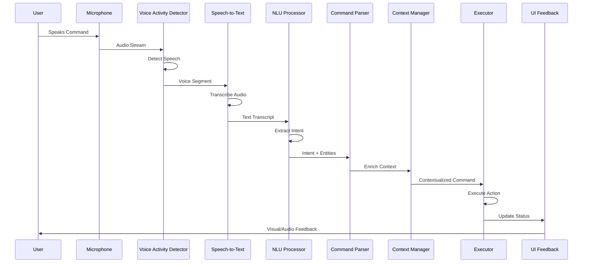

### 3.2 Voice Data Pipeline Stages

#### Stage 1: Audio Capture
```typescript
interface AudioCaptureData {
  timestamp: number;
  sampleRate: number;
  channels: number;
  buffer: Float32Array;
  deviceId: string;
}
```

**Processing**:
1. Microphone initialization
2. Audio stream capture (48kHz, mono)
3. Chunking into 100ms buffers
4. Noise gate application

#### Stage 2: Voice Activity Detection
```typescript
interface VADResult {
  isSpeech: boolean;
  confidence: number;
  energyLevel: number;
  segment?: {
    start: number;
    end: number;
    audio: ArrayBuffer;
  };
}
```

**Processing**:
1. Energy-based detection
2. Zero-crossing rate analysis
3. Spectral entropy calculation
4. Segment boundary detection

#### Stage 3: Speech Recognition
```typescript
interface STTResult {
  transcript: string;
  confidence: number;
  alternatives: Array<{
    text: string;
    confidence: number;
  }>;
  timestamps: WordTimestamp[];
  isFinal: boolean;
}
```

**Flow Modes**:
- **Streaming Mode**: Real-time partial results
- **Batch Mode**: Complete utterance processing
- **Hybrid Mode**: Local with cloud fallback

#### Stage 4: Natural Language Understanding
```typescript
interface NLUResult {
  intent: {
    name: string;
    confidence: number;
  };
  entities: Array<{
    type: string;
    value: string;
    position: [number, number];
  }>;
  sentiment?: {
    score: number;
    magnitude: number;
  };
}
```

## 4. Command Execution Flow

### 4.1 Command Processing Pipeline

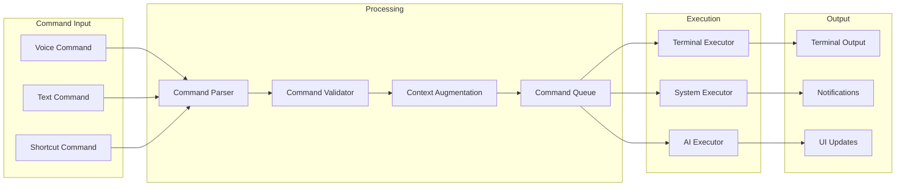

### 4.2 Command Data Structure

```typescript
interface Command {
  id: string;
  type: 'terminal' | 'system' | 'ai' | 'navigation';
  source: 'voice' | 'text' | 'shortcut';
  raw: string;
  parsed: {
    action: string;
    target?: string;
    parameters: Record<string, any>;
    flags: string[];
  };
  context: {
    projectId: string;
    sessionId: string;
    windowId?: string;
    paneId?: string;
    workingDirectory: string;
  };
  metadata: {
    timestamp: number;
    userId: string;
    confidence?: number;
    executionPriority: number;
  };
}
```

## 5. Project Context Management Flow

### 5.1 Context Switching Flow

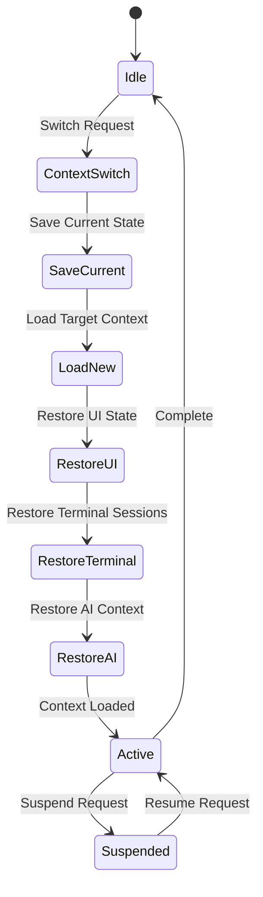

### 5.2 Context Data Model

```typescript
interface ProjectContext {
  projectId: string;
  name: string;
  state: 'active' | 'suspended' | 'archived';
  
  environment: {
    workingDirectory: string;
    environmentVariables: Record<string, string>;
    shellPath: string;
  };
  
  terminalSessions: Array<{
    sessionId: string;
    windowLayout: TerminalLayout;
    commandHistory: string[];
    scrollbackBuffer: string[];
  }>;
  
  aiContext: {
    conversationHistory: Message[];
    customInstructions: string;
    activeTools: string[];
  };
  
  uiState: {
    activeTab: string;
    sidebarCollapsed: boolean;
    theme: string;
    customLayouts: Layout[];
  };
  
  metadata: {
    created: Date;
    lastAccessed: Date;
    accessCount: number;
    tags: string[];
  };
}
```

## 6. Notification System Flow

### 6.1 Notification Pipeline

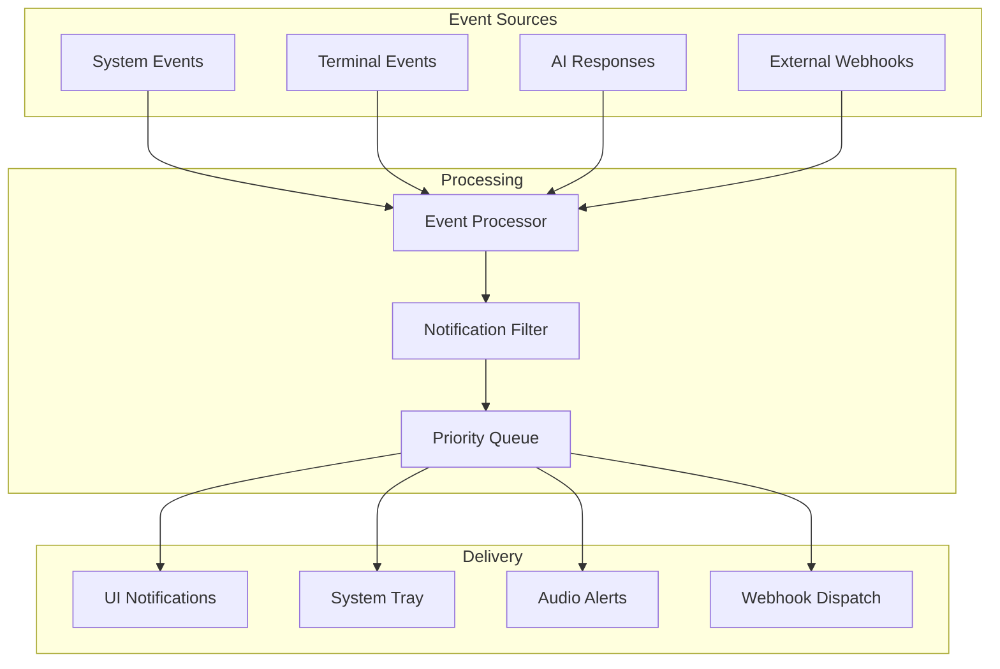

### 6.2 Notification Data Structure

```typescript
interface Notification {
  id: string;
  type: 'info' | 'success' | 'warning' | 'error' | 'progress';
  source: 'system' | 'terminal' | 'ai' | 'external';
  
  content: {
    title: string;
    message: string;
    details?: any;
    actions?: Array<{
      label: string;
      action: string;
      primary?: boolean;
    }>;
  };
  
  delivery: {
    channels: ('ui' | 'tray' | 'audio' | 'webhook')[];
    priority: 'low' | 'medium' | 'high' | 'critical';
    ttl?: number;
    persistent: boolean;
  };
  
  context: {
    projectId?: string;
    sessionId?: string;
    correlationId?: string;
  };
  
  timestamps: {
    created: Date;
    delivered?: Date;
    read?: Date;
    dismissed?: Date;
  };
}
```

## 7. Cross-Project Communication Flow

### 7.1 Inter-Project Messaging

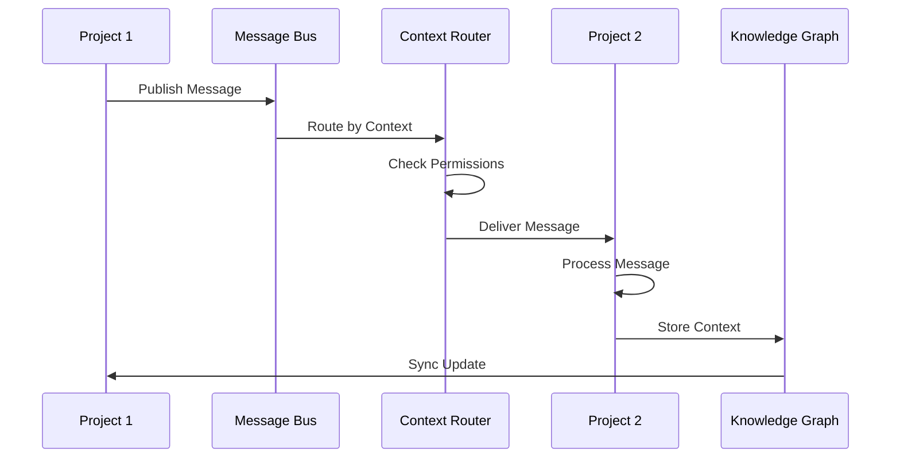

### 7.2 Message Bus Protocol

```typescript
interface CrossProjectMessage {
  header: {
    messageId: string;
    sourceProject: string;
    targetProjects: string[] | '*';
    messageType: 'data' | 'command' | 'query' | 'event';
    timestamp: number;
    ttl?: number;
  };
  
  routing: {
    pattern: 'direct' | 'broadcast' | 'request-reply';
    replyTo?: string;
    correlationId?: string;
  };
  
  payload: {
    action: string;
    data: any;
    metadata?: Record<string, any>;
  };
  
  security: {
    signature?: string;
    encrypted?: boolean;
    permissions: string[];
  };
}
```

## 8. State Synchronization Flow

### 8.1 State Sync Architecture

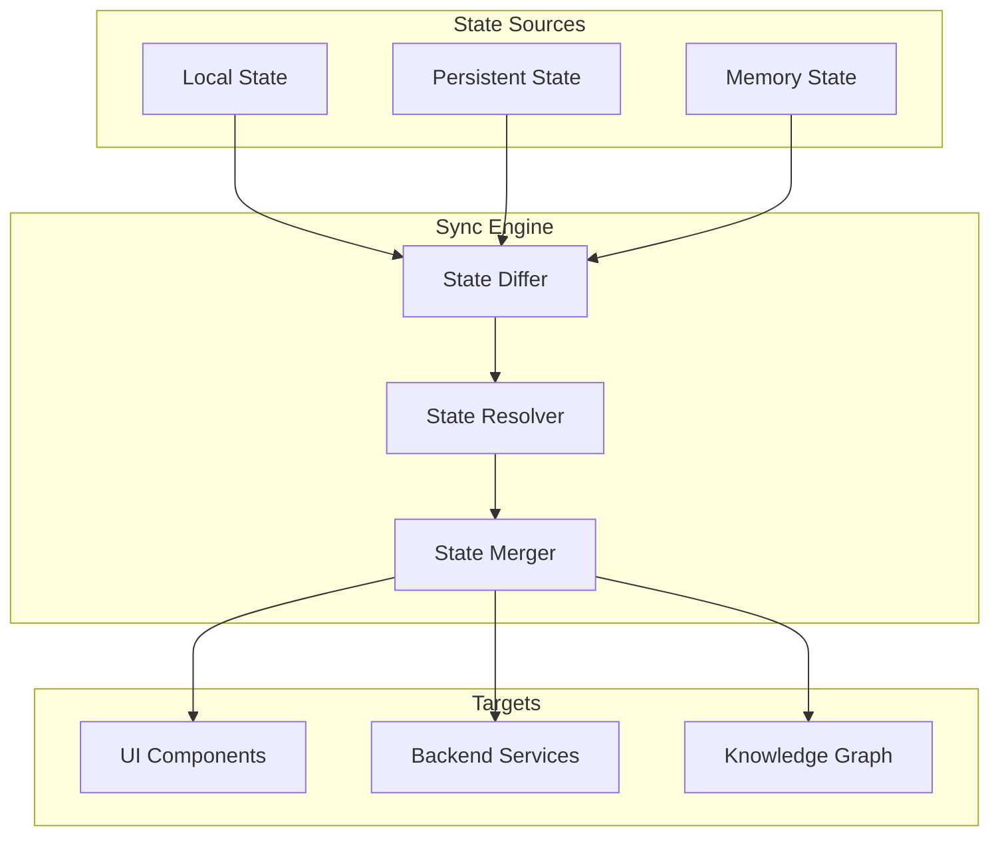

### 8.2 State Synchronization Protocol

```typescript
interface StateSync {
  syncId: string;
  type: 'full' | 'incremental' | 'patch';
  
  source: {
    stateType: 'local' | 'persistent' | 'memory';
    version: number;
    checksum: string;
  };
  
  changes: Array<{
    operation: 'create' | 'update' | 'delete';
    path: string;
    value?: any;
    previousValue?: any;
    timestamp: number;
  }>;
  
  conflict?: {
    detected: boolean;
    resolution: 'local' | 'remote' | 'merge' | 'manual';
    conflicts: Array<{
      path: string;
      localValue: any;
      remoteValue: any;
    }>;
  };
}
```

## 9. Terminal I/O Stream Processing

### 9.1 Terminal Output Pipeline

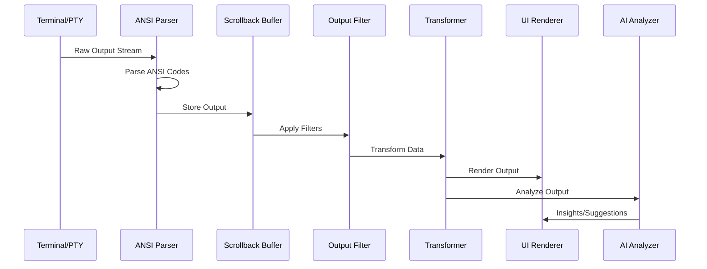

### 9.2 Stream Data Structure

```typescript
interface TerminalStream {
  sessionId: string;
  streamType: 'stdout' | 'stderr' | 'stdin';
  
  data: {
    raw: Uint8Array;
    decoded: string;
    ansiCodes: Array<{
      type: string;
      params: any[];
      position: number;
    }>;
  };
  
  metadata: {
    timestamp: number;
    sequence: number;
    encoding: string;
    lineNumber?: number;
  };
  
  processing: {
    filtered?: boolean;
    highlighted?: boolean;
    collapsed?: boolean;
    bookmarked?: boolean;
  };
}
```

## 10. AI Integration Data Flow

### 10.1 AI Request/Response Flow

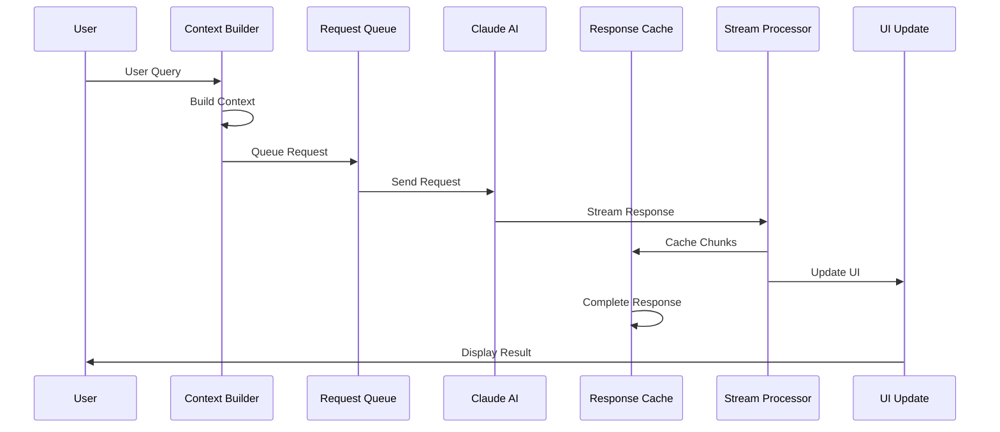

### 10.2 AI Context Structure

```typescript
interface AIContext {
  sessionId: string;
  model: string;
  
  request: {
    query: string;
    systemPrompt?: string;
    temperature?: number;
    maxTokens?: number;
    tools?: string[];
  };
  
  context: {
    conversationHistory: Message[];
    projectContext: {
      files: string[];
      currentFile?: string;
      selection?: TextRange;
    };
    terminalContext: {
      lastCommands: string[];
      currentOutput: string;
      workingDirectory: string;
    };
  };
  
  response: {
    text: string;
    tokens: {
      input: number;
      output: number;
    };
    toolCalls?: ToolCall[];
    streaming: boolean;
  };
}
```

## 11. Performance Monitoring Flow

### 11.1 Metrics Collection Pipeline

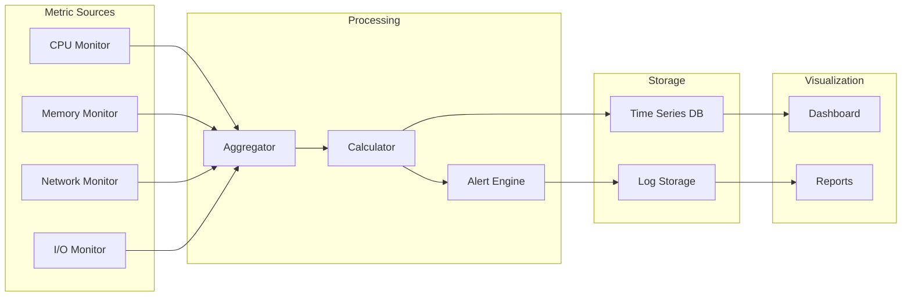

### 11.2 Performance Metrics Structure

```typescript
interface PerformanceMetric {
  metricId: string;
  type: 'latency' | 'throughput' | 'resource' | 'error';
  
  measurement: {
    value: number;
    unit: string;
    timestamp: number;
    tags: Record<string, string>;
  };
  
  aggregation: {
    min: number;
    max: number;
    avg: number;
    p50: number;
    p95: number;
    p99: number;
    count: number;
    window: number; // seconds
  };
  
  threshold?: {
    warning: number;
    critical: number;
    action: 'alert' | 'throttle' | 'scale';
  };
}
```

## 12. Error Handling Flow

### 12.1 Error Processing Pipeline

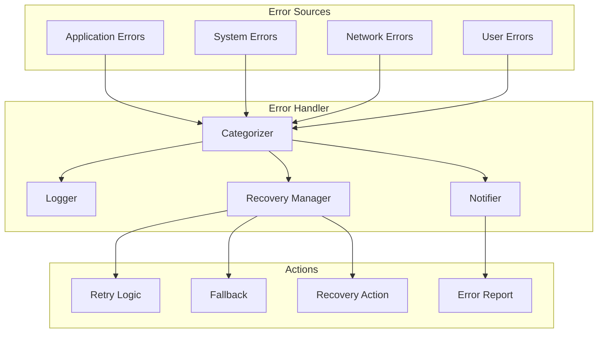

### 12.2 Error Data Model

```typescript
interface ErrorEvent {
  errorId: string;
  type: 'application' | 'system' | 'network' | 'user';
  severity: 'low' | 'medium' | 'high' | 'critical';
  
  error: {
    message: string;
    code?: string;
    stack?: string;
    cause?: any;
  };
  
  context: {
    component: string;
    action: string;
    userId?: string;
    sessionId?: string;
    projectId?: string;
  };
  
  recovery: {
    attempted: boolean;
    strategy?: 'retry' | 'fallback' | 'ignore' | 'fail';
    result?: 'success' | 'failure' | 'partial';
    attempts?: number;
  };
  
  reporting: {
    logged: boolean;
    notified: boolean;
    reportId?: string;
  };
}
```

## 13. Data Flow Optimization Strategies

### 13.1 Buffering and Batching
- **Command Batching**: Group multiple commands for execution
- **Event Buffering**: Aggregate events before processing
- **Stream Buffering**: Optimize terminal output rendering

### 13.2 Caching Strategies
- **Response Caching**: Cache AI and API responses
- **State Caching**: Local state snapshots
- **Asset Caching**: Static resource optimization

### 13.3 Throttling and Debouncing
- **Input Throttling**: Limit voice processing rate
- **Event Debouncing**: Reduce UI update frequency
- **API Rate Limiting**: Manage external service calls

## 14. Data Flow Security

### 14.1 Data Sanitization Points
- Input validation at entry points
- Output encoding for display
- Command injection prevention
- XSS protection in UI rendering

### 14.2 Data Encryption Flow
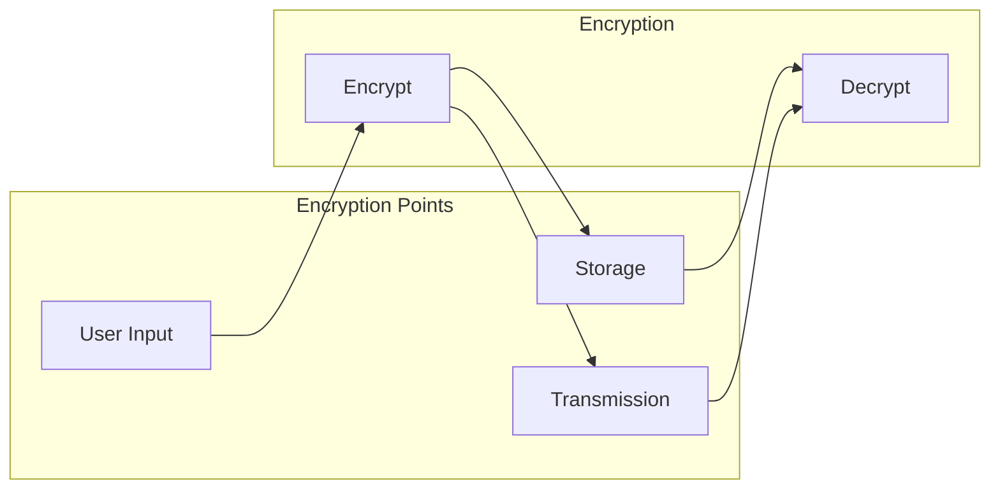

---

## Document History
- v1.0.0 (2025-09-18): Initial data flow architecture documentation