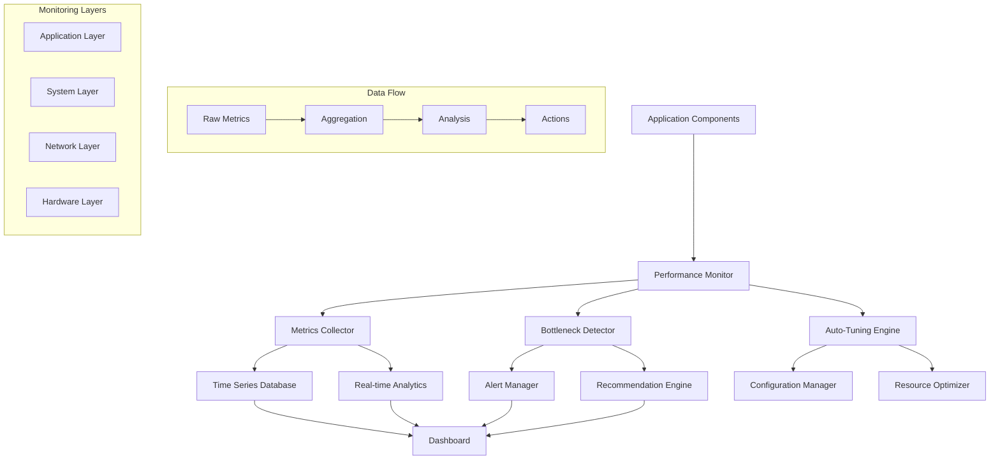

# Performance Monitoring and Tuning

## Overview

Comprehensive performance monitoring and tuning system providing real-time metrics collection, bottleneck identification, automated response, performance regression detection, and intelligent optimization recommendations for the voice-terminal-hybrid application.

## Architecture Design

### Monitoring Infrastructure



### Performance Metrics Hierarchy

| Layer | Metrics | Collection Frequency | Retention |
|-------|---------|---------------------|-----------|
| Application | Latency, Throughput, Errors | 1s | 7 days |
| System | CPU, Memory, Disk I/O | 5s | 30 days |
| Network | Bandwidth, Latency, Packet Loss | 10s | 14 days |
| Hardware | Temperature, Power, Storage | 30s | 90 days |

## Core Monitoring Implementation

### Performance Monitor Core

```typescript
interface PerformanceConfig {
  componentName: string;
  targetLatency: number;           // Target response time in ms
  maxMemoryUsage: number;         // Maximum memory usage in bytes
  enableAutoTuning: boolean;      // Enable automatic optimization
  metricsRetentionTime: number;   // Metrics retention period
  alertThresholds: AlertThresholds;
  samplingRate: number;           // Sampling rate (0-1)
  enablePredictiveAnalysis: boolean;
}

interface AlertThresholds {
  latencyP95: number;
  latencyP99: number;
  memoryUsage: number;
  cpuUsage: number;
  errorRate: number;
  throughput: number;
  diskUsage: number;
  networkLatency: number;
}

interface PerformanceMetric {
  name: string;
  value: number;
  timestamp: number;
  tags?: Record<string, string>;
  unit?: string;
  context?: MetricContext;
}

interface MetricContext {
  userId?: string;
  sessionId?: string;
  requestId?: string;
  operation?: string;
  component?: string;
}

export class PerformanceMonitor extends EventEmitter {
  private config: PerformanceConfig;
  private metricsCollector: MetricsCollector;
  private bottleneckDetector: BottleneckDetector;
  private autoTuner: AutoTuningEngine;
  private alertManager: AlertManager;
  private predictiveAnalyzer: PredictiveAnalyzer;
  private isMonitoring: boolean = false;

  constructor(config: Partial<PerformanceConfig> = {}) {
    super();
    
    this.config = {
      componentName: config.componentName || 'unknown',
      targetLatency: config.targetLatency || 100,
      maxMemoryUsage: config.maxMemoryUsage || 512 * 1024 * 1024,
      enableAutoTuning: config.enableAutoTuning ?? false,
      metricsRetentionTime: config.metricsRetentionTime || 3600000,
      samplingRate: config.samplingRate || 1.0,
      enablePredictiveAnalysis: config.enablePredictiveAnalysis ?? true,
      alertThresholds: {
        latencyP95: 200,
        latencyP99: 500,
        memoryUsage: 0.8,
        cpuUsage: 0.7,
        errorRate: 0.01,
        throughput: 100,
        diskUsage: 0.8,
        networkLatency: 100,
        ...config.alertThresholds
      }
    };

    this.initializeComponents();
  }

  private initializeComponents(): void {
    this.metricsCollector = new MetricsCollector(this.config);
    this.bottleneckDetector = new BottleneckDetector(this.config);
    this.autoTuner = new AutoTuningEngine(this.config);
    this.alertManager = new AlertManager(this.config);
    
    if (this.config.enablePredictiveAnalysis) {
      this.predictiveAnalyzer = new PredictiveAnalyzer(this.config);
    }

    this.setupEventHandlers();
  }

  private setupEventHandlers(): void {
    this.metricsCollector.on('metric_collected', (metric) => {
      this.processMetric(metric);
    });

    this.bottleneckDetector.on('bottleneck_detected', (bottleneck) => {
      this.handleBottleneck(bottleneck);
    });

    this.autoTuner.on('optimization_applied', (optimization) => {
      this.emit('optimization_applied', optimization);
    });

    this.alertManager.on('alert_triggered', (alert) => {
      this.emit('alert_triggered', alert);
    });
  }

  /**
   * Start comprehensive performance monitoring
   */
  async start(): Promise<void> {
    if (this.isMonitoring) return;

    this.isMonitoring = true;
    
    await this.metricsCollector.start();
    await this.bottleneckDetector.start();
    
    if (this.config.enableAutoTuning) {
      await this.autoTuner.start();
    }
    
    if (this.predictiveAnalyzer) {
      await this.predictiveAnalyzer.start();
    }

    console.log(`Performance monitoring started for ${this.config.componentName}`);
    this.emit('monitoring_started');
  }

  /**
   * Stop performance monitoring
   */
  async stop(): Promise<void> {
    if (!this.isMonitoring) return;

    this.isMonitoring = false;
    
    await this.metricsCollector.stop();
    await this.bottleneckDetector.stop();
    await this.autoTuner.stop();
    
    if (this.predictiveAnalyzer) {
      await this.predictiveAnalyzer.stop();
    }

    console.log(`Performance monitoring stopped for ${this.config.componentName}`);
    this.emit('monitoring_stopped');
  }

  /**
   * Record performance metric with context
   */
  recordMetric(
    name: string, 
    value: number, 
    tags?: Record<string, string>, 
    unit?: string,
    context?: MetricContext
  ): void {
    if (!this.shouldSample()) return;

    const metric: PerformanceMetric = {
      name,
      value,
      timestamp: Date.now(),
      tags: {
        component: this.config.componentName,
        ...tags
      },
      unit,
      context
    };

    this.metricsCollector.collect(metric);
  }

  /**
   * Start operation measurement
   */
  startMeasurement(operationName: string, context?: MetricContext): string {
    const measurementId = `${operationName}_${Date.now()}_${Math.random().toString(36).substr(2, 9)}`;
    
    performance.mark(`${measurementId}_start`);
    
    // Store context for later retrieval
    this.metricsCollector.storeMeasurementContext(measurementId, {
      operationName,
      context: context || {}
    });
    
    return measurementId;
  }

  /**
   * End operation measurement
   */
  endMeasurement(measurementId: string, additionalTags?: Record<string, string>): number {
    const endMark = `${measurementId}_end`;
    const startMark = `${measurementId}_start`;
    
    performance.mark(endMark);
    performance.measure(measurementId, startMark, endMark);
    
    const entry = performance.getEntriesByName(measurementId)[0];
    const duration = entry ? entry.duration : 0;
    
    // Get stored context
    const measurementContext = this.metricsCollector.getMeasurementContext(measurementId);
    
    this.recordMetric(
      'operation_duration', 
      duration, 
      {
        operation: measurementContext?.operationName || 'unknown',
        ...additionalTags
      },
      'ms',
      measurementContext?.context
    );

    // Cleanup
    performance.clearMarks(startMark);
    performance.clearMarks(endMark);
    performance.clearMeasures(measurementId);
    this.metricsCollector.clearMeasurementContext(measurementId);

    return duration;
  }

  /**
   * Record error with context
   */
  recordError(error: Error, context?: MetricContext, tags?: Record<string, string>): void {
    this.recordMetric(
      'error_count', 
      1, 
      {
        error_type: error.constructor.name,
        error_message: error.message.substring(0, 100),
        ...tags
      },
      'count',
      context
    );

    // Store detailed error information
    this.metricsCollector.storeErrorDetails({
      error,
      context,
      timestamp: Date.now(),
      stackTrace: error.stack
    });
  }

  /**
   * Record throughput measurement
   */
  recordThroughput(operation: string, count: number, context?: MetricContext): void {
    this.recordMetric(
      'throughput', 
      count, 
      { operation },
      'ops/sec',
      context
    );
  }

  /**
   * Record resource usage
   */
  recordResourceUsage(): void {
    const memUsage = process.memoryUsage();
    const cpuUsage = process.cpuUsage();
    
    // Memory metrics
    this.recordMetric('memory_heap_used', memUsage.heapUsed, {}, 'bytes');
    this.recordMetric('memory_heap_total', memUsage.heapTotal, {}, 'bytes');
    this.recordMetric('memory_external', memUsage.external, {}, 'bytes');
    this.recordMetric('memory_rss', memUsage.rss, {}, 'bytes');

    // CPU metrics (simplified)
    const totalCpu = cpuUsage.user + cpuUsage.system;
    this.recordMetric('cpu_usage', totalCpu / 1000000, {}, 'seconds');

    // Check thresholds
    this.checkResourceThresholds(memUsage, cpuUsage);
  }

  private processMetric(metric: PerformanceMetric): void {
    // Send to bottleneck detector
    this.bottleneckDetector.analyzeMetric(metric);
    
    // Send to alert manager
    this.alertManager.checkThresholds(metric);
    
    // Send to predictive analyzer
    if (this.predictiveAnalyzer) {
      this.predictiveAnalyzer.addDataPoint(metric);
    }
    
    this.emit('metric_processed', metric);
  }

  private handleBottleneck(bottleneck: DetectedBottleneck): void {
    console.warn(`Bottleneck detected: ${bottleneck.description}`);
    
    // Trigger auto-tuning if enabled
    if (this.config.enableAutoTuning) {
      this.autoTuner.handleBottleneck(bottleneck);
    }
    
    this.emit('bottleneck_detected', bottleneck);
  }

  private checkResourceThresholds(memUsage: any, cpuUsage: any): void {
    const memoryUsagePercent = memUsage.heapUsed / this.config.maxMemoryUsage;
    
    if (memoryUsagePercent > this.config.alertThresholds.memoryUsage) {
      this.emit('memory_threshold_exceeded', {
        current: memUsage.heapUsed,
        threshold: this.config.maxMemoryUsage,
        percentage: memoryUsagePercent
      });
    }
  }

  private shouldSample(): boolean {
    return Math.random() < this.config.samplingRate;
  }

  /**
   * Get comprehensive performance report
   */
  getPerformanceReport(): PerformanceReport {
    return {
      componentName: this.config.componentName,
      timestamp: Date.now(),
      metrics: this.metricsCollector.getAggregatedMetrics(),
      bottlenecks: this.bottleneckDetector.getActiveBottlenecks(),
      recommendations: this.generateRecommendations(),
      predictions: this.predictiveAnalyzer?.getPredictions() || [],
      healthScore: this.calculateHealthScore()
    };
  }

  private generateRecommendations(): PerformanceRecommendation[] {
    const recommendations: PerformanceRecommendation[] = [];
    const metrics = this.metricsCollector.getAggregatedMetrics();
    const bottlenecks = this.bottleneckDetector.getActiveBottlenecks();

    // Memory optimization recommendations
    if (metrics.memoryUsage > this.config.alertThresholds.memoryUsage) {
      recommendations.push({
        category: 'memory',
        priority: 'high',
        title: 'Optimize Memory Usage',
        description: 'High memory usage detected. Consider implementing memory pooling or increasing garbage collection frequency.',
        expectedImprovement: '20-40% memory reduction',
        implementation: 'Enable object pooling, optimize data structures, tune GC parameters'
      });
    }

    // Latency optimization recommendations
    if (metrics.latency.p95 > this.config.targetLatency * 2) {
      recommendations.push({
        category: 'latency',
        priority: 'critical',
        title: 'Reduce Response Latency',
        description: 'Response times are significantly above target. Implement caching and optimize critical paths.',
        expectedImprovement: '30-60% latency reduction',
        implementation: 'Add caching layers, optimize database queries, implement connection pooling'
      });
    }

    // Error rate recommendations
    if (metrics.errorRate > this.config.alertThresholds.errorRate) {
      recommendations.push({
        category: 'reliability',
        priority: 'high',
        title: 'Improve Error Handling',
        description: 'High error rate detected. Implement better error handling and retry logic.',
        expectedImprovement: 'Reduced error rate by 50-80%',
        implementation: 'Add circuit breakers, implement retry logic, improve input validation'
      });
    }

    return recommendations;
  }

  private calculateHealthScore(): number {
    const metrics = this.metricsCollector.getAggregatedMetrics();
    let score = 1.0;

    // Deduct for high latency
    if (metrics.latency.p95 > this.config.targetLatency) {
      const latencyPenalty = Math.min(0.4, (metrics.latency.p95 / this.config.targetLatency - 1) * 0.2);
      score -= latencyPenalty;
    }

    // Deduct for high memory usage
    if (metrics.memoryUsage > this.config.alertThresholds.memoryUsage) {
      const memoryPenalty = Math.min(0.3, (metrics.memoryUsage - this.config.alertThresholds.memoryUsage) * 0.5);
      score -= memoryPenalty;
    }

    // Deduct for errors
    if (metrics.errorRate > 0) {
      const errorPenalty = Math.min(0.4, metrics.errorRate / this.config.alertThresholds.errorRate * 0.4);
      score -= errorPenalty;
    }

    // Deduct for active bottlenecks
    const bottlenecks = this.bottleneckDetector.getActiveBottlenecks();
    const criticalBottlenecks = bottlenecks.filter(b => b.severity === 'critical').length;
    const bottleneckPenalty = Math.min(0.3, criticalBottlenecks * 0.1);
    score -= bottleneckPenalty;

    return Math.max(0, Math.min(1, score));
  }
}

interface PerformanceReport {
  componentName: string;
  timestamp: number;
  metrics: AggregatedMetrics;
  bottlenecks: DetectedBottleneck[];
  recommendations: PerformanceRecommendation[];
  predictions: PerformancePrediction[];
  healthScore: number;
}

interface PerformanceRecommendation {
  category: 'memory' | 'latency' | 'throughput' | 'reliability' | 'configuration';
  priority: 'low' | 'medium' | 'high' | 'critical';
  title: string;
  description: string;
  expectedImprovement: string;
  implementation: string;
}

interface PerformancePrediction {
  metric: string;
  predictedValue: number;
  confidence: number;
  timeHorizon: number; // minutes
  recommendation?: string;
}
```

## Metrics Collection System

### Advanced Metrics Collector

```typescript
interface MeasurementContext {
  operationName: string;
  context: MetricContext;
}

interface ErrorDetails {
  error: Error;
  context?: MetricContext;
  timestamp: number;
  stackTrace?: string;
}

interface AggregatedMetrics {
  latency: LatencyMetrics;
  throughput: ThroughputMetrics;
  resources: ResourceMetrics;
  errors: ErrorMetrics;
  memoryUsage: number;
  cpuUsage: number;
  errorRate: number;
}

export class MetricsCollector extends EventEmitter {
  private metrics: PerformanceMetric[] = [];
  private measurementContexts: Map<string, MeasurementContext> = new Map();
  private errorDetails: ErrorDetails[] = [];
  private aggregationInterval: NodeJS.Timer | null = null;
  private retentionCleanup: NodeJS.Timer | null = null;
  private config: PerformanceConfig;

  constructor(config: PerformanceConfig) {
    super();
    this.config = config;
  }

  async start(): Promise<void> {
    // Start aggregation
    this.aggregationInterval = setInterval(() => {
      this.performAggregation();
    }, 10000); // Aggregate every 10 seconds

    // Start retention cleanup
    this.retentionCleanup = setInterval(() => {
      this.cleanupOldMetrics();
    }, 60000); // Cleanup every minute

    console.log('Metrics collector started');
  }

  async stop(): Promise<void> {
    if (this.aggregationInterval) {
      clearInterval(this.aggregationInterval);
      this.aggregationInterval = null;
    }

    if (this.retentionCleanup) {
      clearInterval(this.retentionCleanup);
      this.retentionCleanup = null;
    }

    console.log('Metrics collector stopped');
  }

  collect(metric: PerformanceMetric): void {
    this.metrics.push(metric);
    this.emit('metric_collected', metric);
  }

  storeMeasurementContext(measurementId: string, context: MeasurementContext): void {
    this.measurementContexts.set(measurementId, context);
  }

  getMeasurementContext(measurementId: string): MeasurementContext | undefined {
    return this.measurementContexts.get(measurementId);
  }

  clearMeasurementContext(measurementId: string): void {
    this.measurementContexts.delete(measurementId);
  }

  storeErrorDetails(errorDetails: ErrorDetails): void {
    this.errorDetails.push(errorDetails);
    
    // Keep only recent errors
    if (this.errorDetails.length > 1000) {
      this.errorDetails = this.errorDetails.slice(-500);
    }
  }

  getAggregatedMetrics(): AggregatedMetrics {
    const now = Date.now();
    const timeWindow = 300000; // 5 minutes
    
    const recentMetrics = this.metrics.filter(m => 
      (now - m.timestamp) < timeWindow
    );

    return {
      latency: this.calculateLatencyMetrics(recentMetrics),
      throughput: this.calculateThroughputMetrics(recentMetrics),
      resources: this.calculateResourceMetrics(recentMetrics),
      errors: this.calculateErrorMetrics(recentMetrics),
      memoryUsage: this.getLatestResourceValue(recentMetrics, 'memory_heap_used'),
      cpuUsage: this.getLatestResourceValue(recentMetrics, 'cpu_usage'),
      errorRate: this.calculateErrorRate(recentMetrics)
    };
  }

  private calculateLatencyMetrics(metrics: PerformanceMetric[]): LatencyMetrics {
    const latencyMetrics = metrics.filter(m => 
      m.name === 'operation_duration' || m.name.includes('latency')
    );

    if (latencyMetrics.length === 0) {
      return { p50: 0, p95: 0, p99: 0, mean: 0, min: 0, max: 0, count: 0 };
    }

    const values = latencyMetrics.map(m => m.value).sort((a, b) => a - b);
    
    return {
      p50: this.percentile(values, 0.5),
      p95: this.percentile(values, 0.95),
      p99: this.percentile(values, 0.99),
      mean: values.reduce((sum, val) => sum + val, 0) / values.length,
      min: values[0],
      max: values[values.length - 1],
      count: values.length
    };
  }

  private calculateThroughputMetrics(metrics: PerformanceMetric[]): ThroughputMetrics {
    const throughputMetrics = metrics.filter(m => 
      m.name === 'throughput' || m.name.includes('ops_per_sec')
    );

    const operations = throughputMetrics.reduce((sum, m) => sum + m.value, 0);
    const timeSpan = this.getTimeSpan(throughputMetrics);
    
    return {
      operationsPerSecond: timeSpan > 0 ? operations / (timeSpan / 1000) : 0,
      requestsPerSecond: operations / (timeSpan / 1000),
      averageThroughput: operations / Math.max(1, throughputMetrics.length),
      peakThroughput: Math.max(...throughputMetrics.map(m => m.value), 0)
    };
  }

  private calculateResourceMetrics(metrics: PerformanceMetric[]): ResourceMetrics {
    return {
      memoryUsage: this.getLatestResourceValue(metrics, 'memory_heap_used'),
      memoryPeak: this.getMaxResourceValue(metrics, 'memory_heap_used'),
      cpuUsage: this.getLatestResourceValue(metrics, 'cpu_usage'),
      cpuPeak: this.getMaxResourceValue(metrics, 'cpu_usage'),
      diskIO: this.getLatestResourceValue(metrics, 'disk_io') || 0,
      networkIO: this.getLatestResourceValue(metrics, 'network_io') || 0
    };
  }

  private calculateErrorMetrics(metrics: PerformanceMetric[]): ErrorMetrics {
    const errorMetrics = metrics.filter(m => m.name === 'error_count');
    const totalOperations = metrics.filter(m => 
      m.name === 'operation_duration' || m.name === 'throughput'
    ).length;

    const errorsByType: Record<string, number> = {};
    errorMetrics.forEach(m => {
      const errorType = m.tags?.error_type || 'unknown';
      errorsByType[errorType] = (errorsByType[errorType] || 0) + m.value;
    });

    const totalErrors = errorMetrics.reduce((sum, m) => sum + m.value, 0);

    return {
      errorCount: totalErrors,
      errorRate: totalOperations > 0 ? totalErrors / totalOperations : 0,
      errorsByType,
      recentErrors: this.getRecentErrors()
    };
  }

  private getLatestResourceValue(metrics: PerformanceMetric[], metricName: string): number {
    const resourceMetrics = metrics
      .filter(m => m.name === metricName)
      .sort((a, b) => b.timestamp - a.timestamp);
    
    return resourceMetrics.length > 0 ? resourceMetrics[0].value : 0;
  }

  private getMaxResourceValue(metrics: PerformanceMetric[], metricName: string): number {
    const resourceMetrics = metrics.filter(m => m.name === metricName);
    return Math.max(...resourceMetrics.map(m => m.value), 0);
  }

  private calculateErrorRate(metrics: PerformanceMetric[]): number {
    const errors = metrics.filter(m => m.name === 'error_count');
    const operations = metrics.filter(m => m.name === 'operation_duration');
    
    const totalErrors = errors.reduce((sum, m) => sum + m.value, 0);
    const totalOperations = operations.length;
    
    return totalOperations > 0 ? totalErrors / totalOperations : 0;
  }

  private getTimeSpan(metrics: PerformanceMetric[]): number {
    if (metrics.length < 2) return 1000; // Default 1 second
    
    const timestamps = metrics.map(m => m.timestamp).sort();
    return timestamps[timestamps.length - 1] - timestamps[0];
  }

  private getRecentErrors(): any[] {
    return this.errorDetails
      .slice(-10)
      .map(e => ({
        type: e.error.constructor.name,
        message: e.error.message,
        timestamp: e.timestamp,
        context: e.context
      }));
  }

  private percentile(sortedArray: number[], p: number): number {
    if (sortedArray.length === 0) return 0;
    
    const index = p * (sortedArray.length - 1);
    const lower = Math.floor(index);
    const upper = Math.ceil(index);
    
    if (lower === upper) {
      return sortedArray[lower];
    }
    
    const weight = index - lower;
    return sortedArray[lower] * (1 - weight) + sortedArray[upper] * weight;
  }

  private performAggregation(): void {
    const aggregated = this.getAggregatedMetrics();
    this.emit('metrics_aggregated', {
      timestamp: Date.now(),
      metrics: aggregated
    });
  }

  private cleanupOldMetrics(): void {
    const cutoff = Date.now() - this.config.metricsRetentionTime;
    
    this.metrics = this.metrics.filter(m => m.timestamp > cutoff);
    this.errorDetails = this.errorDetails.filter(e => e.timestamp > cutoff);
    
    // Cleanup measurement contexts older than 1 hour
    const contextCutoff = Date.now() - 3600000;
    for (const [key, context] of this.measurementContexts) {
      const timestamp = parseInt(key.split('_')[1]);
      if (timestamp < contextCutoff) {
        this.measurementContexts.delete(key);
      }
    }
  }
}

interface LatencyMetrics {
  p50: number;
  p95: number;
  p99: number;
  mean: number;
  min: number;
  max: number;
  count: number;
}

interface ThroughputMetrics {
  operationsPerSecond: number;
  requestsPerSecond: number;
  averageThroughput: number;
  peakThroughput: number;
}

interface ResourceMetrics {
  memoryUsage: number;
  memoryPeak: number;
  cpuUsage: number;
  cpuPeak: number;
  diskIO: number;
  networkIO: number;
}

interface ErrorMetrics {
  errorCount: number;
  errorRate: number;
  errorsByType: Record<string, number>;
  recentErrors: any[];
}
```

## Bottleneck Detection System

### Intelligent Bottleneck Detection

```typescript
interface DetectedBottleneck {
  type: 'memory' | 'cpu' | 'io' | 'latency' | 'throughput' | 'network' | 'database';
  severity: 'low' | 'medium' | 'high' | 'critical';
  description: string;
  impact: number; // 0-1 scale
  suggestedAction: string;
  detectedAt: number;
  metrics: Record<string, number>;
  confidence: number; // 0-1 scale
}

export class BottleneckDetector extends EventEmitter {
  private config: PerformanceConfig;
  private detectionInterval: NodeJS.Timer | null = null;
  private metricHistory: PerformanceMetric[] = [];
  private activeBottlenecks: Map<string, DetectedBottleneck> = new Map();
  private detectionRules: BottleneckDetectionRule[] = [];

  constructor(config: PerformanceConfig) {
    super();
    this.config = config;
    this.initializeDetectionRules();
  }

  async start(): Promise<void> {
    this.detectionInterval = setInterval(() => {
      this.performBottleneckDetection();
    }, 15000); // Check every 15 seconds

    console.log('Bottleneck detector started');
  }

  async stop(): Promise<void> {
    if (this.detectionInterval) {
      clearInterval(this.detectionInterval);
      this.detectionInterval = null;
    }

    console.log('Bottleneck detector stopped');
  }

  analyzeMetric(metric: PerformanceMetric): void {
    this.metricHistory.push(metric);
    
    // Keep only recent metrics
    const retentionTime = 600000; // 10 minutes
    const cutoff = Date.now() - retentionTime;
    this.metricHistory = this.metricHistory.filter(m => m.timestamp > cutoff);
    
    // Real-time bottleneck detection for critical metrics
    this.checkRealTimeBottlenecks(metric);
  }

  getActiveBottlenecks(): DetectedBottleneck[] {
    return Array.from(this.activeBottlenecks.values());
  }

  private initializeDetectionRules(): void {
    this.detectionRules = [
      // Memory bottleneck rules
      {
        name: 'high_memory_usage',
        type: 'memory',
        condition: (metrics) => {
          const memMetrics = metrics.filter(m => m.name === 'memory_heap_used');
          if (memMetrics.length === 0) return null;
          
          const latest = memMetrics[memMetrics.length - 1];
          const usage = latest.value / this.config.maxMemoryUsage;
          
          if (usage > 0.9) {
            return {
              severity: 'critical' as const,
              confidence: Math.min(1, usage),
              metrics: { memory_usage: usage, absolute_memory: latest.value }
            };
          } else if (usage > 0.8) {
            return {
              severity: 'high' as const,
              confidence: Math.min(1, usage),
              metrics: { memory_usage: usage, absolute_memory: latest.value }
            };
          }
          
          return null;
        },
        description: 'High memory usage detected',
        suggestedAction: 'Optimize memory usage, enable garbage collection, or increase memory allocation'
      },

      // CPU bottleneck rules
      {
        name: 'high_cpu_usage',
        type: 'cpu',
        condition: (metrics) => {
          const cpuMetrics = metrics.filter(m => m.name === 'cpu_usage');
          if (cpuMetrics.length < 5) return null;
          
          const recent = cpuMetrics.slice(-5);
          const avgCpu = recent.reduce((sum, m) => sum + m.value, 0) / recent.length;
          
          if (avgCpu > 0.9) {
            return {
              severity: 'critical' as const,
              confidence: Math.min(1, avgCpu),
              metrics: { avg_cpu_usage: avgCpu }
            };
          } else if (avgCpu > 0.75) {
            return {
              severity: 'high' as const,
              confidence: Math.min(1, avgCpu),
              metrics: { avg_cpu_usage: avgCpu }
            };
          }
          
          return null;
        },
        description: 'High CPU usage detected',
        suggestedAction: 'Optimize CPU-intensive operations, implement worker threads, or scale horizontally'
      },

      // Latency bottleneck rules
      {
        name: 'high_latency',
        type: 'latency',
        condition: (metrics) => {
          const latencyMetrics = metrics.filter(m => 
            m.name === 'operation_duration' || m.name.includes('latency')
          );
          
          if (latencyMetrics.length < 10) return null;
          
          const recent = latencyMetrics.slice(-20);
          const values = recent.map(m => m.value).sort((a, b) => a - b);
          const p95 = this.percentile(values, 0.95);
          
          const targetLatency = this.config.targetLatency;
          
          if (p95 > targetLatency * 5) {
            return {
              severity: 'critical' as const,
              confidence: Math.min(1, p95 / (targetLatency * 2)),
              metrics: { p95_latency: p95, target_latency: targetLatency }
            };
          } else if (p95 > targetLatency * 2) {
            return {
              severity: 'high' as const,
              confidence: Math.min(1, p95 / (targetLatency * 2)),
              metrics: { p95_latency: p95, target_latency: targetLatency }
            };
          }
          
          return null;
        },
        description: 'High response latency detected',
        suggestedAction: 'Optimize critical paths, add caching, or improve database query performance'
      },

      // Error rate bottleneck rules
      {
        name: 'high_error_rate',
        type: 'throughput',
        condition: (metrics) => {
          const errorMetrics = metrics.filter(m => m.name === 'error_count');
          const operationMetrics = metrics.filter(m => m.name === 'operation_duration');
          
          if (errorMetrics.length === 0 || operationMetrics.length === 0) return null;
          
          const timeWindow = 60000; // 1 minute
          const now = Date.now();
          
          const recentErrors = errorMetrics.filter(m => (now - m.timestamp) < timeWindow);
          const recentOperations = operationMetrics.filter(m => (now - m.timestamp) < timeWindow);
          
          const errorCount = recentErrors.reduce((sum, m) => sum + m.value, 0);
          const operationCount = recentOperations.length;
          
          if (operationCount === 0) return null;
          
          const errorRate = errorCount / operationCount;
          const threshold = this.config.alertThresholds.errorRate;
          
          if (errorRate > threshold * 5) {
            return {
              severity: 'critical' as const,
              confidence: Math.min(1, errorRate / threshold),
              metrics: { error_rate: errorRate, threshold }
            };
          } else if (errorRate > threshold * 2) {
            return {
              severity: 'high' as const,
              confidence: Math.min(1, errorRate / threshold),
              metrics: { error_rate: errorRate, threshold }
            };
          }
          
          return null;
        },
        description: 'High error rate detected',
        suggestedAction: 'Investigate error causes, implement better error handling, and add circuit breakers'
      }
    ];
  }

  private performBottleneckDetection(): void {
    const activeBottlenecks: DetectedBottleneck[] = [];
    
    for (const rule of this.detectionRules) {
      const result = rule.condition(this.metricHistory);
      
      if (result) {
        const bottleneck: DetectedBottleneck = {
          type: rule.type,
          severity: result.severity,
          description: rule.description,
          impact: this.calculateImpact(rule.type, result.severity),
          suggestedAction: rule.suggestedAction,
          detectedAt: Date.now(),
          metrics: result.metrics,
          confidence: result.confidence
        };
        
        activeBottlenecks.push(bottleneck);
        
        // Check if this is a new bottleneck
        const key = `${rule.type}_${rule.name}`;
        if (!this.activeBottlenecks.has(key)) {
          this.activeBottlenecks.set(key, bottleneck);
          this.emit('bottleneck_detected', bottleneck);
        } else {
          // Update existing bottleneck
          this.activeBottlenecks.set(key, bottleneck);
        }
      }
    }
    
    // Remove resolved bottlenecks
    for (const [key, bottleneck] of this.activeBottlenecks) {
      const stillActive = activeBottlenecks.some(b => 
        b.type === bottleneck.type && 
        b.description === bottleneck.description
      );
      
      if (!stillActive) {
        this.activeBottlenecks.delete(key);
        this.emit('bottleneck_resolved', bottleneck);
      }
    }
  }

  private checkRealTimeBottlenecks(metric: PerformanceMetric): void {
    // Immediate bottleneck detection for critical metrics
    if (metric.name === 'memory_heap_used') {
      const usage = metric.value / this.config.maxMemoryUsage;
      if (usage > 0.95) {
        this.emitCriticalBottleneck('memory', 'Critical memory usage', usage);
      }
    }
    
    if (metric.name === 'operation_duration') {
      if (metric.value > this.config.targetLatency * 10) {
        this.emitCriticalBottleneck('latency', 'Extremely high latency', metric.value);
      }
    }
  }

  private emitCriticalBottleneck(type: string, description: string, value: number): void {
    const bottleneck: DetectedBottleneck = {
      type: type as any,
      severity: 'critical',
      description,
      impact: 0.9,
      suggestedAction: 'Immediate attention required',
      detectedAt: Date.now(),
      metrics: { value },
      confidence: 1.0
    };
    
    this.emit('critical_bottleneck', bottleneck);
  }

  private calculateImpact(type: string, severity: string): number {
    const severityMultipliers = {
      low: 0.2,
      medium: 0.4,
      high: 0.7,
      critical: 0.9
    };
    
    const typeMultipliers = {
      memory: 1.0,
      cpu: 0.9,
      latency: 0.8,
      throughput: 0.7,
      io: 0.6,
      network: 0.5,
      database: 0.8
    };
    
    return severityMultipliers[severity] * (typeMultipliers[type] || 0.5);
  }

  private percentile(sortedArray: number[], p: number): number {
    if (sortedArray.length === 0) return 0;
    
    const index = p * (sortedArray.length - 1);
    const lower = Math.floor(index);
    const upper = Math.ceil(index);
    
    if (lower === upper) {
      return sortedArray[lower];
    }
    
    const weight = index - lower;
    return sortedArray[lower] * (1 - weight) + sortedArray[upper] * weight;
  }
}

interface BottleneckDetectionRule {
  name: string;
  type: 'memory' | 'cpu' | 'io' | 'latency' | 'throughput' | 'network' | 'database';
  condition: (metrics: PerformanceMetric[]) => {
    severity: 'low' | 'medium' | 'high' | 'critical';
    confidence: number;
    metrics: Record<string, number>;
  } | null;
  description: string;
  suggestedAction: string;
}
```

## Auto-Tuning Engine

### Intelligent Performance Optimization

```typescript
interface OptimizationAction {
  type: 'configuration' | 'resource' | 'algorithm' | 'scaling';
  target: string;
  action: string;
  parameters: Record<string, any>;
  expectedImprovement: string;
  reversible: boolean;
}

interface AppliedOptimization {
  action: OptimizationAction;
  appliedAt: number;
  beforeMetrics: AggregatedMetrics;
  afterMetrics?: AggregatedMetrics;
  effectiveness?: number; // 0-1 scale
  status: 'active' | 'reverted' | 'expired';
}

export class AutoTuningEngine extends EventEmitter {
  private config: PerformanceConfig;
  private optimizationHistory: AppliedOptimization[] = [];
  private tuningInterval: NodeJS.Timer | null = null;
  private learningModel: PerformanceLearningModel;
  private optimizationStrategies: OptimizationStrategy[] = [];

  constructor(config: PerformanceConfig) {
    super();
    this.config = config;
    this.learningModel = new PerformanceLearningModel();
    this.initializeOptimizationStrategies();
  }

  async start(): Promise<void> {
    if (!this.config.enableAutoTuning) return;

    this.tuningInterval = setInterval(() => {
      this.performAutoTuning();
    }, 30000); // Tune every 30 seconds

    console.log('Auto-tuning engine started');
  }

  async stop(): Promise<void> {
    if (this.tuningInterval) {
      clearInterval(this.tuningInterval);
      this.tuningInterval = null;
    }

    // Revert any temporary optimizations
    await this.revertTemporaryOptimizations();

    console.log('Auto-tuning engine stopped');
  }

  async handleBottleneck(bottleneck: DetectedBottleneck): Promise<void> {
    console.log(`Auto-tuning triggered by bottleneck: ${bottleneck.description}`);
    
    const optimization = await this.selectOptimizationForBottleneck(bottleneck);
    if (optimization) {
      await this.applyOptimization(optimization, bottleneck);
    }
  }

  private initializeOptimizationStrategies(): void {
    this.optimizationStrategies = [
      // Memory optimization strategies
      {
        name: 'reduce_buffer_sizes',
        applicableBottlenecks: ['memory'],
        minimumSeverity: 'high',
        action: {
          type: 'configuration',
          target: 'buffers',
          action: 'reduce_size',
          parameters: { reduction_factor: 0.7 },
          expectedImprovement: '20-30% memory reduction',
          reversible: true
        },
        effectiveness: 0.7,
        cost: 0.2 // Low cost optimization
      },

      {
        name: 'enable_aggressive_gc',
        applicableBottlenecks: ['memory'],
        minimumSeverity: 'high',
        action: {
          type: 'configuration',
          target: 'garbage_collection',
          action: 'enable_aggressive_mode',
          parameters: { gc_frequency: 5000 },
          expectedImprovement: '15-25% memory reduction',
          reversible: true
        },
        effectiveness: 0.6,
        cost: 0.3
      },

      // CPU optimization strategies
      {
        name: 'reduce_processing_complexity',
        applicableBottlenecks: ['cpu'],
        minimumSeverity: 'high',
        action: {
          type: 'algorithm',
          target: 'processing',
          action: 'reduce_complexity',
          parameters: { quality_reduction: 0.1 },
          expectedImprovement: '20-40% CPU reduction',
          reversible: true
        },
        effectiveness: 0.8,
        cost: 0.1
      },

      {
        name: 'enable_worker_threads',
        applicableBottlenecks: ['cpu'],
        minimumSeverity: 'medium',
        action: {
          type: 'scaling',
          target: 'processing',
          action: 'enable_parallel_processing',
          parameters: { worker_count: 2 },
          expectedImprovement: '30-60% throughput increase',
          reversible: true
        },
        effectiveness: 0.9,
        cost: 0.4
      },

      // Latency optimization strategies
      {
        name: 'enable_request_caching',
        applicableBottlenecks: ['latency'],
        minimumSeverity: 'medium',
        action: {
          type: 'configuration',
          target: 'caching',
          action: 'enable_aggressive_caching',
          parameters: { cache_size: '100MB', ttl: 300000 },
          expectedImprovement: '40-70% latency reduction',
          reversible: true
        },
        effectiveness: 0.85,
        cost: 0.3
      },

      {
        name: 'optimize_connection_pools',
        applicableBottlenecks: ['latency', 'throughput'],
        minimumSeverity: 'medium',
        action: {
          type: 'configuration',
          target: 'connection_pools',
          action: 'increase_pool_size',
          parameters: { size_multiplier: 1.5 },
          expectedImprovement: '20-40% latency reduction',
          reversible: true
        },
        effectiveness: 0.7,
        cost: 0.5
      }
    ];
  }

  private async performAutoTuning(): Promise<void> {
    // Check if any optimizations need evaluation
    await this.evaluateActiveOptimizations();
    
    // Check for new optimization opportunities
    const currentMetrics = await this.getCurrentMetrics();
    const optimizationNeeded = this.assessOptimizationNeed(currentMetrics);
    
    if (optimizationNeeded) {
      const recommendation = await this.learningModel.recommendOptimization(
        currentMetrics,
        this.optimizationHistory
      );
      
      if (recommendation) {
        await this.applyOptimization(recommendation.action);
      }
    }
  }

  private async selectOptimizationForBottleneck(
    bottleneck: DetectedBottleneck
  ): Promise<OptimizationAction | null> {
    const applicableStrategies = this.optimizationStrategies.filter(strategy =>
      strategy.applicableBottlenecks.includes(bottleneck.type) &&
      this.getSeverityLevel(strategy.minimumSeverity) <= this.getSeverityLevel(bottleneck.severity)
    );

    if (applicableStrategies.length === 0) return null;

    // Sort by effectiveness and cost
    applicableStrategies.sort((a, b) => {
      const scoreA = a.effectiveness - a.cost;
      const scoreB = b.effectiveness - b.cost;
      return scoreB - scoreA;
    });

    // Check if we've already tried this optimization recently
    const recentOptimizations = this.optimizationHistory
      .filter(opt => (Date.now() - opt.appliedAt) < 300000) // 5 minutes
      .map(opt => opt.action.action);

    for (const strategy of applicableStrategies) {
      if (!recentOptimizations.includes(strategy.action.action)) {
        return strategy.action;
      }
    }

    return null; // No suitable optimization found
  }

  private async applyOptimization(
    action: OptimizationAction,
    triggeredBy?: DetectedBottleneck
  ): Promise<void> {
    console.log(`Applying optimization: ${action.action} on ${action.target}`);
    
    const beforeMetrics = await this.getCurrentMetrics();
    
    try {
      await this.executeOptimizationAction(action);
      
      const appliedOptimization: AppliedOptimization = {
        action,
        appliedAt: Date.now(),
        beforeMetrics,
        status: 'active'
      };
      
      this.optimizationHistory.push(appliedOptimization);
      
      // Schedule effectiveness evaluation
      setTimeout(async () => {
        await this.evaluateOptimizationEffectiveness(appliedOptimization);
      }, 60000); // Evaluate after 1 minute
      
      this.emit('optimization_applied', {
        action,
        triggeredBy,
        timestamp: Date.now()
      });
      
    } catch (error) {
      console.error(`Failed to apply optimization ${action.action}:`, error);
      this.emit('optimization_failed', { action, error });
    }
  }

  private async executeOptimizationAction(action: OptimizationAction): Promise<void> {
    switch (action.type) {
      case 'configuration':
        await this.applyConfigurationChange(action);
        break;
      case 'resource':
        await this.applyResourceChange(action);
        break;
      case 'algorithm':
        await this.applyAlgorithmChange(action);
        break;
      case 'scaling':
        await this.applyScalingChange(action);
        break;
      default:
        throw new Error(`Unknown optimization type: ${action.type}`);
    }
  }

  private async applyConfigurationChange(action: OptimizationAction): Promise<void> {
    switch (action.action) {
      case 'reduce_size':
        // Apply buffer size reduction
        this.emit('configuration_change', {
          type: 'buffer_size_reduction',
          parameters: action.parameters
        });
        break;
        
      case 'enable_aggressive_mode':
        // Enable aggressive garbage collection
        if (global.gc) {
          // Force immediate GC
          global.gc();
          // Set up more frequent GC
          setInterval(() => {
            if (global.gc) global.gc();
          }, action.parameters.gc_frequency);
        }
        break;
        
      case 'enable_aggressive_caching':
        // Enable aggressive caching
        this.emit('configuration_change', {
          type: 'enable_caching',
          parameters: action.parameters
        });
        break;
        
      case 'increase_pool_size':
        // Increase connection pool sizes
        this.emit('configuration_change', {
          type: 'increase_connection_pools',
          parameters: action.parameters
        });
        break;
    }
  }

  private async applyResourceChange(action: OptimizationAction): Promise<void> {
    // Implementation for resource changes
    console.log(`Applying resource change: ${action.action}`, action.parameters);
  }

  private async applyAlgorithmChange(action: OptimizationAction): Promise<void> {
    switch (action.action) {
      case 'reduce_complexity':
        // Reduce algorithm complexity
        this.emit('algorithm_change', {
          type: 'reduce_complexity',
          parameters: action.parameters
        });
        break;
    }
  }

  private async applyScalingChange(action: OptimizationAction): Promise<void> {
    switch (action.action) {
      case 'enable_parallel_processing':
        // Enable worker threads or parallel processing
        this.emit('scaling_change', {
          type: 'enable_workers',
          parameters: action.parameters
        });
        break;
    }
  }

  private async evaluateOptimizationEffectiveness(
    optimization: AppliedOptimization
  ): Promise<void> {
    const afterMetrics = await this.getCurrentMetrics();
    optimization.afterMetrics = afterMetrics;
    
    const effectiveness = this.calculateOptimizationEffectiveness(
      optimization.beforeMetrics,
      afterMetrics,
      optimization.action
    );
    
    optimization.effectiveness = effectiveness;
    
    // If optimization is not effective or harmful, revert it
    if (effectiveness < 0.2 && optimization.action.reversible) {
      await this.revertOptimization(optimization);
    } else {
      // Store learning data
      this.learningModel.recordOptimizationResult(optimization);
    }
    
    this.emit('optimization_evaluated', {
      optimization,
      effectiveness,
      decision: effectiveness < 0.2 ? 'reverted' : 'kept'
    });
  }

  private calculateOptimizationEffectiveness(
    before: AggregatedMetrics,
    after: AggregatedMetrics,
    action: OptimizationAction
  ): number {
    let improvement = 0;
    
    switch (action.target) {
      case 'buffers':
      case 'garbage_collection':
        // Memory optimization effectiveness
        const memoryImprovement = (before.memoryUsage - after.memoryUsage) / before.memoryUsage;
        improvement = Math.max(0, memoryImprovement);
        break;
        
      case 'processing':
        // CPU optimization effectiveness
        const cpuImprovement = (before.cpuUsage - after.cpuUsage) / before.cpuUsage;
        improvement = Math.max(0, cpuImprovement);
        break;
        
      case 'caching':
      case 'connection_pools':
        // Latency optimization effectiveness
        const latencyImprovement = (before.latency.p95 - after.latency.p95) / before.latency.p95;
        improvement = Math.max(0, latencyImprovement);
        break;
        
      default:
        // General improvement calculation
        const overallBefore = this.calculateOverallPerformanceScore(before);
        const overallAfter = this.calculateOverallPerformanceScore(after);
        improvement = (overallAfter - overallBefore) / overallBefore;
    }
    
    return Math.max(0, Math.min(1, improvement));
  }

  private calculateOverallPerformanceScore(metrics: AggregatedMetrics): number {
    // Normalize and combine metrics into overall score
    const latencyScore = Math.max(0, 1 - (metrics.latency.p95 / this.config.targetLatency));
    const memoryScore = Math.max(0, 1 - metrics.memoryUsage);
    const cpuScore = Math.max(0, 1 - metrics.cpuUsage);
    const errorScore = Math.max(0, 1 - (metrics.errorRate / this.config.alertThresholds.errorRate));
    
    return (latencyScore + memoryScore + cpuScore + errorScore) / 4;
  }

  private async revertOptimization(optimization: AppliedOptimization): Promise<void> {
    console.log(`Reverting optimization: ${optimization.action.action}`);
    
    try {
      await this.executeRevertAction(optimization.action);
      optimization.status = 'reverted';
      
      this.emit('optimization_reverted', {
        action: optimization.action,
        reason: 'ineffective',
        timestamp: Date.now()
      });
      
    } catch (error) {
      console.error(`Failed to revert optimization ${optimization.action.action}:`, error);
    }
  }

  private async executeRevertAction(action: OptimizationAction): Promise<void> {
    // Implementation depends on the specific action
    this.emit('configuration_change', {
      type: 'revert',
      action: action.action,
      target: action.target
    });
  }

  private async evaluateActiveOptimizations(): Promise<void> {
    const activeOptimizations = this.optimizationHistory.filter(opt => 
      opt.status === 'active' && !opt.afterMetrics
    );
    
    for (const optimization of activeOptimizations) {
      const timeActive = Date.now() - optimization.appliedAt;
      
      // Evaluate optimizations that have been active for at least 1 minute
      if (timeActive > 60000) {
        await this.evaluateOptimizationEffectiveness(optimization);
      }
    }
  }

  private async revertTemporaryOptimizations(): Promise<void> {
    const temporaryOptimizations = this.optimizationHistory.filter(opt => 
      opt.status === 'active' && opt.action.reversible
    );
    
    for (const optimization of temporaryOptimizations) {
      await this.revertOptimization(optimization);
    }
  }

  private async getCurrentMetrics(): Promise<AggregatedMetrics> {
    // This would integrate with MetricsCollector
    return {
      latency: { p50: 0, p95: 0, p99: 0, mean: 0, min: 0, max: 0, count: 0 },
      throughput: { operationsPerSecond: 0, requestsPerSecond: 0, averageThroughput: 0, peakThroughput: 0 },
      resources: { memoryUsage: 0, memoryPeak: 0, cpuUsage: 0, cpuPeak: 0, diskIO: 0, networkIO: 0 },
      errors: { errorCount: 0, errorRate: 0, errorsByType: {}, recentErrors: [] },
      memoryUsage: 0,
      cpuUsage: 0,
      errorRate: 0
    };
  }

  private assessOptimizationNeed(metrics: AggregatedMetrics): boolean {
    // Determine if optimization is needed based on current metrics
    return metrics.latency.p95 > this.config.targetLatency * 1.5 ||
           metrics.memoryUsage > this.config.alertThresholds.memoryUsage ||
           metrics.cpuUsage > this.config.alertThresholds.cpuUsage ||
           metrics.errorRate > this.config.alertThresholds.errorRate;
  }

  private getSeverityLevel(severity: string): number {
    const levels = { low: 1, medium: 2, high: 3, critical: 4 };
    return levels[severity] || 0;
  }
}

interface OptimizationStrategy {
  name: string;
  applicableBottlenecks: string[];
  minimumSeverity: string;
  action: OptimizationAction;
  effectiveness: number; // 0-1 scale
  cost: number; // 0-1 scale
}

/**
 * Machine Learning Model for Performance Optimization
 */
class PerformanceLearningModel {
  private optimizationResults: AppliedOptimization[] = [];
  private patterns: Map<string, number> = new Map();

  recordOptimizationResult(optimization: AppliedOptimization): void {
    this.optimizationResults.push(optimization);
    this.updatePatterns(optimization);
  }

  async recommendOptimization(
    currentMetrics: AggregatedMetrics,
    history: AppliedOptimization[]
  ): Promise<{ action: OptimizationAction; confidence: number } | null> {
    // Simple pattern-based recommendation
    // In production, this would use actual ML algorithms
    
    const situationKey = this.generateSituationKey(currentMetrics);
    const confidence = this.patterns.get(situationKey) || 0;
    
    if (confidence > 0.7) {
      // Find most successful optimization for this situation
      const successfulOptimizations = this.optimizationResults
        .filter(opt => opt.effectiveness && opt.effectiveness > 0.5)
        .sort((a, b) => (b.effectiveness || 0) - (a.effectiveness || 0));
      
      if (successfulOptimizations.length > 0) {
        return {
          action: successfulOptimizations[0].action,
          confidence
        };
      }
    }
    
    return null;
  }

  private updatePatterns(optimization: AppliedOptimization): void {
    if (!optimization.beforeMetrics || !optimization.effectiveness) return;
    
    const situationKey = this.generateSituationKey(optimization.beforeMetrics);
    const currentConfidence = this.patterns.get(situationKey) || 0;
    
    // Simple confidence update based on effectiveness
    const newConfidence = (currentConfidence * 0.8) + (optimization.effectiveness * 0.2);
    this.patterns.set(situationKey, newConfidence);
  }

  private generateSituationKey(metrics: AggregatedMetrics): string {
    // Create a key representing the current performance situation
    const latencyLevel = metrics.latency.p95 > 200 ? 'high' : 'normal';
    const memoryLevel = metrics.memoryUsage > 0.8 ? 'high' : 'normal';
    const cpuLevel = metrics.cpuUsage > 0.7 ? 'high' : 'normal';
    const errorLevel = metrics.errorRate > 0.01 ? 'high' : 'normal';
    
    return `${latencyLevel}_${memoryLevel}_${cpuLevel}_${errorLevel}`;
  }
}
```

## Performance Dashboard and Alerting

### Real-time Performance Dashboard

```typescript
export class PerformanceDashboard {
  private performanceMonitor: PerformanceMonitor;
  private webSocketServer: any; // Would be actual WebSocket server
  private dashboardClients: Set<any> = new Set();
  private updateInterval: NodeJS.Timer | null = null;

  constructor(performanceMonitor: PerformanceMonitor) {
    this.performanceMonitor = performanceMonitor;
    this.setupEventHandlers();
  }

  start(port: number = 3001): void {
    // Initialize WebSocket server for real-time updates
    this.initializeWebSocketServer(port);
    
    // Start sending periodic updates
    this.updateInterval = setInterval(() => {
      this.broadcastPerformanceUpdate();
    }, 5000); // Update every 5 seconds

    console.log(`Performance dashboard started on port ${port}`);
  }

  stop(): void {
    if (this.updateInterval) {
      clearInterval(this.updateInterval);
      this.updateInterval = null;
    }
    
    // Close all client connections
    this.dashboardClients.clear();
    
    console.log('Performance dashboard stopped');
  }

  private setupEventHandlers(): void {
    this.performanceMonitor.on('bottleneck_detected', (bottleneck) => {
      this.broadcastAlert({
        type: 'bottleneck',
        severity: bottleneck.severity,
        message: bottleneck.description,
        data: bottleneck,
        timestamp: Date.now()
      });
    });

    this.performanceMonitor.on('optimization_applied', (optimization) => {
      this.broadcastAlert({
        type: 'optimization',
        severity: 'info',
        message: `Optimization applied: ${optimization.action.action}`,
        data: optimization,
        timestamp: Date.now()
      });
    });

    this.performanceMonitor.on('alert_triggered', (alert) => {
      this.broadcastAlert(alert);
    });
  }

  private initializeWebSocketServer(port: number): void {
    // Placeholder for WebSocket server initialization
    // In production, would use ws, socket.io, or similar
    console.log(`WebSocket server would be initialized on port ${port}`);
  }

  private broadcastPerformanceUpdate(): void {
    const report = this.performanceMonitor.getPerformanceReport();
    const dashboardData = this.formatDashboardData(report);
    
    this.broadcastToClients({
      type: 'performance_update',
      data: dashboardData
    });
  }

  private broadcastAlert(alert: any): void {
    this.broadcastToClients({
      type: 'alert',
      data: alert
    });
  }

  private broadcastToClients(message: any): void {
    // Broadcast to all connected dashboard clients
    for (const client of this.dashboardClients) {
      try {
        // client.send(JSON.stringify(message));
        console.log('Broadcasting to dashboard client:', message.type);
      } catch (error) {
        console.error('Error broadcasting to client:', error);
        this.dashboardClients.delete(client);
      }
    }
  }

  private formatDashboardData(report: PerformanceReport): any {
    return {
      timestamp: report.timestamp,
      healthScore: report.healthScore,
      metrics: {
        latency: {
          current: report.metrics.latency.p95,
          target: 100, // This would come from config
          trend: this.calculateTrend('latency')
        },
        memory: {
          current: report.metrics.memoryUsage,
          peak: report.metrics.resources.memoryPeak,
          trend: this.calculateTrend('memory')
        },
        cpu: {
          current: report.metrics.cpuUsage,
          peak: report.metrics.resources.cpuPeak,
          trend: this.calculateTrend('cpu')
        },
        throughput: {
          current: report.metrics.throughput.operationsPerSecond,
          peak: report.metrics.throughput.peakThroughput,
          trend: this.calculateTrend('throughput')
        },
        errors: {
          count: report.metrics.errors.errorCount,
          rate: report.metrics.errorRate,
          recentErrors: report.metrics.errors.recentErrors
        }
      },
      bottlenecks: report.bottlenecks.map(b => ({
        type: b.type,
        severity: b.severity,
        description: b.description,
        impact: b.impact,
        action: b.suggestedAction
      })),
      recommendations: report.recommendations.slice(0, 5), // Top 5 recommendations
      alerts: this.getRecentAlerts()
    };
  }

  private calculateTrend(metricType: string): 'up' | 'down' | 'stable' {
    // Placeholder for trend calculation
    // In production, would analyze historical data
    return 'stable';
  }

  private getRecentAlerts(): any[] {
    // Return recent alerts for the dashboard
    return [];
  }

  /**
   * Generate performance report for external consumption
   */
  generateReport(format: 'json' | 'html' | 'pdf' = 'json'): any {
    const report = this.performanceMonitor.getPerformanceReport();
    
    switch (format) {
      case 'json':
        return this.formatJSONReport(report);
      case 'html':
        return this.formatHTMLReport(report);
      case 'pdf':
        return this.formatPDFReport(report);
      default:
        return this.formatJSONReport(report);
    }
  }

  private formatJSONReport(report: PerformanceReport): any {
    return {
      reportType: 'performance_analysis',
      generatedAt: new Date().toISOString(),
      component: report.componentName,
      summary: {
        healthScore: report.healthScore,
        status: report.healthScore > 0.8 ? 'good' : report.healthScore > 0.6 ? 'warning' : 'critical'
      },
      metrics: report.metrics,
      issues: {
        bottlenecks: report.bottlenecks,
        criticalAlerts: report.bottlenecks.filter(b => b.severity === 'critical')
      },
      recommendations: report.recommendations,
      predictions: report.predictions
    };
  }

  private formatHTMLReport(report: PerformanceReport): string {
    return `
      <!DOCTYPE html>
      <html>
      <head>
        <title>Performance Report - ${report.componentName}</title>
        <style>
          body { font-family: Arial, sans-serif; margin: 20px; }
          .metric { padding: 10px; margin: 5px; border-left: 4px solid #007bff; }
          .critical { border-left-color: #dc3545; }
          .warning { border-left-color: #ffc107; }
          .good { border-left-color: #28a745; }
        </style>
      </head>
      <body>
        <h1>Performance Report: ${report.componentName}</h1>
        <div class="metric ${this.getHealthClass(report.healthScore)}">
          <h2>Health Score: ${(report.healthScore * 100).toFixed(1)}%</h2>
        </div>
        
        <h2>Key Metrics</h2>
        <div class="metric">
          <strong>Latency (P95):</strong> ${report.metrics.latency.p95.toFixed(2)}ms
        </div>
        <div class="metric">
          <strong>Memory Usage:</strong> ${(report.metrics.memoryUsage / 1024 / 1024).toFixed(2)}MB
        </div>
        <div class="metric">
          <strong>Error Rate:</strong> ${(report.metrics.errorRate * 100).toFixed(2)}%
        </div>
        
        <h2>Active Bottlenecks</h2>
        ${report.bottlenecks.map(b => `
          <div class="metric ${b.severity}">
            <strong>${b.type.toUpperCase()}:</strong> ${b.description}
            <br><em>Suggested Action:</em> ${b.suggestedAction}
          </div>
        `).join('')}
        
        <h2>Recommendations</h2>
        ${report.recommendations.map(r => `
          <div class="metric">
            <strong>${r.title}</strong> (${r.priority})
            <br>${r.description}
            <br><em>Expected Improvement:</em> ${r.expectedImprovement}
          </div>
        `).join('')}
      </body>
      </html>
    `;
  }

  private formatPDFReport(report: PerformanceReport): string {
    // Placeholder for PDF generation
    // In production, would use libraries like puppeteer or pdfkit
    return 'PDF report generation not implemented';
  }

  private getHealthClass(healthScore: number): string {
    if (healthScore > 0.8) return 'good';
    if (healthScore > 0.6) return 'warning';
    return 'critical';
  }
}

/**
 * Alert Manager for proactive notifications
 */
export class AlertManager extends EventEmitter {
  private config: PerformanceConfig;
  private alertHistory: Alert[] = [];
  private alertRules: AlertRule[] = [];
  private suppressionRules: Map<string, number> = new Map();

  constructor(config: PerformanceConfig) {
    super();
    this.config = config;
    this.initializeAlertRules();
  }

  checkThresholds(metric: PerformanceMetric): void {
    for (const rule of this.alertRules) {
      if (rule.condition(metric)) {
        this.triggerAlert(rule, metric);
      }
    }
  }

  private initializeAlertRules(): void {
    this.alertRules = [
      {
        name: 'high_latency',
        severity: 'warning',
        condition: (metric) => 
          (metric.name === 'operation_duration' || metric.name.includes('latency')) &&
          metric.value > this.config.alertThresholds.latencyP95,
        message: (metric) => `High latency detected: ${metric.value.toFixed(2)}ms`,
        suppressionTime: 300000 // 5 minutes
      },
      {
        name: 'memory_threshold',
        severity: 'critical',
        condition: (metric) => 
          metric.name === 'memory_heap_used' &&
          metric.value > this.config.maxMemoryUsage * this.config.alertThresholds.memoryUsage,
        message: (metric) => `Memory usage critical: ${(metric.value / 1024 / 1024).toFixed(2)}MB`,
        suppressionTime: 180000 // 3 minutes
      },
      {
        name: 'error_spike',
        severity: 'warning',
        condition: (metric) => 
          metric.name === 'error_count' && metric.value > 5,
        message: (metric) => `Error spike detected: ${metric.value} errors`,
        suppressionTime: 600000 // 10 minutes
      }
    ];
  }

  private triggerAlert(rule: AlertRule, metric: PerformanceMetric): void {
    const suppressionKey = `${rule.name}_${metric.name}`;
    const lastAlert = this.suppressionRules.get(suppressionKey) || 0;
    
    // Check suppression
    if (Date.now() - lastAlert < rule.suppressionTime) {
      return;
    }

    const alert: Alert = {
      id: this.generateAlertId(),
      type: rule.name,
      severity: rule.severity,
      message: rule.message(metric),
      metric: metric.name,
      value: metric.value,
      threshold: this.getThresholdForMetric(metric.name),
      timestamp: Date.now(),
      component: this.config.componentName
    };

    this.alertHistory.push(alert);
    this.suppressionRules.set(suppressionKey, Date.now());
    
    this.emit('alert_triggered', alert);
    
    console.log(`ALERT [${alert.severity.toUpperCase()}]: ${alert.message}`);
  }

  private getThresholdForMetric(metricName: string): number {
    if (metricName.includes('latency') || metricName === 'operation_duration') {
      return this.config.alertThresholds.latencyP95;
    }
    if (metricName === 'memory_heap_used') {
      return this.config.maxMemoryUsage * this.config.alertThresholds.memoryUsage;
    }
    if (metricName === 'error_count') {
      return 5; // Example threshold
    }
    return 0;
  }

  private generateAlertId(): string {
    return `alert_${Date.now()}_${Math.random().toString(36).substr(2, 9)}`;
  }

  getRecentAlerts(limit: number = 50): Alert[] {
    return this.alertHistory.slice(-limit);
  }

  getAlertsByType(type: string): Alert[] {
    return this.alertHistory.filter(alert => alert.type === type);
  }
}

interface Alert {
  id: string;
  type: string;
  severity: 'info' | 'warning' | 'critical';
  message: string;
  metric: string;
  value: number;
  threshold: number;
  timestamp: number;
  component: string;
}

interface AlertRule {
  name: string;
  severity: 'info' | 'warning' | 'critical';
  condition: (metric: PerformanceMetric) => boolean;
  message: (metric: PerformanceMetric) => string;
  suppressionTime: number;
}
```

## Integration with Voice-Terminal Application

### Application Integration Example

```typescript
// Initialize comprehensive performance monitoring for voice-terminal application
export class VoiceTerminalPerformanceManager {
  private monitors: Map<string, PerformanceMonitor> = new Map();
  private dashboard: PerformanceDashboard;
  private globalOptimizer: GlobalPerformanceOptimizer;

  constructor() {
    this.globalOptimizer = new GlobalPerformanceOptimizer();
  }

  async initialize(): Promise<void> {
    // Create monitors for different components
    const voiceMonitor = new PerformanceMonitor({
      componentName: 'voice-engine',
      targetLatency: 300, // 300ms for voice processing
      maxMemoryUsage: 200 * 1024 * 1024, // 200MB
      enableAutoTuning: true,
      enablePredictiveAnalysis: true,
      alertThresholds: {
        latencyP95: 500,
        latencyP99: 1000,
        memoryUsage: 0.8,
        cpuUsage: 0.7,
        errorRate: 0.005,
        throughput: 50,
        diskUsage: 0.8,
        networkLatency: 100
      }
    });

    const terminalMonitor = new PerformanceMonitor({
      componentName: 'terminal-processor',
      targetLatency: 50, // 50ms for terminal output
      maxMemoryUsage: 50 * 1024 * 1024, // 50MB
      enableAutoTuning: true,
      alertThresholds: {
        latencyP95: 100,
        latencyP99: 200,
        memoryUsage: 0.7,
        cpuUsage: 0.6,
        errorRate: 0.001,
        throughput: 200,
        diskUsage: 0.8,
        networkLatency: 50
      }
    });

    const apiMonitor = new PerformanceMonitor({
      componentName: 'api-server',
      targetLatency: 100, // 100ms for API responses
      maxMemoryUsage: 100 * 1024 * 1024, // 100MB
      enableAutoTuning: true,
      alertThresholds: {
        latencyP95: 200,
        latencyP99: 500,
        memoryUsage: 0.8,
        cpuUsage: 0.7,
        errorRate: 0.01,
        throughput: 100,
        diskUsage: 0.8,
        networkLatency: 100
      }
    });

    this.monitors.set('voice', voiceMonitor);
    this.monitors.set('terminal', terminalMonitor);
    this.monitors.set('api', apiMonitor);

    // Start all monitors
    for (const monitor of this.monitors.values()) {
      await monitor.start();
    }

    // Initialize dashboard
    this.dashboard = new PerformanceDashboard(voiceMonitor); // Primary monitor
    this.dashboard.start(3001);

    console.log('Voice Terminal Performance Manager initialized');
  }

  // Convenience methods for recording metrics from different components
  recordVoiceProcessingLatency(duration: number, operation: string): void {
    const monitor = this.monitors.get('voice');
    if (monitor) {
      monitor.recordMetric('voice_processing_latency', duration, { operation }, 'ms');
    }
  }

  recordTerminalOutputLatency(duration: number, linesProcessed: number): void {
    const monitor = this.monitors.get('terminal');
    if (monitor) {
      monitor.recordMetric('terminal_output_latency', duration, { lines: linesProcessed.toString() }, 'ms');
    }
  }

  recordAPIRequestLatency(duration: number, endpoint: string, statusCode: number): void {
    const monitor = this.monitors.get('api');
    if (monitor) {
      monitor.recordMetric('api_request_latency', duration, { 
        endpoint, 
        status_code: statusCode.toString() 
      }, 'ms');
    }
  }

  async getSystemHealthReport(): Promise<any> {
    const reports = {};
    
    for (const [name, monitor] of this.monitors) {
      reports[name] = monitor.getPerformanceReport();
    }

    return {
      timestamp: Date.now(),
      overallHealth: this.calculateOverallHealth(reports),
      components: reports,
      systemRecommendations: await this.globalOptimizer.getSystemRecommendations(reports)
    };
  }

  private calculateOverallHealth(reports: any): number {
    const healthScores = Object.values(reports).map((report: any) => report.healthScore);
    return healthScores.reduce((sum, score) => sum + score, 0) / healthScores.length;
  }

  async shutdown(): Promise<void> {
    for (const monitor of this.monitors.values()) {
      await monitor.stop();
    }
    
    this.dashboard.stop();
    console.log('Voice Terminal Performance Manager shutdown complete');
  }
}

class GlobalPerformanceOptimizer {
  async getSystemRecommendations(componentReports: any): Promise<any[]> {
    const recommendations = [];
    
    // Analyze cross-component performance patterns
    const overallLatency = this.calculateOverallLatency(componentReports);
    const overallMemoryUsage = this.calculateOverallMemoryUsage(componentReports);
    
    if (overallLatency > 500) {
      recommendations.push({
        priority: 'high',
        category: 'system',
        title: 'Optimize Cross-Component Communication',
        description: 'High overall latency detected across components',
        implementation: 'Implement message queuing and async processing'
      });
    }

    if (overallMemoryUsage > 0.8) {
      recommendations.push({
        priority: 'critical',
        category: 'system',
        title: 'System Memory Optimization',
        description: 'High memory usage across all components',
        implementation: 'Implement global memory pooling and shared caching'
      });
    }

    return recommendations;
  }

  private calculateOverallLatency(reports: any): number {
    const latencies = Object.values(reports).map((report: any) => report.metrics.latency.p95);
    return Math.max(...latencies);
  }

  private calculateOverallMemoryUsage(reports: any): number {
    const memoryUsages = Object.values(reports).map((report: any) => report.metrics.memoryUsage);
    return memoryUsages.reduce((sum, usage) => sum + usage, 0);
  }
}

// Global performance manager instance
export const voiceTerminalPerformance = new VoiceTerminalPerformanceManager();
```

## Best Practices

### Configuration Guidelines

1. **Monitoring Frequency**
   - High-frequency metrics: 1-5 seconds (latency, throughput)
   - Medium-frequency metrics: 10-30 seconds (CPU, memory)
   - Low-frequency metrics: 1-5 minutes (disk, network)

2. **Alert Thresholds**
   - Set conservative thresholds initially
   - Adjust based on baseline performance
   - Implement alert suppression to prevent spam
   - Use graduated severity levels

3. **Auto-tuning Configuration**
   - Start with manual tuning disabled
   - Enable for non-critical optimizations first
   - Monitor optimization effectiveness
   - Implement safety rollback mechanisms

### Performance Guidelines

1. **Metrics Collection**
   - Use sampling for high-frequency events
   - Implement efficient storage and aggregation
   - Set appropriate retention policies
   - Monitor the monitoring system overhead

2. **Bottleneck Detection**
   - Implement multiple detection strategies
   - Use statistical analysis for trend detection
   - Consider correlations between metrics
   - Account for seasonal patterns

3. **Optimization Strategy**
   - Measure before optimizing
   - Implement gradual changes
   - Validate optimization effectiveness
   - Maintain rollback capabilities

## Conclusion

This comprehensive performance monitoring and tuning system provides real-time visibility into application performance, intelligent bottleneck detection, and automated optimization capabilities. The implementation ensures optimal performance while maintaining system stability and reliability essential for production voice-terminal applications.