# AlphanumericMango Architecture Documentation
## Comprehensive System Architecture

Version: 2.0.0  
Last Updated: 2025-09-18  
Status: Phase 3 - Documentation Complete  
Coverage: 100% Issue #27 Requirements

---

## 📋 Documentation Overview

This directory contains the complete architectural documentation for the AlphanumericMango voice-controlled terminal system. The documentation covers all aspects of the system from high-level architecture to detailed implementation specifications.

### ✅ Documentation Status: 9/9 Complete

| Document | Status | Description |
|----------|--------|-------------|
| [System Architecture Overview](./SYSTEM_ARCHITECTURE_OVERVIEW.md) | ✅ Complete | High-level system architecture and component overview |
| [Data Flow Architecture](./DATA_FLOW_ARCHITECTURE.md) | ✅ Complete | Data flow patterns and communication protocols |
| [API Specifications](./api/API_SPECIFICATIONS.md) | ✅ Complete | Complete API documentation and specifications |
| [State Management Architecture](./state/STATE_MANAGEMENT_ARCHITECTURE.md) | ✅ Complete | Reactive state management with isolation and persistence |
| [Database Design](./database/DATABASE_DESIGN.md) | ✅ Complete | Local-first database with encryption and synchronization |
| [Module Dependencies](./modules/MODULE_DEPENDENCIES.md) | ✅ Complete | Dependency injection and module management |
| [Deployment Architecture](./deployment/DEPLOYMENT_ARCHITECTURE.md) | ✅ Complete | Multi-environment deployment with container orchestration |
| [Plugin/Extension Architecture](./plugins/PLUGIN_EXTENSION_ARCHITECTURE.md) | ✅ Complete | Secure plugin system with sandboxing and APIs |
| **Security Documentation** | ✅ Complete | Comprehensive security frameworks and controls |

---

## 🏗️ Architecture Quick Start

### High-Level System Components

```mermaid
graph TB
    subgraph "🎯 Core System"
        UI[🖥️ Voice Terminal UI]
        VOICE[🎤 Voice Engine]
        TERMINAL[💻 Terminal Controller]
        AI[🤖 AI Integration]
    end
    
    subgraph "🔧 Infrastructure"
        STATE[📊 State Management]
        DB[🗄️ Database Layer]
        PLUGIN[🔌 Plugin System]
        SECURITY[🔒 Security Layer]
    end
    
    subgraph "🚀 Deployment"
        DEV[👨‍💻 Development]
        STAGING[🧪 Staging]
        PROD[🏭 Production]
    end
    
    UI <--> VOICE
    VOICE <--> TERMINAL
    TERMINAL <--> AI
    
    UI <--> STATE
    VOICE <--> DB
    AI <--> PLUGIN
    TERMINAL <--> SECURITY
    
    DEV --> STAGING
    STAGING --> PROD
    
    style UI fill:#e3f2fd
    style VOICE fill:#e8f5e8
    style TERMINAL fill:#fff3e0
    style AI fill:#fce4ec
    style STATE fill:#f3e5f5
    style DB fill:#e0f2f1
    style PLUGIN fill:#fdf2e9
    style SECURITY fill:#ffebee
```

### System Capabilities

- **🎤 Voice Control**: Advanced voice recognition with natural language processing
- **💻 Terminal Management**: Multi-session terminal control with tmux integration
- **🤖 AI Integration**: Claude AI integration with MCP protocol
- **🔌 Plugin System**: Secure, sandboxed plugin architecture
- **📊 State Management**: Reactive state with multi-project isolation
- **🗄️ Database**: Local-first encrypted storage with cloud sync
- **🔒 Security**: Multi-layered security with encryption and audit trails
- **🚀 Deployment**: Container-ready with CI/CD automation

---

## 📚 Documentation Structure

### 📋 Core Architecture Documents

#### 1. [System Architecture Overview](./SYSTEM_ARCHITECTURE_OVERVIEW.md)
**Primary Reference Document**
- Complete system overview and high-level architecture
- Technology stack and key architectural decisions
- Integration points and communication patterns
- Performance targets and scalability design

#### 2. [Data Flow Architecture](./DATA_FLOW_ARCHITECTURE.md)
**Data and Communication Patterns**
- Voice processing data flow
- Terminal communication protocols
- AI integration data patterns
- Event-driven messaging architecture

#### 3. [API Specifications](./api/API_SPECIFICATIONS.md)
**Interface Documentation**
- RESTful API specifications
- WebSocket communication protocols
- Voice command API definitions
- AI integration endpoints

### 🏗️ Implementation Architecture

#### 4. [State Management Architecture](./state/STATE_MANAGEMENT_ARCHITECTURE.md)
**Application State Design**
- Global application state design (Svelte stores)
- Project context isolation and management
- Voice recognition state machine
- Session persistence strategy
- Multi-project state management
- Cross-component state synchronization

#### 5. [Database Design](./database/DATABASE_DESIGN.md)
**Data Persistence Strategy**
- Notification system schema
- Project context schema  
- User preferences schema
- Voice command history schema
- Session recovery data model
- Security audit log schema
- Performance optimization indexes

#### 6. [Module Dependencies](./modules/MODULE_DEPENDENCIES.md)
**Module System Architecture**
- Component dependency graph
- Service interdependencies
- External library dependencies
- Plugin dependency management
- Circular dependency prevention
- Dependency injection patterns
- Module lifecycle management

### 🚀 Operations Architecture

#### 7. [Deployment Architecture](./deployment/DEPLOYMENT_ARCHITECTURE.md)
**Infrastructure and Operations**
- Local development deployment
- Production deployment architecture
- Container orchestration (Docker/Kubernetes)
- CI/CD pipeline architecture
- Environment configuration management
- Monitoring and logging deployment
- Security deployment considerations

#### 8. [Plugin/Extension Architecture](./plugins/PLUGIN_EXTENSION_ARCHITECTURE.md)
**Extensibility Framework**
- Plugin lifecycle management
- Plugin API specification
- Plugin security model
- Plugin discovery and loading
- Plugin communication protocols
- Extension point architecture
- Plugin development guidelines

### 🔒 Security Documentation

The security documentation is distributed across multiple specialized documents:

- [Security Review Assessment](./SECURITY_REVIEW_ASSESSMENT.md)
- [Emergency Security Measures](./EMERGENCY_SECURITY_MEASURES.md)
- [Voice Security Framework](./VOICE_SECURITY_FRAMEWORK.md)
- [API Security Framework](./API_SECURITY_FRAMEWORK.md)
- [Command Safety Engine](./COMMAND_SAFETY_ENGINE.md)
- [IPC Security Hardening](./IPC_SECURITY_HARDENING.md)
- [Backend Security Framework](./BACKEND_SECURITY_FRAMEWORK.md)
- [MFA Authentication System](./MFA_AUTHENTICATION_SYSTEM.md)
- [Advanced RBAC System](./ADVANCED_RBAC_SYSTEM.md)
- [Database Security Hardening](./DATABASE_SECURITY_HARDENING.md)
- [Production Input Validation](./PRODUCTION_INPUT_VALIDATION.md)
- [Encryption Key Management](./ENCRYPTION_KEY_MANAGEMENT.md)
- [Session Management Infrastructure](./SESSION_MANAGEMENT_INFRASTRUCTURE.md)
- [Security Monitoring SIEM](./SECURITY_MONITORING_SIEM.md)

---

## 🎯 Architecture Decision Records (ADRs)

### Core System Decisions

| ADR | Decision | Status | Rationale |
|-----|----------|--------|-----------|
| ADR-001 | Electron as Desktop Framework | ✅ Accepted | Native OS integration, cross-platform support |
| ADR-002 | tmux for Terminal Abstraction | ✅ Accepted | Mature, stable, session persistence |
| ADR-003 | SvelteKit for UI Framework | ✅ Accepted | Performance, small bundle size, reactive |
| ADR-004 | Local-First Voice Processing | ✅ Accepted | Privacy, latency reduction, offline capability |
| ADR-005 | MCP for AI Integration | ✅ Accepted | Standardized protocol, rich context support |

### Architecture Extension Decisions

| ADR | Decision | Status | Rationale |
|-----|----------|--------|-----------|
| ADR-006 | Comprehensive State Management | ✅ Accepted | Multi-project isolation with security-first design |
| ADR-007 | Local-First Database Strategy | ✅ Accepted | Offline-first capability with optional cloud sync |
| ADR-008 | Modular Dependency Architecture | ✅ Accepted | Maintainable, testable, scalable module system |
| ADR-009 | Multi-Environment Deployment | ✅ Accepted | Flexible deployment with container orchestration |
| ADR-010 | Extensible Plugin System | ✅ Accepted | Secure third-party integrations with sandboxing |

---

## 🔧 Development Workflow

### Architecture Documentation Standards

1. **Documentation Format**: All documents use Markdown with Mermaid diagrams
2. **Version Control**: Semantic versioning with change tracking
3. **Review Process**: Architecture reviews required for major changes
4. **Integration**: Documentation integrated with codebase development
5. **Maintenance**: Regular updates aligned with implementation phases

### Documentation Maintenance

- **Weekly Reviews**: Architecture documentation review and updates
- **Phase Alignment**: Documentation updated with each implementation phase
- **Issue Tracking**: GitHub issues for documentation requests and updates
- **Quality Gates**: Documentation completeness checks in CI/CD pipeline

---

## 📊 Implementation Phases

### ✅ Completed Phases

#### Phase 0: Security Foundation (Complete)
- Core security frameworks
- Authentication and authorization systems
- Encryption and audit logging
- Input validation and safety engines

#### Phase 1: Security Hardening (Complete)
- Advanced security controls
- Multi-factor authentication
- Database security hardening
- Session management infrastructure

#### Phase 2: Backend Hardening (Complete)
- Performance optimization systems
- Circuit breakers and backpressure management
- Caching strategies and connection pooling
- API security and monitoring

#### Phase 3: Documentation Completion (Complete)
- ✅ State Management Architecture
- ✅ Database Design documentation
- ✅ Module Dependencies architecture
- ✅ Deployment Architecture
- ✅ Plugin/Extension Architecture

### 🔄 Next Phase

#### Phase 4: Testing and Validation (In Progress)
- Comprehensive testing framework
- Security validation and penetration testing
- Performance testing and optimization
- Integration testing across all components

---

## 🎯 Quality Metrics

### Documentation Quality Targets

| Metric | Target | Current | Status |
|--------|--------|---------|--------|
| Issue #27 Coverage | 100% | 100% | ✅ Complete |
| Architecture Components | 9/9 | 9/9 | ✅ Complete |
| Security Documentation | Complete | Complete | ✅ Complete |
| ADR Documentation | 10/10 | 10/10 | ✅ Complete |
| Diagram Coverage | 100% | 100% | ✅ Complete |

### System Performance Targets

| Component | Target | Description |
|-----------|--------|-------------|
| Voice Response | <300ms | End-to-end voice command processing |
| Database Queries | <50ms | Simple queries, <200ms complex |
| State Updates | <16ms | 60fps UI responsiveness |
| Plugin Loading | <2s | Average plugin initialization |
| Memory Usage | <500MB | Baseline usage, <2GB under load |

### Security Targets

| Area | Target | Description |
|------|--------|-------------|
| Encryption | AES-256 | All sensitive data encryption |
| Authentication | Multi-factor | Session management with MFA |
| Audit Coverage | 100% | All security-sensitive operations |
| Plugin Isolation | Complete | Sandbox isolation with permissions |
| Vulnerability Response | <24h | Critical security issue response |

---

## 📈 Architecture Evolution

### Version History

- **v1.0.0**: Initial architecture documentation (Phases 0-2)
- **v2.0.0**: Complete Phase 3 architecture documentation
- **v3.0.0** (Planned): Phase 4 testing and validation updates

### Future Enhancements

- **Performance Optimization**: Advanced performance monitoring and optimization
- **Security Enhancements**: Continuous security improvements and hardening
- **Plugin Ecosystem**: Expanded plugin APIs and development tools
- **Cloud Integration**: Enhanced cloud services integration
- **Mobile Support**: Mobile client architecture extensions

---

## 🤝 Contributing to Architecture

### Architecture Review Process

1. **RFC Creation**: Create architecture RFC for major changes
2. **Community Review**: Open review period for feedback
3. **Technical Review**: Core team technical evaluation
4. **Decision Recording**: ADR creation for accepted changes
5. **Documentation Update**: Comprehensive documentation updates

### Architecture Guidelines

- **Security First**: All architecture decisions prioritize security
- **Performance Conscious**: Consider performance implications
- **Maintainability**: Design for long-term maintenance
- **Testability**: Ensure comprehensive testing capabilities
- **Documentation**: Maintain comprehensive documentation

---

## 📞 Architecture Support

### Contact Information

- **Architecture Team**: [GitHub Issues](https://github.com/alphanumeric/alphanumeric-mango/issues)
- **Security Team**: [Security Issues](https://github.com/alphanumeric/alphanumeric-mango/security)
- **Documentation**: [Documentation Issues](https://github.com/alphanumeric/alphanumeric-mango/issues?label=documentation)

### Resources

- **Architecture Guidelines**: [ARCHITECTURE_GUIDELINES.md](./ARCHITECTURE_GUIDELINES.md)
- **Development Guide**: [DEVELOPMENT.md](../DEVELOPMENT.md)
- **Security Guide**: [SECURITY.md](../SECURITY.md)
- **Contributing**: [CONTRIBUTING.md](../CONTRIBUTING.md)

---

## 📜 License and Acknowledgments

This architecture documentation is part of the AlphanumericMango project and is subject to the project's licensing terms.

### Acknowledgments

- **Architecture Team**: Core architecture design and documentation
- **Security Team**: Security framework design and validation
- **Development Team**: Implementation feedback and validation
- **Community Contributors**: Feedback and improvement suggestions

---

*Last Updated: 2025-09-18 - Phase 3 Documentation Completion*  
*Architecture Documentation Version: 2.0.0*  
*Issue #27 Coverage: 100% Complete* ✅