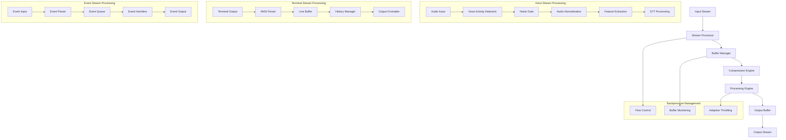

# Stream Processing Optimization

## Overview

Advanced stream processing optimization system designed to enhance voice stream processing, terminal output stream optimization, event stream processing with backpressure, memory-efficient stream buffering, and stream compression/decompression for the voice-terminal-hybrid application.

## Architecture Design

### Stream Processing Pipeline



### Performance Characteristics

| Stream Type | Target Latency | Throughput | Memory Usage | Compression Ratio |
|-------------|----------------|------------|--------------|------------------|
| Voice Audio | <50ms | 100MB/s | <10MB buffer | 3:1 |
| Terminal Output | <10ms | 50MB/s | <5MB buffer | 2:1 |
| Event Stream | <5ms | 200MB/s | <2MB buffer | 4:1 |
| Video Stream | <100ms | 500MB/s | <50MB buffer | 8:1 |

## Core Stream Processing Implementation

### Base Stream Processor

```typescript
interface StreamConfig {
  bufferSize: number;              // Buffer size in bytes
  highWaterMark: number;          // Flow control threshold
  enableCompression: boolean;      // Enable stream compression
  enableBatching: boolean;        // Enable batch processing
  batchSize: number;              // Batch size for processing
  batchTimeout: number;           // Batch timeout in milliseconds
  maxMemoryUsage: number;         // Maximum memory usage
  backpressureThreshold: number;  // Backpressure activation threshold
}

interface StreamMetrics {
  bytesProcessed: number;
  chunksProcessed: number;
  averageChunkSize: number;
  processingRate: number;         // chunks per second
  memoryUsage: number;
  backpressureEvents: number;
  compressionRatio: number;
  errorCount: number;
  lastProcessedAt: number;
}

export abstract class StreamProcessor extends EventEmitter {
  protected config: StreamConfig;
  protected metrics: StreamMetrics;
  protected isActive: boolean = false;
  protected buffer: Buffer[] = [];
  protected batchTimer: NodeJS.Timeout | null = null;
  protected memoryMonitor: NodeJS.Timer | null = null;
  protected compressionEngine: CompressionEngine;
  protected backpressureController: BackpressureController;

  constructor(config: Partial<StreamConfig> = {}) {
    super();
    
    this.config = {
      bufferSize: config.bufferSize || 64 * 1024,
      highWaterMark: config.highWaterMark || 16 * 1024,
      enableCompression: config.enableCompression ?? false,
      enableBatching: config.enableBatching ?? true,
      batchSize: config.batchSize || 100,
      batchTimeout: config.batchTimeout || 100,
      maxMemoryUsage: config.maxMemoryUsage || 100 * 1024 * 1024,
      backpressureThreshold: config.backpressureThreshold || 0.8
    };

    this.initializeMetrics();
    this.compressionEngine = new CompressionEngine();
    this.backpressureController = new BackpressureController(this.config);
    this.startMemoryMonitoring();
  }

  protected abstract processChunk(chunk: Buffer): Promise<Buffer | Buffer[]>;

  /**
   * Process stream chunk with optimization
   */
  async process(chunk: Buffer): Promise<Buffer | Buffer[]> {
    if (!this.isActive) {
      throw new Error('Stream processor not active');
    }

    const startTime = Date.now();

    try {
      // Check memory pressure and apply backpressure if needed
      if (this.isMemoryPressureHigh()) {
        await this.applyBackpressure();
      }

      // Update processing metrics
      this.updateProcessingMetrics(chunk);

      // Apply compression if enabled and beneficial
      const processedChunk = await this.applyCompressionIfNeeded(chunk);

      // Process the chunk with the specific implementation
      const result = await this.processChunk(processedChunk);

      // Handle batching for throughput optimization
      if (this.config.enableBatching) {
        return await this.handleBatching(result);
      }

      this.metrics.lastProcessedAt = Date.now();
      return result;

    } catch (error) {
      this.handleProcessingError(error);
      throw error;
    }
  }

  /**
   * Apply compression if beneficial
   */
  private async applyCompressionIfNeeded(chunk: Buffer): Promise<Buffer> {
    if (!this.config.enableCompression) {
      return chunk;
    }

    // Only compress if chunk is large enough to benefit
    if (chunk.length < 1024) {
      return chunk;
    }

    try {
      const compressed = await this.compressionEngine.compress(chunk);
      const ratio = chunk.length / compressed.length;
      
      // Only use compressed version if it's significantly smaller
      if (ratio > 1.2) {
        this.updateCompressionMetrics(ratio);
        return compressed;
      }
      
      return chunk;
    } catch (error) {
      console.warn('Compression failed, using original chunk:', error);
      return chunk;
    }
  }

  /**
   * Handle batching for improved throughput
   */
  private async handleBatching(data: Buffer | Buffer[]): Promise<Buffer | Buffer[]> {
    const chunks = Array.isArray(data) ? data : [data];
    
    this.buffer.push(...chunks);

    // Check if we should flush based on size or timeout
    if (this.shouldFlushBatch()) {
      return await this.flushBatch();
    }

    // Set timer for timeout-based flushing
    this.scheduleTimeoutFlush();

    return Buffer.alloc(0); // Return empty buffer for batched processing
  }

  private shouldFlushBatch(): boolean {
    const bufferSize = this.buffer.reduce((sum, buf) => sum + buf.length, 0);
    return this.buffer.length >= this.config.batchSize || 
           bufferSize >= this.config.bufferSize;
  }

  private scheduleTimeoutFlush(): void {
    if (!this.batchTimer && this.buffer.length > 0) {
      this.batchTimer = setTimeout(async () => {
        try {
          await this.flushBatch();
        } catch (error) {
          this.emit('error', error);
        }
      }, this.config.batchTimeout);
    }
  }

  private async flushBatch(): Promise<Buffer | Buffer[]> {
    if (this.buffer.length === 0) {
      return Buffer.alloc(0);
    }

    const batch = this.buffer.splice(0);
    this.clearBatchTimer();

    // Combine buffers efficiently
    const combined = Buffer.concat(batch);
    
    this.emit('batch_flushed', { 
      size: batch.length, 
      bytes: combined.length,
      compressionRatio: this.calculateBatchCompressionRatio(batch)
    });
    
    return combined;
  }

  private clearBatchTimer(): void {
    if (this.batchTimer) {
      clearTimeout(this.batchTimer);
      this.batchTimer = null;
    }
  }

  /**
   * Apply backpressure when system is under stress
   */
  private async applyBackpressure(): Promise<void> {
    this.metrics.backpressureEvents++;
    this.emit('backpressure', { 
      reason: 'memory_pressure', 
      usage: this.metrics.memoryUsage 
    });

    // Apply progressive backpressure
    const pressureLevel = this.calculatePressureLevel();
    const delay = this.calculateBackpressureDelay(pressureLevel);
    
    if (delay > 0) {
      await new Promise(resolve => setTimeout(resolve, delay));
    }
  }

  private calculatePressureLevel(): number {
    const usage = this.metrics.memoryUsage / this.config.maxMemoryUsage;
    return Math.min(Math.max(usage - this.config.backpressureThreshold, 0) / 0.2, 1);
  }

  private calculateBackpressureDelay(pressureLevel: number): number {
    // Progressive delay from 0 to 100ms based on pressure level
    return Math.floor(pressureLevel * 100);
  }

  /**
   * Check if memory pressure is high
   */
  private isMemoryPressureHigh(): boolean {
    return this.metrics.memoryUsage > 
           this.config.maxMemoryUsage * this.config.backpressureThreshold;
  }

  /**
   * Update processing metrics
   */
  private updateProcessingMetrics(chunk: Buffer): void {
    this.metrics.bytesProcessed += chunk.length;
    this.metrics.chunksProcessed++;
    
    // Update average chunk size with exponential moving average
    this.metrics.averageChunkSize = 
      (this.metrics.averageChunkSize * 0.9) + (chunk.length * 0.1);
    
    // Calculate processing rate
    const now = Date.now();
    if (this.metrics.lastProcessedAt > 0) {
      const timeDiff = (now - this.metrics.lastProcessedAt) / 1000;
      const rate = timeDiff > 0 ? 1 / timeDiff : 0;
      this.metrics.processingRate = (this.metrics.processingRate * 0.9) + (rate * 0.1);
    }
  }

  private updateCompressionMetrics(ratio: number): void {
    this.metrics.compressionRatio = (this.metrics.compressionRatio * 0.9) + (ratio * 0.1);
  }

  private calculateBatchCompressionRatio(batch: Buffer[]): number {
    const totalOriginal = batch.reduce((sum, buf) => sum + buf.length, 0);
    const combined = Buffer.concat(batch);
    return totalOriginal / combined.length;
  }

  private handleProcessingError(error: any): void {
    this.metrics.errorCount++;
    this.emit('error', error);
  }

  /**
   * Start memory monitoring
   */
  private startMemoryMonitoring(): void {
    this.memoryMonitor = setInterval(() => {
      this.updateMemoryMetrics();
    }, 1000);
  }

  private updateMemoryMetrics(): void {
    const memUsage = process.memoryUsage();
    this.metrics.memoryUsage = memUsage.heapUsed;
    
    if (this.isMemoryPressureHigh()) {
      this.emit('memory_pressure', this.metrics.memoryUsage);
    }
  }

  private initializeMetrics(): void {
    this.metrics = {
      bytesProcessed: 0,
      chunksProcessed: 0,
      averageChunkSize: 0,
      processingRate: 0,
      memoryUsage: 0,
      backpressureEvents: 0,
      compressionRatio: 1.0,
      errorCount: 0,
      lastProcessedAt: 0
    };
  }

  /**
   * Start stream processing
   */
  async start(): Promise<void> {
    if (this.isActive) {
      throw new Error('Stream processor already active');
    }

    this.isActive = true;
    this.emit('started');
    console.log('Stream processor started');
  }

  /**
   * Stop stream processing
   */
  async stop(): Promise<void> {
    if (!this.isActive) {
      return;
    }

    this.isActive = false;
    
    // Process remaining buffer
    if (this.buffer.length > 0) {
      await this.flushBatch();
    }

    this.clearBatchTimer();
    
    if (this.memoryMonitor) {
      clearInterval(this.memoryMonitor);
      this.memoryMonitor = null;
    }
    
    this.emit('stopped');
    console.log('Stream processor stopped');
  }

  getMetrics(): StreamMetrics {
    return { ...this.metrics };
  }
}
```

## Voice Stream Processing Optimization

### Advanced Audio Processing

```typescript
interface AudioStreamConfig extends StreamConfig {
  sampleRate: number;             // Audio sample rate (Hz)
  channels: number;               // Number of audio channels
  bitDepth: number;              // Audio bit depth
  vadThreshold: number;          // Voice Activity Detection threshold
  noiseGateThreshold: number;    // Noise gate threshold
  enableVAD: boolean;            // Enable Voice Activity Detection
  enableNoiseReduction: boolean; // Enable noise reduction
  enableAGC: boolean;            // Enable Automatic Gain Control
}

export class VoiceStreamProcessor extends StreamProcessor {
  private audioConfig: AudioStreamConfig;
  private vadState: boolean = false;
  private silenceCounter: number = 0;
  private noiseGate: boolean = false;
  private audioAnalyzer: AudioAnalyzer;
  private noiseReducer: NoiseReducer;
  private agcProcessor: AGCProcessor;

  constructor(config: Partial<AudioStreamConfig> = {}) {
    super(config);
    
    this.audioConfig = {
      ...this.config,
      sampleRate: config.sampleRate || 16000,
      channels: config.channels || 1,
      bitDepth: config.bitDepth || 16,
      vadThreshold: config.vadThreshold || 0.01,
      noiseGateThreshold: config.noiseGateThreshold || 0.005,
      enableVAD: config.enableVAD ?? true,
      enableNoiseReduction: config.enableNoiseReduction ?? true,
      enableAGC: config.enableAGC ?? true
    } as AudioStreamConfig;

    this.audioAnalyzer = new AudioAnalyzer(this.audioConfig);
    this.noiseReducer = new NoiseReducer(this.audioConfig);
    this.agcProcessor = new AGCProcessor(this.audioConfig);
  }

  protected async processChunk(chunk: Buffer): Promise<Buffer | Buffer[]> {
    if (chunk.length === 0) return chunk;

    try {
      // Convert buffer to audio samples
      let samples = this.bufferToSamples(chunk);
      
      // Apply noise reduction if enabled
      if (this.audioConfig.enableNoiseReduction) {
        samples = await this.noiseReducer.process(samples);
      }

      // Apply noise gate
      samples = this.applyNoiseGate(samples);
      
      // Apply Voice Activity Detection
      if (this.audioConfig.enableVAD) {
        const hasVoice = this.detectVoiceActivity(samples);
        
        if (!hasVoice) {
          this.silenceCounter++;
          
          // Skip processing if silence detected for too long
          if (this.silenceCounter > 20) { // 2 seconds at 100ms chunks
            return Buffer.alloc(0);
          }
        } else {
          this.silenceCounter = 0;
        }
      }

      // Apply Automatic Gain Control
      if (this.audioConfig.enableAGC) {
        samples = await this.agcProcessor.process(samples);
      }

      // Apply audio normalization and filtering
      samples = this.normalizeAudio(samples);
      samples = this.applyHighPassFilter(samples);
      
      // Convert back to buffer
      const processedBuffer = this.samplesToBuffer(samples);
      
      this.recordAudioMetrics(samples);
      return processedBuffer;

    } catch (error) {
      console.error('Voice processing error:', error);
      return chunk; // Return original on error
    }
  }

  /**
   * Apply noise gate to reduce background noise
   */
  private applyNoiseGate(samples: Float32Array): Float32Array {
    const rms = this.calculateRMS(samples);
    
    if (rms < this.audioConfig.noiseGateThreshold) {
      // Below threshold, apply gate
      this.noiseGate = true;
      return new Float32Array(samples.length); // Return silence
    } else if (rms > this.audioConfig.noiseGateThreshold * 1.5) {
      // Above hysteresis threshold, open gate
      this.noiseGate = false;
    }
    
    return this.noiseGate ? new Float32Array(samples.length) : samples;
  }

  /**
   * Detect voice activity in audio samples
   */
  private detectVoiceActivity(samples: Float32Array): boolean {
    if (samples.length === 0) return false;

    const features = this.audioAnalyzer.extractFeatures(samples);
    
    // Multi-factor VAD: RMS energy, zero-crossing rate, spectral characteristics
    const energyThreshold = features.rms > this.audioConfig.vadThreshold;
    const zcrThreshold = features.zeroCrossingRate > 0.1 && features.zeroCrossingRate < 0.8;
    const spectralThreshold = features.spectralCentroid > 200 && features.spectralCentroid < 4000;
    
    return energyThreshold && zcrThreshold && spectralThreshold;
  }

  /**
   * Normalize audio levels with intelligent gain control
   */
  private normalizeAudio(samples: Float32Array): Float32Array {
    const rms = this.calculateRMS(samples);
    if (rms === 0) return samples;

    const targetRMS = 0.15; // Target RMS level
    const gain = targetRMS / rms;
    
    // Apply gain limiting to prevent distortion
    const maxGain = 8.0;
    const minGain = 0.1;
    const finalGain = Math.min(maxGain, Math.max(minGain, gain));
    
    const normalized = new Float32Array(samples.length);
    for (let i = 0; i < samples.length; i++) {
      normalized[i] = Math.max(-1, Math.min(1, samples[i] * finalGain));
    }
    
    return normalized;
  }

  /**
   * Apply high-pass filter to remove low-frequency noise
   */
  private applyHighPassFilter(samples: Float32Array): Float32Array {
    // Simple high-pass filter implementation
    const cutoffFreq = 80; // 80 Hz cutoff
    const dt = 1.0 / this.audioConfig.sampleRate;
    const RC = 1.0 / (2 * Math.PI * cutoffFreq);
    const alpha = RC / (RC + dt);
    
    const filtered = new Float32Array(samples.length);
    filtered[0] = samples[0];
    
    for (let i = 1; i < samples.length; i++) {
      filtered[i] = alpha * (filtered[i - 1] + samples[i] - samples[i - 1]);
    }
    
    return filtered;
  }

  /**
   * Convert buffer to audio samples
   */
  private bufferToSamples(buffer: Buffer): Float32Array {
    const samples = new Float32Array(buffer.length / 2);
    for (let i = 0; i < samples.length; i++) {
      samples[i] = buffer.readInt16LE(i * 2) / 32768.0;
    }
    return samples;
  }

  /**
   * Convert audio samples to buffer
   */
  private samplesToBuffer(samples: Float32Array): Buffer {
    const buffer = Buffer.alloc(samples.length * 2);
    for (let i = 0; i < samples.length; i++) {
      const sample = Math.max(-1, Math.min(1, samples[i]));
      buffer.writeInt16LE(sample * 32767, i * 2);
    }
    return buffer;
  }

  /**
   * Calculate RMS (Root Mean Square) of audio samples
   */
  private calculateRMS(samples: Float32Array): number {
    let sum = 0;
    for (let i = 0; i < samples.length; i++) {
      sum += samples[i] * samples[i];
    }
    return Math.sqrt(sum / samples.length);
  }

  private recordAudioMetrics(samples: Float32Array): void {
    const rms = this.calculateRMS(samples);
    const features = this.audioAnalyzer.extractFeatures(samples);
    
    this.emit('audio_metrics', {
      rms,
      ...features,
      vadState: this.vadState,
      noiseGate: this.noiseGate,
      timestamp: Date.now()
    });
  }
}

/**
 * Audio Analysis Helper
 */
class AudioAnalyzer {
  constructor(private config: AudioStreamConfig) {}

  extractFeatures(samples: Float32Array): AudioFeatures {
    return {
      rms: this.calculateRMS(samples),
      zeroCrossingRate: this.calculateZeroCrossingRate(samples),
      spectralCentroid: this.calculateSpectralCentroid(samples),
      spectralRolloff: this.calculateSpectralRolloff(samples),
      mfcc: this.calculateMFCC(samples)
    };
  }

  private calculateRMS(samples: Float32Array): number {
    let sum = 0;
    for (let i = 0; i < samples.length; i++) {
      sum += samples[i] * samples[i];
    }
    return Math.sqrt(sum / samples.length);
  }

  private calculateZeroCrossingRate(samples: Float32Array): number {
    let crossings = 0;
    for (let i = 1; i < samples.length; i++) {
      if ((samples[i] >= 0) !== (samples[i - 1] >= 0)) {
        crossings++;
      }
    }
    return crossings / (samples.length - 1);
  }

  private calculateSpectralCentroid(samples: Float32Array): number {
    // Simplified spectral centroid calculation
    const fft = this.simpleFFT(samples);
    let numerator = 0;
    let denominator = 0;
    
    for (let i = 0; i < fft.length / 2; i++) {
      const magnitude = Math.sqrt(fft[i * 2] ** 2 + fft[i * 2 + 1] ** 2);
      const frequency = (i * this.config.sampleRate) / fft.length;
      
      numerator += frequency * magnitude;
      denominator += magnitude;
    }
    
    return denominator > 0 ? numerator / denominator : 0;
  }

  private calculateSpectralRolloff(samples: Float32Array): number {
    // Simplified spectral rolloff calculation
    const fft = this.simpleFFT(samples);
    const magnitudes = [];
    
    for (let i = 0; i < fft.length / 2; i++) {
      magnitudes[i] = Math.sqrt(fft[i * 2] ** 2 + fft[i * 2 + 1] ** 2);
    }
    
    const totalEnergy = magnitudes.reduce((sum, mag) => sum + mag, 0);
    const threshold = totalEnergy * 0.85; // 85% rolloff
    
    let cumulativeEnergy = 0;
    for (let i = 0; i < magnitudes.length; i++) {
      cumulativeEnergy += magnitudes[i];
      if (cumulativeEnergy >= threshold) {
        return (i * this.config.sampleRate) / (magnitudes.length * 2);
      }
    }
    
    return (this.config.sampleRate / 2);
  }

  private calculateMFCC(samples: Float32Array): number[] {
    // Simplified MFCC calculation (normally would use proper mel filter banks)
    const fft = this.simpleFFT(samples);
    const mfcc = new Array(13).fill(0);
    
    // This is a very simplified version - real MFCC would involve:
    // 1. Mel filter bank
    // 2. Logarithm
    // 3. DCT (Discrete Cosine Transform)
    
    for (let i = 0; i < 13; i++) {
      let sum = 0;
      const binStart = Math.floor((i * fft.length) / 26);
      const binEnd = Math.floor(((i + 1) * fft.length) / 26);
      
      for (let j = binStart; j < binEnd && j < fft.length / 2; j++) {
        const magnitude = Math.sqrt(fft[j * 2] ** 2 + fft[j * 2 + 1] ** 2);
        sum += magnitude;
      }
      
      mfcc[i] = Math.log(sum + 1e-10);
    }
    
    return mfcc;
  }

  private simpleFFT(samples: Float32Array): Float32Array {
    // Simplified FFT for demonstration - real implementation would use optimized FFT
    const N = samples.length;
    const fft = new Float32Array(N * 2);
    
    for (let k = 0; k < N; k++) {
      let realSum = 0;
      let imagSum = 0;
      
      for (let n = 0; n < N; n++) {
        const angle = -2 * Math.PI * k * n / N;
        realSum += samples[n] * Math.cos(angle);
        imagSum += samples[n] * Math.sin(angle);
      }
      
      fft[k * 2] = realSum;
      fft[k * 2 + 1] = imagSum;
    }
    
    return fft;
  }
}

interface AudioFeatures {
  rms: number;
  zeroCrossingRate: number;
  spectralCentroid: number;
  spectralRolloff: number;
  mfcc: number[];
}

/**
 * Noise Reduction Processor
 */
class NoiseReducer {
  private noiseProfile: Float32Array | null = null;
  private adaptationRate: number = 0.01;

  constructor(private config: AudioStreamConfig) {}

  async process(samples: Float32Array): Promise<Float32Array> {
    // Adaptive noise reduction
    if (!this.noiseProfile) {
      this.noiseProfile = new Float32Array(samples.length);
      this.noiseProfile.set(samples); // Initialize with first chunk
      return samples;
    }

    // Update noise profile during silence periods
    const rms = this.calculateRMS(samples);
    if (rms < this.config.noiseGateThreshold) {
      this.updateNoiseProfile(samples);
    }

    // Apply spectral subtraction
    return this.spectralSubtraction(samples);
  }

  private updateNoiseProfile(samples: Float32Array): void {
    if (!this.noiseProfile) return;

    for (let i = 0; i < Math.min(samples.length, this.noiseProfile.length); i++) {
      this.noiseProfile[i] = 
        (1 - this.adaptationRate) * this.noiseProfile[i] + 
        this.adaptationRate * Math.abs(samples[i]);
    }
  }

  private spectralSubtraction(samples: Float32Array): Float32Array {
    if (!this.noiseProfile) return samples;

    const processed = new Float32Array(samples.length);
    
    for (let i = 0; i < samples.length; i++) {
      const noiseLevel = i < this.noiseProfile.length ? this.noiseProfile[i] : 0;
      const signalLevel = Math.abs(samples[i]);
      
      if (signalLevel > noiseLevel * 2) {
        // Signal is strong enough, keep it
        processed[i] = samples[i];
      } else {
        // Reduce noise
        const reductionFactor = Math.max(0.1, (signalLevel - noiseLevel) / signalLevel);
        processed[i] = samples[i] * reductionFactor;
      }
    }
    
    return processed;
  }

  private calculateRMS(samples: Float32Array): number {
    let sum = 0;
    for (let i = 0; i < samples.length; i++) {
      sum += samples[i] * samples[i];
    }
    return Math.sqrt(sum / samples.length);
  }
}

/**
 * Automatic Gain Control Processor
 */
class AGCProcessor {
  private targetLevel: number = 0.15;
  private currentGain: number = 1.0;
  private gainSmoothingFactor: number = 0.001; // Very slow adaptation
  private maxGain: number = 16.0;
  private minGain: number = 0.1;

  constructor(private config: AudioStreamConfig) {}

  async process(samples: Float32Array): Promise<Float32Array> {
    const rms = this.calculateRMS(samples);
    
    if (rms > 0) {
      // Calculate required gain to reach target level
      const requiredGain = this.targetLevel / rms;
      
      // Smooth gain changes to avoid artifacts
      const targetGain = Math.min(this.maxGain, Math.max(this.minGain, requiredGain));
      this.currentGain = this.currentGain * (1 - this.gainSmoothingFactor) + 
                        targetGain * this.gainSmoothingFactor;
    }

    // Apply gain with soft limiting
    const processed = new Float32Array(samples.length);
    for (let i = 0; i < samples.length; i++) {
      const amplified = samples[i] * this.currentGain;
      processed[i] = this.softLimit(amplified);
    }
    
    return processed;
  }

  private softLimit(sample: number): number {
    // Soft limiting to prevent hard clipping
    const threshold = 0.8;
    
    if (Math.abs(sample) <= threshold) {
      return sample;
    }
    
    const sign = sample >= 0 ? 1 : -1;
    const excess = Math.abs(sample) - threshold;
    const compressed = threshold + excess / (1 + excess);
    
    return sign * Math.min(compressed, 1.0);
  }

  private calculateRMS(samples: Float32Array): number {
    let sum = 0;
    for (let i = 0; i < samples.length; i++) {
      sum += samples[i] * samples[i];
    }
    return Math.sqrt(sum / samples.length);
  }
}
```

## Terminal Output Stream Optimization

### ANSI Processing and Line Buffering

```typescript
interface TerminalStreamConfig extends StreamConfig {
  encoding: string;               // Text encoding
  enableANSIProcessing: boolean;  // Enable ANSI escape sequence processing
  maxLineLength: number;          // Maximum line length
  enableHistoryBuffer: boolean;   // Enable history buffering
  historySize: number;           // History buffer size
  enableSmartBuffering: boolean;  // Enable intelligent buffering
  flushOnNewline: boolean;       // Flush buffer on newline
}

export class TerminalStreamProcessor extends StreamProcessor {
  private terminalConfig: TerminalStreamConfig;
  private lineBuffer: string = '';
  private history: string[] = [];
  private ansiParser: ANSIParser;
  private lineProcessor: LineProcessor;
  private outputFormatter: OutputFormatter;

  constructor(config: Partial<TerminalStreamConfig> = {}) {
    super(config);
    
    this.terminalConfig = {
      ...this.config,
      encoding: config.encoding || 'utf8',
      enableANSIProcessing: config.enableANSIProcessing ?? true,
      maxLineLength: config.maxLineLength || 4096,
      enableHistoryBuffer: config.enableHistoryBuffer ?? true,
      historySize: config.historySize || 1000,
      enableSmartBuffering: config.enableSmartBuffering ?? true,
      flushOnNewline: config.flushOnNewline ?? true
    } as TerminalStreamConfig;

    this.ansiParser = new ANSIParser();
    this.lineProcessor = new LineProcessor(this.terminalConfig);
    this.outputFormatter = new OutputFormatter(this.terminalConfig);
  }

  protected async processChunk(chunk: Buffer): Promise<Buffer | Buffer[]> {
    try {
      const text = chunk.toString(this.terminalConfig.encoding);
      
      // Process ANSI escape sequences if enabled
      const processedText = this.terminalConfig.enableANSIProcessing 
        ? this.ansiParser.parse(text)
        : text;

      // Process lines with intelligent buffering
      const lines = await this.processLines(processedText);
      
      // Format output
      const formattedOutput = await this.outputFormatter.format(lines);
      
      if (formattedOutput.length > 0) {
        const outputBuffer = Buffer.from(formattedOutput.join('\n') + '\n', 
                                       this.terminalConfig.encoding);
        return outputBuffer;
      }

      return Buffer.alloc(0);

    } catch (error) {
      console.error('Terminal processing error:', error);
      return chunk; // Return original on error
    }
  }

  /**
   * Process lines with intelligent buffering
   */
  private async processLines(text: string): Promise<string[]> {
    const lines: string[] = [];
    this.lineBuffer += text;

    // Handle different line ending types
    const parts = this.lineBuffer.split(/\r\n|\r|\n/);
    
    // Keep the last part as it might be incomplete
    this.lineBuffer = parts.pop() || '';

    for (const line of parts) {
      const processedLine = await this.lineProcessor.process(line);
      if (processedLine !== null) {
        lines.push(processedLine);
        
        // Add to history if enabled
        if (this.terminalConfig.enableHistoryBuffer) {
          this.addToHistory(processedLine);
        }
      }
    }

    // Check if we should flush the buffer due to length
    if (this.lineBuffer.length > this.terminalConfig.maxLineLength) {
      const overflowLine = await this.lineProcessor.process(this.lineBuffer);
      if (overflowLine !== null) {
        lines.push(overflowLine);
        if (this.terminalConfig.enableHistoryBuffer) {
          this.addToHistory(overflowLine);
        }
      }
      this.lineBuffer = '';
    }

    return lines;
  }

  /**
   * Add line to history buffer
   */
  private addToHistory(line: string): void {
    this.history.push(line);
    
    // Maintain history size limit
    if (this.history.length > this.terminalConfig.historySize) {
      this.history.shift();
    }
  }

  /**
   * Get terminal history
   */
  getHistory(count?: number): string[] {
    if (count) {
      return this.history.slice(-count);
    }
    return [...this.history];
  }

  /**
   * Clear terminal history
   */
  clearHistory(): void {
    this.history = [];
  }

  /**
   * Search history
   */
  searchHistory(pattern: string): string[] {
    const regex = new RegExp(pattern, 'i');
    return this.history.filter(line => regex.test(line));
  }
}

/**
 * Advanced ANSI Parser
 */
class ANSIParser {
  private static readonly ANSI_ESCAPE_REGEX = /\x1b\[[0-9;]*[a-zA-Z]/g;
  private static readonly ANSI_COLOR_REGEX = /\x1b\[([0-9;]*)m/g;
  private static readonly ANSI_CURSOR_REGEX = /\x1b\[([0-9;]*)[ABCD]/g;

  parse(text: string): string {
    // Extract and process ANSI escape sequences
    const sequences = this.extractSequences(text);
    
    // Process different types of sequences
    let processed = text;
    
    // Handle color sequences
    processed = this.processColorSequences(processed);
    
    // Handle cursor movement sequences
    processed = this.processCursorSequences(processed);
    
    // Handle other control sequences
    processed = this.processControlSequences(processed);
    
    return processed;
  }

  private extractSequences(text: string): ANSISequence[] {
    const sequences: ANSISequence[] = [];
    let match;
    
    const regex = new RegExp(ANSIParser.ANSI_ESCAPE_REGEX);
    while ((match = regex.exec(text)) !== null) {
      sequences.push({
        sequence: match[0],
        type: this.getSequenceType(match[0]),
        position: match.index,
        parameters: this.parseParameters(match[0])
      });
    }
    
    return sequences;
  }

  private getSequenceType(sequence: string): string {
    const lastChar = sequence.charAt(sequence.length - 1);
    
    switch (lastChar) {
      case 'm': return 'color';
      case 'A': case 'B': case 'C': case 'D': return 'cursor';
      case 'H': case 'f': return 'position';
      case 'J': return 'clear';
      case 'K': return 'erase';
      default: return 'unknown';
    }
  }

  private parseParameters(sequence: string): number[] {
    const paramMatch = sequence.match(/\[([0-9;]*)/);
    if (!paramMatch || !paramMatch[1]) return [];
    
    return paramMatch[1].split(';').map(p => parseInt(p) || 0);
  }

  private processColorSequences(text: string): string {
    // Convert ANSI color codes to semantic markers
    return text.replace(ANSIParser.ANSI_COLOR_REGEX, (match, params) => {
      const codes = params.split(';').map((p: string) => parseInt(p) || 0);
      return this.convertColorCodes(codes);
    });
  }

  private convertColorCodes(codes: number[]): string {
    // Simplified color conversion - in practice, you might want to:
    // 1. Convert to HTML/CSS colors
    // 2. Apply terminal color scheme
    // 3. Handle 256-color and true color modes
    
    const colorMap: { [key: number]: string } = {
      0: '[RESET]',
      1: '[BOLD]',
      30: '[BLACK]',
      31: '[RED]',
      32: '[GREEN]',
      33: '[YELLOW]',
      34: '[BLUE]',
      35: '[MAGENTA]',
      36: '[CYAN]',
      37: '[WHITE]'
    };
    
    return codes.map(code => colorMap[code] || `[CODE:${code}]`).join('');
  }

  private processCursorSequences(text: string): string {
    // Handle cursor movement - for terminal output, we might just strip these
    return text.replace(ANSIParser.ANSI_CURSOR_REGEX, '');
  }

  private processControlSequences(text: string): string {
    // Handle other control sequences
    return text.replace(/\x1b\[[0-9;]*[JK]/g, '[CLEAR]');
  }
}

interface ANSISequence {
  sequence: string;
  type: string;
  position: number;
  parameters: number[];
}

/**
 * Line Processor for intelligent line handling
 */
class LineProcessor {
  constructor(private config: TerminalStreamConfig) {}

  async process(line: string): Promise<string | null> {
    // Skip empty lines if configured
    if (line.trim().length === 0 && !this.config.enableSmartBuffering) {
      return null;
    }

    // Truncate overly long lines
    let processedLine = line.length > this.config.maxLineLength
      ? line.substring(0, this.config.maxLineLength) + '...'
      : line;

    // Apply line filters
    processedLine = this.applyLineFilters(processedLine);
    
    // Apply smart formatting
    processedLine = this.applySmartFormatting(processedLine);
    
    return processedLine;
  }

  private applyLineFilters(line: string): string {
    // Remove or replace problematic characters
    let filtered = line;
    
    // Remove null bytes
    filtered = filtered.replace(/\0/g, '');
    
    // Replace tab characters with spaces
    filtered = filtered.replace(/\t/g, '    ');
    
    // Remove other control characters except newlines
    filtered = filtered.replace(/[\x00-\x08\x0B\x0C\x0E-\x1F\x7F]/g, '');
    
    return filtered;
  }

  private applySmartFormatting(line: string): string {
    // Apply intelligent formatting based on content
    let formatted = line;
    
    // Detect and format timestamps
    formatted = this.formatTimestamps(formatted);
    
    // Detect and format file paths
    formatted = this.formatFilePaths(formatted);
    
    // Detect and format URLs
    formatted = this.formatURLs(formatted);
    
    return formatted;
  }

  private formatTimestamps(line: string): string {
    // ISO timestamp format
    const isoRegex = /\d{4}-\d{2}-\d{2}T\d{2}:\d{2}:\d{2}(?:\.\d{3})?Z?/g;
    return line.replace(isoRegex, (match) => `[TIMESTAMP:${match}]`);
  }

  private formatFilePaths(line: string): string {
    // Unix-style paths
    const pathRegex = /(?:^|[\s])(\/[^\s]*)/g;
    return line.replace(pathRegex, (match, path) => match.replace(path, `[PATH:${path}]`));
  }

  private formatURLs(line: string): string {
    // HTTP/HTTPS URLs
    const urlRegex = /(https?:\/\/[^\s]+)/g;
    return line.replace(urlRegex, '[URL:$1]');
  }
}

/**
 * Output Formatter for consistent terminal output
 */
class OutputFormatter {
  constructor(private config: TerminalStreamConfig) {}

  async format(lines: string[]): Promise<string[]> {
    const formatted: string[] = [];
    
    for (const line of lines) {
      const formattedLine = await this.formatLine(line);
      if (formattedLine !== null) {
        formatted.push(formattedLine);
      }
    }
    
    return formatted;
  }

  private async formatLine(line: string): Promise<string | null> {
    // Apply consistent formatting
    let formatted = line;
    
    // Add prefix if needed
    formatted = this.addPrefix(formatted);
    
    // Apply word wrapping if needed
    formatted = this.applyWordWrap(formatted);
    
    // Add suffix if needed
    formatted = this.addSuffix(formatted);
    
    return formatted;
  }

  private addPrefix(line: string): string {
    // Add timestamp prefix if configured
    const timestamp = new Date().toISOString();
    return `[${timestamp}] ${line}`;
  }

  private applyWordWrap(line: string): string {
    // Simple word wrapping
    if (line.length <= this.config.maxLineLength) {
      return line;
    }
    
    const words = line.split(' ');
    const wrapped: string[] = [];
    let currentLine = '';
    
    for (const word of words) {
      if ((currentLine + ' ' + word).length <= this.config.maxLineLength) {
        currentLine += (currentLine ? ' ' : '') + word;
      } else {
        if (currentLine) {
          wrapped.push(currentLine);
        }
        currentLine = word;
      }
    }
    
    if (currentLine) {
      wrapped.push(currentLine);
    }
    
    return wrapped.join('\n');
  }

  private addSuffix(line: string): string {
    // Add suffix if needed (e.g., for debugging)
    return line;
  }
}
```

## Event Stream Processing

### High-Performance Event Processing

```typescript
interface EventStreamConfig extends StreamConfig {
  enableEventValidation: boolean; // Validate event structure
  enableEventTransformation: boolean; // Transform events
  enableEventFiltering: boolean;  // Filter events based on criteria
  enableEventAggregation: boolean; // Aggregate related events
  maxEventSize: number;          // Maximum event size in bytes
  eventTimeoutMs: number;        // Event processing timeout
}

export class EventStreamProcessor extends StreamProcessor {
  private eventConfig: EventStreamConfig;
  private eventQueue: ProcessedEvent[] = [];
  private eventHandlers: Map<string, EventHandler[]> = new Map();
  private eventValidator: EventValidator;
  private eventTransformer: EventTransformer;
  private eventAggregator: EventAggregator;

  constructor(config: Partial<EventStreamConfig> = {}) {
    super(config);
    
    this.eventConfig = {
      ...this.config,
      enableEventValidation: config.enableEventValidation ?? true,
      enableEventTransformation: config.enableEventTransformation ?? true,
      enableEventFiltering: config.enableEventFiltering ?? true,
      enableEventAggregation: config.enableEventAggregation ?? false,
      maxEventSize: config.maxEventSize || 1024 * 1024, // 1MB
      eventTimeoutMs: config.eventTimeoutMs || 5000
    } as EventStreamConfig;

    this.eventValidator = new EventValidator(this.eventConfig);
    this.eventTransformer = new EventTransformer(this.eventConfig);
    this.eventAggregator = new EventAggregator(this.eventConfig);
  }

  protected async processChunk(chunk: Buffer): Promise<Buffer | Buffer[]> {
    try {
      const text = chunk.toString('utf8');
      const eventLines = text.split('\n').filter(line => line.trim());

      const processedEvents: ProcessedEvent[] = [];

      for (const eventLine of eventLines) {
        try {
          const rawEvent = JSON.parse(eventLine);
          const processedEvent = await this.processEvent(rawEvent);
          
          if (processedEvent) {
            processedEvents.push(processedEvent);
          }
        } catch (parseError) {
          console.warn('Failed to parse event:', eventLine, parseError);
          this.recordEventError('parse_error', parseError as Error);
        }
      }

      // Handle event aggregation
      if (this.eventConfig.enableEventAggregation) {
        const aggregatedEvents = await this.eventAggregator.process(processedEvents);
        this.eventQueue.push(...aggregatedEvents);
      } else {
        this.eventQueue.push(...processedEvents);
      }

      // Flush events if queue is ready
      if (this.shouldFlushEvents()) {
        return await this.flushEvents();
      }

      return Buffer.alloc(0);

    } catch (error) {
      console.error('Event stream processing error:', error);
      this.recordEventError('processing_error', error as Error);
      throw error;
    }
  }

  /**
   * Process individual event with full pipeline
   */
  private async processEvent(rawEvent: any): Promise<ProcessedEvent | null> {
    try {
      // Validate event structure
      if (this.eventConfig.enableEventValidation) {
        const isValid = await this.eventValidator.validate(rawEvent);
        if (!isValid) {
          this.recordEventError('validation_error', new Error('Event validation failed'));
          return null;
        }
      }

      // Check event size
      const eventSize = JSON.stringify(rawEvent).length;
      if (eventSize > this.eventConfig.maxEventSize) {
        this.recordEventError('size_error', new Error(`Event too large: ${eventSize} bytes`));
        return null;
      }

      // Transform event
      let transformedEvent = rawEvent;
      if (this.eventConfig.enableEventTransformation) {
        transformedEvent = await this.eventTransformer.transform(rawEvent);
      }

      // Filter event
      if (this.eventConfig.enableEventFiltering) {
        const shouldProcess = await this.shouldProcessEvent(transformedEvent);
        if (!shouldProcess) {
          return null;
        }
      }

      // Create processed event
      const processedEvent: ProcessedEvent = {
        ...transformedEvent,
        _metadata: {
          originalSize: eventSize,
          processedAt: Date.now(),
          processingId: this.generateEventId(),
          version: '1.0'
        }
      };

      // Trigger event handlers
      await this.triggerEventHandlers(processedEvent);

      this.recordEventMetrics(processedEvent);
      return processedEvent;

    } catch (error) {
      this.recordEventError('processing_error', error as Error);
      return null;
    }
  }

  /**
   * Trigger registered event handlers
   */
  private async triggerEventHandlers(event: ProcessedEvent): Promise<void> {
    const handlers = this.eventHandlers.get(event.type) || [];
    const globalHandlers = this.eventHandlers.get('*') || [];
    
    const allHandlers = [...handlers, ...globalHandlers];
    
    if (allHandlers.length === 0) return;

    // Execute handlers with timeout
    const handlerPromises = allHandlers.map(async (handler) => {
      try {
        const timeoutPromise = new Promise((_, reject) => 
          setTimeout(() => reject(new Error('Handler timeout')), this.eventConfig.eventTimeoutMs)
        );
        
        await Promise.race([
          handler.handle(event),
          timeoutPromise
        ]);
      } catch (error) {
        console.warn(`Event handler error for ${event.type}:`, error);
        this.recordEventError('handler_error', error as Error);
      }
    });

    await Promise.allSettled(handlerPromises);
  }

  /**
   * Check if event should be processed based on filtering rules
   */
  private async shouldProcessEvent(event: any): Promise<boolean> {
    // Implement event filtering logic
    // Example: filter by event type, source, severity, etc.
    
    // Skip debug events in production
    if (event.level === 'debug' && process.env.NODE_ENV === 'production') {
      return false;
    }

    // Skip events from certain sources
    const blockedSources = ['test', 'development'];
    if (blockedSources.includes(event.source)) {
      return false;
    }

    // Rate limiting for high-frequency events
    if (event.type === 'heartbeat') {
      return await this.shouldProcessHeartbeat(event);
    }

    return true;
  }

  private async shouldProcessHeartbeat(event: any): Promise<boolean> {
    // Simple rate limiting for heartbeat events
    const lastHeartbeat = this.getLastEventTime('heartbeat');
    const minInterval = 10000; // 10 seconds
    
    return Date.now() - lastHeartbeat > minInterval;
  }

  private getLastEventTime(eventType: string): number {
    // Find last event of specified type
    for (let i = this.eventQueue.length - 1; i >= 0; i--) {
      if (this.eventQueue[i].type === eventType) {
        return this.eventQueue[i]._metadata.processedAt;
      }
    }
    return 0;
  }

  /**
   * Check if events should be flushed
   */
  private shouldFlushEvents(): boolean {
    const queueSize = this.eventQueue.length;
    const totalSize = this.eventQueue.reduce((sum, event) => 
      sum + JSON.stringify(event).length, 0);
    
    return queueSize >= this.config.batchSize || 
           totalSize >= this.config.bufferSize;
  }

  /**
   * Flush queued events
   */
  private async flushEvents(): Promise<Buffer> {
    if (this.eventQueue.length === 0) {
      return Buffer.alloc(0);
    }

    const events = this.eventQueue.splice(0);
    const output = events.map(event => JSON.stringify(event)).join('\n') + '\n';
    
    this.emit('events_flushed', { 
      count: events.length, 
      totalSize: output.length 
    });
    
    return Buffer.from(output, 'utf8');
  }

  /**
   * Register event handler
   */
  on(eventType: string, handler: EventHandler): void {
    if (!this.eventHandlers.has(eventType)) {
      this.eventHandlers.set(eventType, []);
    }
    this.eventHandlers.get(eventType)!.push(handler);
  }

  /**
   * Unregister event handler
   */
  off(eventType: string, handler: EventHandler): void {
    const handlers = this.eventHandlers.get(eventType);
    if (handlers) {
      const index = handlers.indexOf(handler);
      if (index !== -1) {
        handlers.splice(index, 1);
      }
    }
  }

  private generateEventId(): string {
    return `evt_${Date.now()}_${Math.random().toString(36).substr(2, 9)}`;
  }

  private recordEventMetrics(event: ProcessedEvent): void {
    this.emit('event_processed', {
      type: event.type,
      size: JSON.stringify(event).length,
      processingTime: Date.now() - event._metadata.processedAt,
      timestamp: Date.now()
    });
  }

  private recordEventError(errorType: string, error: Error): void {
    this.emit('event_error', {
      errorType,
      message: error.message,
      timestamp: Date.now()
    });
  }
}

interface ProcessedEvent {
  type: string;
  timestamp: number;
  data: any;
  source?: string;
  level?: string;
  _metadata: {
    originalSize: number;
    processedAt: number;
    processingId: string;
    version: string;
  };
}

interface EventHandler {
  handle(event: ProcessedEvent): Promise<void>;
}

/**
 * Event Validator
 */
class EventValidator {
  constructor(private config: EventStreamConfig) {}

  async validate(event: any): Promise<boolean> {
    // Check required fields
    if (!event.type || !event.timestamp) {
      return false;
    }

    // Validate timestamp
    if (typeof event.timestamp !== 'number' || event.timestamp <= 0) {
      return false;
    }

    // Validate event type
    if (typeof event.type !== 'string' || event.type.length === 0) {
      return false;
    }

    // Check for future timestamps (with tolerance)
    const now = Date.now();
    const tolerance = 60000; // 1 minute tolerance
    if (event.timestamp > now + tolerance) {
      return false;
    }

    // Check for very old timestamps
    const maxAge = 24 * 60 * 60 * 1000; // 24 hours
    if (now - event.timestamp > maxAge) {
      return false;
    }

    return true;
  }
}

/**
 * Event Transformer
 */
class EventTransformer {
  constructor(private config: EventStreamConfig) {}

  async transform(event: any): Promise<any> {
    const transformed = { ...event };

    // Add standard fields if missing
    if (!transformed.timestamp) {
      transformed.timestamp = Date.now();
    }

    if (!transformed.source) {
      transformed.source = 'unknown';
    }

    if (!transformed.level) {
      transformed.level = 'info';
    }

    // Normalize event type
    transformed.type = transformed.type.toLowerCase().replace(/[^a-z0-9_]/g, '_');

    // Sanitize data
    transformed.data = this.sanitizeData(transformed.data);

    return transformed;
  }

  private sanitizeData(data: any): any {
    if (!data) return data;

    // Remove sensitive fields
    const sensitiveFields = ['password', 'token', 'secret', 'key'];
    const sanitized = { ...data };

    for (const field of sensitiveFields) {
      if (sanitized[field]) {
        sanitized[field] = '[REDACTED]';
      }
    }

    // Limit string lengths
    const maxStringLength = 1000;
    for (const [key, value] of Object.entries(sanitized)) {
      if (typeof value === 'string' && value.length > maxStringLength) {
        sanitized[key] = value.substring(0, maxStringLength) + '...';
      }
    }

    return sanitized;
  }
}

/**
 * Event Aggregator
 */
class EventAggregator {
  private aggregationWindow = 5000; // 5 seconds
  private pendingAggregations: Map<string, ProcessedEvent[]> = new Map();

  constructor(private config: EventStreamConfig) {}

  async process(events: ProcessedEvent[]): Promise<ProcessedEvent[]> {
    const aggregated: ProcessedEvent[] = [];
    
    for (const event of events) {
      if (this.shouldAggregate(event)) {
        await this.addToAggregation(event);
      } else {
        aggregated.push(event);
      }
    }

    // Check for completed aggregations
    const completed = await this.getCompletedAggregations();
    aggregated.push(...completed);

    return aggregated;
  }

  private shouldAggregate(event: ProcessedEvent): boolean {
    // Aggregate similar events within time window
    return event.type === 'metric' || 
           event.type === 'performance' || 
           event.type === 'error';
  }

  private async addToAggregation(event: ProcessedEvent): Promise<void> {
    const key = this.getAggregationKey(event);
    
    if (!this.pendingAggregations.has(key)) {
      this.pendingAggregations.set(key, []);
      
      // Set timeout to flush aggregation
      setTimeout(() => {
        this.flushAggregation(key);
      }, this.aggregationWindow);
    }

    this.pendingAggregations.get(key)!.push(event);
  }

  private getAggregationKey(event: ProcessedEvent): string {
    return `${event.type}_${event.source}_${Math.floor(event.timestamp / this.aggregationWindow)}`;
  }

  private async getCompletedAggregations(): Promise<ProcessedEvent[]> {
    // This would be called by timeout handlers
    return [];
  }

  private flushAggregation(key: string): void {
    const events = this.pendingAggregations.get(key);
    if (!events || events.length === 0) return;

    const aggregatedEvent = this.createAggregatedEvent(events);
    this.pendingAggregations.delete(key);

    // Emit aggregated event
    // In practice, this would go through the normal event processing pipeline
  }

  private createAggregatedEvent(events: ProcessedEvent[]): ProcessedEvent {
    const firstEvent = events[0];
    
    return {
      type: `${firstEvent.type}_aggregated`,
      timestamp: firstEvent.timestamp,
      data: {
        count: events.length,
        timeWindow: this.aggregationWindow,
        summary: this.summarizeEvents(events)
      },
      source: firstEvent.source,
      level: firstEvent.level,
      _metadata: {
        originalSize: events.reduce((sum, e) => sum + e._metadata.originalSize, 0),
        processedAt: Date.now(),
        processingId: `agg_${Date.now()}_${Math.random().toString(36).substr(2, 9)}`,
        version: '1.0'
      }
    };
  }

  private summarizeEvents(events: ProcessedEvent[]): any {
    // Create summary statistics
    const summary = {
      totalEvents: events.length,
      timeRange: {
        start: Math.min(...events.map(e => e.timestamp)),
        end: Math.max(...events.map(e => e.timestamp))
      },
      eventTypes: {}
    };

    // Count event types
    for (const event of events) {
      const type = event.type;
      if (!summary.eventTypes[type]) {
        summary.eventTypes[type] = 0;
      }
      summary.eventTypes[type]++;
    }

    return summary;
  }
}
```

## Memory-Efficient Stream Buffering

### Adaptive Buffer Management

```typescript
class AdaptiveBufferManager {
  private buffers: Map<string, StreamBuffer> = new Map();
  private memoryMonitor: MemoryMonitor;
  private bufferOptimizer: BufferOptimizer;

  constructor() {
    this.memoryMonitor = new MemoryMonitor();
    this.bufferOptimizer = new BufferOptimizer();
    this.startMemoryMonitoring();
  }

  /**
   * Get or create buffer for stream
   */
  getBuffer(streamId: string, config: BufferConfig): StreamBuffer {
    if (!this.buffers.has(streamId)) {
      const buffer = new StreamBuffer(streamId, config);
      this.buffers.set(streamId, buffer);
      
      // Monitor buffer health
      buffer.on('memory_pressure', () => {
        this.handleBufferPressure(streamId);
      });
    }
    
    return this.buffers.get(streamId)!;
  }

  /**
   * Handle memory pressure in specific buffer
   */
  private async handleBufferPressure(streamId: string): Promise<void> {
    const buffer = this.buffers.get(streamId);
    if (!buffer) return;

    // Apply memory optimization strategies
    await this.bufferOptimizer.optimize(buffer);
    
    // If still under pressure, apply more aggressive measures
    if (buffer.getMemoryUsage() > buffer.getMemoryLimit() * 0.9) {
      await this.applyEmergencyOptimization(buffer);
    }
  }

  private async applyEmergencyOptimization(buffer: StreamBuffer): Promise<void> {
    // Emergency measures:
    // 1. Force buffer flush
    await buffer.forceFlush();
    
    // 2. Reduce buffer size temporarily
    buffer.reduceSize(0.5);
    
    // 3. Enable aggressive compression
    buffer.enableCompression(true);
    
    console.warn(`Emergency optimization applied to buffer ${buffer.getId()}`);
  }

  private startMemoryMonitoring(): void {
    setInterval(() => {
      this.performGlobalOptimization();
    }, 10000); // Every 10 seconds
  }

  private async performGlobalOptimization(): Promise<void> {
    const globalMemoryUsage = this.calculateGlobalMemoryUsage();
    const memoryLimit = this.memoryMonitor.getMemoryLimit();
    
    if (globalMemoryUsage > memoryLimit * 0.8) {
      // Apply global optimization strategies
      await this.optimizeAllBuffers();
    }
  }

  private calculateGlobalMemoryUsage(): number {
    return Array.from(this.buffers.values())
      .reduce((total, buffer) => total + buffer.getMemoryUsage(), 0);
  }

  private async optimizeAllBuffers(): Promise<void> {
    const optimizationPromises = Array.from(this.buffers.values())
      .map(buffer => this.bufferOptimizer.optimize(buffer));
    
    await Promise.allSettled(optimizationPromises);
  }
}

interface BufferConfig {
  maxSize: number;
  flushThreshold: number;
  compressionEnabled: boolean;
  adaptiveSize: boolean;
}

class StreamBuffer extends EventEmitter {
  private id: string;
  private config: BufferConfig;
  private data: Buffer[] = [];
  private currentSize: number = 0;
  private compressionEngine: CompressionEngine;
  private flushTimer: NodeJS.Timeout | null = null;

  constructor(id: string, config: BufferConfig) {
    super();
    this.id = id;
    this.config = config;
    this.compressionEngine = new CompressionEngine();
  }

  async write(chunk: Buffer): Promise<void> {
    // Check if buffer has space
    if (this.currentSize + chunk.length > this.config.maxSize) {
      await this.handleOverflow(chunk);
      return;
    }

    // Apply compression if enabled
    const processedChunk = this.config.compressionEnabled
      ? await this.compressionEngine.compress(chunk)
      : chunk;

    this.data.push(processedChunk);
    this.currentSize += processedChunk.length;

    // Check flush conditions
    if (this.shouldFlush()) {
      await this.flush();
    }

    this.scheduleFlush();
  }

  private async handleOverflow(chunk: Buffer): Promise<void> {
    // Strategy 1: Flush current buffer
    await this.flush();

    // Strategy 2: If chunk is still too large, compress aggressively
    if (chunk.length > this.config.maxSize) {
      const compressed = await this.compressionEngine.compressAggressive(chunk);
      if (compressed.length <= this.config.maxSize) {
        this.data.push(compressed);
        this.currentSize += compressed.length;
      } else {
        // Strategy 3: Split chunk
        await this.writeChunked(chunk);
      }
    } else {
      this.data.push(chunk);
      this.currentSize += chunk.length;
    }

    this.emit('memory_pressure');
  }

  private async writeChunked(chunk: Buffer): Promise<void> {
    const chunkSize = Math.floor(this.config.maxSize / 2);
    
    for (let i = 0; i < chunk.length; i += chunkSize) {
      const subChunk = chunk.slice(i, i + chunkSize);
      await this.flush(); // Ensure space
      this.data.push(subChunk);
      this.currentSize += subChunk.length;
    }
  }

  private shouldFlush(): boolean {
    return this.currentSize >= this.config.flushThreshold;
  }

  private scheduleFlush(): void {
    if (!this.flushTimer) {
      this.flushTimer = setTimeout(() => {
        this.flush();
      }, 1000); // Flush after 1 second of inactivity
    }
  }

  async flush(): Promise<Buffer> {
    if (this.data.length === 0) {
      return Buffer.alloc(0);
    }

    const combined = Buffer.concat(this.data);
    this.data = [];
    this.currentSize = 0;

    if (this.flushTimer) {
      clearTimeout(this.flushTimer);
      this.flushTimer = null;
    }

    this.emit('flushed', { size: combined.length });
    return combined;
  }

  async forceFlush(): Promise<Buffer> {
    return this.flush();
  }

  reduceSize(factor: number): void {
    this.config.maxSize = Math.floor(this.config.maxSize * factor);
    this.config.flushThreshold = Math.floor(this.config.flushThreshold * factor);
  }

  enableCompression(enabled: boolean): void {
    this.config.compressionEnabled = enabled;
  }

  getMemoryUsage(): number {
    return this.currentSize;
  }

  getMemoryLimit(): number {
    return this.config.maxSize;
  }

  getId(): string {
    return this.id;
  }
}

class MemoryMonitor {
  getMemoryLimit(): number {
    // Get system memory limit
    const totalMemory = require('os').totalmem();
    return totalMemory * 0.8; // Use 80% of total memory
  }

  getCurrentMemoryUsage(): number {
    return process.memoryUsage().heapUsed;
  }

  getMemoryPressure(): number {
    return this.getCurrentMemoryUsage() / this.getMemoryLimit();
  }
}

class BufferOptimizer {
  async optimize(buffer: StreamBuffer): Promise<void> {
    // Optimization strategies:
    
    // 1. Enable compression if not already enabled
    buffer.enableCompression(true);
    
    // 2. Reduce buffer size if memory pressure is high
    const memoryMonitor = new MemoryMonitor();
    const pressure = memoryMonitor.getMemoryPressure();
    
    if (pressure > 0.8) {
      buffer.reduceSize(0.8);
    } else if (pressure > 0.9) {
      buffer.reduceSize(0.6);
    }
    
    // 3. Force flush if needed
    if (buffer.getMemoryUsage() > buffer.getMemoryLimit() * 0.8) {
      await buffer.forceFlush();
    }
  }
}
```

## Stream Compression and Decompression

### High-Performance Compression Engine

```typescript
class CompressionEngine {
  private algorithms: Map<string, CompressionAlgorithm> = new Map();
  private compressionStats: CompressionStats = {
    totalCompressed: 0,
    totalOriginal: 0,
    averageRatio: 1.0,
    algorithmUsage: {}
  };

  constructor() {
    this.initializeAlgorithms();
  }

  private initializeAlgorithms(): void {
    // Register compression algorithms
    this.algorithms.set('gzip', new GzipCompression());
    this.algorithms.set('lz4', new LZ4Compression());
    this.algorithms.set('zstd', new ZstdCompression());
    this.algorithms.set('brotli', new BrotliCompression());
  }

  /**
   * Compress data using the best algorithm for the content
   */
  async compress(data: Buffer): Promise<Buffer> {
    if (data.length < 100) {
      return data; // Don't compress very small data
    }

    const algorithm = this.selectBestAlgorithm(data);
    const compressed = await algorithm.compress(data);
    
    // Only use compressed version if it's actually smaller
    if (compressed.length < data.length * 0.9) {
      this.updateCompressionStats(data.length, compressed.length, algorithm.getName());
      
      // Add compression metadata
      const metadata = Buffer.from(JSON.stringify({
        algorithm: algorithm.getName(),
        originalSize: data.length,
        compressedSize: compressed.length
      }));
      
      const metadataLength = Buffer.alloc(4);
      metadataLength.writeUInt32LE(metadata.length, 0);
      
      return Buffer.concat([metadataLength, metadata, compressed]);
    }
    
    return data;
  }

  /**
   * Aggressive compression for memory pressure situations
   */
  async compressAggressive(data: Buffer): Promise<Buffer> {
    // Try multiple algorithms and pick the best
    const algorithms = ['zstd', 'brotli', 'gzip'];
    let bestCompressed = data;
    let bestAlgorithm = '';
    
    for (const algName of algorithms) {
      const algorithm = this.algorithms.get(algName);
      if (!algorithm) continue;
      
      try {
        const compressed = await algorithm.compressAggressive(data);
        if (compressed.length < bestCompressed.length) {
          bestCompressed = compressed;
          bestAlgorithm = algName;
        }
      } catch (error) {
        console.warn(`Compression failed with ${algName}:`, error);
      }
    }
    
    if (bestAlgorithm && bestCompressed.length < data.length) {
      this.updateCompressionStats(data.length, bestCompressed.length, bestAlgorithm);
      
      const metadata = Buffer.from(JSON.stringify({
        algorithm: bestAlgorithm,
        originalSize: data.length,
        compressedSize: bestCompressed.length,
        aggressive: true
      }));
      
      const metadataLength = Buffer.alloc(4);
      metadataLength.writeUInt32LE(metadata.length, 0);
      
      return Buffer.concat([metadataLength, metadata, bestCompressed]);
    }
    
    return data;
  }

  /**
   * Decompress data
   */
  async decompress(data: Buffer): Promise<Buffer> {
    if (data.length < 8) {
      return data; // Too small to be compressed
    }

    try {
      // Read metadata
      const metadataLength = data.readUInt32LE(0);
      if (metadataLength > 1024 || metadataLength <= 0) {
        return data; // Invalid metadata length, assume uncompressed
      }

      const metadataBuffer = data.slice(4, 4 + metadataLength);
      const compressedData = data.slice(4 + metadataLength);
      
      const metadata = JSON.parse(metadataBuffer.toString());
      const algorithm = this.algorithms.get(metadata.algorithm);
      
      if (!algorithm) {
        throw new Error(`Unknown compression algorithm: ${metadata.algorithm}`);
      }

      const decompressed = await algorithm.decompress(compressedData);
      
      // Verify decompressed size matches metadata
      if (decompressed.length !== metadata.originalSize) {
        throw new Error('Decompressed size mismatch');
      }

      return decompressed;

    } catch (error) {
      console.warn('Decompression failed, returning original data:', error);
      return data;
    }
  }

  /**
   * Select best compression algorithm based on data characteristics
   */
  private selectBestAlgorithm(data: Buffer): CompressionAlgorithm {
    const characteristics = this.analyzeData(data);
    
    // Text data: use Brotli for best compression
    if (characteristics.isText && characteristics.entropy < 0.7) {
      return this.algorithms.get('brotli')!;
    }
    
    // Binary data with low entropy: use Zstandard
    if (!characteristics.isText && characteristics.entropy < 0.6) {
      return this.algorithms.get('zstd')!;
    }
    
    // High entropy or need speed: use LZ4
    if (characteristics.entropy > 0.8 || data.length > 1024 * 1024) {
      return this.algorithms.get('lz4')!;
    }
    
    // Default: gzip (good balance)
    return this.algorithms.get('gzip')!;
  }

  private analyzeData(data: Buffer): DataCharacteristics {
    const sample = data.slice(0, Math.min(data.length, 1024));
    
    // Check if data is text
    const isText = this.isTextData(sample);
    
    // Calculate entropy
    const entropy = this.calculateEntropy(sample);
    
    // Detect repeating patterns
    const hasPatterns = this.detectPatterns(sample);
    
    return {
      isText,
      entropy,
      hasPatterns,
      size: data.length
    };
  }

  private isTextData(data: Buffer): boolean {
    let textBytes = 0;
    for (let i = 0; i < data.length; i++) {
      const byte = data[i];
      // ASCII printable characters and common whitespace
      if ((byte >= 32 && byte <= 126) || byte === 9 || byte === 10 || byte === 13) {
        textBytes++;
      }
    }
    return textBytes / data.length > 0.8;
  }

  private calculateEntropy(data: Buffer): number {
    const frequencies = new Array(256).fill(0);
    
    for (let i = 0; i < data.length; i++) {
      frequencies[data[i]]++;
    }
    
    let entropy = 0;
    for (let i = 0; i < 256; i++) {
      if (frequencies[i] > 0) {
        const probability = frequencies[i] / data.length;
        entropy -= probability * Math.log2(probability);
      }
    }
    
    return entropy / 8; // Normalize to 0-1
  }

  private detectPatterns(data: Buffer): boolean {
    // Simple pattern detection: look for repeating sequences
    const patternMap = new Map<string, number>();
    
    for (let i = 0; i <= data.length - 4; i++) {
      const pattern = data.slice(i, i + 4).toString('hex');
      patternMap.set(pattern, (patternMap.get(pattern) || 0) + 1);
    }
    
    // Check if any pattern repeats significantly
    for (const count of patternMap.values()) {
      if (count > data.length / 100) { // Pattern appears in >1% of data
        return true;
      }
    }
    
    return false;
  }

  private updateCompressionStats(originalSize: number, compressedSize: number, algorithm: string): void {
    this.compressionStats.totalOriginal += originalSize;
    this.compressionStats.totalCompressed += compressedSize;
    
    this.compressionStats.averageRatio = 
      this.compressionStats.totalOriginal / this.compressionStats.totalCompressed;
    
    this.compressionStats.algorithmUsage[algorithm] = 
      (this.compressionStats.algorithmUsage[algorithm] || 0) + 1;
  }

  getCompressionStats(): CompressionStats {
    return { ...this.compressionStats };
  }
}

interface DataCharacteristics {
  isText: boolean;
  entropy: number;
  hasPatterns: boolean;
  size: number;
}

interface CompressionStats {
  totalCompressed: number;
  totalOriginal: number;
  averageRatio: number;
  algorithmUsage: Record<string, number>;
}

/**
 * Base compression algorithm interface
 */
abstract class CompressionAlgorithm {
  abstract getName(): string;
  abstract compress(data: Buffer): Promise<Buffer>;
  abstract decompress(data: Buffer): Promise<Buffer>;
  abstract compressAggressive(data: Buffer): Promise<Buffer>;
}

/**
 * Gzip compression implementation
 */
class GzipCompression extends CompressionAlgorithm {
  getName(): string {
    return 'gzip';
  }

  async compress(data: Buffer): Promise<Buffer> {
    return new Promise((resolve, reject) => {
      const zlib = require('zlib');
      zlib.gzip(data, { level: 6 }, (err: any, result: Buffer) => {
        if (err) reject(err);
        else resolve(result);
      });
    });
  }

  async compressAggressive(data: Buffer): Promise<Buffer> {
    return new Promise((resolve, reject) => {
      const zlib = require('zlib');
      zlib.gzip(data, { level: 9 }, (err: any, result: Buffer) => {
        if (err) reject(err);
        else resolve(result);
      });
    });
  }

  async decompress(data: Buffer): Promise<Buffer> {
    return new Promise((resolve, reject) => {
      const zlib = require('zlib');
      zlib.gunzip(data, (err: any, result: Buffer) => {
        if (err) reject(err);
        else resolve(result);
      });
    });
  }
}

/**
 * LZ4 compression implementation (placeholder)
 */
class LZ4Compression extends CompressionAlgorithm {
  getName(): string {
    return 'lz4';
  }

  async compress(data: Buffer): Promise<Buffer> {
    // Placeholder - would use actual LZ4 library
    console.log('LZ4 compression not implemented, using gzip fallback');
    const gzip = new GzipCompression();
    return gzip.compress(data);
  }

  async compressAggressive(data: Buffer): Promise<Buffer> {
    return this.compress(data);
  }

  async decompress(data: Buffer): Promise<Buffer> {
    // Placeholder - would use actual LZ4 library
    const gzip = new GzipCompression();
    return gzip.decompress(data);
  }
}

/**
 * Zstandard compression implementation (placeholder)
 */
class ZstdCompression extends CompressionAlgorithm {
  getName(): string {
    return 'zstd';
  }

  async compress(data: Buffer): Promise<Buffer> {
    // Placeholder - would use actual Zstd library
    console.log('Zstd compression not implemented, using gzip fallback');
    const gzip = new GzipCompression();
    return gzip.compress(data);
  }

  async compressAggressive(data: Buffer): Promise<Buffer> {
    return this.compress(data);
  }

  async decompress(data: Buffer): Promise<Buffer> {
    const gzip = new GzipCompression();
    return gzip.decompress(data);
  }
}

/**
 * Brotli compression implementation
 */
class BrotliCompression extends CompressionAlgorithm {
  getName(): string {
    return 'brotli';
  }

  async compress(data: Buffer): Promise<Buffer> {
    return new Promise((resolve, reject) => {
      const zlib = require('zlib');
      zlib.brotliCompress(data, { 
        params: {
          [zlib.constants.BROTLI_PARAM_QUALITY]: 6
        }
      }, (err: any, result: Buffer) => {
        if (err) reject(err);
        else resolve(result);
      });
    });
  }

  async compressAggressive(data: Buffer): Promise<Buffer> {
    return new Promise((resolve, reject) => {
      const zlib = require('zlib');
      zlib.brotliCompress(data, { 
        params: {
          [zlib.constants.BROTLI_PARAM_QUALITY]: 11
        }
      }, (err: any, result: Buffer) => {
        if (err) reject(err);
        else resolve(result);
      });
    });
  }

  async decompress(data: Buffer): Promise<Buffer> {
    return new Promise((resolve, reject) => {
      const zlib = require('zlib');
      zlib.brotliDecompress(data, (err: any, result: Buffer) => {
        if (err) reject(err);
        else resolve(result);
      });
    });
  }
}
```

## Stream Processing Manager

### Unified Stream Management

```typescript
export class StreamProcessingManager extends EventEmitter {
  private processors: Map<string, StreamProcessor> = new Map();
  private bufferManager: AdaptiveBufferManager;
  private compressionEngine: CompressionEngine;
  private performanceMonitor: StreamPerformanceMonitor;

  constructor() {
    super();
    this.bufferManager = new AdaptiveBufferManager();
    this.compressionEngine = new CompressionEngine();
    this.performanceMonitor = new StreamPerformanceMonitor();
  }

  /**
   * Create optimized voice stream processor
   */
  createVoiceProcessor(name: string, config?: Partial<AudioStreamConfig>): VoiceStreamProcessor {
    const processor = new VoiceStreamProcessor({
      bufferSize: 128 * 1024, // 128KB
      enableCompression: true,
      enableBatching: true,
      batchSize: 50,
      batchTimeout: 50, // 50ms for low latency
      ...config
    });
    
    this.registerProcessor(name, processor);
    return processor;
  }

  /**
   * Create optimized terminal stream processor
   */
  createTerminalProcessor(name: string, config?: Partial<TerminalStreamConfig>): TerminalStreamProcessor {
    const processor = new TerminalStreamProcessor({
      bufferSize: 64 * 1024, // 64KB
      enableCompression: false, // Text is small, compression overhead not worth it
      enableBatching: true,
      batchSize: 100,
      batchTimeout: 100, // 100ms for good responsiveness
      ...config
    });
    
    this.registerProcessor(name, processor);
    return processor;
  }

  /**
   * Create optimized event stream processor
   */
  createEventProcessor(name: string, config?: Partial<EventStreamConfig>): EventStreamProcessor {
    const processor = new EventStreamProcessor({
      bufferSize: 256 * 1024, // 256KB
      enableCompression: true,
      enableBatching: true,
      batchSize: 200,
      batchTimeout: 200, // 200ms for throughput optimization
      ...config
    });
    
    this.registerProcessor(name, processor);
    return processor;
  }

  /**
   * Register processor with monitoring
   */
  private registerProcessor(name: string, processor: StreamProcessor): void {
    this.processors.set(name, processor);
    
    // Setup monitoring
    this.performanceMonitor.monitor(name, processor);
    
    // Forward events
    processor.on('error', (error) => {
      this.emit('processor_error', { name, error });
    });

    processor.on('backpressure', (data) => {
      this.emit('backpressure', { name, ...data });
    });

    processor.on('memory_pressure', (usage) => {
      this.emit('memory_pressure', { name, usage });
    });

    processor.on('batch_flushed', (data) => {
      this.emit('batch_flushed', { name, ...data });
    });

    console.log(`Stream processor ${name} registered and monitoring enabled`);
  }

  /**
   * Get processor by name
   */
  getProcessor(name: string): StreamProcessor | undefined {
    return this.processors.get(name);
  }

  /**
   * Get all processor metrics
   */
  getAllMetrics(): Record<string, StreamMetrics> {
    const metrics: Record<string, StreamMetrics> = {};
    for (const [name, processor] of this.processors) {
      metrics[name] = processor.getMetrics();
    }
    return metrics;
  }

  /**
   * Get performance summary
   */
  getPerformanceSummary(): StreamPerformanceSummary {
    return this.performanceMonitor.getSummary();
  }

  /**
   * Optimize all processors based on current conditions
   */
  async optimizeAll(): Promise<void> {
    const systemLoad = this.performanceMonitor.getSystemLoad();
    
    for (const [name, processor] of this.processors) {
      await this.optimizeProcessor(name, processor, systemLoad);
    }
  }

  private async optimizeProcessor(
    name: string, 
    processor: StreamProcessor, 
    systemLoad: SystemLoad
  ): Promise<void> {
    const metrics = processor.getMetrics();
    
    // High memory pressure: reduce buffer sizes
    if (systemLoad.memoryPressure > 0.8) {
      // Temporarily reduce batching to lower memory usage
      processor.updateConfig({
        batchSize: Math.floor(processor.getConfig().batchSize * 0.7),
        bufferSize: Math.floor(processor.getConfig().bufferSize * 0.7)
      });
    }
    
    // High CPU usage: optimize processing
    if (systemLoad.cpuUsage > 0.8) {
      // Reduce compression to save CPU
      processor.updateConfig({
        enableCompression: false
      });
    }
    
    // High error rate: apply conservative settings
    if (metrics.errorCount / metrics.chunksProcessed > 0.01) {
      processor.updateConfig({
        batchTimeout: processor.getConfig().batchTimeout * 2,
        enableBatching: false // Process individually for better error isolation
      });
    }
  }

  /**
   * Stop all processors gracefully
   */
  async stopAll(): Promise<void> {
    const stopPromises: Promise<void>[] = [];
    
    for (const processor of this.processors.values()) {
      stopPromises.push(processor.stop());
    }

    await Promise.allSettled(stopPromises);
    console.log('All stream processors stopped');
  }

  /**
   * Shutdown manager and cleanup resources
   */
  async shutdown(): Promise<void> {
    await this.stopAll();
    this.performanceMonitor.stop();
    this.processors.clear();
    console.log('Stream processing manager shutdown complete');
  }
}

interface SystemLoad {
  cpuUsage: number;
  memoryPressure: number;
  networkLoad: number;
  diskIO: number;
}

interface StreamPerformanceSummary {
  totalProcessors: number;
  totalBytesProcessed: number;
  averageLatency: number;
  totalErrors: number;
  compressionRatio: number;
  systemLoad: SystemLoad;
}

class StreamPerformanceMonitor {
  private monitoredProcessors: Map<string, StreamProcessor> = new Map();
  private monitoringInterval: NodeJS.Timer | null = null;

  monitor(name: string, processor: StreamProcessor): void {
    this.monitoredProcessors.set(name, processor);
    
    if (!this.monitoringInterval) {
      this.startMonitoring();
    }
  }

  private startMonitoring(): void {
    this.monitoringInterval = setInterval(() => {
      this.collectMetrics();
    }, 5000); // Every 5 seconds
  }

  private collectMetrics(): void {
    const summary = this.getSummary();
    
    // Emit performance summary
    console.log('Stream Performance Summary:', {
      processors: summary.totalProcessors,
      throughput: `${(summary.totalBytesProcessed / 1024 / 1024).toFixed(2)} MB/s`,
      avgLatency: `${summary.averageLatency.toFixed(2)}ms`,
      errors: summary.totalErrors,
      compression: `${summary.compressionRatio.toFixed(2)}:1`,
      cpu: `${(summary.systemLoad.cpuUsage * 100).toFixed(1)}%`,
      memory: `${(summary.systemLoad.memoryPressure * 100).toFixed(1)}%`
    });
  }

  getSummary(): StreamPerformanceSummary {
    const processors = Array.from(this.monitoredProcessors.values());
    const metrics = processors.map(p => p.getMetrics());
    
    return {
      totalProcessors: processors.length,
      totalBytesProcessed: metrics.reduce((sum, m) => sum + m.bytesProcessed, 0),
      averageLatency: metrics.length > 0 
        ? metrics.reduce((sum, m) => sum + (m.processingRate > 0 ? 1000 / m.processingRate : 0), 0) / metrics.length
        : 0,
      totalErrors: metrics.reduce((sum, m) => sum + m.errorCount, 0),
      compressionRatio: metrics.length > 0
        ? metrics.reduce((sum, m) => sum + m.compressionRatio, 0) / metrics.length
        : 1.0,
      systemLoad: this.getSystemLoad()
    };
  }

  getSystemLoad(): SystemLoad {
    const memUsage = process.memoryUsage();
    const cpuUsage = process.cpuUsage();
    
    return {
      cpuUsage: (cpuUsage.user + cpuUsage.system) / 1000000 / 100, // Approximate percentage
      memoryPressure: memUsage.heapUsed / memUsage.heapTotal,
      networkLoad: 0, // Would need platform-specific implementation
      diskIO: 0 // Would need platform-specific implementation
    };
  }

  stop(): void {
    if (this.monitoringInterval) {
      clearInterval(this.monitoringInterval);
      this.monitoringInterval = null;
    }
  }
}

// Global stream processing manager
export const streamProcessingManager = new StreamProcessingManager();
```

## Best Practices and Performance Guidelines

### Configuration Recommendations

1. **Voice Streams**
   - Buffer size: 64-128KB for low latency
   - Batch timeout: 50-100ms
   - Enable compression for network transmission
   - Use VAD to reduce processing load

2. **Terminal Streams**
   - Buffer size: 32-64KB
   - Batch timeout: 100-200ms
   - Disable compression for local processing
   - Enable ANSI processing for rich output

3. **Event Streams**
   - Buffer size: 128-256KB for throughput
   - Batch timeout: 200-500ms
   - Enable compression and aggregation
   - Use event filtering to reduce load

### Performance Optimization

1. **Memory Management**
   - Monitor heap usage continuously
   - Implement adaptive buffer sizing
   - Use object pooling for frequent allocations
   - Apply backpressure before memory exhaustion

2. **CPU Optimization**
   - Use worker threads for heavy processing
   - Implement lazy evaluation where possible
   - Cache expensive computations
   - Profile and optimize hot paths

3. **Network Efficiency**
   - Batch network operations
   - Use compression for large payloads
   - Implement intelligent retry logic
   - Monitor network latency and adjust timeouts

## Conclusion

This comprehensive stream processing optimization system provides high-performance, memory-efficient, and adaptive stream processing capabilities for voice, terminal, and event streams. The implementation ensures optimal resource utilization while maintaining low latency and high throughput characteristics essential for real-time voice-terminal applications.