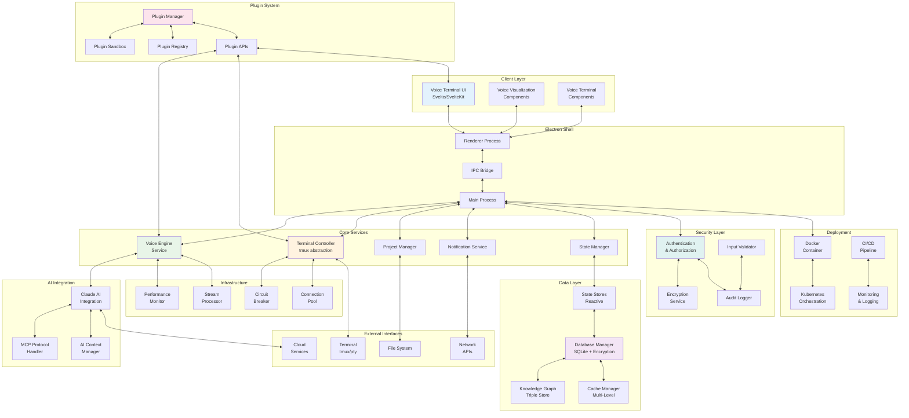
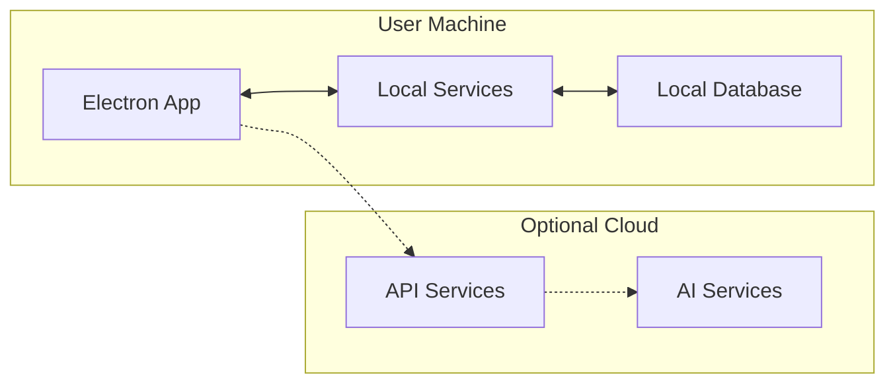
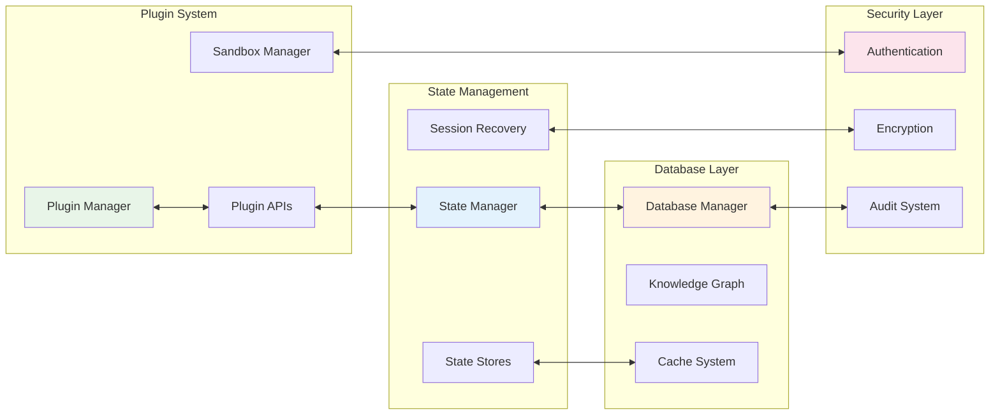

# System Architecture Overview
## AlphanumericMango Project

Version: 2.0.0  
Last Updated: 2025-09-18  
Status: Phase 3 - Documentation Complete

---

## 1. Executive Summary

AlphanumericMango is a comprehensive voice-controlled terminal interface system built on Electron, integrating advanced voice recognition, terminal management, AI assistance, and extensible plugin architecture. The system employs a security-first, modular design pattern enabling real-time voice command processing, multi-project context management, seamless terminal orchestration, and robust plugin ecosystem.

### Key Architectural Principles
- **Separation of Concerns**: Clear boundaries between voice processing, UI, terminal management, and AI integration
- **Event-Driven Architecture**: Asynchronous message passing between components
- **Plugin-Based Extensibility**: Comprehensive plugin system with secure sandboxing
- **Security-First Design**: Multi-layered security with encryption, isolation, and audit trails
- **Local-First Processing**: Prioritizing on-device processing with optional cloud enhancement
- **State Management**: Reactive state architecture with persistent recovery capabilities
- **Deployment Flexibility**: Container-ready with multiple deployment strategies
- **Module Dependencies**: Dependency injection with circular dependency prevention

## 2. High-Level Architecture



## 3. Component Architecture

### 3.1 Electron Shell Layer
The foundation layer providing desktop application capabilities and process isolation.

#### Main Process (`electron-shell/`)
- **Responsibilities**:
  - Window management
  - System tray integration
  - Native OS integration
  - IPC communication orchestration
  - Security and permission management

- **Key Technologies**:
  - Electron 28.x
  - Node.js runtime
  - node-pty for terminal emulation

#### Renderer Process
- **Responsibilities**:
  - UI rendering and state management
  - User interaction handling
  - WebSocket communication
  - Local state caching

### 3.2 Voice Processing Pipeline

#### Voice Engine Service
- **Components**:
  - Audio Capture Module
  - Voice Activity Detection (VAD)
  - Speech-to-Text Engine
  - Natural Language Understanding (NLU)
  - Command Parser

- **Processing Flow**:
  1. Audio stream capture
  2. Noise reduction and preprocessing
  3. Voice activity detection
  4. Speech recognition (local/hybrid)
  5. Intent classification
  6. Command extraction
  7. Context enrichment

### 3.3 Terminal Management System

#### Terminal Controller
- **Architecture**: tmux abstraction layer
- **Features**:
  - Session management
  - Window/pane orchestration
  - Command execution
  - Output streaming
  - History management

- **Integration Points**:
  - PTY (Pseudo-Terminal) interface
  - tmux server communication
  - Shell environment management

### 3.4 User Interface Layer (`voice-terminal-hybrid/`)

#### Technology Stack
- **Framework**: SvelteKit 2.0
- **Component Library**: Custom voice-terminal-components
- **Styling**: Flowbite + Custom themes
- **Testing**: Vitest + Playwright
- **Documentation**: Storybook 8.0

#### Component Architecture
```
voice-terminal-hybrid/
├── src/
│   ├── lib/
│   │   ├── components/     # Reusable UI components
│   │   ├── stores/         # Svelte stores for state
│   │   ├── services/       # Business logic services
│   │   └── utils/          # Utility functions
│   ├── routes/             # SvelteKit routes
│   └── app.html            # Application shell
```

### 3.5 AI Integration Layer

#### Claude AI Integration
- **Protocol**: MCP (Model Context Protocol)
- **Features**:
  - Natural language command interpretation
  - Code generation and assistance
  - Context-aware suggestions
  - Multi-turn conversations

#### MCP Architecture
- Bidirectional communication protocol
- Session management
- Context preservation
- Tool invocation framework

## 4. Data Architecture

### 4.1 State Management

#### Global State (Svelte Stores)
```typescript
interface ApplicationState {
  user: UserState;
  projects: ProjectState[];
  activeSession: SessionState;
  voiceStatus: VoiceState;
  terminalSessions: TerminalState[];
  notifications: NotificationState[];
}
```

### 4.2 Persistence Strategy

#### Local Storage
- User preferences
- Session recovery data
- Command history
- Voice training data

#### Knowledge Graph System
- Entity-relationship storage
- Cross-project memory
- Context preservation
- Semantic search capabilities

## 5. Communication Architecture

### 5.1 IPC Communication

#### Message Protocol
```typescript
interface IPCMessage {
  channel: string;
  type: 'request' | 'response' | 'event';
  id: string;
  payload: any;
  timestamp: number;
}
```

#### Channel Categories
- `voice:*` - Voice processing events
- `terminal:*` - Terminal operations
- `project:*` - Project management
- `ai:*` - AI integration
- `system:*` - System events

### 5.2 WebSocket Communication

Used for real-time updates between services:
- Voice processing status
- Terminal output streaming
- Notification delivery
- AI response streaming

## 6. Security Architecture

### 6.1 Process Isolation
- Main process handles sensitive operations
- Renderer processes run in sandboxed environment
- Context isolation enabled
- Node integration disabled in renderers

### 6.2 Permission Model
```yaml
Permissions:
  voice:
    - microphone_access
    - audio_processing
  terminal:
    - shell_execution
    - file_system_access
  ai:
    - api_key_management
    - context_access
```

### 6.3 Data Security
- Encrypted storage for sensitive data
- Secure credential management
- API key isolation
- Session token management

## 7. Deployment Architecture

### 7.1 Local Deployment


### 7.2 Distribution Strategy
- **Platforms**: macOS, Linux (Ubuntu, Fedora)
- **Package Formats**: DMG, AppImage, DEB, RPM
- **Update Mechanism**: Electron auto-updater
- **Configuration**: Environment-based

## 8. Performance Considerations

### 8.1 Optimization Strategies
- Lazy loading of components
- Virtual scrolling for terminal output
- Debounced voice processing
- Efficient IPC message batching
- Memory pool for terminal buffers

### 8.2 Performance Targets
- Voice response latency: <300ms
- Terminal command execution: <50ms
- UI responsiveness: 60fps
- Memory usage: <500MB baseline
- CPU usage: <5% idle, <25% active

## 9. Scalability Design

### 9.1 Horizontal Scaling
- Multiple terminal sessions
- Parallel voice processing pipelines
- Distributed project contexts
- Load-balanced AI requests

### 9.2 Vertical Scaling
- Configurable thread pools
- Adjustable memory limits
- Dynamic resource allocation
- Performance profiling hooks

## 10. Technology Stack Summary

### Core Technologies
- **Runtime**: Electron 28.x + Node.js
- **Frontend**: SvelteKit 2.0 + TypeScript 5.x
- **Terminal**: tmux + node-pty
- **Voice**: Web Audio API + Local STT
- **AI**: Claude API + MCP Protocol
- **Testing**: Vitest + Playwright
- **Build**: Vite + ESBuild

### Development Tools
- **Documentation**: Storybook 8.0
- **Linting**: ESLint + Prettier
- **Version Control**: Git
- **Package Management**: npm
- **CI/CD**: GitHub Actions

---

## Appendix A: Architecture Decision Records (ADRs)

### ADR-001: Electron as Desktop Framework
**Status**: Accepted  
**Decision**: Use Electron for cross-platform desktop application  
**Rationale**: Provides native OS integration, broad platform support, and familiar web technologies

### ADR-002: tmux for Terminal Abstraction
**Status**: Accepted  
**Decision**: Use tmux as terminal multiplexer abstraction  
**Rationale**: Mature, stable, provides session persistence and advanced window management

### ADR-003: SvelteKit for UI Framework
**Status**: Accepted  
**Decision**: Use SvelteKit for reactive UI development  
**Rationale**: Excellent performance, small bundle size, built-in state management

### ADR-004: Local-First Voice Processing
**Status**: Accepted  
**Decision**: Prioritize local voice processing with cloud fallback  
**Rationale**: Privacy, latency reduction, offline capability

### ADR-005: MCP for AI Integration
**Status**: Accepted  
**Decision**: Use Model Context Protocol for Claude integration  
**Rationale**: Standardized protocol, rich context support, extensible tool system

### ADR-006: Comprehensive State Management Strategy
**Status**: Accepted  
**Decision**: Implement layered state management using Svelte stores with security-first design  
**Rationale**: Need centralized state management for voice-controlled terminal with multi-project context isolation

### ADR-007: Local-First Database Strategy
**Status**: Accepted  
**Decision**: Implement hybrid local-first database with optional cloud synchronization  
**Rationale**: Need persistent storage for voice-controlled terminal with offline-first capability and security

### ADR-008: Modular Architecture with Dependency Isolation
**Status**: Accepted  
**Decision**: Implement modular architecture with clear dependency boundaries and isolation  
**Rationale**: Need maintainable, testable, and scalable module system for voice-controlled terminal

### ADR-009: Multi-Environment Deployment Strategy
**Status**: Accepted  
**Decision**: Implement local-first deployment with container orchestration capabilities  
**Rationale**: Need flexible deployment supporting development, testing, and production environments

### ADR-010: Extensible Plugin System Architecture
**Status**: Accepted  
**Decision**: Implement secure, sandboxed plugin system with standardized APIs  
**Rationale**: Need extensible architecture for third-party integrations and custom functionality

---

## 11. Comprehensive Architecture Components

### 11.1 State Management Architecture

The state management layer provides a reactive, secure, and performant state system built on Svelte stores with comprehensive isolation and persistence capabilities.

**Key Features:**
- **Global Application State**: Centralized state management with isolation boundaries
- **Project Context Isolation**: Secure separation of project-specific state
- **Voice State Machine**: Comprehensive voice recognition state management
- **Session Recovery**: Persistent session recovery with encryption
- **Multi-Project Management**: Isolated state for concurrent projects
- **Performance Optimization**: Lazy loading and efficient change detection

**Reference**: [State Management Architecture](./state/STATE_MANAGEMENT_ARCHITECTURE.md)

### 11.2 Database Design

The database layer implements a local-first, encrypted storage system with comprehensive schemas for all application data and optional cloud synchronization.

**Key Features:**
- **SQLite Core**: Local-first database with encryption at rest
- **Knowledge Graph**: Triple store for semantic relationships
- **Notification System**: Complete notification management schema
- **Security Audit**: Comprehensive audit logging and monitoring
- **Performance Optimization**: Indexing strategies and query optimization
- **Backup and Sync**: Automated backup with optional cloud synchronization

**Reference**: [Database Design](./database/DATABASE_DESIGN.md)

### 11.3 Module Dependencies

The module dependency system provides comprehensive dependency management with injection patterns, circular dependency prevention, and performance optimization.

**Key Features:**
- **Dependency Injection**: Comprehensive DI container with lifecycle management
- **Circular Prevention**: Automatic detection and prevention of circular dependencies
- **Service Orchestration**: Managed service startup and communication
- **Performance Monitoring**: Module-level performance tracking and optimization
- **Hot Reloading**: Development-time module reloading capabilities
- **Security Isolation**: Module-level security boundaries and validation

**Reference**: [Module Dependencies](./modules/MODULE_DEPENDENCIES.md)

### 11.4 Deployment Architecture

The deployment system supports multiple environments with container orchestration, automated CI/CD, and comprehensive monitoring.

**Key Features:**
- **Multi-Environment**: Development, staging, and production deployments
- **Container Orchestration**: Docker and Kubernetes support
- **CI/CD Pipeline**: Automated testing, security scanning, and deployment
- **Monitoring Integration**: Comprehensive performance and security monitoring
- **Security Validation**: Automated security scanning and validation
- **Environment Management**: Configuration management across environments

**Reference**: [Deployment Architecture](./deployment/DEPLOYMENT_ARCHITECTURE.md)

### 11.5 Plugin/Extension System

The plugin architecture provides a secure, sandboxed extension system with comprehensive APIs and development tools.

**Key Features:**
- **Secure Sandboxing**: Isolated execution environments for plugins
- **Comprehensive APIs**: Voice, Terminal, UI, and AI integration APIs
- **Plugin Registry**: Complete plugin discovery and installation system
- **Development SDK**: Rich development tools and testing framework
- **Security Framework**: Multi-layered security validation and monitoring
- **Hot Reloading**: Development-time plugin reloading and debugging

**Reference**: [Plugin/Extension Architecture](./plugins/PLUGIN_EXTENSION_ARCHITECTURE.md)

---

## 12. Architecture Integration Points

### 12.1 Cross-System Communication



### 12.2 Security Integration

The security framework integrates across all architectural layers:

- **State Security**: Encrypted state storage with audit trails
- **Database Security**: Encryption at rest with access control
- **Plugin Security**: Sandboxed execution with permission validation
- **Deployment Security**: Container security with runtime monitoring
- **Module Security**: Dependency validation with isolation boundaries

### 12.3 Performance Integration

Performance optimization spans all architectural components:

- **State Performance**: Reactive updates with minimal re-renders
- **Database Performance**: Optimized queries with intelligent caching
- **Plugin Performance**: Resource monitoring with limits enforcement
- **Deployment Performance**: Auto-scaling with load balancing
- **Module Performance**: Lazy loading with dependency optimization

---

## 13. Implementation Phases Summary

### Phase 0: Security Foundation (Complete)
- ✅ Core security frameworks implemented
- ✅ Authentication and authorization systems
- ✅ Encryption and audit logging
- ✅ Input validation and safety engines

### Phase 1: Security Hardening (Complete)
- ✅ Advanced security controls
- ✅ Multi-factor authentication
- ✅ Database security hardening
- ✅ Session management infrastructure

### Phase 2: Backend Hardening (Complete)
- ✅ Performance optimization systems
- ✅ Circuit breakers and backpressure management
- ✅ Caching strategies and connection pooling
- ✅ API security and monitoring

### Phase 3: Documentation Completion (Complete)
- ✅ State Management Architecture
- ✅ Database Design documentation
- ✅ Module Dependencies architecture
- ✅ Deployment Architecture
- ✅ Plugin/Extension Architecture

### Phase 4: Testing and Validation (Next)
- 🔄 Comprehensive testing framework
- 🔄 Security validation and penetration testing
- 🔄 Performance testing and optimization
- 🔄 Integration testing across all components

---

## 14. Quality Metrics and Targets

### 14.1 Performance Targets
- **Voice Response**: <300ms end-to-end latency
- **Database Queries**: <50ms for simple, <200ms for complex
- **State Updates**: <16ms for 60fps UI responsiveness
- **Plugin Loading**: <2 seconds for average plugin
- **Memory Usage**: <500MB baseline, <2GB under load

### 14.2 Security Targets
- **Encryption**: AES-256 encryption for all sensitive data
- **Authentication**: Multi-factor authentication with session management
- **Audit Coverage**: 100% coverage of security-sensitive operations
- **Plugin Isolation**: Complete sandbox isolation with permission validation
- **Vulnerability Response**: <24 hours for critical security issues

### 14.3 Reliability Targets
- **Uptime**: 99.9% availability for core functions
- **Data Integrity**: Zero data loss with automated backup
- **Error Recovery**: Automatic recovery from transient failures
- **Session Persistence**: 100% session recovery after crashes
- **Plugin Stability**: Plugin failures do not affect core system

---

## Document History
- v1.0.0 (2025-09-18): Initial architecture documentation
- v2.0.0 (2025-09-18): Complete Phase 3 architecture documentation with all components