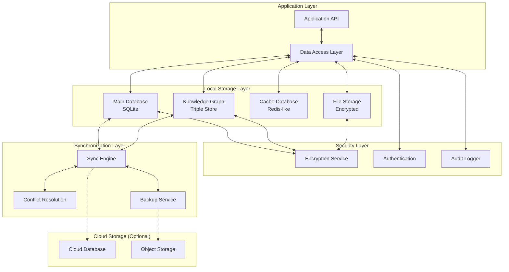

# Database Design Architecture
## AlphanumericMango Project

Version: 1.0.0  
Last Updated: 2025-09-18  
Status: Phase 3 - Documentation Completion

---

## ADR-007: Local-First Database Strategy

**Status**: Accepted  
**Decision**: Implement hybrid local-first database with optional cloud synchronization  
**Context**: Need persistent storage for voice-controlled terminal with offline-first capability and security

---

## 1. Executive Summary

The Database Design Architecture defines a comprehensive data persistence strategy for the AlphanumericMango voice-controlled terminal system. The architecture emphasizes local-first storage, security isolation, and efficient data retrieval while maintaining the ability to synchronize with cloud services when available.

### Key Design Principles
- **Local-First**: Primary data storage on user's device
- **Security-Focused**: Encrypted storage with granular access control
- **Performance-Optimized**: Efficient indexing and caching strategies
- **Offline-Capable**: Full functionality without network connectivity
- **Synchronization-Ready**: Optional cloud backup and sync

---

## 2. Database Architecture Overview



---

## 3. Main Database Schema (SQLite)

### 3.1 Core Tables Structure

```sql
-- User and Authentication
CREATE TABLE users (
    id TEXT PRIMARY KEY,
    username TEXT UNIQUE NOT NULL,
    email TEXT UNIQUE,
    created_at INTEGER NOT NULL,
    updated_at INTEGER NOT NULL,
    last_login INTEGER,
    preferences TEXT, -- JSON
    security_profile TEXT, -- JSON, encrypted
    voice_profile_id TEXT,
    FOREIGN KEY (voice_profile_id) REFERENCES voice_profiles(id)
);

-- Projects and Workspaces
CREATE TABLE projects (
    id TEXT PRIMARY KEY,
    user_id TEXT NOT NULL,
    name TEXT NOT NULL,
    display_name TEXT,
    path TEXT NOT NULL,
    type TEXT DEFAULT 'generic',
    status TEXT DEFAULT 'active',
    created_at INTEGER NOT NULL,
    updated_at INTEGER NOT NULL,
    last_accessed INTEGER,
    metadata TEXT, -- JSON
    security_config TEXT, -- JSON, encrypted
    git_config TEXT, -- JSON
    FOREIGN KEY (user_id) REFERENCES users(id),
    UNIQUE(user_id, path)
);

-- Terminal Sessions
CREATE TABLE terminal_sessions (
    id TEXT PRIMARY KEY,
    project_id TEXT,
    user_id TEXT NOT NULL,
    name TEXT,
    status TEXT DEFAULT 'active',
    working_directory TEXT,
    environment_variables TEXT, -- JSON, encrypted
    created_at INTEGER NOT NULL,
    last_activity INTEGER,
    session_data TEXT, -- JSON, encrypted
    tmux_session_id TEXT,
    FOREIGN KEY (project_id) REFERENCES projects(id),
    FOREIGN KEY (user_id) REFERENCES users(id)
);

-- Voice Recognition Profiles
CREATE TABLE voice_profiles (
    id TEXT PRIMARY KEY,
    user_id TEXT NOT NULL,
    name TEXT NOT NULL,
    language TEXT DEFAULT 'en-US',
    accuracy_score REAL DEFAULT 0.0,
    training_data TEXT, -- JSON, encrypted
    voice_print TEXT, -- JSON, encrypted
    created_at INTEGER NOT NULL,
    updated_at INTEGER NOT NULL,
    is_active BOOLEAN DEFAULT FALSE,
    FOREIGN KEY (user_id) REFERENCES users(id)
);

-- Command History
CREATE TABLE command_history (
    id TEXT PRIMARY KEY,
    user_id TEXT NOT NULL,
    project_id TEXT,
    terminal_session_id TEXT,
    command TEXT NOT NULL,
    command_type TEXT, -- 'voice', 'keyboard', 'ai'
    execution_time INTEGER,
    exit_code INTEGER,
    output TEXT,
    working_directory TEXT,
    timestamp INTEGER NOT NULL,
    voice_confidence REAL,
    ai_suggested BOOLEAN DEFAULT FALSE,
    FOREIGN KEY (user_id) REFERENCES users(id),
    FOREIGN KEY (project_id) REFERENCES projects(id),
    FOREIGN KEY (terminal_session_id) REFERENCES terminal_sessions(id)
);
```

### 3.2 Notification System Schema

```sql
-- Notification Types and Templates
CREATE TABLE notification_types (
    id TEXT PRIMARY KEY,
    name TEXT UNIQUE NOT NULL,
    category TEXT NOT NULL, -- 'system', 'voice', 'ai', 'project'
    priority TEXT DEFAULT 'normal', -- 'low', 'normal', 'high', 'critical'
    template TEXT NOT NULL, -- Message template
    default_actions TEXT, -- JSON array of actions
    retention_days INTEGER DEFAULT 30,
    created_at INTEGER NOT NULL
);

-- User Notification Preferences
CREATE TABLE notification_preferences (
    id TEXT PRIMARY KEY,
    user_id TEXT NOT NULL,
    notification_type_id TEXT NOT NULL,
    enabled BOOLEAN DEFAULT TRUE,
    delivery_methods TEXT NOT NULL, -- JSON: ['desktop', 'voice', 'log']
    sound_enabled BOOLEAN DEFAULT TRUE,
    voice_enabled BOOLEAN DEFAULT FALSE,
    urgency_threshold TEXT DEFAULT 'normal',
    quiet_hours_start TEXT, -- HH:MM format
    quiet_hours_end TEXT, -- HH:MM format
    project_specific TEXT, -- JSON: project-specific overrides
    created_at INTEGER NOT NULL,
    updated_at INTEGER NOT NULL,
    FOREIGN KEY (user_id) REFERENCES users(id),
    FOREIGN KEY (notification_type_id) REFERENCES notification_types(id),
    UNIQUE(user_id, notification_type_id)
);

-- Notification Queue and History
CREATE TABLE notifications (
    id TEXT PRIMARY KEY,
    user_id TEXT NOT NULL,
    project_id TEXT,
    notification_type_id TEXT NOT NULL,
    title TEXT NOT NULL,
    message TEXT NOT NULL,
    priority TEXT NOT NULL,
    status TEXT DEFAULT 'pending', -- 'pending', 'delivered', 'read', 'dismissed', 'failed'
    delivery_methods TEXT, -- JSON: actual delivery methods used
    metadata TEXT, -- JSON: additional context data
    scheduled_at INTEGER,
    delivered_at INTEGER,
    read_at INTEGER,
    dismissed_at INTEGER,
    expires_at INTEGER,
    created_at INTEGER NOT NULL,
    FOREIGN KEY (user_id) REFERENCES users(id),
    FOREIGN KEY (project_id) REFERENCES projects(id),
    FOREIGN KEY (notification_type_id) REFERENCES notification_types(id)
);

-- Notification Actions and Responses
CREATE TABLE notification_actions (
    id TEXT PRIMARY KEY,
    notification_id TEXT NOT NULL,
    action_type TEXT NOT NULL, -- 'button', 'voice_command', 'auto'
    action_label TEXT NOT NULL,
    action_command TEXT, -- Command to execute
    action_data TEXT, -- JSON: additional action data
    executed_at INTEGER,
    execution_result TEXT,
    created_at INTEGER NOT NULL,
    FOREIGN KEY (notification_id) REFERENCES notifications(id)
);
```

### 3.3 AI Context and Memory Schema

```sql
-- AI Conversation Sessions
CREATE TABLE ai_conversations (
    id TEXT PRIMARY KEY,
    user_id TEXT NOT NULL,
    project_id TEXT,
    title TEXT,
    context_type TEXT DEFAULT 'general', -- 'general', 'project', 'terminal', 'voice'
    status TEXT DEFAULT 'active', -- 'active', 'archived', 'deleted'
    conversation_data TEXT, -- JSON, encrypted
    token_count INTEGER DEFAULT 0,
    created_at INTEGER NOT NULL,
    last_message_at INTEGER,
    expires_at INTEGER,
    FOREIGN KEY (user_id) REFERENCES users(id),
    FOREIGN KEY (project_id) REFERENCES projects(id)
);

-- AI Memory and Context
CREATE TABLE ai_memory (
    id TEXT PRIMARY KEY,
    user_id TEXT NOT NULL,
    project_id TEXT,
    conversation_id TEXT,
    memory_type TEXT NOT NULL, -- 'fact', 'preference', 'skill', 'context'
    key_name TEXT NOT NULL,
    value_data TEXT NOT NULL, -- JSON
    confidence_score REAL DEFAULT 1.0,
    source TEXT, -- 'user_input', 'inference', 'observation'
    created_at INTEGER NOT NULL,
    last_accessed INTEGER,
    access_count INTEGER DEFAULT 0,
    expires_at INTEGER,
    FOREIGN KEY (user_id) REFERENCES users(id),
    FOREIGN KEY (project_id) REFERENCES projects(id),
    FOREIGN KEY (conversation_id) REFERENCES ai_conversations(id)
);
```

### 3.4 Security and Audit Schema

```sql
-- Security Events and Audit Log
CREATE TABLE security_events (
    id TEXT PRIMARY KEY,
    user_id TEXT,
    event_type TEXT NOT NULL, -- 'auth', 'access', 'command', 'voice', 'data'
    severity TEXT NOT NULL, -- 'info', 'warning', 'error', 'critical'
    source_component TEXT NOT NULL,
    event_data TEXT, -- JSON
    client_info TEXT, -- JSON: user agent, IP, etc.
    risk_score REAL DEFAULT 0.0,
    resolved BOOLEAN DEFAULT FALSE,
    resolved_at INTEGER,
    resolved_by TEXT,
    timestamp INTEGER NOT NULL,
    FOREIGN KEY (user_id) REFERENCES users(id)
);

-- Access Control and Permissions
CREATE TABLE permissions (
    id TEXT PRIMARY KEY,
    user_id TEXT NOT NULL,
    resource_type TEXT NOT NULL, -- 'project', 'terminal', 'voice', 'ai'
    resource_id TEXT, -- Specific resource ID or '*' for all
    permission_type TEXT NOT NULL, -- 'read', 'write', 'execute', 'admin'
    granted_by TEXT,
    granted_at INTEGER NOT NULL,
    expires_at INTEGER,
    revoked_at INTEGER,
    revoked_by TEXT,
    conditions TEXT, -- JSON: additional conditions
    FOREIGN KEY (user_id) REFERENCES users(id)
);

-- Session Security
CREATE TABLE user_sessions (
    id TEXT PRIMARY KEY,
    user_id TEXT NOT NULL,
    session_token TEXT UNIQUE NOT NULL,
    device_info TEXT, -- JSON
    ip_address TEXT,
    user_agent TEXT,
    created_at INTEGER NOT NULL,
    last_activity INTEGER,
    expires_at INTEGER,
    revoked_at INTEGER,
    revoked_reason TEXT,
    is_active BOOLEAN DEFAULT TRUE,
    security_level TEXT DEFAULT 'standard', -- 'low', 'standard', 'high'
    FOREIGN KEY (user_id) REFERENCES users(id)
);
```

---

## 4. Knowledge Graph Database Design

### 4.1 Triple Store Schema (RDF-like)

```sql
-- Knowledge Graph Entities
CREATE TABLE kg_entities (
    id TEXT PRIMARY KEY,
    user_id TEXT NOT NULL,
    project_id TEXT,
    entity_type TEXT NOT NULL, -- 'person', 'project', 'command', 'file', 'concept'
    name TEXT NOT NULL,
    description TEXT,
    metadata TEXT, -- JSON
    confidence_score REAL DEFAULT 1.0,
    created_at INTEGER NOT NULL,
    updated_at INTEGER NOT NULL,
    last_accessed INTEGER,
    access_count INTEGER DEFAULT 0,
    FOREIGN KEY (user_id) REFERENCES users(id),
    FOREIGN KEY (project_id) REFERENCES projects(id)
);

-- Knowledge Graph Relations
CREATE TABLE kg_relations (
    id TEXT PRIMARY KEY,
    user_id TEXT NOT NULL,
    project_id TEXT,
    subject_id TEXT NOT NULL,
    predicate TEXT NOT NULL, -- 'uses', 'creates', 'depends_on', 'similar_to'
    object_id TEXT NOT NULL,
    weight REAL DEFAULT 1.0,
    confidence_score REAL DEFAULT 1.0,
    created_at INTEGER NOT NULL,
    last_confirmed INTEGER,
    source TEXT, -- 'user', 'inference', 'observation'
    FOREIGN KEY (user_id) REFERENCES users(id),
    FOREIGN KEY (project_id) REFERENCES projects(id),
    FOREIGN KEY (subject_id) REFERENCES kg_entities(id),
    FOREIGN KEY (object_id) REFERENCES kg_entities(id)
);

-- Knowledge Graph Observations
CREATE TABLE kg_observations (
    id TEXT PRIMARY KEY,
    entity_id TEXT NOT NULL,
    user_id TEXT NOT NULL,
    observation_type TEXT NOT NULL, -- 'fact', 'behavior', 'preference', 'pattern'
    content TEXT NOT NULL,
    context TEXT, -- JSON: when/where observed
    confidence_score REAL DEFAULT 1.0,
    verified BOOLEAN DEFAULT FALSE,
    created_at INTEGER NOT NULL,
    verified_at INTEGER,
    FOREIGN KEY (entity_id) REFERENCES kg_entities(id),
    FOREIGN KEY (user_id) REFERENCES users(id)
);
```

### 4.2 Semantic Search and Indexing

```sql
-- Full-Text Search Index for Knowledge Graph
CREATE VIRTUAL TABLE kg_search_index USING fts5(
    entity_id,
    content,
    tokenize='porter unicode61'
);

-- Vector Embeddings for Semantic Search
CREATE TABLE kg_embeddings (
    id TEXT PRIMARY KEY,
    entity_id TEXT NOT NULL,
    user_id TEXT NOT NULL,
    embedding_type TEXT DEFAULT 'semantic', -- 'semantic', 'syntactic', 'contextual'
    vector_data BLOB, -- Serialized vector embeddings
    dimensions INTEGER NOT NULL,
    model_version TEXT NOT NULL,
    created_at INTEGER NOT NULL,
    FOREIGN KEY (entity_id) REFERENCES kg_entities(id),
    FOREIGN KEY (user_id) REFERENCES users(id)
);
```

---

## 5. Performance Optimization and Indexing

### 5.1 Database Indexes

```sql
-- Primary Performance Indexes
CREATE INDEX idx_users_email ON users(email);
CREATE INDEX idx_users_last_login ON users(last_login);

CREATE INDEX idx_projects_user_id ON projects(user_id);
CREATE INDEX idx_projects_last_accessed ON projects(last_accessed);
CREATE INDEX idx_projects_status ON projects(status);

CREATE INDEX idx_terminal_sessions_project_id ON terminal_sessions(project_id);
CREATE INDEX idx_terminal_sessions_user_id ON terminal_sessions(user_id);
CREATE INDEX idx_terminal_sessions_last_activity ON terminal_sessions(last_activity);

CREATE INDEX idx_command_history_user_id ON command_history(user_id);
CREATE INDEX idx_command_history_project_id ON command_history(project_id);
CREATE INDEX idx_command_history_timestamp ON command_history(timestamp);
CREATE INDEX idx_command_history_command_type ON command_history(command_type);

-- Notification Indexes
CREATE INDEX idx_notifications_user_id ON notifications(user_id);
CREATE INDEX idx_notifications_status ON notifications(status);
CREATE INDEX idx_notifications_created_at ON notifications(created_at);
CREATE INDEX idx_notifications_priority ON notifications(priority);

-- Security and Audit Indexes
CREATE INDEX idx_security_events_user_id ON security_events(user_id);
CREATE INDEX idx_security_events_timestamp ON security_events(timestamp);
CREATE INDEX idx_security_events_severity ON security_events(severity);
CREATE INDEX idx_security_events_resolved ON security_events(resolved);

-- Knowledge Graph Indexes
CREATE INDEX idx_kg_entities_user_id ON kg_entities(user_id);
CREATE INDEX idx_kg_entities_project_id ON kg_entities(project_id);
CREATE INDEX idx_kg_entities_entity_type ON kg_entities(entity_type);
CREATE INDEX idx_kg_entities_last_accessed ON kg_entities(last_accessed);

CREATE INDEX idx_kg_relations_subject_id ON kg_relations(subject_id);
CREATE INDEX idx_kg_relations_object_id ON kg_relations(object_id);
CREATE INDEX idx_kg_relations_predicate ON kg_relations(predicate);
CREATE INDEX idx_kg_relations_user_id ON kg_relations(user_id);

-- Composite Indexes for Common Queries
CREATE INDEX idx_command_history_user_project ON command_history(user_id, project_id);
CREATE INDEX idx_notifications_user_status ON notifications(user_id, status);
CREATE INDEX idx_kg_entities_user_type ON kg_entities(user_id, entity_type);
```

### 5.2 Query Optimization Strategies

```typescript
class DatabaseOptimizer {
  // Connection pool management
  private connectionPool: SQLiteConnectionPool;
  
  // Query caching
  private queryCache: QueryCache;
  
  // Performance monitoring
  private performanceMonitor: QueryPerformanceMonitor;
  
  constructor() {
    this.connectionPool = new SQLiteConnectionPool({
      maxConnections: 10,
      idleTimeout: 30000,
      acquireTimeout: 10000
    });
    
    this.queryCache = new QueryCache({
      maxSize: 1000,
      ttl: 300000 // 5 minutes
    });
    
    this.performanceMonitor = new QueryPerformanceMonitor({
      slowQueryThreshold: 100, // ms
      enableTracing: true
    });
  }

  async executeOptimizedQuery<T>(
    query: string,
    params: any[] = [],
    options: QueryOptions = {}
  ): Promise<T[]> {
    const cacheKey = this.generateCacheKey(query, params);
    
    // Check cache first
    if (options.useCache !== false) {
      const cached = this.queryCache.get(cacheKey);
      if (cached) {
        return cached;
      }
    }
    
    const startTime = performance.now();
    
    try {
      const connection = await this.connectionPool.acquire();
      const result = await connection.all(query, params);
      
      // Cache the result
      if (options.useCache !== false) {
        this.queryCache.set(cacheKey, result);
      }
      
      const duration = performance.now() - startTime;
      this.performanceMonitor.recordQuery(query, duration, result.length);
      
      return result;
      
    } catch (error) {
      this.performanceMonitor.recordError(query, error);
      throw error;
    }
  }

  // Batch operations for better performance
  async executeBatch(operations: BatchOperation[]): Promise<BatchResult> {
    const connection = await this.connectionPool.acquire();
    
    try {
      await connection.run('BEGIN TRANSACTION');
      
      const results: any[] = [];
      for (const operation of operations) {
        const result = await connection.run(operation.query, operation.params);
        results.push(result);
      }
      
      await connection.run('COMMIT');
      return { success: true, results };
      
    } catch (error) {
      await connection.run('ROLLBACK');
      return { success: false, error };
    } finally {
      this.connectionPool.release(connection);
    }
  }
}

export const databaseOptimizer = new DatabaseOptimizer();
```

---

## 6. Data Access Layer Design

### 6.1 Repository Pattern Implementation

```typescript
abstract class BaseRepository<T> {
  protected tableName: string;
  protected db: DatabaseConnection;
  protected encryptionService: EncryptionService;
  
  constructor(tableName: string) {
    this.tableName = tableName;
    this.db = getDatabaseConnection();
    this.encryptionService = getEncryptionService();
  }

  async findById(id: string): Promise<T | null> {
    const query = `SELECT * FROM ${this.tableName} WHERE id = ?`;
    const rows = await this.db.all(query, [id]);
    
    if (rows.length === 0) return null;
    
    return this.deserialize(rows[0]);
  }

  async findByUserId(userId: string): Promise<T[]> {
    const query = `SELECT * FROM ${this.tableName} WHERE user_id = ?`;
    const rows = await this.db.all(query, [userId]);
    
    return rows.map(row => this.deserialize(row));
  }

  async create(entity: Partial<T>): Promise<T> {
    const serialized = await this.serialize(entity);
    const columns = Object.keys(serialized).join(', ');
    const placeholders = Object.keys(serialized).map(() => '?').join(', ');
    const values = Object.values(serialized);
    
    const query = `INSERT INTO ${this.tableName} (${columns}) VALUES (${placeholders})`;
    
    await this.db.run(query, values);
    
    return this.findById(serialized.id);
  }

  async update(id: string, updates: Partial<T>): Promise<T> {
    const serialized = await this.serialize(updates);
    const setClause = Object.keys(serialized)
      .map(key => `${key} = ?`)
      .join(', ');
    const values = [...Object.values(serialized), id];
    
    const query = `UPDATE ${this.tableName} SET ${setClause} WHERE id = ?`;
    
    await this.db.run(query, values);
    
    return this.findById(id);
  }

  async delete(id: string): Promise<boolean> {
    const query = `DELETE FROM ${this.tableName} WHERE id = ?`;
    const result = await this.db.run(query, [id]);
    
    return result.changes > 0;
  }

  protected abstract serialize(entity: Partial<T>): Promise<Record<string, any>>;
  protected abstract deserialize(row: any): Promise<T>;
}

// Example: Project Repository
class ProjectRepository extends BaseRepository<Project> {
  constructor() {
    super('projects');
  }

  async findByPath(userId: string, path: string): Promise<Project | null> {
    const query = `SELECT * FROM ${this.tableName} WHERE user_id = ? AND path = ?`;
    const rows = await this.db.all(query, [userId, path]);
    
    if (rows.length === 0) return null;
    
    return this.deserialize(rows[0]);
  }

  async findActiveProjects(userId: string): Promise<Project[]> {
    const query = `
      SELECT * FROM ${this.tableName} 
      WHERE user_id = ? AND status = 'active' 
      ORDER BY last_accessed DESC
    `;
    const rows = await this.db.all(query, [userId]);
    
    return Promise.all(rows.map(row => this.deserialize(row)));
  }

  protected async serialize(project: Partial<Project>): Promise<Record<string, any>> {
    const serialized: any = { ...project };
    
    // Encrypt sensitive data
    if (serialized.security_config) {
      serialized.security_config = await this.encryptionService.encrypt(
        JSON.stringify(serialized.security_config)
      );
    }
    
    // Serialize JSON fields
    if (serialized.metadata) {
      serialized.metadata = JSON.stringify(serialized.metadata);
    }
    
    if (serialized.git_config) {
      serialized.git_config = JSON.stringify(serialized.git_config);
    }
    
    return serialized;
  }

  protected async deserialize(row: any): Promise<Project> {
    const project: any = { ...row };
    
    // Decrypt sensitive data
    if (project.security_config) {
      const decrypted = await this.encryptionService.decrypt(project.security_config);
      project.security_config = JSON.parse(decrypted);
    }
    
    // Parse JSON fields
    if (project.metadata) {
      project.metadata = JSON.parse(project.metadata);
    }
    
    if (project.git_config) {
      project.git_config = JSON.parse(project.git_config);
    }
    
    return project as Project;
  }
}

export const projectRepository = new ProjectRepository();
```

---

## 7. Caching Strategy

### 7.1 Multi-Level Caching

```typescript
class CacheManager {
  private memoryCache: MemoryCache;
  private diskCache: DiskCache;
  private queryCache: QueryCache;
  
  constructor() {
    this.memoryCache = new MemoryCache({
      maxSize: 100 * 1024 * 1024, // 100MB
      ttl: 300000 // 5 minutes
    });
    
    this.diskCache = new DiskCache({
      maxSize: 1024 * 1024 * 1024, // 1GB
      ttl: 3600000 // 1 hour
    });
    
    this.queryCache = new QueryCache({
      maxSize: 50 * 1024 * 1024, // 50MB
      ttl: 600000 // 10 minutes
    });
  }

  async get<T>(key: string, type: CacheType = 'memory'): Promise<T | null> {
    switch (type) {
      case 'memory':
        return this.memoryCache.get(key);
      case 'disk':
        return this.diskCache.get(key);
      case 'query':
        return this.queryCache.get(key);
      default:
        return null;
    }
  }

  async set<T>(
    key: string, 
    value: T, 
    type: CacheType = 'memory',
    ttl?: number
  ): Promise<void> {
    switch (type) {
      case 'memory':
        this.memoryCache.set(key, value, ttl);
        break;
      case 'disk':
        await this.diskCache.set(key, value, ttl);
        break;
      case 'query':
        this.queryCache.set(key, value, ttl);
        break;
    }
  }

  // Cache invalidation strategies
  async invalidatePattern(pattern: string): Promise<void> {
    await Promise.all([
      this.memoryCache.invalidatePattern(pattern),
      this.diskCache.invalidatePattern(pattern),
      this.queryCache.invalidatePattern(pattern)
    ]);
  }

  async invalidateByTags(tags: string[]): Promise<void> {
    await Promise.all([
      this.memoryCache.invalidateByTags(tags),
      this.diskCache.invalidateByTags(tags),
      this.queryCache.invalidateByTags(tags)
    ]);
  }
}

export const cacheManager = new CacheManager();
```

---

## 8. Database Security Implementation

### 8.1 Encryption at Rest

```typescript
class DatabaseEncryption {
  private encryptionKey: CryptoKey;
  private keyDerivation: KeyDerivationService;
  
  constructor() {
    this.keyDerivation = new KeyDerivationService();
    this.initializeEncryption();
  }

  private async initializeEncryption(): Promise<void> {
    // Derive encryption key from user credentials + device info
    const keyMaterial = await this.keyDerivation.deriveKey({
      password: await this.getUserPassword(),
      salt: await this.getDeviceSalt(),
      iterations: 100000
    });
    
    this.encryptionKey = keyMaterial;
  }

  async encryptField(data: string, fieldType: FieldType): Promise<EncryptedField> {
    const encoder = new TextEncoder();
    const iv = crypto.getRandomValues(new Uint8Array(12));
    
    const encrypted = await crypto.subtle.encrypt(
      { name: 'AES-GCM', iv },
      this.encryptionKey,
      encoder.encode(data)
    );
    
    return {
      data: new Uint8Array(encrypted),
      iv,
      fieldType,
      encryptedAt: Date.now()
    };
  }

  async decryptField(encryptedField: EncryptedField): Promise<string> {
    const decrypted = await crypto.subtle.decrypt(
      { name: 'AES-GCM', iv: encryptedField.iv },
      this.encryptionKey,
      encryptedField.data
    );
    
    const decoder = new TextDecoder();
    return decoder.decode(decrypted);
  }

  // Field-level encryption for sensitive columns
  async encryptSensitiveData(
    tableName: string,
    data: Record<string, any>
  ): Promise<Record<string, any>> {
    const sensitiveFields = this.getSensitiveFields(tableName);
    const result = { ...data };
    
    for (const field of sensitiveFields) {
      if (result[field] !== undefined) {
        result[field] = await this.encryptField(
          JSON.stringify(result[field]),
          this.getFieldType(tableName, field)
        );
      }
    }
    
    return result;
  }

  private getSensitiveFields(tableName: string): string[] {
    const sensitiveFieldMap: Record<string, string[]> = {
      users: ['security_profile'],
      projects: ['security_config'],
      terminal_sessions: ['environment_variables', 'session_data'],
      voice_profiles: ['training_data', 'voice_print'],
      ai_conversations: ['conversation_data'],
      notifications: ['metadata']
    };
    
    return sensitiveFieldMap[tableName] || [];
  }
}

export const databaseEncryption = new DatabaseEncryption();
```

---

## 9. Data Synchronization and Backup

### 9.1 Synchronization Strategy

```typescript
class DatabaseSynchronization {
  private syncEngine: SyncEngine;
  private conflictResolver: ConflictResolver;
  private backupService: BackupService;
  
  constructor() {
    this.syncEngine = new SyncEngine({
      syncInterval: 300000, // 5 minutes
      batchSize: 100,
      retryAttempts: 3
    });
    
    this.conflictResolver = new ConflictResolver({
      strategy: 'last-write-wins', // or 'merge', 'manual'
      timestampField: 'updated_at'
    });
    
    this.backupService = new BackupService({
      backupInterval: 3600000, // 1 hour
      retentionDays: 30,
      compressionEnabled: true
    });
  }

  async synchronizeData(): Promise<SyncResult> {
    const localChanges = await this.getLocalChanges();
    const remoteChanges = await this.getRemoteChanges();
    
    // Resolve conflicts
    const conflicts = this.detectConflicts(localChanges, remoteChanges);
    const resolvedChanges = await this.conflictResolver.resolve(conflicts);
    
    // Apply changes
    await this.applyLocalChanges(resolvedChanges.remote);
    await this.applyRemoteChanges(resolvedChanges.local);
    
    return {
      localChangesApplied: resolvedChanges.remote.length,
      remoteChangesApplied: resolvedChanges.local.length,
      conflictsResolved: conflicts.length,
      timestamp: Date.now()
    };
  }

  private async getLocalChanges(): Promise<DatabaseChange[]> {
    const lastSync = await this.getLastSyncTimestamp();
    
    const query = `
      SELECT table_name, record_id, operation, timestamp, data
      FROM sync_log 
      WHERE timestamp > ? 
      ORDER BY timestamp ASC
    `;
    
    const changes = await databaseOptimizer.executeOptimizedQuery(
      query, 
      [lastSync]
    );
    
    return changes.map(change => ({
      table: change.table_name,
      id: change.record_id,
      operation: change.operation as 'insert' | 'update' | 'delete',
      timestamp: change.timestamp,
      data: JSON.parse(change.data)
    }));
  }

  async createBackup(): Promise<BackupResult> {
    const backupId = this.generateBackupId();
    const timestamp = Date.now();
    
    try {
      // Create database dump
      const databaseDump = await this.createDatabaseDump();
      
      // Encrypt backup
      const encryptedBackup = await databaseEncryption.encryptField(
        JSON.stringify(databaseDump),
        'backup'
      );
      
      // Compress backup
      const compressedBackup = await this.compressBackup(encryptedBackup);
      
      // Store backup
      await this.storeBackup(backupId, compressedBackup);
      
      return {
        backupId,
        timestamp,
        size: compressedBackup.byteLength,
        success: true
      };
      
    } catch (error) {
      return {
        backupId,
        timestamp,
        size: 0,
        success: false,
        error: error.message
      };
    }
  }
}

export const databaseSynchronization = new DatabaseSynchronization();
```

---

## 10. Performance Monitoring

### 10.1 Database Performance Metrics

```typescript
class DatabasePerformanceMonitor {
  private metrics: PerformanceMetrics;
  private alertThresholds: AlertThresholds;
  
  constructor() {
    this.metrics = {
      queryTimes: new Map(),
      connectionPoolStats: {
        active: 0,
        idle: 0,
        waiting: 0
      },
      cacheHitRates: new Map(),
      diskUsage: 0,
      indexUsage: new Map()
    };
    
    this.alertThresholds = {
      slowQueryTime: 1000, // 1 second
      highCacheHitRate: 0.8, // 80%
      maxDiskUsage: 10 * 1024 * 1024 * 1024, // 10GB
      connectionPoolUtilization: 0.9 // 90%
    };
  }

  recordQuery(query: string, duration: number, resultCount: number): void {
    const queryHash = this.hashQuery(query);
    
    if (!this.metrics.queryTimes.has(queryHash)) {
      this.metrics.queryTimes.set(queryHash, {
        count: 0,
        totalTime: 0,
        avgTime: 0,
        maxTime: 0,
        minTime: Infinity
      });
    }
    
    const stats = this.metrics.queryTimes.get(queryHash);
    stats.count++;
    stats.totalTime += duration;
    stats.avgTime = stats.totalTime / stats.count;
    stats.maxTime = Math.max(stats.maxTime, duration);
    stats.minTime = Math.min(stats.minTime, duration);
    
    // Check for slow queries
    if (duration > this.alertThresholds.slowQueryTime) {
      this.alertSlowQuery(query, duration);
    }
  }

  recordCacheAccess(cacheType: string, hit: boolean): void {
    if (!this.metrics.cacheHitRates.has(cacheType)) {
      this.metrics.cacheHitRates.set(cacheType, {
        hits: 0,
        misses: 0,
        hitRate: 0
      });
    }
    
    const stats = this.metrics.cacheHitRates.get(cacheType);
    if (hit) {
      stats.hits++;
    } else {
      stats.misses++;
    }
    
    stats.hitRate = stats.hits / (stats.hits + stats.misses);
  }

  async generatePerformanceReport(): Promise<PerformanceReport> {
    const diskUsage = await this.getDiskUsage();
    const indexUsage = await this.getIndexUsage();
    
    return {
      timestamp: Date.now(),
      queryPerformance: this.analyzeQueryPerformance(),
      cachePerformance: this.analyzeCachePerformance(),
      diskUsage,
      indexUsage,
      recommendations: this.generateRecommendations()
    };
  }

  private analyzeQueryPerformance(): QueryPerformanceAnalysis {
    const slowQueries = [];
    let totalQueries = 0;
    let totalTime = 0;
    
    for (const [queryHash, stats] of this.metrics.queryTimes) {
      totalQueries += stats.count;
      totalTime += stats.totalTime;
      
      if (stats.avgTime > this.alertThresholds.slowQueryTime) {
        slowQueries.push({
          queryHash,
          avgTime: stats.avgTime,
          count: stats.count
        });
      }
    }
    
    return {
      totalQueries,
      averageQueryTime: totalTime / totalQueries,
      slowQueries,
      performanceScore: this.calculatePerformanceScore()
    };
  }

  private generateRecommendations(): string[] {
    const recommendations = [];
    
    // Query performance recommendations
    if (this.hasSlowQueries()) {
      recommendations.push('Consider adding indexes for slow queries');
      recommendations.push('Optimize queries with high execution times');
    }
    
    // Cache recommendations
    const lowCacheHitRates = Array.from(this.metrics.cacheHitRates.entries())
      .filter(([_, stats]) => stats.hitRate < this.alertThresholds.highCacheHitRate);
      
    if (lowCacheHitRates.length > 0) {
      recommendations.push('Improve cache hit rates by optimizing cache keys');
      recommendations.push('Consider increasing cache size or TTL');
    }
    
    // Disk usage recommendations
    if (this.metrics.diskUsage > this.alertThresholds.maxDiskUsage * 0.8) {
      recommendations.push('Database size approaching limit - consider archiving old data');
      recommendations.push('Run VACUUM command to optimize database file');
    }
    
    return recommendations;
  }
}

export const databasePerformanceMonitor = new DatabasePerformanceMonitor();
```

---

## 11. Migration and Schema Management

### 11.1 Database Migration System

```typescript
class DatabaseMigration {
  private migrationHistory: MigrationRecord[] = [];
  private currentVersion: number = 0;
  
  constructor() {
    this.loadMigrationHistory();
  }

  async migrate(): Promise<MigrationResult> {
    const pendingMigrations = this.getPendingMigrations();
    const results: MigrationStepResult[] = [];
    
    try {
      for (const migration of pendingMigrations) {
        const result = await this.executeMigration(migration);
        results.push(result);
        
        if (!result.success) {
          throw new Error(`Migration ${migration.version} failed: ${result.error}`);
        }
      }
      
      return {
        success: true,
        migrationsExecuted: results.length,
        finalVersion: this.currentVersion,
        results
      };
      
    } catch (error) {
      // Rollback on failure
      await this.rollbackMigrations(results);
      
      return {
        success: false,
        error: error.message,
        migrationsExecuted: 0,
        finalVersion: this.currentVersion,
        results
      };
    }
  }

  private async executeMigration(migration: Migration): Promise<MigrationStepResult> {
    const startTime = Date.now();
    
    try {
      // Backup current state
      const backupId = await this.createMigrationBackup(migration.version);
      
      // Execute migration SQL
      await this.db.exec(migration.upSql);
      
      // Update migration history
      await this.recordMigration(migration);
      
      this.currentVersion = migration.version;
      
      return {
        version: migration.version,
        success: true,
        duration: Date.now() - startTime,
        backupId
      };
      
    } catch (error) {
      return {
        version: migration.version,
        success: false,
        duration: Date.now() - startTime,
        error: error.message
      };
    }
  }

  private getPendingMigrations(): Migration[] {
    return migrations.filter(m => m.version > this.currentVersion);
  }
}

// Migration definitions
const migrations: Migration[] = [
  {
    version: 1,
    description: 'Initial schema creation',
    upSql: `
      -- Create initial tables
      ${createUsersTable}
      ${createProjectsTable}
      ${createTerminalSessionsTable}
      -- ... other initial tables
    `,
    downSql: `
      DROP TABLE IF EXISTS users;
      DROP TABLE IF EXISTS projects;
      DROP TABLE IF EXISTS terminal_sessions;
      -- ... drop other tables
    `
  },
  {
    version: 2,
    description: 'Add notification system',
    upSql: `
      ${createNotificationTables}
      ${createNotificationIndexes}
    `,
    downSql: `
      DROP TABLE IF EXISTS notifications;
      DROP TABLE IF EXISTS notification_types;
      DROP TABLE IF EXISTS notification_preferences;
    `
  },
  {
    version: 3,
    description: 'Add knowledge graph support',
    upSql: `
      ${createKnowledgeGraphTables}
      ${createKnowledgeGraphIndexes}
    `,
    downSql: `
      DROP TABLE IF EXISTS kg_entities;
      DROP TABLE IF EXISTS kg_relations;
      DROP TABLE IF EXISTS kg_observations;
    `
  }
];

export const databaseMigration = new DatabaseMigration();
```

---

## 12. Testing Strategy

### 12.1 Database Testing Framework

```typescript
class DatabaseTestingFramework {
  private testDb: DatabaseConnection;
  private originalDb: DatabaseConnection;
  
  async setupTestDatabase(): Promise<void> {
    // Create in-memory test database
    this.testDb = new DatabaseConnection(':memory:');
    
    // Run migrations
    await this.runTestMigrations();
    
    // Seed test data
    await this.seedTestData();
  }

  async teardownTestDatabase(): Promise<void> {
    await this.testDb.close();
  }

  async testRepository<T>(
    repository: BaseRepository<T>,
    testCases: RepositoryTestCase<T>[]
  ): Promise<TestResult[]> {
    const results: TestResult[] = [];
    
    for (const testCase of testCases) {
      const result = await this.runRepositoryTest(repository, testCase);
      results.push(result);
    }
    
    return results;
  }

  async testPerformance(
    query: string,
    params: any[],
    expectedMaxTime: number
  ): Promise<PerformanceTestResult> {
    const iterations = 100;
    const times: number[] = [];
    
    for (let i = 0; i < iterations; i++) {
      const start = performance.now();
      await this.testDb.all(query, params);
      const duration = performance.now() - start;
      times.push(duration);
    }
    
    const avgTime = times.reduce((a, b) => a + b, 0) / times.length;
    const maxTime = Math.max(...times);
    const minTime = Math.min(...times);
    
    return {
      query,
      iterations,
      avgTime,
      maxTime,
      minTime,
      expectedMaxTime,
      passed: avgTime <= expectedMaxTime
    };
  }

  private async seedTestData(): Promise<void> {
    const testUser = {
      id: 'test-user-1',
      username: 'testuser',
      email: 'test@example.com',
      created_at: Date.now(),
      updated_at: Date.now()
    };
    
    await this.testDb.run(
      'INSERT INTO users (id, username, email, created_at, updated_at) VALUES (?, ?, ?, ?, ?)',
      [testUser.id, testUser.username, testUser.email, testUser.created_at, testUser.updated_at]
    );
    
    // Seed more test data...
  }
}

export const databaseTestingFramework = new DatabaseTestingFramework();
```

---

## 13. Security Compliance

### 13.1 Data Protection Requirements

```typescript
interface DataProtectionCompliance {
  // GDPR Compliance
  gdpr: {
    dataMinimization: boolean;
    purposeLimitation: boolean;
    retentionPolicies: RetentionPolicy[];
    userRights: UserRights;
  };
  
  // Security Standards
  security: {
    encryptionAtRest: boolean;
    encryptionInTransit: boolean;
    accessLogging: boolean;
    regularBackups: boolean;
  };
  
  // Privacy Controls
  privacy: {
    anonymization: boolean;
    pseudonymization: boolean;
    dataPortability: boolean;
    rightToErasure: boolean;
  };
}

class DataProtectionManager {
  async implementRetentionPolicy(policy: RetentionPolicy): Promise<void> {
    const cutoffDate = Date.now() - (policy.retentionDays * 24 * 60 * 60 * 1000);
    
    switch (policy.table) {
      case 'command_history':
        await this.archiveOldCommands(cutoffDate);
        break;
      case 'notifications':
        await this.deleteOldNotifications(cutoffDate);
        break;
      case 'security_events':
        await this.archiveSecurityEvents(cutoffDate);
        break;
    }
  }

  async handleDataErasureRequest(userId: string): Promise<ErasureResult> {
    const tables = [
      'users', 'projects', 'terminal_sessions', 'command_history',
      'notifications', 'ai_conversations', 'security_events'
    ];
    
    const results: TableErasureResult[] = [];
    
    for (const table of tables) {
      const result = await this.eraseUserData(table, userId);
      results.push(result);
    }
    
    return {
      userId,
      timestamp: Date.now(),
      tables: results,
      success: results.every(r => r.success)
    };
  }

  async exportUserData(userId: string): Promise<UserDataExport> {
    const userData = await this.collectUserData(userId);
    
    return {
      userId,
      exportDate: new Date().toISOString(),
      format: 'JSON',
      data: userData,
      checksum: await this.calculateChecksum(userData)
    };
  }
}

export const dataProtectionManager = new DataProtectionManager();
```

---

## 14. Implementation Timeline

### Phase 3.1: Core Database Setup (Week 3, Days 1-2)
- Implement SQLite database with core schemas
- Set up Repository pattern and basic CRUD operations
- Implement database encryption

### Phase 3.2: Advanced Features (Week 3, Days 3-4)
- Implement Knowledge Graph database
- Set up caching and performance optimization
- Create synchronization and backup systems

### Phase 3.3: Security and Monitoring (Week 3, Days 5-7)
- Implement comprehensive security controls
- Set up performance monitoring
- Create testing framework and compliance tools

---

## 15. Performance Targets

### 15.1 Database Performance Goals
- Query response time: <50ms for simple queries, <200ms for complex
- Cache hit rate: >80% for frequently accessed data
- Database size: <10GB for typical installation
- Backup time: <30 seconds for incremental, <5 minutes for full
- Sync time: <10 seconds for typical changes

### 15.2 Security Targets
- Encryption overhead: <10ms for field encryption/decryption
- Audit log size: <100MB for 30 days of activity
- Access control validation: <1ms per operation

---

## Document History
- v1.0.0 (2025-09-18): Initial database design architecture documentation