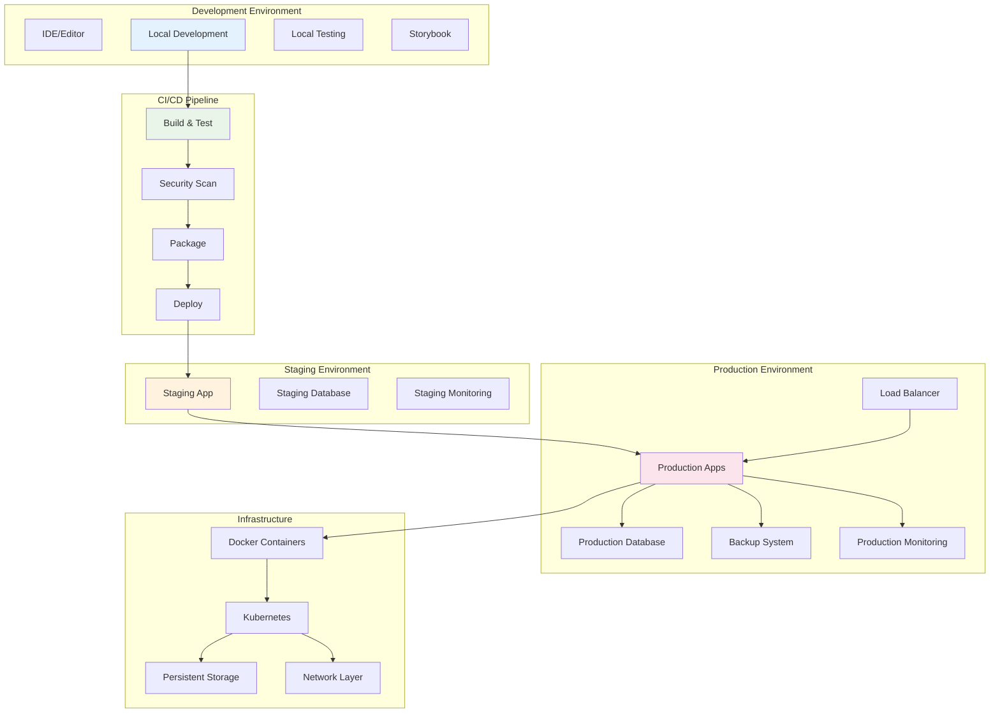

# Deployment Architecture
## AlphanumericMango Project

Version: 1.0.0  
Last Updated: 2025-09-18  
Status: Phase 3 - Documentation Completion

---

## ADR-009: Multi-Environment Deployment Strategy

**Status**: Accepted  
**Decision**: Implement local-first deployment with container orchestration capabilities  
**Context**: Need flexible deployment supporting development, testing, and production environments

---

## 1. Executive Summary

The Deployment Architecture defines comprehensive deployment strategies for the AlphanumericMango voice-controlled terminal system across multiple environments. The architecture emphasizes local development efficiency, automated CI/CD pipelines, and production reliability while maintaining security and observability.

### Key Deployment Principles
- **Local-First Development**: Optimized for developer experience
- **Container-Ready**: Docker containerization for consistency
- **CI/CD Automation**: Automated testing and deployment pipelines
- **Environment Parity**: Consistent behavior across environments
- **Zero-Downtime Deployment**: Rolling updates and health checks
- **Monitoring-Integrated**: Comprehensive observability

---

## 2. Deployment Overview



---

## 3. Local Development Deployment

### 3.1 Development Environment Setup

```bash
#!/bin/bash
# setup-dev-environment.sh

echo "Setting up AlphanumericMango development environment..."

# Check prerequisites
check_prerequisites() {
    echo "Checking prerequisites..."
    
    # Node.js version check
    if ! command -v node &> /dev/null; then
        echo "❌ Node.js not found. Please install Node.js 18+"
        exit 1
    fi
    
    NODE_VERSION=$(node --version | cut -d 'v' -f 2)
    if [[ $(echo "$NODE_VERSION < 18.0.0" | bc -l) -eq 1 ]]; then
        echo "❌ Node.js version $NODE_VERSION is too old. Please upgrade to 18+"
        exit 1
    fi
    echo "✅ Node.js $NODE_VERSION"
    
    # npm version check
    if ! command -v npm &> /dev/null; then
        echo "❌ npm not found"
        exit 1
    fi
    echo "✅ npm $(npm --version)"
    
    # Docker check (optional)
    if command -v docker &> /dev/null; then
        echo "✅ Docker $(docker --version | cut -d ' ' -f 3)"
    else
        echo "⚠️ Docker not found (optional for advanced features)"
    fi
    
    # tmux check
    if ! command -v tmux &> /dev/null; then
        echo "❌ tmux not found. Please install tmux"
        exit 1
    fi
    echo "✅ tmux $(tmux -V)"
}

# Install dependencies
install_dependencies() {
    echo "Installing dependencies..."
    
    # Root dependencies
    npm install
    
    # Electron shell dependencies
    cd electron-shell && npm install && cd ..
    
    # Voice terminal hybrid dependencies
    cd voice-terminal-hybrid && npm install && cd ..
    
    # Voice terminal components dependencies
    cd voice-terminal-components/voice-terminal-components && npm install && cd ../..
    
    echo "✅ Dependencies installed"
}

# Setup environment files
setup_environment() {
    echo "Setting up environment files..."
    
    # Development environment variables
    cat > .env.development << EOF
# Development Environment Configuration
NODE_ENV=development
ELECTRON_DEV=true
VOICE_ENGINE_DEBUG=true
DATABASE_PATH=./data/dev.db
LOG_LEVEL=debug
STORYBOOK_PORT=6006
VITE_DEV_PORT=5173
PLAYWRIGHT_PORT=9323
EOF

    # Local configuration
    cat > config/local.json << EOF
{
  "development": {
    "database": {
      "path": "./data/dev.db",
      "verbose": true
    },
    "voice": {
      "debug": true,
      "mockMode": false
    },
    "terminal": {
      "defaultShell": "$SHELL",
      "tmuxSocketPath": "/tmp/alphanumeric-dev"
    },
    "security": {
      "strictMode": false,
      "auditLevel": "debug"
    }
  }
}
EOF

    echo "✅ Environment files created"
}

# Setup development databases
setup_databases() {
    echo "Setting up development databases..."
    
    mkdir -p data
    mkdir -p logs
    
    # Initialize SQLite database
    if [ ! -f "data/dev.db" ]; then
        echo "Creating development database..."
        npm run db:init:dev
    fi
    
    echo "✅ Databases initialized"
}

# Setup Git hooks
setup_git_hooks() {
    echo "Setting up Git hooks..."
    
    # Pre-commit hook
    cat > .git/hooks/pre-commit << 'EOF'
#!/bin/bash
# Pre-commit hook for AlphanumericMango

echo "Running pre-commit checks..."

# Run linting
npm run lint
if [ $? -ne 0 ]; then
    echo "❌ Linting failed"
    exit 1
fi

# Run type checking
npm run check
if [ $? -ne 0 ]; then
    echo "❌ Type checking failed"
    exit 1
fi

# Run unit tests
npm run test
if [ $? -ne 0 ]; then
    echo "❌ Unit tests failed"
    exit 1
fi

echo "✅ Pre-commit checks passed"
EOF

    chmod +x .git/hooks/pre-commit
    
    echo "✅ Git hooks installed"
}

# Main setup function
main() {
    check_prerequisites
    install_dependencies
    setup_environment
    setup_databases
    setup_git_hooks
    
    echo ""
    echo "🎉 Development environment setup complete!"
    echo ""
    echo "Next steps:"
    echo "1. npm run dev          # Start development servers"
    echo "2. npm run storybook    # Start Storybook"
    echo "3. npm run test:watch   # Start test watcher"
    echo ""
}

main "$@"
```

### 3.2 Development Workflow

```typescript
// scripts/dev-workflow.ts
interface DevWorkflow {
  // Development commands
  dev: {
    start: string;           // "npm run dev"
    storybook: string;       // "npm run storybook"
    test: string;            // "npm run test:watch"
    typecheck: string;       // "npm run check:watch"
  };
  
  // Build commands
  build: {
    development: string;     // "npm run build:dev"
    production: string;      // "npm run build:prod"
    analyze: string;         // "npm run build:analyze"
  };
  
  // Quality assurance
  qa: {
    lint: string;           // "npm run lint"
    format: string;         // "npm run format"
    security: string;       // "npm run security:check"
    performance: string;    // "npm run perf:test"
  };
  
  // Testing
  test: {
    unit: string;           // "npm run test"
    integration: string;    // "npm run test:integration"
    e2e: string;           // "npm run test:e2e"
    visual: string;        // "npm run test:visual"
    accessibility: string; // "npm run test:a11y"
  };
}

class DevWorkflowManager {
  private isRunning: Map<string, boolean> = new Map();
  
  async startDevelopment(): Promise<void> {
    console.log('🚀 Starting development environment...');
    
    // Start concurrent processes
    const processes = [
      this.startProcess('electron-dev', 'npm run dev:electron'),
      this.startProcess('vite-dev', 'npm run dev:vite'),
      this.startProcess('storybook', 'npm run storybook'),
      this.startProcess('type-check', 'npm run check:watch')
    ];
    
    // Wait for all to start
    await Promise.all(processes);
    
    console.log('✅ Development environment ready!');
    this.printDevelopmentInfo();
  }
  
  private async startProcess(name: string, command: string): Promise<void> {
    this.isRunning.set(name, true);
    
    const process = spawn(command, [], {
      shell: true,
      stdio: 'pipe'
    });
    
    process.stdout?.on('data', (data) => {
      console.log(`[${name}] ${data.toString().trim()}`);
    });
    
    process.stderr?.on('data', (data) => {
      console.error(`[${name}] ${data.toString().trim()}`);
    });
    
    process.on('exit', (code) => {
      this.isRunning.set(name, false);
      if (code !== 0) {
        console.error(`❌ Process ${name} exited with code ${code}`);
      }
    });
  }
  
  private printDevelopmentInfo(): void {
    console.log(`
🎯 Development URLs:
   • Electron App:    Starting...
   • Vite Dev Server: http://localhost:5173
   • Storybook:       http://localhost:6006
   • Playwright UI:   http://localhost:9323

📊 Development Tools:
   • Hot Reload:      ✅ Enabled
   • Type Checking:   ✅ Running
   • Auto Format:     ✅ On Save
   • Test Watch:      ⏸️  Run 'npm run test:watch'

🔧 Useful Commands:
   • npm run build        # Build for production
   • npm run test          # Run all tests
   • npm run lint          # Check code quality
   • npm run format        # Format code
    `);
  }
}

export const devWorkflowManager = new DevWorkflowManager();
```

---

## 4. CI/CD Pipeline Architecture

### 4.1 GitHub Actions Pipeline

```yaml
# .github/workflows/ci-cd.yml
name: CI/CD Pipeline

on:
  push:
    branches: [ main, develop ]
  pull_request:
    branches: [ main ]

env:
  NODE_VERSION: '18.x'
  REGISTRY: ghcr.io
  IMAGE_NAME: ${{ github.repository }}

jobs:
  # Code Quality and Security
  quality:
    runs-on: ubuntu-latest
    steps:
      - name: Checkout code
        uses: actions/checkout@v4
      
      - name: Setup Node.js
        uses: actions/setup-node@v4
        with:
          node-version: ${{ env.NODE_VERSION }}
          cache: 'npm'
      
      - name: Install dependencies
        run: |
          npm ci
          cd electron-shell && npm ci && cd ..
          cd voice-terminal-hybrid && npm ci && cd ..
          cd voice-terminal-components/voice-terminal-components && npm ci && cd ../..
      
      - name: Run linting
        run: npm run lint
      
      - name: Run type checking
        run: npm run check
      
      - name: Security audit
        run: npm audit --audit-level moderate
      
      - name: Dependency vulnerability scan
        uses: actions/dependency-review-action@v3
        if: github.event_name == 'pull_request'

  # Unit and Integration Tests
  test:
    runs-on: ${{ matrix.os }}
    needs: quality
    
    strategy:
      matrix:
        os: [ubuntu-latest, macos-latest, windows-latest]
        node-version: ['18.x', '20.x']
    
    steps:
      - name: Checkout code
        uses: actions/checkout@v4
      
      - name: Setup Node.js ${{ matrix.node-version }}
        uses: actions/setup-node@v4
        with:
          node-version: ${{ matrix.node-version }}
          cache: 'npm'
      
      - name: Install system dependencies (Ubuntu)
        if: matrix.os == 'ubuntu-latest'
        run: |
          sudo apt-get update
          sudo apt-get install -y tmux xvfb
      
      - name: Install system dependencies (macOS)
        if: matrix.os == 'macos-latest'
        run: |
          brew install tmux
      
      - name: Install dependencies
        run: |
          npm ci
          cd electron-shell && npm ci && cd ..
          cd voice-terminal-hybrid && npm ci && cd ..
          cd voice-terminal-components/voice-terminal-components && npm ci && cd ../..
      
      - name: Run unit tests
        run: npm run test:coverage
      
      - name: Run integration tests
        run: npm run test:integration
      
      - name: Upload coverage reports
        uses: codecov/codecov-action@v3
        with:
          files: ./coverage/lcov.info
          flags: unittests
          name: codecov-umbrella

  # End-to-End Tests
  e2e:
    runs-on: ubuntu-latest
    needs: quality
    
    steps:
      - name: Checkout code
        uses: actions/checkout@v4
      
      - name: Setup Node.js
        uses: actions/setup-node@v4
        with:
          node-version: ${{ env.NODE_VERSION }}
          cache: 'npm'
      
      - name: Install system dependencies
        run: |
          sudo apt-get update
          sudo apt-get install -y tmux xvfb
      
      - name: Install dependencies
        run: |
          npm ci
          cd electron-shell && npm ci && cd ..
          cd voice-terminal-hybrid && npm ci && cd ..
          cd voice-terminal-components/voice-terminal-components && npm ci && cd ../..
      
      - name: Install Playwright browsers
        run: cd voice-terminal-hybrid && npx playwright install --with-deps
      
      - name: Build application
        run: npm run build
      
      - name: Run E2E tests
        run: xvfb-run --auto-servernum --server-args="-screen 0 1280x960x24" npm run test:e2e
      
      - name: Upload E2E artifacts
        uses: actions/upload-artifact@v3
        if: always()
        with:
          name: playwright-report
          path: voice-terminal-hybrid/playwright-report/
          retention-days: 30

  # Performance Tests
  performance:
    runs-on: ubuntu-latest
    needs: quality
    
    steps:
      - name: Checkout code
        uses: actions/checkout@v4
      
      - name: Setup Node.js
        uses: actions/setup-node@v4
        with:
          node-version: ${{ env.NODE_VERSION }}
          cache: 'npm'
      
      - name: Install dependencies
        run: |
          npm ci
          cd electron-shell && npm ci && cd ..
          cd voice-terminal-hybrid && npm ci && cd ..
      
      - name: Build application
        run: npm run build
      
      - name: Run performance tests
        run: npm run test:performance
      
      - name: Upload performance results
        uses: actions/upload-artifact@v3
        with:
          name: performance-results
          path: performance-results.json

  # Security Scanning
  security:
    runs-on: ubuntu-latest
    needs: quality
    
    steps:
      - name: Checkout code
        uses: actions/checkout@v4
      
      - name: Run Trivy vulnerability scanner
        uses: aquasecurity/trivy-action@master
        with:
          scan-type: 'fs'
          scan-ref: '.'
          format: 'sarif'
          output: 'trivy-results.sarif'
      
      - name: Upload Trivy scan results
        uses: github/codeql-action/upload-sarif@v2
        with:
          sarif_file: 'trivy-results.sarif'

  # Build and Package
  build:
    runs-on: ${{ matrix.os }}
    needs: [test, e2e, performance, security]
    
    strategy:
      matrix:
        os: [ubuntu-latest, macos-latest, windows-latest]
    
    steps:
      - name: Checkout code
        uses: actions/checkout@v4
      
      - name: Setup Node.js
        uses: actions/setup-node@v4
        with:
          node-version: ${{ env.NODE_VERSION }}
          cache: 'npm'
      
      - name: Install dependencies
        run: |
          npm ci
          cd electron-shell && npm ci && cd ..
          cd voice-terminal-hybrid && npm ci && cd ..
          cd voice-terminal-components/voice-terminal-components && npm ci && cd ../..
      
      - name: Build application
        run: npm run build
      
      - name: Package Electron app
        run: npm run package:${{ matrix.os }}
      
      - name: Upload build artifacts
        uses: actions/upload-artifact@v3
        with:
          name: build-${{ matrix.os }}
          path: dist/
          retention-days: 30

  # Container Build (Linux only)
  container:
    runs-on: ubuntu-latest
    needs: build
    if: github.ref == 'refs/heads/main'
    
    steps:
      - name: Checkout code
        uses: actions/checkout@v4
      
      - name: Set up Docker Buildx
        uses: docker/setup-buildx-action@v3
      
      - name: Log in to Container Registry
        uses: docker/login-action@v3
        with:
          registry: ${{ env.REGISTRY }}
          username: ${{ github.actor }}
          password: ${{ secrets.GITHUB_TOKEN }}
      
      - name: Extract metadata
        id: meta
        uses: docker/metadata-action@v5
        with:
          images: ${{ env.REGISTRY }}/${{ env.IMAGE_NAME }}
          tags: |
            type=ref,event=branch
            type=ref,event=pr
            type=sha
      
      - name: Build and push Docker image
        uses: docker/build-push-action@v5
        with:
          context: .
          push: true
          tags: ${{ steps.meta.outputs.tags }}
          labels: ${{ steps.meta.outputs.labels }}
          cache-from: type=gha
          cache-to: type=gha,mode=max

  # Deploy to Staging
  deploy-staging:
    runs-on: ubuntu-latest
    needs: [build, container]
    if: github.ref == 'refs/heads/develop'
    environment: staging
    
    steps:
      - name: Deploy to staging
        run: |
          echo "Deploying to staging environment..."
          # Add staging deployment logic here

  # Deploy to Production
  deploy-production:
    runs-on: ubuntu-latest
    needs: [build, container]
    if: github.ref == 'refs/heads/main'
    environment: production
    
    steps:
      - name: Deploy to production
        run: |
          echo "Deploying to production environment..."
          # Add production deployment logic here
```

### 4.2 Build Optimization

```typescript
// scripts/build-optimizer.ts
interface BuildOptimization {
  // Bundle analysis
  bundleAnalysis: {
    enabled: boolean;
    outputPath: string;
    thresholds: {
      maxBundleSize: number;    // 5MB
      maxChunkSize: number;     // 1MB
      maxAssetSize: number;     // 500KB
    };
  };
  
  // Code splitting
  codeSplitting: {
    chunks: 'all' | 'async' | 'initial';
    maxSize: number;
    minSize: number;
    cacheGroups: Record<string, any>;
  };
  
  // Tree shaking
  treeShaking: {
    enabled: boolean;
    sideEffects: false | string[];
    usedExports: boolean;
  };
  
  // Compression
  compression: {
    gzip: boolean;
    brotli: boolean;
    threshold: number;
  };
}

class BuildOptimizer {
  private config: BuildOptimization;
  
  constructor() {
    this.config = {
      bundleAnalysis: {
        enabled: process.env.ANALYZE === 'true',
        outputPath: './dist/bundle-analysis',
        thresholds: {
          maxBundleSize: 5 * 1024 * 1024,    // 5MB
          maxChunkSize: 1 * 1024 * 1024,     // 1MB
          maxAssetSize: 500 * 1024           // 500KB
        }
      },
      codeSplitting: {
        chunks: 'all',
        maxSize: 1024 * 1024, // 1MB
        minSize: 20 * 1024,   // 20KB
        cacheGroups: {
          vendor: {
            test: /[\\/]node_modules[\\/]/,
            name: 'vendors',
            chunks: 'all'
          },
          common: {
            minChunks: 2,
            chunks: 'all',
            enforce: true
          }
        }
      },
      treeShaking: {
        enabled: true,
        sideEffects: false,
        usedExports: true
      },
      compression: {
        gzip: true,
        brotli: true,
        threshold: 8192 // 8KB
      }
    };
  }
  
  async optimizeBuild(buildPath: string): Promise<BuildOptimizationResult> {
    const startTime = Date.now();
    
    try {
      // Analyze bundle
      const bundleAnalysis = await this.analyzeBundles(buildPath);
      
      // Optimize assets
      const assetOptimization = await this.optimizeAssets(buildPath);
      
      // Generate compression
      const compression = await this.generateCompression(buildPath);
      
      // Validate thresholds
      const validation = this.validateThresholds(bundleAnalysis);
      
      const duration = Date.now() - startTime;
      
      return {
        success: validation.passed,
        duration,
        bundleAnalysis,
        assetOptimization,
        compression,
        validation,
        recommendations: this.generateRecommendations(bundleAnalysis)
      };
      
    } catch (error) {
      return {
        success: false,
        duration: Date.now() - startTime,
        error: error.message
      };
    }
  }
  
  private async analyzeBundles(buildPath: string): Promise<BundleAnalysis> {
    const bundleFiles = await this.findBundleFiles(buildPath);
    const analysis: BundleAnalysis = {
      totalSize: 0,
      bundles: [],
      dependencies: new Map()
    };
    
    for (const file of bundleFiles) {
      const stats = await fs.stat(file);
      const bundleInfo = {
        name: path.basename(file),
        path: file,
        size: stats.size,
        gzipSize: await this.getGzipSize(file),
        brotliSize: await this.getBrotliSize(file)
      };
      
      analysis.bundles.push(bundleInfo);
      analysis.totalSize += stats.size;
    }
    
    return analysis;
  }
  
  private validateThresholds(analysis: BundleAnalysis): ValidationResult {
    const issues: string[] = [];
    
    // Check total bundle size
    if (analysis.totalSize > this.config.bundleAnalysis.thresholds.maxBundleSize) {
      issues.push(`Total bundle size ${this.formatBytes(analysis.totalSize)} exceeds threshold ${this.formatBytes(this.config.bundleAnalysis.thresholds.maxBundleSize)}`);
    }
    
    // Check individual chunk sizes
    for (const bundle of analysis.bundles) {
      if (bundle.size > this.config.bundleAnalysis.thresholds.maxChunkSize) {
        issues.push(`Bundle ${bundle.name} size ${this.formatBytes(bundle.size)} exceeds chunk threshold`);
      }
    }
    
    return {
      passed: issues.length === 0,
      issues,
      score: this.calculateOptimizationScore(analysis)
    };
  }
  
  private generateRecommendations(analysis: BundleAnalysis): string[] {
    const recommendations: string[] = [];
    
    // Large bundle recommendations
    const largeBundles = analysis.bundles.filter(b => 
      b.size > this.config.bundleAnalysis.thresholds.maxChunkSize
    );
    
    if (largeBundles.length > 0) {
      recommendations.push('Consider code splitting for large bundles');
      recommendations.push('Implement dynamic imports for route-based splitting');
    }
    
    // Compression recommendations
    const uncompressedBundles = analysis.bundles.filter(b =>
      b.gzipSize / b.size > 0.8 // Poor compression ratio
    );
    
    if (uncompressedBundles.length > 0) {
      recommendations.push('Some bundles have poor compression - consider optimizing');
    }
    
    // Performance recommendations
    if (analysis.totalSize > 3 * 1024 * 1024) { // 3MB
      recommendations.push('Consider lazy loading for better initial load performance');
    }
    
    return recommendations;
  }
}

export const buildOptimizer = new BuildOptimizer();
```

---

## 5. Container Orchestration

### 5.1 Docker Configuration

```dockerfile
# Dockerfile
FROM node:18-alpine AS base

# Install system dependencies
RUN apk add --no-cache \
    tmux \
    git \
    python3 \
    make \
    g++ \
    && rm -rf /var/cache/apk/*

WORKDIR /app

# Copy package files
COPY package*.json ./
COPY electron-shell/package*.json ./electron-shell/
COPY voice-terminal-hybrid/package*.json ./voice-terminal-hybrid/
COPY voice-terminal-components/voice-terminal-components/package*.json ./voice-terminal-components/voice-terminal-components/

# Install dependencies
FROM base AS dependencies
RUN npm ci --only=production && npm cache clean --force
RUN cd electron-shell && npm ci --only=production && npm cache clean --force
RUN cd voice-terminal-hybrid && npm ci --only=production && npm cache clean --force
RUN cd voice-terminal-components/voice-terminal-components && npm ci --only=production && npm cache clean --force

# Build stage
FROM base AS build
COPY . .
RUN npm ci
RUN cd electron-shell && npm ci
RUN cd voice-terminal-hybrid && npm ci
RUN cd voice-terminal-components/voice-terminal-components && npm ci
RUN npm run build

# Production stage
FROM node:18-alpine AS production

# Install runtime dependencies
RUN apk add --no-cache \
    tmux \
    git \
    dumb-init \
    && rm -rf /var/cache/apk/*

# Create app user
RUN addgroup -g 1001 -S nodejs
RUN adduser -S alphanumeric -u 1001

WORKDIR /app

# Copy built application
COPY --from=build --chown=alphanumeric:nodejs /app/dist ./dist
COPY --from=dependencies --chown=alphanumeric:nodejs /app/node_modules ./node_modules
COPY --from=build --chown=alphanumeric:nodejs /app/package.json ./

# Create data directories
RUN mkdir -p /app/data /app/logs && chown -R alphanumeric:nodejs /app/data /app/logs

# Security settings
RUN chmod -R 755 /app/dist
RUN chmod -R 700 /app/data

USER alphanumeric

# Health check
HEALTHCHECK --interval=30s --timeout=3s --start-period=5s --retries=3 \
    CMD node dist/health-check.js

EXPOSE 3000

# Use dumb-init to handle signals properly
ENTRYPOINT ["dumb-init", "--"]
CMD ["node", "dist/main.js"]
```

### 5.2 Docker Compose Configuration

```yaml
# docker-compose.yml
version: '3.8'

services:
  alphanumeric-app:
    build:
      context: .
      dockerfile: Dockerfile
      target: production
    container_name: alphanumeric-app
    restart: unless-stopped
    ports:
      - "3000:3000"
    environment:
      - NODE_ENV=production
      - DATABASE_PATH=/app/data/production.db
      - LOG_LEVEL=info
      - TMUX_SOCKET_PATH=/tmp/alphanumeric-tmux
    volumes:
      - app-data:/app/data
      - app-logs:/app/logs
      - tmux-sockets:/tmp
    networks:
      - alphanumeric-network
    depends_on:
      - redis
      - monitoring
    healthcheck:
      test: ["CMD", "node", "dist/health-check.js"]
      interval: 30s
      timeout: 10s
      retries: 3
      start_period: 40s
    deploy:
      resources:
        limits:
          cpus: '2.0'
          memory: 1G
        reservations:
          cpus: '0.5'
          memory: 256M

  redis:
    image: redis:7-alpine
    container_name: alphanumeric-redis
    restart: unless-stopped
    ports:
      - "6379:6379"
    volumes:
      - redis-data:/data
    networks:
      - alphanumeric-network
    command: redis-server --appendonly yes --maxmemory 256mb --maxmemory-policy allkeys-lru
    healthcheck:
      test: ["CMD", "redis-cli", "ping"]
      interval: 30s
      timeout: 3s
      retries: 3

  monitoring:
    image: prom/prometheus:latest
    container_name: alphanumeric-monitoring
    restart: unless-stopped
    ports:
      - "9090:9090"
    volumes:
      - ./monitoring/prometheus.yml:/etc/prometheus/prometheus.yml
      - prometheus-data:/prometheus
    networks:
      - alphanumeric-network
    command:
      - '--config.file=/etc/prometheus/prometheus.yml'
      - '--storage.tsdb.path=/prometheus'
      - '--web.console.libraries=/etc/prometheus/console_libraries'
      - '--web.console.templates=/etc/prometheus/consoles'
      - '--web.enable-lifecycle'

  grafana:
    image: grafana/grafana:latest
    container_name: alphanumeric-grafana
    restart: unless-stopped
    ports:
      - "3001:3000"
    volumes:
      - grafana-data:/var/lib/grafana
      - ./monitoring/grafana/dashboards:/etc/grafana/provisioning/dashboards
      - ./monitoring/grafana/datasources:/etc/grafana/provisioning/datasources
    networks:
      - alphanumeric-network
    environment:
      - GF_SECURITY_ADMIN_PASSWORD=admin123
      - GF_USERS_ALLOW_SIGN_UP=false

volumes:
  app-data:
    driver: local
  app-logs:
    driver: local
  redis-data:
    driver: local
  prometheus-data:
    driver: local
  grafana-data:
    driver: local
  tmux-sockets:
    driver: local

networks:
  alphanumeric-network:
    driver: bridge
    ipam:
      config:
        - subnet: 172.20.0.0/16
```

### 5.3 Kubernetes Deployment

```yaml
# k8s/namespace.yaml
apiVersion: v1
kind: Namespace
metadata:
  name: alphanumeric
  labels:
    name: alphanumeric

---
# k8s/deployment.yaml
apiVersion: apps/v1
kind: Deployment
metadata:
  name: alphanumeric-app
  namespace: alphanumeric
  labels:
    app: alphanumeric
    version: v1.0.0
spec:
  replicas: 3
  strategy:
    type: RollingUpdate
    rollingUpdate:
      maxSurge: 1
      maxUnavailable: 0
  selector:
    matchLabels:
      app: alphanumeric
  template:
    metadata:
      labels:
        app: alphanumeric
        version: v1.0.0
    spec:
      serviceAccountName: alphanumeric-service-account
      securityContext:
        runAsNonRoot: true
        runAsUser: 1001
        fsGroup: 1001
      containers:
      - name: alphanumeric
        image: ghcr.io/alphanumeric/alphanumeric-mango:latest
        imagePullPolicy: Always
        ports:
        - containerPort: 3000
          name: http
          protocol: TCP
        env:
        - name: NODE_ENV
          value: "production"
        - name: DATABASE_PATH
          value: "/app/data/production.db"
        - name: LOG_LEVEL
          value: "info"
        - name: REDIS_URL
          value: "redis://alphanumeric-redis:6379"
        resources:
          requests:
            memory: "256Mi"
            cpu: "250m"
          limits:
            memory: "1Gi"
            cpu: "1000m"
        livenessProbe:
          httpGet:
            path: /health
            port: 3000
          initialDelaySeconds: 30
          periodSeconds: 10
          timeoutSeconds: 5
          failureThreshold: 3
        readinessProbe:
          httpGet:
            path: /ready
            port: 3000
          initialDelaySeconds: 5
          periodSeconds: 5
          timeoutSeconds: 3
          failureThreshold: 3
        volumeMounts:
        - name: app-data
          mountPath: /app/data
        - name: app-config
          mountPath: /app/config
          readOnly: true
        - name: tmp
          mountPath: /tmp
      volumes:
      - name: app-data
        persistentVolumeClaim:
          claimName: alphanumeric-data-pvc
      - name: app-config
        configMap:
          name: alphanumeric-config
      - name: tmp
        emptyDir: {}
      nodeSelector:
        kubernetes.io/os: linux
      tolerations:
      - key: "app"
        operator: "Equal"
        value: "alphanumeric"
        effect: "NoSchedule"

---
# k8s/service.yaml
apiVersion: v1
kind: Service
metadata:
  name: alphanumeric-service
  namespace: alphanumeric
  labels:
    app: alphanumeric
spec:
  type: ClusterIP
  ports:
  - port: 80
    targetPort: 3000
    protocol: TCP
    name: http
  selector:
    app: alphanumeric

---
# k8s/ingress.yaml
apiVersion: networking.k8s.io/v1
kind: Ingress
metadata:
  name: alphanumeric-ingress
  namespace: alphanumeric
  annotations:
    kubernetes.io/ingress.class: nginx
    nginx.ingress.kubernetes.io/rewrite-target: /
    nginx.ingress.kubernetes.io/ssl-redirect: "true"
    cert-manager.io/cluster-issuer: letsencrypt-prod
spec:
  tls:
  - hosts:
    - alphanumeric.example.com
    secretName: alphanumeric-tls
  rules:
  - host: alphanumeric.example.com
    http:
      paths:
      - path: /
        pathType: Prefix
        backend:
          service:
            name: alphanumeric-service
            port:
              number: 80

---
# k8s/configmap.yaml
apiVersion: v1
kind: ConfigMap
metadata:
  name: alphanumeric-config
  namespace: alphanumeric
data:
  production.json: |
    {
      "database": {
        "path": "/app/data/production.db",
        "backupInterval": 3600000,
        "maxConnections": 20
      },
      "voice": {
        "enabled": true,
        "timeout": 5000,
        "maxConcurrentSessions": 10
      },
      "terminal": {
        "defaultShell": "/bin/bash",
        "maxSessions": 50,
        "sessionTimeout": 1800000
      },
      "security": {
        "strictMode": true,
        "auditLevel": "info",
        "maxFailedAttempts": 3
      },
      "monitoring": {
        "enabled": true,
        "metricsPort": 9091,
        "healthCheckInterval": 30000
      }
    }

---
# k8s/pvc.yaml
apiVersion: v1
kind: PersistentVolumeClaim
metadata:
  name: alphanumeric-data-pvc
  namespace: alphanumeric
spec:
  accessModes:
    - ReadWriteOnce
  resources:
    requests:
      storage: 10Gi
  storageClassName: fast-ssd

---
# k8s/hpa.yaml
apiVersion: autoscaling/v2
kind: HorizontalPodAutoscaler
metadata:
  name: alphanumeric-hpa
  namespace: alphanumeric
spec:
  scaleTargetRef:
    apiVersion: apps/v1
    kind: Deployment
    name: alphanumeric-app
  minReplicas: 3
  maxReplicas: 10
  metrics:
  - type: Resource
    resource:
      name: cpu
      target:
        type: Utilization
        averageUtilization: 70
  - type: Resource
    resource:
      name: memory
      target:
        type: Utilization
        averageUtilization: 80
  behavior:
    scaleDown:
      stabilizationWindowSeconds: 300
      policies:
      - type: Percent
        value: 10
        periodSeconds: 60
    scaleUp:
      stabilizationWindowSeconds: 60
      policies:
      - type: Percent
        value: 25
        periodSeconds: 60

---
# k8s/service-account.yaml
apiVersion: v1
kind: ServiceAccount
metadata:
  name: alphanumeric-service-account
  namespace: alphanumeric
---
apiVersion: rbac.authorization.k8s.io/v1
kind: Role
metadata:
  namespace: alphanumeric
  name: alphanumeric-role
rules:
- apiGroups: [""]
  resources: ["configmaps", "secrets"]
  verbs: ["get", "list", "watch"]
---
apiVersion: rbac.authorization.k8s.io/v1
kind: RoleBinding
metadata:
  name: alphanumeric-rolebinding
  namespace: alphanumeric
subjects:
- kind: ServiceAccount
  name: alphanumeric-service-account
  namespace: alphanumeric
roleRef:
  kind: Role
  name: alphanumeric-role
  apiGroup: rbac.authorization.k8s.io
```

---

## 6. Environment Configuration Management

### 6.1 Environment-Specific Configurations

```typescript
// config/environment-manager.ts
interface EnvironmentConfig {
  name: string;
  database: DatabaseConfig;
  voice: VoiceConfig;
  terminal: TerminalConfig;
  security: SecurityConfig;
  monitoring: MonitoringConfig;
  logging: LoggingConfig;
}

class EnvironmentManager {
  private configs: Map<string, EnvironmentConfig> = new Map();
  
  constructor() {
    this.loadConfigurations();
  }
  
  private loadConfigurations(): void {
    // Development configuration
    this.configs.set('development', {
      name: 'development',
      database: {
        path: './data/dev.db',
        verbose: true,
        backup: false,
        encryption: false
      },
      voice: {
        debug: true,
        mockMode: true,
        apiTimeout: 10000,
        maxConcurrentSessions: 5
      },
      terminal: {
        defaultShell: process.env.SHELL || '/bin/bash',
        maxSessions: 10,
        sessionTimeout: 3600000, // 1 hour
        tmuxSocketPath: '/tmp/alphanumeric-dev'
      },
      security: {
        strictMode: false,
        auditLevel: 'debug',
        encryption: false,
        maxFailedAttempts: 10
      },
      monitoring: {
        enabled: true,
        verbose: true,
        metricsPort: 9091,
        healthCheckInterval: 10000
      },
      logging: {
        level: 'debug',
        console: true,
        file: true,
        path: './logs/dev.log'
      }
    });
    
    // Staging configuration
    this.configs.set('staging', {
      name: 'staging',
      database: {
        path: './data/staging.db',
        verbose: false,
        backup: true,
        encryption: true,
        backupInterval: 1800000 // 30 minutes
      },
      voice: {
        debug: false,
        mockMode: false,
        apiTimeout: 5000,
        maxConcurrentSessions: 20
      },
      terminal: {
        defaultShell: '/bin/bash',
        maxSessions: 50,
        sessionTimeout: 1800000, // 30 minutes
        tmuxSocketPath: '/tmp/alphanumeric-staging'
      },
      security: {
        strictMode: true,
        auditLevel: 'info',
        encryption: true,
        maxFailedAttempts: 5
      },
      monitoring: {
        enabled: true,
        verbose: false,
        metricsPort: 9091,
        healthCheckInterval: 30000
      },
      logging: {
        level: 'info',
        console: false,
        file: true,
        path: './logs/staging.log'
      }
    });
    
    // Production configuration
    this.configs.set('production', {
      name: 'production',
      database: {
        path: './data/production.db',
        verbose: false,
        backup: true,
        encryption: true,
        backupInterval: 3600000, // 1 hour
        replication: true
      },
      voice: {
        debug: false,
        mockMode: false,
        apiTimeout: 3000,
        maxConcurrentSessions: 100
      },
      terminal: {
        defaultShell: '/bin/bash',
        maxSessions: 200,
        sessionTimeout: 1800000, // 30 minutes
        tmuxSocketPath: '/tmp/alphanumeric-prod'
      },
      security: {
        strictMode: true,
        auditLevel: 'warn',
        encryption: true,
        maxFailedAttempts: 3,
        rateLimiting: true
      },
      monitoring: {
        enabled: true,
        verbose: false,
        metricsPort: 9091,
        healthCheckInterval: 30000,
        alerting: true
      },
      logging: {
        level: 'warn',
        console: false,
        file: true,
        path: './logs/production.log',
        rotation: true
      }
    });
  }
  
  getConfig(environment: string = process.env.NODE_ENV || 'development'): EnvironmentConfig {
    const config = this.configs.get(environment);
    if (!config) {
      throw new Error(`Environment configuration for '${environment}' not found`);
    }
    return config;
  }
  
  validateConfig(config: EnvironmentConfig): ValidationResult {
    const issues: string[] = [];
    
    // Validate database configuration
    if (!config.database.path) {
      issues.push('Database path is required');
    }
    
    // Validate security settings
    if (config.name === 'production' && !config.security.encryption) {
      issues.push('Encryption must be enabled in production');
    }
    
    // Validate monitoring
    if (config.name === 'production' && !config.monitoring.enabled) {
      issues.push('Monitoring must be enabled in production');
    }
    
    return {
      valid: issues.length === 0,
      issues
    };
  }
  
  async applyConfiguration(environment: string): Promise<void> {
    const config = this.getConfig(environment);
    const validation = this.validateConfig(config);
    
    if (!validation.valid) {
      throw new Error(`Invalid configuration: ${validation.issues.join(', ')}`);
    }
    
    // Apply configuration to application services
    await this.configureDatabase(config.database);
    await this.configureVoice(config.voice);
    await this.configureTerminal(config.terminal);
    await this.configureSecurity(config.security);
    await this.configureMonitoring(config.monitoring);
    await this.configureLogging(config.logging);
    
    console.log(`Configuration applied for environment: ${environment}`);
  }
  
  private async configureDatabase(config: DatabaseConfig): Promise<void> {
    // Configure database service
    databaseManager.configure(config);
  }
  
  private async configureVoice(config: VoiceConfig): Promise<void> {
    // Configure voice engine
    voiceEngine.configure(config);
  }
  
  private async configureTerminal(config: TerminalConfig): Promise<void> {
    // Configure terminal controller
    terminalController.configure(config);
  }
  
  private async configureSecurity(config: SecurityConfig): Promise<void> {
    // Configure security services
    securityManager.configure(config);
  }
  
  private async configureMonitoring(config: MonitoringConfig): Promise<void> {
    // Configure monitoring services
    monitoringService.configure(config);
  }
  
  private async configureLogging(config: LoggingConfig): Promise<void> {
    // Configure logging service
    loggingService.configure(config);
  }
}

export const environmentManager = new EnvironmentManager();
```

---

## 7. Monitoring and Logging Deployment

### 7.1 Monitoring Configuration

```yaml
# monitoring/prometheus.yml
global:
  scrape_interval: 15s
  evaluation_interval: 15s

rule_files:
  - "rules/*.yml"

alerting:
  alertmanagers:
    - static_configs:
        - targets:
          - alertmanager:9093

scrape_configs:
  - job_name: 'alphanumeric-app'
    static_configs:
      - targets: ['alphanumeric-app:9091']
    metrics_path: '/metrics'
    scrape_interval: 10s

  - job_name: 'redis'
    static_configs:
      - targets: ['redis:6379']
    metrics_path: '/metrics'

  - job_name: 'node-exporter'
    static_configs:
      - targets: ['node-exporter:9100']

  - job_name: 'cadvisor'
    static_configs:
      - targets: ['cadvisor:8080']
```

```yaml
# monitoring/rules/alerts.yml
groups:
  - name: alphanumeric.rules
    rules:
      - alert: HighCPUUsage
        expr: cpu_usage_percent > 80
        for: 5m
        labels:
          severity: warning
        annotations:
          summary: "High CPU usage detected"
          description: "CPU usage is above 80% for more than 5 minutes"

      - alert: HighMemoryUsage
        expr: memory_usage_percent > 85
        for: 5m
        labels:
          severity: warning
        annotations:
          summary: "High memory usage detected"
          description: "Memory usage is above 85% for more than 5 minutes"

      - alert: VoiceEngineDown
        expr: up{job="alphanumeric-app"} == 0
        for: 1m
        labels:
          severity: critical
        annotations:
          summary: "Voice engine is down"
          description: "Voice engine has been down for more than 1 minute"

      - alert: DatabaseConnectionFailed
        expr: database_connections_failed_total > 10
        for: 2m
        labels:
          severity: critical
        annotations:
          summary: "Database connection failures"
          description: "More than 10 database connection failures in 2 minutes"
```

### 7.2 Logging Infrastructure

```typescript
// logging/structured-logger.ts
interface LogEntry {
  timestamp: string;
  level: LogLevel;
  component: string;
  message: string;
  metadata?: Record<string, any>;
  traceId?: string;
  spanId?: string;
  userId?: string;
  sessionId?: string;
}

type LogLevel = 'debug' | 'info' | 'warn' | 'error' | 'fatal';

class StructuredLogger {
  private config: LoggingConfig;
  private outputs: LogOutput[] = [];
  
  constructor(config: LoggingConfig) {
    this.config = config;
    this.setupOutputs();
  }
  
  private setupOutputs(): void {
    // Console output for development
    if (this.config.console) {
      this.outputs.push(new ConsoleLogOutput());
    }
    
    // File output
    if (this.config.file) {
      this.outputs.push(new FileLogOutput(this.config.path));
    }
    
    // Structured logging for production
    if (process.env.NODE_ENV === 'production') {
      this.outputs.push(new JSONLogOutput());
    }
    
    // External log aggregation
    if (this.config.external) {
      this.outputs.push(new ExternalLogOutput(this.config.external));
    }
  }
  
  debug(component: string, message: string, metadata?: Record<string, any>): void {
    this.log('debug', component, message, metadata);
  }
  
  info(component: string, message: string, metadata?: Record<string, any>): void {
    this.log('info', component, message, metadata);
  }
  
  warn(component: string, message: string, metadata?: Record<string, any>): void {
    this.log('warn', component, message, metadata);
  }
  
  error(component: string, message: string, error?: Error, metadata?: Record<string, any>): void {
    const errorMetadata = error ? {
      ...metadata,
      error: {
        name: error.name,
        message: error.message,
        stack: error.stack
      }
    } : metadata;
    
    this.log('error', component, message, errorMetadata);
  }
  
  fatal(component: string, message: string, error?: Error, metadata?: Record<string, any>): void {
    const errorMetadata = error ? {
      ...metadata,
      error: {
        name: error.name,
        message: error.message,
        stack: error.stack
      }
    } : metadata;
    
    this.log('fatal', component, message, errorMetadata);
    
    // Fatal errors should potentially trigger alerts
    this.triggerAlert(component, message, errorMetadata);
  }
  
  private log(level: LogLevel, component: string, message: string, metadata?: Record<string, any>): void {
    // Check if this log level should be output
    if (!this.shouldLog(level)) {
      return;
    }
    
    const entry: LogEntry = {
      timestamp: new Date().toISOString(),
      level,
      component,
      message,
      metadata,
      traceId: this.getCurrentTraceId(),
      spanId: this.getCurrentSpanId(),
      userId: this.getCurrentUserId(),
      sessionId: this.getCurrentSessionId()
    };
    
    // Output to all configured outputs
    for (const output of this.outputs) {
      output.write(entry);
    }
    
    // Performance monitoring for high-frequency logging
    this.monitorLogPerformance(level, component);
  }
  
  private shouldLog(level: LogLevel): boolean {
    const levels = ['debug', 'info', 'warn', 'error', 'fatal'];
    const configLevel = this.config.level;
    
    return levels.indexOf(level) >= levels.indexOf(configLevel);
  }
  
  private getCurrentTraceId(): string | undefined {
    // Integration with distributed tracing
    return process.env.TRACE_ID;
  }
  
  private getCurrentSpanId(): string | undefined {
    // Integration with distributed tracing
    return process.env.SPAN_ID;
  }
  
  private getCurrentUserId(): string | undefined {
    // Get from current execution context
    return AsyncLocalStorage.getStore()?.userId;
  }
  
  private getCurrentSessionId(): string | undefined {
    // Get from current execution context
    return AsyncLocalStorage.getStore()?.sessionId;
  }
  
  private triggerAlert(component: string, message: string, metadata?: Record<string, any>): void {
    // Trigger alert for fatal errors
    alertManager.triggerAlert({
      severity: 'critical',
      component,
      message,
      metadata,
      timestamp: Date.now()
    });
  }
  
  private monitorLogPerformance(level: LogLevel, component: string): void {
    // Monitor logging performance
    performanceMonitor.incrementCounter('logs_total', {
      level,
      component
    });
  }
}

export const logger = new StructuredLogger(environmentManager.getConfig().logging);
```

---

## 8. Security Deployment Considerations

### 8.1 Security Deployment Checklist

```typescript
// security/deployment-security.ts
interface SecurityDeploymentChecklist {
  network: NetworkSecurityCheck[];
  container: ContainerSecurityCheck[];
  secrets: SecretsManagementCheck[];
  access: AccessControlCheck[];
  monitoring: SecurityMonitoringCheck[];
}

class DeploymentSecurityValidator {
  async validateDeployment(environment: string): Promise<SecurityValidationResult> {
    const checks: SecurityCheck[] = [];
    
    // Network security checks
    checks.push(...await this.validateNetworkSecurity());
    
    // Container security checks
    checks.push(...await this.validateContainerSecurity());
    
    // Secrets management checks
    checks.push(...await this.validateSecretsManagement());
    
    // Access control checks
    checks.push(...await this.validateAccessControl());
    
    // Monitoring checks
    checks.push(...await this.validateSecurityMonitoring());
    
    const failedChecks = checks.filter(check => !check.passed);
    const criticalFailures = failedChecks.filter(check => check.severity === 'critical');
    
    return {
      environment,
      timestamp: Date.now(),
      overall: criticalFailures.length === 0 ? 'pass' : 'fail',
      checks,
      summary: {
        total: checks.length,
        passed: checks.length - failedChecks.length,
        failed: failedChecks.length,
        critical: criticalFailures.length
      },
      recommendations: this.generateSecurityRecommendations(failedChecks)
    };
  }
  
  private async validateNetworkSecurity(): Promise<SecurityCheck[]> {
    const checks: SecurityCheck[] = [];
    
    // HTTPS enforcement
    checks.push({
      name: 'HTTPS Enforcement',
      category: 'network',
      severity: 'critical',
      passed: await this.checkHTTPSEnforcement(),
      description: 'All traffic must use HTTPS',
      remediation: 'Configure TLS certificates and redirect HTTP to HTTPS'
    });
    
    // Network policies
    checks.push({
      name: 'Network Policies',
      category: 'network',
      severity: 'high',
      passed: await this.checkNetworkPolicies(),
      description: 'Kubernetes network policies should be configured',
      remediation: 'Implement network policies to restrict pod-to-pod communication'
    });
    
    // Firewall rules
    checks.push({
      name: 'Firewall Configuration',
      category: 'network',
      severity: 'high',
      passed: await this.checkFirewallRules(),
      description: 'Proper firewall rules should be in place',
      remediation: 'Configure firewall to only allow necessary ports'
    });
    
    return checks;
  }
  
  private async validateContainerSecurity(): Promise<SecurityCheck[]> {
    const checks: SecurityCheck[] = [];
    
    // Non-root user
    checks.push({
      name: 'Non-Root User',
      category: 'container',
      severity: 'critical',
      passed: await this.checkNonRootUser(),
      description: 'Containers should not run as root',
      remediation: 'Configure container to run as non-root user'
    });
    
    // Image scanning
    checks.push({
      name: 'Image Vulnerability Scanning',
      category: 'container',
      severity: 'high',
      passed: await this.checkImageScanning(),
      description: 'Container images should be scanned for vulnerabilities',
      remediation: 'Implement automated image scanning in CI/CD pipeline'
    });
    
    // Resource limits
    checks.push({
      name: 'Resource Limits',
      category: 'container',
      severity: 'medium',
      passed: await this.checkResourceLimits(),
      description: 'Containers should have resource limits configured',
      remediation: 'Set CPU and memory limits for all containers'
    });
    
    return checks;
  }
  
  private async validateSecretsManagement(): Promise<SecurityCheck[]> {
    const checks: SecurityCheck[] = [];
    
    // Kubernetes secrets
    checks.push({
      name: 'Kubernetes Secrets',
      category: 'secrets',
      severity: 'critical',
      passed: await this.checkKubernetesSecrets(),
      description: 'Sensitive data should be stored in Kubernetes secrets',
      remediation: 'Move hardcoded secrets to Kubernetes secret objects'
    });
    
    // Encryption at rest
    checks.push({
      name: 'Secrets Encryption',
      category: 'secrets',
      severity: 'critical',
      passed: await this.checkSecretsEncryption(),
      description: 'Secrets should be encrypted at rest',
      remediation: 'Enable etcd encryption for Kubernetes secrets'
    });
    
    // Secret rotation
    checks.push({
      name: 'Secret Rotation',
      category: 'secrets',
      severity: 'medium',
      passed: await this.checkSecretRotation(),
      description: 'Secrets should be rotated regularly',
      remediation: 'Implement automated secret rotation'
    });
    
    return checks;
  }
  
  private generateSecurityRecommendations(failedChecks: SecurityCheck[]): string[] {
    const recommendations: string[] = [];
    
    const criticalFailures = failedChecks.filter(check => check.severity === 'critical');
    if (criticalFailures.length > 0) {
      recommendations.push('❌ CRITICAL: Address all critical security failures before deployment');
      recommendations.push('🔒 Review security policies and ensure compliance');
    }
    
    const networkIssues = failedChecks.filter(check => check.category === 'network');
    if (networkIssues.length > 0) {
      recommendations.push('🌐 Network security improvements needed');
      recommendations.push('🔥 Configure proper firewall rules and network policies');
    }
    
    const containerIssues = failedChecks.filter(check => check.category === 'container');
    if (containerIssues.length > 0) {
      recommendations.push('📦 Container security hardening required');
      recommendations.push('🛡️ Implement image scanning and runtime security');
    }
    
    const secretsIssues = failedChecks.filter(check => check.category === 'secrets');
    if (secretsIssues.length > 0) {
      recommendations.push('🔐 Secrets management improvements needed');
      recommendations.push('🔄 Implement secret rotation and encryption');
    }
    
    return recommendations;
  }
}

export const deploymentSecurityValidator = new DeploymentSecurityValidator();
```

---

## 9. Performance Monitoring Deployment

### 9.1 Performance Metrics Collection

```typescript
// monitoring/performance-collector.ts
interface PerformanceMetrics {
  // Application metrics
  application: {
    responseTime: Histogram;
    throughput: Counter;
    errorRate: Counter;
    activeUsers: Gauge;
  };
  
  // Voice engine metrics
  voice: {
    processingTime: Histogram;
    recognitionAccuracy: Gauge;
    voiceActivations: Counter;
    concurrentSessions: Gauge;
  };
  
  // Terminal metrics
  terminal: {
    sessionCount: Gauge;
    commandExecutionTime: Histogram;
    terminalResponseTime: Histogram;
    failedCommands: Counter;
  };
  
  // Database metrics
  database: {
    queryTime: Histogram;
    connectionPool: Gauge;
    transactionRate: Counter;
    failedQueries: Counter;
  };
  
  // System metrics
  system: {
    cpuUsage: Gauge;
    memoryUsage: Gauge;
    diskUsage: Gauge;
    networkIO: Counter;
  };
}

class PerformanceCollector {
  private metrics: PerformanceMetrics;
  private registry: PrometheusRegistry;
  
  constructor() {
    this.registry = new PrometheusRegistry();
    this.metrics = this.initializeMetrics();
    this.startCollection();
  }
  
  private initializeMetrics(): PerformanceMetrics {
    return {
      application: {
        responseTime: new Histogram({
          name: 'http_request_duration_seconds',
          help: 'HTTP request duration in seconds',
          labelNames: ['method', 'route', 'status_code'],
          buckets: [0.1, 0.5, 1, 2, 5, 10]
        }),
        throughput: new Counter({
          name: 'http_requests_total',
          help: 'Total number of HTTP requests',
          labelNames: ['method', 'route', 'status_code']
        }),
        errorRate: new Counter({
          name: 'http_errors_total',
          help: 'Total number of HTTP errors',
          labelNames: ['method', 'route', 'error_type']
        }),
        activeUsers: new Gauge({
          name: 'active_users_total',
          help: 'Number of active users'
        })
      },
      voice: {
        processingTime: new Histogram({
          name: 'voice_processing_duration_seconds',
          help: 'Voice processing duration in seconds',
          labelNames: ['operation', 'language'],
          buckets: [0.1, 0.3, 0.5, 1, 2, 5]
        }),
        recognitionAccuracy: new Gauge({
          name: 'voice_recognition_accuracy',
          help: 'Voice recognition accuracy percentage',
          labelNames: ['language', 'user_id']
        }),
        voiceActivations: new Counter({
          name: 'voice_activations_total',
          help: 'Total number of voice activations',
          labelNames: ['trigger_type', 'user_id']
        }),
        concurrentSessions: new Gauge({
          name: 'voice_concurrent_sessions',
          help: 'Number of concurrent voice sessions'
        })
      },
      terminal: {
        sessionCount: new Gauge({
          name: 'terminal_sessions_active',
          help: 'Number of active terminal sessions',
          labelNames: ['project_id', 'user_id']
        }),
        commandExecutionTime: new Histogram({
          name: 'terminal_command_duration_seconds',
          help: 'Terminal command execution duration',
          labelNames: ['command_type', 'project_id'],
          buckets: [0.01, 0.05, 0.1, 0.5, 1, 5, 10]
        }),
        terminalResponseTime: new Histogram({
          name: 'terminal_response_duration_seconds',
          help: 'Terminal response time',
          labelNames: ['session_id'],
          buckets: [0.01, 0.05, 0.1, 0.3, 0.5, 1]
        }),
        failedCommands: new Counter({
          name: 'terminal_failed_commands_total',
          help: 'Total number of failed terminal commands',
          labelNames: ['command_type', 'error_type']
        })
      },
      database: {
        queryTime: new Histogram({
          name: 'database_query_duration_seconds',
          help: 'Database query duration',
          labelNames: ['query_type', 'table'],
          buckets: [0.001, 0.005, 0.01, 0.05, 0.1, 0.5, 1]
        }),
        connectionPool: new Gauge({
          name: 'database_connection_pool_size',
          help: 'Database connection pool size',
          labelNames: ['state'] // 'active', 'idle', 'waiting'
        }),
        transactionRate: new Counter({
          name: 'database_transactions_total',
          help: 'Total number of database transactions',
          labelNames: ['type', 'status']
        }),
        failedQueries: new Counter({
          name: 'database_failed_queries_total',
          help: 'Total number of failed database queries',
          labelNames: ['error_type', 'table']
        })
      },
      system: {
        cpuUsage: new Gauge({
          name: 'system_cpu_usage_percent',
          help: 'System CPU usage percentage'
        }),
        memoryUsage: new Gauge({
          name: 'system_memory_usage_bytes',
          help: 'System memory usage in bytes',
          labelNames: ['type'] // 'used', 'free', 'cached'
        }),
        diskUsage: new Gauge({
          name: 'system_disk_usage_bytes',
          help: 'System disk usage in bytes',
          labelNames: ['mount_point', 'type'] // 'used', 'free'
        }),
        networkIO: new Counter({
          name: 'system_network_io_bytes_total',
          help: 'Total network I/O in bytes',
          labelNames: ['direction', 'interface'] // 'in', 'out'
        })
      }
    };
  }
  
  private startCollection(): void {
    // Start system metrics collection
    setInterval(() => {
      this.collectSystemMetrics();
    }, 10000); // Every 10 seconds
    
    // Start application metrics collection
    setInterval(() => {
      this.collectApplicationMetrics();
    }, 5000); // Every 5 seconds
  }
  
  private async collectSystemMetrics(): Promise<void> {
    // CPU usage
    const cpuUsage = await this.getCPUUsage();
    this.metrics.system.cpuUsage.set(cpuUsage);
    
    // Memory usage
    const memoryStats = await this.getMemoryStats();
    this.metrics.system.memoryUsage.set({ type: 'used' }, memoryStats.used);
    this.metrics.system.memoryUsage.set({ type: 'free' }, memoryStats.free);
    this.metrics.system.memoryUsage.set({ type: 'cached' }, memoryStats.cached);
    
    // Disk usage
    const diskStats = await this.getDiskStats();
    for (const [mountPoint, stats] of diskStats) {
      this.metrics.system.diskUsage.set({ mount_point: mountPoint, type: 'used' }, stats.used);
      this.metrics.system.diskUsage.set({ mount_point: mountPoint, type: 'free' }, stats.free);
    }
  }
  
  private async collectApplicationMetrics(): Promise<void> {
    // Active users
    const activeUsers = await this.getActiveUserCount();
    this.metrics.application.activeUsers.set(activeUsers);
    
    // Voice sessions
    const voiceSessions = await this.getVoiceSessionCount();
    this.metrics.voice.concurrentSessions.set(voiceSessions);
    
    // Terminal sessions
    const terminalSessionsByProject = await this.getTerminalSessionsByProject();
    for (const [projectId, count] of terminalSessionsByProject) {
      this.metrics.terminal.sessionCount.set({ project_id: projectId }, count);
    }
    
    // Database connection pool
    const poolStats = await this.getDatabasePoolStats();
    this.metrics.database.connectionPool.set({ state: 'active' }, poolStats.active);
    this.metrics.database.connectionPool.set({ state: 'idle' }, poolStats.idle);
    this.metrics.database.connectionPool.set({ state: 'waiting' }, poolStats.waiting);
  }
  
  getMetricsEndpoint(): string {
    return this.registry.metrics();
  }
  
  // Performance tracking methods
  trackVoiceProcessing(operation: string, language: string, duration: number): void {
    this.metrics.voice.processingTime.observe({ operation, language }, duration);
  }
  
  trackTerminalCommand(commandType: string, projectId: string, duration: number): void {
    this.metrics.terminal.commandExecutionTime.observe({ command_type: commandType, project_id: projectId }, duration);
  }
  
  trackDatabaseQuery(queryType: string, table: string, duration: number): void {
    this.metrics.database.queryTime.observe({ query_type: queryType, table }, duration);
  }
  
  incrementVoiceActivation(triggerType: string, userId: string): void {
    this.metrics.voice.voiceActivations.inc({ trigger_type: triggerType, user_id: userId });
  }
  
  incrementHTTPRequest(method: string, route: string, statusCode: string): void {
    this.metrics.application.throughput.inc({ method, route, status_code: statusCode });
  }
  
  observeHTTPDuration(method: string, route: string, statusCode: string, duration: number): void {
    this.metrics.application.responseTime.observe({ method, route, status_code: statusCode }, duration);
  }
}

export const performanceCollector = new PerformanceCollector();
```

---

## 10. Implementation Timeline

### Phase 3.1: Development Environment (Week 3, Days 1-2)
- Set up local development workflow
- Configure development environment automation
- Implement development monitoring

### Phase 3.2: CI/CD Pipeline (Week 3, Days 3-4)
- Implement GitHub Actions pipeline
- Set up automated testing and security scanning
- Configure build optimization

### Phase 3.3: Production Deployment (Week 3, Days 5-7)
- Configure container orchestration
- Set up monitoring and logging infrastructure
- Implement security validation and deployment automation

---

## 11. Security Considerations

### 11.1 Deployment Security
- **Container Security**: Non-root users, image scanning, resource limits
- **Network Security**: TLS encryption, network policies, firewall rules
- **Secrets Management**: Kubernetes secrets, encryption at rest, rotation
- **Access Control**: RBAC, service accounts, least privilege
- **Monitoring**: Security event logging, alert management

### 11.2 Security Metrics
- Image scan time: <2 minutes
- Security validation time: <30 seconds
- Secret rotation frequency: Weekly
- Security alert response time: <5 minutes

---

## Document History
- v1.0.0 (2025-09-18): Initial deployment architecture documentation