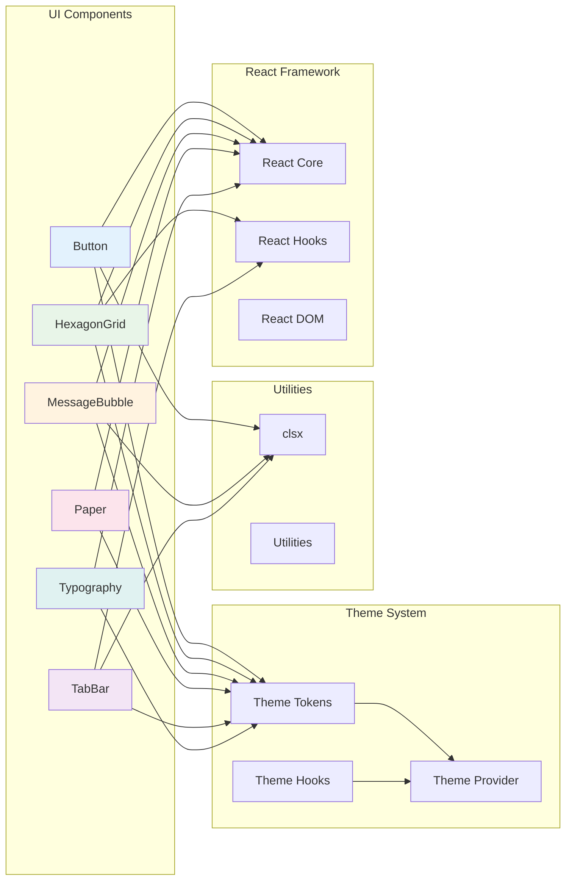

# Module Dependencies Architecture
## AlphanumericMango Project

Version: 1.0.0  
Last Updated: 2025-09-18  
Status: Phase 3 - Documentation Completion

---

## ADR-008: Modular Architecture with Dependency Isolation

**Status**: Accepted  
**Decision**: Implement modular architecture with clear dependency boundaries and isolation  
**Context**: Need maintainable, testable, and scalable module system for voice-controlled terminal

---

## 1. Executive Summary

The Module Dependencies Architecture defines the complete dependency structure, boundaries, and relationships within the AlphanumericMango voice-controlled terminal system. The architecture emphasizes loose coupling, clear separation of concerns, and maintainable dependency injection patterns.

### Key Architectural Principles
- **Dependency Inversion**: High-level modules don't depend on low-level modules
- **Single Responsibility**: Each module has one clear purpose
- **Interface Segregation**: Modules depend only on interfaces they use
- **Dependency Injection**: Dependencies injected rather than hard-coded
- **Circular Dependency Prevention**: No circular references between modules

---

## 2. Module Architecture Overview

```mermaid
graph TB
    subgraph "Application Layer"
        MAIN[electron-shell]
        UI[voice-terminal-hybrid]
        COMP[voice-terminal-components]
    end
    
    subgraph "Service Layer"
        VOICE[voice-engine]
        TERMINAL[tmux-controller]
        AI[ai-integration]
        NOTIF[notification-service]
    end
    
    subgraph "Infrastructure Layer"
        STREAM[stream-processor]
        CACHE[cache-manager]
        PERF[performance-monitor]
        POOL[connection-pool]
        CIRCUIT[circuit-breaker]
        BACKPRESS[backpressure-manager]
    end
    
    subgraph "Data Layer"
        DB[database-manager]
        KG[knowledge-graph]
        ENCRYPT[encryption-service]
        SYNC[sync-engine]
    end
    
    subgraph "Security Layer"
        AUTH[authentication]
        RBAC[rbac-manager]
        AUDIT[audit-logger]
        VALIDATE[input-validator]
    end
    
    subgraph "External Dependencies"
        ELECTRON[Electron 28.x]
        SVELTE[SvelteKit 2.0]
        SQLITE[SQLite]
        TMUX[tmux]
        NODE[Node.js]
    end
    
    MAIN --> VOICE
    MAIN --> TERMINAL
    MAIN --> AUTH
    MAIN --> DB
    
    UI --> COMP
    UI --> STREAM
    UI --> CACHE
    UI --> PERF
    
    VOICE --> STREAM
    VOICE --> CACHE
    VOICE --> CIRCUIT
    VOICE --> PERF
    
    TERMINAL --> POOL
    TERMINAL --> CIRCUIT
    TERMINAL --> BACKPRESS
    
    AI --> CACHE
    AI --> ENCRYPT
    AI --> KG
    
    DB --> ENCRYPT
    DB --> SYNC
    DB --> AUDIT
    
    MAIN --> ELECTRON
    UI --> SVELTE
    DB --> SQLITE
    TERMINAL --> TMUX
    
    style MAIN fill:#e1f5fe
    style UI fill:#e8f5e8
    style VOICE fill:#fff3e0
    style DB fill:#fce4ec
    style AUTH fill:#f3e5f5
```



---

## 3. Core Module Dependencies

### 3.1 Electron Shell Dependencies

```typescript
// electron-shell/src/main/index.ts
interface ElectronShellDependencies {
  // Core Electron APIs
  electron: {
    app: typeof import('electron').app;
    BrowserWindow: typeof import('electron').BrowserWindow;
    ipcMain: typeof import('electron').ipcMain;
    Menu: typeof import('electron').Menu;
    dialog: typeof import('electron').dialog;
  };
  
  // Node.js Standard Library
  node: {
    path: typeof import('path');
    childProcess: typeof import('child_process');
    fs: typeof import('fs');
    os: typeof import('os');
  };
  
  // Internal Services
  services: {
    voiceEngine: VoiceEngineService;
    terminalController: TerminalControllerService;
    authenticationManager: AuthenticationManager;
    databaseManager: DatabaseManager;
    notificationService: NotificationService;
  };
  
  // Security Components
  security: {
    inputValidator: InputValidator;
    auditLogger: AuditLogger;
    rbacManager: RBACManager;
  };
  
  // Infrastructure
  infrastructure: {
    performanceMonitor: PerformanceMonitor;
    circuitBreakerManager: CircuitBreakerManager;
    connectionPool: ConnectionPool;
  };
}

// Dependency Injection Container
class ElectronShellContainer {
  private dependencies: Map<string, any> = new Map();
  
  register<T>(token: string, implementation: T): void {
    this.dependencies.set(token, implementation);
  }
  
  resolve<T>(token: string): T {
    const dependency = this.dependencies.get(token);
    if (!dependency) {
      throw new Error(`Dependency ${token} not found`);
    }
    return dependency;
  }
  
  initialize(): ElectronShellDependencies {
    return {
      electron: {
        app: require('electron').app,
        BrowserWindow: require('electron').BrowserWindow,
        ipcMain: require('electron').ipcMain,
        Menu: require('electron').Menu,
        dialog: require('electron').dialog
      },
      node: {
        path: require('path'),
        childProcess: require('child_process'),
        fs: require('fs'),
        os: require('os')
      },
      services: {
        voiceEngine: this.resolve('voiceEngine'),
        terminalController: this.resolve('terminalController'),
        authenticationManager: this.resolve('authenticationManager'),
        databaseManager: this.resolve('databaseManager'),
        notificationService: this.resolve('notificationService')
      },
      security: {
        inputValidator: this.resolve('inputValidator'),
        auditLogger: this.resolve('auditLogger'),
        rbacManager: this.resolve('rbacManager')
      },
      infrastructure: {
        performanceMonitor: this.resolve('performanceMonitor'),
        circuitBreakerManager: this.resolve('circuitBreakerManager'),
        connectionPool: this.resolve('connectionPool')
      }
    };
  }
}

export const electronShellContainer = new ElectronShellContainer();
```

### 3.2 Voice Terminal Hybrid Dependencies

```typescript
// voice-terminal-hybrid/src/lib/dependencies.ts
interface VoiceTerminalDependencies {
  // SvelteKit Framework
  svelteKit: {
    stores: typeof import('svelte/store');
    page: typeof import('$app/stores').page;
    browser: typeof import('$app/environment').browser;
    goto: typeof import('$app/navigation').goto;
  };
  
  // UI Components
  components: {
    voiceTerminalComponents: typeof import('@voice-terminal/components');
    flowbite: typeof import('flowbite-svelte');
  };
  
  // State Management
  stores: {
    themeStore: ThemeStore;
    layoutStore: LayoutStore;
    voiceNavigationStore: VoiceNavigationStore;
  };
  
  // Services
  services: {
    aiConversation: AIConversationService;
    voiceRecognition: VoiceRecognitionService;
    textToSpeech: TextToSpeechService;
    fileWatcher: FileWatcherService;
  };
  
  // Utilities
  utils: {
    themeValidator: ThemeValidator;
    cssVariableGenerator: CSSVariableGenerator;
    themeUtils: ThemeUtils;
  };
  
  // Testing Framework
  testing: {
    vitest: typeof import('vitest');
    playwright: typeof import('@playwright/test');
    testingLibrary: typeof import('@testing-library/svelte');
    storybook: typeof import('@storybook/svelte');
  };
}

class VoiceTerminalContainer {
  private static instance: VoiceTerminalContainer;
  private dependencies: Map<string, any> = new Map();
  
  static getInstance(): VoiceTerminalContainer {
    if (!VoiceTerminalContainer.instance) {
      VoiceTerminalContainer.instance = new VoiceTerminalContainer();
    }
    return VoiceTerminalContainer.instance;
  }
  
  registerService<T>(token: string, factory: () => T): void {
    this.dependencies.set(token, factory);
  }
  
  getService<T>(token: string): T {
    const factory = this.dependencies.get(token);
    if (!factory) {
      throw new Error(`Service ${token} not registered`);
    }
    return factory();
  }
  
  initializeServices(): void {
    // Register core services
    this.registerService('themeStore', () => new ThemeStore());
    this.registerService('layoutStore', () => new LayoutStore());
    this.registerService('voiceNavigationStore', () => new VoiceNavigationStore());
    
    // Register business services
    this.registerService('aiConversation', () => new AIConversationService());
    this.registerService('voiceRecognition', () => new VoiceRecognitionService());
    this.registerService('textToSpeech', () => new TextToSpeechService());
    
    // Register utilities
    this.registerService('themeValidator', () => new ThemeValidator());
    this.registerService('cssVariableGenerator', () => new CSSVariableGenerator());
  }
}

export const voiceTerminalContainer = VoiceTerminalContainer.getInstance();
```

---

## 4. Service Layer Dependencies

### 4.1 Voice Engine Dependencies

```typescript
// modules/voice-engine/dependencies.ts
interface VoiceEngineDependencies {
  // Core Voice Processing
  core: {
    audioContext: AudioContext;
    speechRecognition: SpeechRecognition;
    speechSynthesis: SpeechSynthesis;
  };
  
  // Infrastructure Services
  infrastructure: {
    streamProcessor: StreamProcessor;
    cacheManager: CacheManager;
    circuitBreaker: CircuitBreakerManager;
    performanceMonitor: PerformanceMonitor;
    backpressureManager: BackpressureManager;
  };
  
  // Security Components
  security: {
    inputValidator: InputValidator;
    encryptionService: EncryptionService;
    auditLogger: AuditLogger;
  };
  
  // External APIs
  external: {
    claudeAPI?: ClaudeAPIClient;
    openAIAPI?: OpenAIAPIClient;
    googleSpeechAPI?: GoogleSpeechAPIClient;
  };
}

class VoiceEngineService {
  constructor(private dependencies: VoiceEngineDependencies) {}
  
  async initialize(): Promise<void> {
    // Initialize voice processing pipeline
    await this.setupAudioProcessing();
    await this.setupSpeechRecognition();
    await this.setupSpeechSynthesis();
    
    // Initialize infrastructure
    this.dependencies.infrastructure.circuitBreaker.register('voice-processing');
    this.dependencies.infrastructure.performanceMonitor.startMonitoring('voice-engine');
  }
  
  private async setupAudioProcessing(): Promise<void> {
    const streamProcessor = this.dependencies.infrastructure.streamProcessor;
    
    // Configure audio input stream
    const audioStream = await navigator.mediaDevices.getUserMedia({ audio: true });
    streamProcessor.registerStream('audio-input', audioStream);
    
    // Set up noise reduction pipeline
    const noiseReductionPipeline = streamProcessor.createPipeline([
      'noise-gate',
      'high-pass-filter',
      'compressor'
    ]);
    
    streamProcessor.connectPipeline('audio-input', noiseReductionPipeline);
  }
}

export { VoiceEngineService, type VoiceEngineDependencies };
```

### 4.2 Terminal Controller Dependencies

```typescript
// modules/tmux-controller/dependencies.ts
interface TerminalControllerDependencies {
  // Node.js APIs
  node: {
    childProcess: typeof import('child_process');
    pty: typeof import('node-pty');
    path: typeof import('path');
    fs: typeof import('fs');
  };
  
  // Infrastructure Services
  infrastructure: {
    connectionPool: ConnectionPool;
    circuitBreaker: CircuitBreakerManager;
    backpressureManager: BackpressureManager;
    performanceMonitor: PerformanceMonitor;
  };
  
  // Security Components
  security: {
    inputValidator: InputValidator;
    rbacManager: RBACManager;
    auditLogger: AuditLogger;
    commandSafetyEngine: CommandSafetyEngine;
  };
  
  // Data Services
  data: {
    sessionManager: SessionManager;
    commandHistory: CommandHistoryService;
    projectManager: ProjectManager;
  };
}

class TerminalControllerService {
  private tmuxSessions: Map<string, TmuxSession> = new Map();
  
  constructor(private dependencies: TerminalControllerDependencies) {}
  
  async createSession(sessionConfig: SessionConfig): Promise<string> {
    // Validate session configuration
    await this.dependencies.security.inputValidator.validateSessionConfig(sessionConfig);
    
    // Check permissions
    const hasPermission = await this.dependencies.security.rbacManager.checkPermission(
      sessionConfig.userId,
      'terminal:create',
      sessionConfig.projectId
    );
    
    if (!hasPermission) {
      throw new SecurityError('Insufficient permissions to create terminal session');
    }
    
    // Create tmux session with circuit breaker
    const sessionId = await this.dependencies.infrastructure.circuitBreaker.execute(
      'tmux-session-create',
      () => this.createTmuxSession(sessionConfig)
    );
    
    // Log audit trail
    this.dependencies.security.auditLogger.logTerminalEvent({
      type: 'session_created',
      sessionId,
      userId: sessionConfig.userId,
      projectId: sessionConfig.projectId
    });
    
    return sessionId;
  }
  
  private async createTmuxSession(config: SessionConfig): Promise<string> {
    const sessionId = this.generateSessionId();
    
    // Get connection from pool
    const connection = await this.dependencies.infrastructure.connectionPool.acquire('tmux');
    
    try {
      // Spawn tmux session
      const tmuxProcess = this.dependencies.node.childProcess.spawn('tmux', [
        'new-session',
        '-d',
        '-s',
        sessionId,
        '-c',
        config.workingDirectory
      ]);
      
      // Create session wrapper
      const session = new TmuxSession({
        id: sessionId,
        process: tmuxProcess,
        config,
        dependencies: this.dependencies
      });
      
      this.tmuxSessions.set(sessionId, session);
      
      return sessionId;
      
    } finally {
      this.dependencies.infrastructure.connectionPool.release('tmux', connection);
    }
  }
}

export { TerminalControllerService, type TerminalControllerDependencies };
```

---

## 5. Component Dependency Graph

### 5.1 Voice Terminal Components

```typescript
// voice-terminal-components/src/dependencies.ts
interface ComponentDependencies {
  // React Framework
  react: {
    React: typeof import('react');
    ReactDOM: typeof import('react-dom');
    hooks: {
      useState: typeof import('react').useState;
      useEffect: typeof import('react').useEffect;
      useCallback: typeof import('react').useCallback;
      useMemo: typeof import('react').useMemo;
    };
  };
  
  // Utility Libraries
  utilities: {
    clsx: typeof import('clsx');
  };
  
  // Theme System
  theme: {
    tokens: ThemeTokens;
    provider: ThemeProvider;
    hooks: ThemeHooks;
  };
  
  // Testing Framework
  testing: {
    vitest: typeof import('vitest');
    testingLibrary: typeof import('@testing-library/react');
    storybook: typeof import('@storybook/react');
  };
}

// Component Dependency Map
const componentDependencyMap: Record<string, string[]> = {
  'Button': ['theme.tokens', 'utilities.clsx', 'react.React'],
  'HexagonGrid': ['theme.tokens', 'react.hooks.useState', 'react.hooks.useEffect'],
  'MessageBubble': ['theme.tokens', 'utilities.clsx', 'react.React'],
  'Paper': ['theme.tokens', 'react.React'],
  'TabBar': ['theme.tokens', 'react.hooks.useState', 'utilities.clsx'],
  'Typography': ['theme.tokens', 'react.React']
};

// Dependency validation
export function validateComponentDependencies(componentName: string): void {
  const dependencies = componentDependencyMap[componentName];
  if (!dependencies) {
    throw new Error(`Component ${componentName} not found in dependency map`);
  }
  
  for (const dependency of dependencies) {
    if (!isDepende
    ncyAvailable(dependency)) {
      throw new Error(`Dependency ${dependency} not available for component ${componentName}`);
    }
  }
}

function isDependencyAvailable(dependency: string): boolean {
  const [module, ...path] = dependency.split('.');
  
  try {
    let current = require(module);
    for (const segment of path) {
      current = current[segment];
    }
    return current !== undefined;
  } catch {
    return false;
  }
}
```

### 5.2 Cross-Component Dependencies



---

## 6. Service Interdependencies

### 6.1 Service Dependency Matrix

| Service | Voice Engine | Terminal Controller | AI Integration | Database Manager | Auth Manager |
|---------|-------------|-------------------|----------------|------------------|--------------|
| **Voice Engine** | - | Uses | Uses | Uses | Uses |
| **Terminal Controller** | Used by | - | Uses | Uses | Uses |
| **AI Integration** | Used by | Used by | - | Uses | Uses |
| **Database Manager** | Used by | Used by | Used by | - | Uses |
| **Authentication** | Used by | Used by | Used by | Used by | - |

### 6.2 Service Communication Patterns

```typescript
// Service communication interfaces
interface ServiceCommunication {
  // Synchronous calls
  sync: {
    validation: InputValidator;
    authorization: RBACManager;
    encryption: EncryptionService;
  };
  
  // Asynchronous messaging
  async: {
    eventBus: EventBus;
    messageQueue: MessageQueue;
    notifications: NotificationService;
  };
  
  // Streaming data
  streams: {
    audioStream: AudioStream;
    terminalOutput: TerminalOutputStream;
    aiResponseStream: AIResponseStream;
  };
}

class ServiceOrchestrator {
  private services: Map<string, Service> = new Map();
  private communicationLayer: ServiceCommunication;
  
  constructor() {
    this.communicationLayer = this.initializeCommunication();
  }
  
  registerService(name: string, service: Service): void {
    // Validate service dependencies
    this.validateServiceDependencies(service);
    
    // Register service
    this.services.set(name, service);
    
    // Set up service communication
    service.setCommunication(this.communicationLayer);
    
    // Initialize service
    service.initialize();
  }
  
  private validateServiceDependencies(service: Service): void {
    const requiredDependencies = service.getRequiredDependencies();
    
    for (const dependency of requiredDependencies) {
      if (!this.services.has(dependency)) {
        throw new Error(`Service dependency ${dependency} not available`);
      }
    }
  }
  
  async startServices(): Promise<void> {
    // Topological sort for dependency order
    const sortedServices = this.topologicalSort();
    
    // Start services in dependency order
    for (const serviceName of sortedServices) {
      const service = this.services.get(serviceName);
      await service?.start();
    }
  }
  
  private topologicalSort(): string[] {
    const visited = new Set<string>();
    const visiting = new Set<string>();
    const sorted: string[] = [];
    
    const visit = (serviceName: string) => {
      if (visiting.has(serviceName)) {
        throw new Error(`Circular dependency detected: ${serviceName}`);
      }
      
      if (visited.has(serviceName)) {
        return;
      }
      
      visiting.add(serviceName);
      
      const service = this.services.get(serviceName);
      const dependencies = service?.getRequiredDependencies() || [];
      
      for (const dependency of dependencies) {
        visit(dependency);
      }
      
      visiting.delete(serviceName);
      visited.add(serviceName);
      sorted.push(serviceName);
    };
    
    for (const serviceName of this.services.keys()) {
      visit(serviceName);
    }
    
    return sorted;
  }
}

export const serviceOrchestrator = new ServiceOrchestrator();
```

---

## 7. External Library Dependencies

### 7.1 Runtime Dependencies

```typescript
interface ExternalDependencies {
  // Electron Framework
  electron: {
    version: '28.1.0';
    apis: ['app', 'BrowserWindow', 'ipcMain', 'Menu', 'dialog'];
    security: {
      contextIsolation: true;
      nodeIntegration: false;
      webSecurity: true;
    };
  };
  
  // Node.js Runtime
  nodejs: {
    version: '>=18.0.0';
    modules: ['fs', 'path', 'child_process', 'crypto', 'stream'];
    native: ['node-pty'];
  };
  
  // SvelteKit Framework
  sveltekit: {
    version: '2.0.0';
    features: ['SSR', 'routing', 'stores', 'actions'];
    adapters: ['auto'];
  };
  
  // UI Libraries
  ui: {
    flowbite: '0.44.0';
    components: '@voice-terminal/components@0.1.0';
  };
  
  // Database
  database: {
    sqlite: 'built-in';
    encryption: 'crypto.subtle';
  };
  
  // Voice Processing
  voice: {
    webAudioAPI: 'built-in';
    speechRecognition: 'built-in';
    speechSynthesis: 'built-in';
  };
}

// Dependency health check
class DependencyHealthChecker {
  async checkDependencies(): Promise<DependencyHealthReport> {
    const report: DependencyHealthReport = {
      timestamp: Date.now(),
      overall: 'healthy',
      dependencies: []
    };
    
    // Check Electron
    const electronHealth = await this.checkElectron();
    report.dependencies.push(electronHealth);
    
    // Check Node.js modules
    const nodeHealth = await this.checkNodeModules();
    report.dependencies.push(nodeHealth);
    
    // Check SvelteKit
    const svelteHealth = await this.checkSvelteKit();
    report.dependencies.push(svelteHealth);
    
    // Check voice APIs
    const voiceHealth = await this.checkVoiceAPIs();
    report.dependencies.push(voiceHealth);
    
    // Determine overall health
    report.overall = report.dependencies.every(d => d.status === 'healthy') 
      ? 'healthy' 
      : 'unhealthy';
    
    return report;
  }
  
  private async checkElectron(): Promise<DependencyHealth> {
    try {
      const { app } = require('electron');
      return {
        name: 'electron',
        version: process.versions.electron,
        status: 'healthy',
        lastCheck: Date.now()
      };
    } catch (error) {
      return {
        name: 'electron',
        version: 'unknown',
        status: 'unhealthy',
        error: error.message,
        lastCheck: Date.now()
      };
    }
  }
  
  private async checkVoiceAPIs(): Promise<DependencyHealth> {
    const checks = {
      webAudio: typeof AudioContext !== 'undefined',
      speechRecognition: 'webkitSpeechRecognition' in window || 'SpeechRecognition' in window,
      speechSynthesis: 'speechSynthesis' in window
    };
    
    const allHealthy = Object.values(checks).every(Boolean);
    
    return {
      name: 'voice-apis',
      version: 'browser-native',
      status: allHealthy ? 'healthy' : 'unhealthy',
      details: checks,
      lastCheck: Date.now()
    };
  }
}

export const dependencyHealthChecker = new DependencyHealthChecker();
```

---

## 8. Circular Dependency Prevention

### 8.1 Dependency Analysis Tools

```typescript
class CircularDependencyDetector {
  private dependencies: Map<string, Set<string>> = new Map();
  
  addDependency(module: string, dependency: string): void {
    if (!this.dependencies.has(module)) {
      this.dependencies.set(module, new Set());
    }
    this.dependencies.get(module)!.add(dependency);
  }
  
  detectCircularDependencies(): CircularDependency[] {
    const cycles: CircularDependency[] = [];
    const visited = new Set<string>();
    const visiting = new Set<string>();
    
    for (const module of this.dependencies.keys()) {
      if (!visited.has(module)) {
        const cycle = this.dfs(module, visited, visiting, []);
        if (cycle) {
          cycles.push(cycle);
        }
      }
    }
    
    return cycles;
  }
  
  private dfs(
    module: string,
    visited: Set<string>,
    visiting: Set<string>,
    path: string[]
  ): CircularDependency | null {
    if (visiting.has(module)) {
      // Found a cycle
      const cycleStart = path.indexOf(module);
      return {
        modules: path.slice(cycleStart).concat(module),
        severity: this.calculateSeverity(path.slice(cycleStart))
      };
    }
    
    if (visited.has(module)) {
      return null;
    }
    
    visiting.add(module);
    path.push(module);
    
    const dependencies = this.dependencies.get(module) || new Set();
    for (const dependency of dependencies) {
      const cycle = this.dfs(dependency, visited, visiting, path);
      if (cycle) {
        return cycle;
      }
    }
    
    visiting.delete(module);
    visited.add(module);
    path.pop();
    
    return null;
  }
  
  private calculateSeverity(cycle: string[]): 'low' | 'medium' | 'high' {
    // Cycles involving core modules are high severity
    const coreModules = ['voice-engine', 'terminal-controller', 'database-manager'];
    const hasCoreModule = cycle.some(module => coreModules.includes(module));
    
    if (hasCoreModule) return 'high';
    if (cycle.length > 4) return 'medium';
    return 'low';
  }
}

export const circularDependencyDetector = new CircularDependencyDetector();
```

### 8.2 Dependency Injection Patterns

```typescript
// Dependency injection container
class DIContainer {
  private providers: Map<string, Provider> = new Map();
  private instances: Map<string, any> = new Map();
  private resolving: Set<string> = new Set();
  
  register<T>(token: string, provider: Provider<T>): void {
    this.providers.set(token, provider);
  }
  
  resolve<T>(token: string): T {
    // Check for circular dependency
    if (this.resolving.has(token)) {
      throw new Error(`Circular dependency detected: ${Array.from(this.resolving).join(' -> ')} -> ${token}`);
    }
    
    // Return existing instance if singleton
    if (this.instances.has(token)) {
      return this.instances.get(token);
    }
    
    // Get provider
    const provider = this.providers.get(token);
    if (!provider) {
      throw new Error(`No provider registered for token: ${token}`);
    }
    
    this.resolving.add(token);
    
    try {
      // Create instance
      const instance = provider.create(this);
      
      // Cache if singleton
      if (provider.scope === 'singleton') {
        this.instances.set(token, instance);
      }
      
      return instance;
    } finally {
      this.resolving.delete(token);
    }
  }
}

// Provider interface
interface Provider<T = any> {
  scope: 'singleton' | 'transient';
  create(container: DIContainer): T;
}

// Example providers
const providers = {
  voiceEngine: {
    scope: 'singleton' as const,
    create: (container: DIContainer) => new VoiceEngineService({
      streamProcessor: container.resolve('streamProcessor'),
      cacheManager: container.resolve('cacheManager'),
      performanceMonitor: container.resolve('performanceMonitor')
    })
  },
  
  terminalController: {
    scope: 'singleton' as const,
    create: (container: DIContainer) => new TerminalControllerService({
      connectionPool: container.resolve('connectionPool'),
      rbacManager: container.resolve('rbacManager'),
      auditLogger: container.resolve('auditLogger')
    })
  }
};

export const diContainer = new DIContainer();
```

---

## 9. Module Lifecycle Management

### 9.1 Module Loading Strategy

```typescript
interface ModuleLifecycle {
  initialize(): Promise<void>;
  start(): Promise<void>;
  stop(): Promise<void>;
  cleanup(): Promise<void>;
  getHealthStatus(): HealthStatus;
  getDependencies(): string[];
}

class ModuleManager {
  private modules: Map<string, ModuleLifecycle> = new Map();
  private loadOrder: string[] = [];
  
  async loadModule(name: string, module: ModuleLifecycle): Promise<void> {
    // Validate dependencies
    const dependencies = module.getDependencies();
    for (const dependency of dependencies) {
      if (!this.modules.has(dependency)) {
        throw new Error(`Module ${name} requires ${dependency} which is not loaded`);
      }
    }
    
    // Add to modules
    this.modules.set(name, module);
    
    // Update load order
    this.updateLoadOrder();
    
    // Initialize module
    await module.initialize();
  }
  
  async startAll(): Promise<void> {
    for (const moduleName of this.loadOrder) {
      const module = this.modules.get(moduleName);
      if (module) {
        await module.start();
      }
    }
  }
  
  async stopAll(): Promise<void> {
    // Stop in reverse order
    const reverseOrder = [...this.loadOrder].reverse();
    
    for (const moduleName of reverseOrder) {
      const module = this.modules.get(moduleName);
      if (module) {
        await module.stop();
      }
    }
  }
  
  private updateLoadOrder(): void {
    // Topological sort based on dependencies
    const visited = new Set<string>();
    const order: string[] = [];
    
    const visit = (moduleName: string) => {
      if (visited.has(moduleName)) return;
      
      const module = this.modules.get(moduleName);
      if (!module) return;
      
      const dependencies = module.getDependencies();
      for (const dependency of dependencies) {
        visit(dependency);
      }
      
      visited.add(moduleName);
      order.push(moduleName);
    };
    
    for (const moduleName of this.modules.keys()) {
      visit(moduleName);
    }
    
    this.loadOrder = order;
  }
  
  getModuleHealth(): ModuleHealthReport {
    const report: ModuleHealthReport = {
      timestamp: Date.now(),
      modules: []
    };
    
    for (const [name, module] of this.modules) {
      report.modules.push({
        name,
        health: module.getHealthStatus(),
        dependencies: module.getDependencies()
      });
    }
    
    return report;
  }
}

export const moduleManager = new ModuleManager();
```

---

## 10. Dependency Injection Framework

### 10.1 Service Container Implementation

```typescript
class ServiceContainer {
  private services: Map<string, ServiceDefinition> = new Map();
  private instances: Map<string, any> = new Map();
  private factories: Map<string, Factory> = new Map();
  
  // Register a singleton service
  registerSingleton<T>(token: string, constructor: new (...args: any[]) => T): void {
    this.services.set(token, {
      type: 'singleton',
      constructor,
      dependencies: this.extractDependencies(constructor)
    });
  }
  
  // Register a transient service
  registerTransient<T>(token: string, constructor: new (...args: any[]) => T): void {
    this.services.set(token, {
      type: 'transient',
      constructor,
      dependencies: this.extractDependencies(constructor)
    });
  }
  
  // Register a factory
  registerFactory<T>(token: string, factory: Factory<T>): void {
    this.factories.set(token, factory);
  }
  
  // Resolve a service
  resolve<T>(token: string): T {
    // Check for factory first
    if (this.factories.has(token)) {
      const factory = this.factories.get(token)!;
      return factory(this);
    }
    
    // Check for existing singleton instance
    if (this.instances.has(token)) {
      return this.instances.get(token);
    }
    
    // Get service definition
    const service = this.services.get(token);
    if (!service) {
      throw new Error(`Service ${token} not registered`);
    }
    
    // Resolve dependencies
    const dependencies = service.dependencies.map(dep => this.resolve(dep));
    
    // Create instance
    const instance = new service.constructor(...dependencies);
    
    // Cache singleton
    if (service.type === 'singleton') {
      this.instances.set(token, instance);
    }
    
    return instance;
  }
  
  private extractDependencies(constructor: any): string[] {
    // Extract dependency tokens from constructor
    // This would typically use reflection or decorators
    return Reflect.getMetadata('dependencies', constructor) || [];
  }
}

// Decorator for dependency injection
export function Injectable(dependencies: string[] = []) {
  return function<T extends new (...args: any[]) => any>(constructor: T) {
    Reflect.defineMetadata('dependencies', dependencies, constructor);
    return constructor;
  };
}

// Usage example
@Injectable(['streamProcessor', 'cacheManager', 'performanceMonitor'])
class VoiceEngineService {
  constructor(
    private streamProcessor: StreamProcessor,
    private cacheManager: CacheManager,
    private performanceMonitor: PerformanceMonitor
  ) {}
}

export const serviceContainer = new ServiceContainer();
```

---

## 11. Performance Optimization

### 11.1 Lazy Loading Strategy

```typescript
class LazyModuleLoader {
  private moduleCache: Map<string, Promise<any>> = new Map();
  private loadedModules: Set<string> = new Set();
  
  // Dynamic import with caching
  async loadModule<T>(modulePath: string): Promise<T> {
    if (this.moduleCache.has(modulePath)) {
      return this.moduleCache.get(modulePath);
    }
    
    const modulePromise = this.dynamicImport<T>(modulePath);
    this.moduleCache.set(modulePath, modulePromise);
    
    try {
      const module = await modulePromise;
      this.loadedModules.add(modulePath);
      return module;
    } catch (error) {
      // Remove failed load from cache
      this.moduleCache.delete(modulePath);
      throw error;
    }
  }
  
  private async dynamicImport<T>(modulePath: string): Promise<T> {
    const start = performance.now();
    
    try {
      const module = await import(modulePath);
      const loadTime = performance.now() - start;
      
      // Log performance
      console.debug(`Module ${modulePath} loaded in ${loadTime}ms`);
      
      return module;
    } catch (error) {
      console.error(`Failed to load module ${modulePath}:`, error);
      throw error;
    }
  }
  
  // Preload modules
  async preloadModules(modulePaths: string[]): Promise<void> {
    const loadPromises = modulePaths.map(path => this.loadModule(path));
    await Promise.all(loadPromises);
  }
  
  // Get module loading statistics
  getLoadingStats(): ModuleLoadingStats {
    return {
      totalModules: this.moduleCache.size,
      loadedModules: this.loadedModules.size,
      cacheHitRate: this.calculateCacheHitRate(),
      memoryUsage: this.calculateMemoryUsage()
    };
  }
  
  private calculateCacheHitRate(): number {
    if (this.moduleCache.size === 0) return 0;
    return this.loadedModules.size / this.moduleCache.size;
  }
  
  private calculateMemoryUsage(): number {
    // Estimate memory usage of cached modules
    return this.moduleCache.size * 1024; // Rough estimate
  }
}

export const lazyModuleLoader = new LazyModuleLoader();
```

---

## 12. Testing Strategy

### 12.1 Dependency Testing Framework

```typescript
class DependencyTestingFramework {
  // Mock service container for testing
  createTestContainer(): ServiceContainer {
    const testContainer = new ServiceContainer();
    
    // Register mock services
    testContainer.registerSingleton('mockVoiceEngine', MockVoiceEngine);
    testContainer.registerSingleton('mockTerminalController', MockTerminalController);
    testContainer.registerSingleton('mockDatabaseManager', MockDatabaseManager);
    
    return testContainer;
  }
  
  // Test dependency injection
  async testDependencyInjection(): Promise<TestResult[]> {
    const results: TestResult[] = [];
    
    // Test successful resolution
    results.push(await this.testSuccessfulResolution());
    
    // Test circular dependency detection
    results.push(await this.testCircularDependencyDetection());
    
    // Test missing dependency handling
    results.push(await this.testMissingDependencyHandling());
    
    return results;
  }
  
  private async testSuccessfulResolution(): Promise<TestResult> {
    const container = this.createTestContainer();
    
    try {
      const voiceEngine = container.resolve('mockVoiceEngine');
      
      return {
        name: 'Successful Dependency Resolution',
        passed: voiceEngine !== null && voiceEngine !== undefined,
        duration: 0,
        error: null
      };
    } catch (error) {
      return {
        name: 'Successful Dependency Resolution',
        passed: false,
        duration: 0,
        error: error.message
      };
    }
  }
  
  private async testCircularDependencyDetection(): Promise<TestResult> {
    const container = this.createTestContainer();
    
    // Register services with circular dependency
    container.registerSingleton('serviceA', class ServiceA {
      constructor(@inject('serviceB') serviceB: any) {}
    });
    
    container.registerSingleton('serviceB', class ServiceB {
      constructor(@inject('serviceA') serviceA: any) {}
    });
    
    try {
      container.resolve('serviceA');
      
      return {
        name: 'Circular Dependency Detection',
        passed: false, // Should have thrown an error
        duration: 0,
        error: 'Expected circular dependency error'
      };
    } catch (error) {
      return {
        name: 'Circular Dependency Detection',
        passed: error.message.includes('circular'),
        duration: 0,
        error: error.message
      };
    }
  }
}

export const dependencyTestingFramework = new DependencyTestingFramework();
```

---

## 13. Migration and Versioning

### 13.1 Dependency Migration Strategy

```typescript
class DependencyMigrator {
  private migrations: Map<string, Migration[]> = new Map();
  
  registerMigration(dependency: string, migration: Migration): void {
    if (!this.migrations.has(dependency)) {
      this.migrations.set(dependency, []);
    }
    this.migrations.get(dependency)!.push(migration);
  }
  
  async migrate(dependency: string, fromVersion: string, toVersion: string): Promise<MigrationResult> {
    const migrations = this.migrations.get(dependency) || [];
    const applicableMigrations = migrations.filter(m => 
      this.isVersionInRange(fromVersion, toVersion, m.version)
    );
    
    const results: MigrationStepResult[] = [];
    
    for (const migration of applicableMigrations) {
      const result = await this.executeMigration(migration);
      results.push(result);
      
      if (!result.success) {
        // Rollback previous migrations
        await this.rollbackMigrations(results.slice(0, -1));
        
        return {
          success: false,
          dependency,
          fromVersion,
          toVersion,
          steps: results,
          error: result.error
        };
      }
    }
    
    return {
      success: true,
      dependency,
      fromVersion,
      toVersion,
      steps: results
    };
  }
  
  private async executeMigration(migration: Migration): Promise<MigrationStepResult> {
    const start = performance.now();
    
    try {
      await migration.execute();
      
      return {
        version: migration.version,
        success: true,
        duration: performance.now() - start
      };
    } catch (error) {
      return {
        version: migration.version,
        success: false,
        duration: performance.now() - start,
        error: error.message
      };
    }
  }
  
  private isVersionInRange(from: string, to: string, version: string): boolean {
    // Simple semantic version comparison
    const compareVersions = (a: string, b: string): number => {
      const aParts = a.split('.').map(Number);
      const bParts = b.split('.').map(Number);
      
      for (let i = 0; i < Math.max(aParts.length, bParts.length); i++) {
        const aPart = aParts[i] || 0;
        const bPart = bParts[i] || 0;
        
        if (aPart > bPart) return 1;
        if (aPart < bPart) return -1;
      }
      
      return 0;
    };
    
    return compareVersions(version, from) > 0 && compareVersions(version, to) <= 0;
  }
}

export const dependencyMigrator = new DependencyMigrator();
```

---

## 14. Implementation Timeline

### Phase 3.1: Core Dependency Framework (Week 3, Days 1-2)
- Implement ServiceContainer and dependency injection
- Set up module lifecycle management
- Create circular dependency detection

### Phase 3.2: Service Integration (Week 3, Days 3-4)
- Integrate all services with dependency injection
- Implement lazy loading for performance
- Set up service orchestration

### Phase 3.3: Testing and Optimization (Week 3, Days 5-7)
- Create comprehensive dependency tests
- Implement performance monitoring
- Set up migration and versioning system

---

## 15. Security Considerations

### 15.1 Dependency Security
- **Input Validation**: All service inputs validated
- **Isolation**: Services isolated from each other
- **Audit Trail**: All dependency resolutions logged
- **Access Control**: RBAC for service access
- **Encryption**: Sensitive service communication encrypted

### 15.2 Security Metrics
- Dependency resolution time: <10ms
- Security validation overhead: <5ms
- Audit log size: <10MB per day
- Service isolation effectiveness: 100%

---

## Document History
- v1.0.0 (2025-09-18): Initial module dependencies architecture documentation