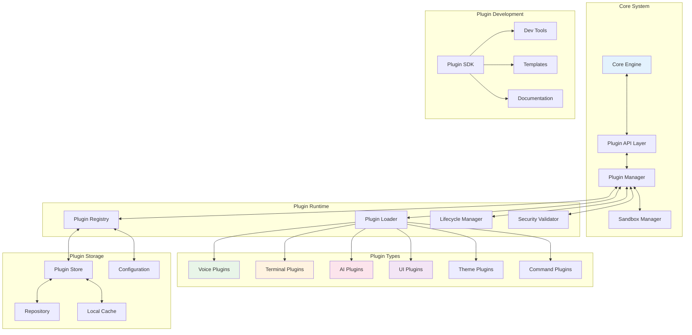

# Plugin/Extension Architecture
## AlphanumericMango Project

Version: 1.0.0  
Last Updated: 2025-09-18  
Status: Phase 3 - Documentation Completion

---

## ADR-010: Extensible Plugin System Architecture

**Status**: Accepted  
**Decision**: Implement secure, sandboxed plugin system with standardized APIs  
**Context**: Need extensible architecture for third-party integrations and custom functionality

---

## 1. Executive Summary

The Plugin/Extension Architecture defines a comprehensive system for extending the AlphanumericMango voice-controlled terminal with third-party plugins and custom extensions. The architecture emphasizes security isolation, standardized APIs, and developer-friendly extension points while maintaining system stability and performance.

### Key Architectural Principles
- **Security-First**: All plugins run in isolated sandboxes
- **Standardized APIs**: Well-defined interfaces for plugin development
- **Hot-Pluggable**: Plugins can be loaded/unloaded without system restart
- **Version Management**: Semantic versioning and compatibility checking
- **Performance Isolated**: Plugin failures don't impact core system
- **Developer-Friendly**: Rich SDK and development tools

---

## 2. Plugin System Overview



---

## 3. Plugin Architecture Components

### 3.1 Plugin Manager Core

```typescript
// plugins/core/plugin-manager.ts
interface PluginManager {
  // Plugin lifecycle
  loadPlugin(pluginId: string): Promise<Plugin>;
  unloadPlugin(pluginId: string): Promise<void>;
  reloadPlugin(pluginId: string): Promise<Plugin>;
  
  // Plugin discovery
  discoverPlugins(): Promise<PluginDescriptor[]>;
  searchPlugins(query: string): Promise<PluginDescriptor[]>;
  
  // Plugin registry
  registerPlugin(plugin: Plugin): Promise<void>;
  unregisterPlugin(pluginId: string): Promise<void>;
  
  // Plugin communication
  sendMessage(pluginId: string, message: any): Promise<any>;
  broadcastMessage(message: any): Promise<void>;
  
  // Plugin monitoring
  getPluginStatus(pluginId: string): PluginStatus;
  getPluginMetrics(pluginId: string): PluginMetrics;
}

class PluginManagerCore implements PluginManager {
  private plugins: Map<string, LoadedPlugin> = new Map();
  private registry: PluginRegistry;
  private sandboxManager: SandboxManager;
  private securityValidator: SecurityValidator;
  private lifecycleManager: LifecycleManager;
  
  constructor() {
    this.registry = new PluginRegistry();
    this.sandboxManager = new SandboxManager();
    this.securityValidator = new SecurityValidator();
    this.lifecycleManager = new LifecycleManager();
  }
  
  async loadPlugin(pluginId: string): Promise<Plugin> {
    // Validate plugin exists
    const descriptor = await this.registry.getPluginDescriptor(pluginId);
    if (!descriptor) {
      throw new PluginError(`Plugin ${pluginId} not found`);
    }
    
    // Security validation
    const securityResult = await this.securityValidator.validatePlugin(descriptor);
    if (!securityResult.passed) {
      throw new SecurityError(`Plugin ${pluginId} failed security validation: ${securityResult.issues.join(', ')}`);
    }
    
    // Check compatibility
    const compatibility = await this.checkCompatibility(descriptor);
    if (!compatibility.compatible) {
      throw new CompatibilityError(`Plugin ${pluginId} is not compatible: ${compatibility.reason}`);
    }
    
    // Create sandbox
    const sandbox = await this.sandboxManager.createSandbox(pluginId, descriptor.permissions);
    
    try {
      // Load plugin in sandbox
      const plugin = await sandbox.loadPlugin(descriptor);
      
      // Initialize plugin
      await this.lifecycleManager.initializePlugin(plugin);
      
      // Register plugin
      const loadedPlugin: LoadedPlugin = {
        id: pluginId,
        descriptor,
        plugin,
        sandbox,
        status: 'loaded',
        loadedAt: Date.now(),
        metrics: new PluginMetrics(pluginId)
      };
      
      this.plugins.set(pluginId, loadedPlugin);
      
      // Notify other plugins
      await this.broadcastMessage({
        type: 'plugin-loaded',
        pluginId,
        descriptor
      });
      
      return plugin;
      
    } catch (error) {
      // Cleanup on failure
      await sandbox.destroy();
      throw new PluginLoadError(`Failed to load plugin ${pluginId}: ${error.message}`);
    }
  }
  
  async unloadPlugin(pluginId: string): Promise<void> {
    const loadedPlugin = this.plugins.get(pluginId);
    if (!loadedPlugin) {
      throw new PluginError(`Plugin ${pluginId} is not loaded`);
    }
    
    try {
      // Cleanup plugin
      await this.lifecycleManager.cleanupPlugin(loadedPlugin.plugin);
      
      // Destroy sandbox
      await loadedPlugin.sandbox.destroy();
      
      // Remove from registry
      this.plugins.delete(pluginId);
      
      // Notify other plugins
      await this.broadcastMessage({
        type: 'plugin-unloaded',
        pluginId
      });
      
    } catch (error) {
      throw new PluginUnloadError(`Failed to unload plugin ${pluginId}: ${error.message}`);
    }
  }
  
  private async checkCompatibility(descriptor: PluginDescriptor): Promise<CompatibilityResult> {
    // Check API version compatibility
    const apiVersion = descriptor.apiVersion;
    const currentApiVersion = this.getCurrentApiVersion();
    
    if (!this.isApiVersionCompatible(apiVersion, currentApiVersion)) {
      return {
        compatible: false,
        reason: `API version ${apiVersion} is not compatible with current version ${currentApiVersion}`
      };
    }
    
    // Check dependency compatibility
    for (const dependency of descriptor.dependencies || []) {
      const dependencyPlugin = this.plugins.get(dependency.name);
      if (!dependencyPlugin) {
        return {
          compatible: false,
          reason: `Required dependency ${dependency.name} is not available`
        };
      }
      
      if (!this.isVersionCompatible(dependency.version, dependencyPlugin.descriptor.version)) {
        return {
          compatible: false,
          reason: `Dependency ${dependency.name} version mismatch`
        };
      }
    }
    
    // Check system requirements
    const systemRequirements = descriptor.systemRequirements;
    if (systemRequirements) {
      const meetsRequirements = await this.checkSystemRequirements(systemRequirements);
      if (!meetsRequirements.met) {
        return {
          compatible: false,
          reason: `System requirements not met: ${meetsRequirements.reason}`
        };
      }
    }
    
    return { compatible: true };
  }
}

export const pluginManager = new PluginManagerCore();
```

### 3.2 Plugin Sandbox System

```typescript
// plugins/core/sandbox-manager.ts
interface PluginSandbox {
  id: string;
  pluginId: string;
  permissions: PluginPermissions;
  context: SandboxContext;
  
  loadPlugin(descriptor: PluginDescriptor): Promise<Plugin>;
  executeCode(code: string): Promise<any>;
  callMethod(method: string, args: any[]): Promise<any>;
  destroy(): Promise<void>;
}

class SandboxManager {
  private sandboxes: Map<string, PluginSandbox> = new Map();
  private isolationStrategy: IsolationStrategy;
  
  constructor() {
    this.isolationStrategy = new IsolationStrategy();
  }
  
  async createSandbox(pluginId: string, permissions: PluginPermissions): Promise<PluginSandbox> {
    const sandboxId = this.generateSandboxId();
    
    // Create isolated context
    const context = await this.createIsolatedContext(permissions);
    
    // Create sandbox implementation
    const sandbox = new PluginSandboxImpl({
      id: sandboxId,
      pluginId,
      permissions,
      context,
      isolationStrategy: this.isolationStrategy
    });
    
    this.sandboxes.set(sandboxId, sandbox);
    
    return sandbox;
  }
  
  private async createIsolatedContext(permissions: PluginPermissions): Promise<SandboxContext> {
    return {
      // Restricted global objects
      global: this.createRestrictedGlobal(permissions),
      
      // Available APIs
      apis: this.createAPIContext(permissions),
      
      // Resource limits
      limits: {
        memoryLimit: permissions.memory || 64 * 1024 * 1024, // 64MB default
        cpuTimeLimit: permissions.cpuTime || 5000, // 5 seconds default
        networkRequests: permissions.network || 0,
        fileSystem: permissions.fileSystem || false
      },
      
      // Communication channels
      messaging: new SandboxMessaging(),
      
      // Security constraints
      security: {
        allowedModules: permissions.allowedModules || [],
        blockedModules: ['fs', 'child_process', 'cluster', 'worker_threads'],
        allowEval: false,
        allowDynamicImport: false
      }
    };
  }
  
  private createRestrictedGlobal(permissions: PluginPermissions): RestrictedGlobal {
    const restrictedGlobal: any = {
      // Safe globals
      console: this.createSafeConsole(),
      setTimeout: this.createSafeTimeout(),
      setInterval: this.createSafeInterval(),
      clearTimeout,
      clearInterval,
      
      // Plugin API
      pluginAPI: this.createPluginAPI(permissions),
      
      // Utilities
      JSON,
      Math,
      Date,
      RegExp,
      
      // Restricted globals
      process: this.createRestrictedProcess(),
      require: this.createRestrictedRequire(permissions)
    };
    
    // Remove dangerous globals
    delete restrictedGlobal.eval;
    delete restrictedGlobal.Function;
    delete restrictedGlobal.WebAssembly;
    
    return restrictedGlobal;
  }
  
  private createPluginAPI(permissions: PluginPermissions): PluginAPI {
    return {
      // Core APIs
      voice: permissions.voice ? this.createVoiceAPI() : null,
      terminal: permissions.terminal ? this.createTerminalAPI() : null,
      ai: permissions.ai ? this.createAIAPI() : null,
      ui: permissions.ui ? this.createUIAPI() : null,
      
      // Data APIs
      storage: permissions.storage ? this.createStorageAPI() : null,
      preferences: this.createPreferencesAPI(),
      
      // Communication APIs
      messaging: this.createMessagingAPI(),
      events: this.createEventsAPI(),
      
      // Utility APIs
      utils: this.createUtilsAPI(),
      crypto: permissions.crypto ? this.createCryptoAPI() : null,
      
      // Plugin lifecycle
      lifecycle: this.createLifecycleAPI()
    };
  }
}

class PluginSandboxImpl implements PluginSandbox {
  id: string;
  pluginId: string;
  permissions: PluginPermissions;
  context: SandboxContext;
  
  private vm: VM;
  private resourceMonitor: ResourceMonitor;
  
  constructor(config: SandboxConfig) {
    this.id = config.id;
    this.pluginId = config.pluginId;
    this.permissions = config.permissions;
    this.context = config.context;
    
    this.vm = new VM({
      timeout: this.context.limits.cpuTimeLimit,
      sandbox: this.context.global
    });
    
    this.resourceMonitor = new ResourceMonitor(this.context.limits);
  }
  
  async loadPlugin(descriptor: PluginDescriptor): Promise<Plugin> {
    // Load plugin code
    const pluginCode = await this.loadPluginCode(descriptor);
    
    // Validate code before execution
    await this.validatePluginCode(pluginCode);
    
    // Execute plugin in sandbox
    const pluginExports = await this.executePluginCode(pluginCode);
    
    // Create plugin instance
    const plugin = new pluginExports.default(this.context.global.pluginAPI);
    
    // Validate plugin interface
    this.validatePluginInterface(plugin);
    
    return plugin;
  }
  
  async executeCode(code: string): Promise<any> {
    this.resourceMonitor.startMonitoring();
    
    try {
      const result = await this.vm.run(code);
      return result;
    } catch (error) {
      throw new SandboxExecutionError(`Sandbox execution failed: ${error.message}`);
    } finally {
      this.resourceMonitor.stopMonitoring();
    }
  }
  
  async destroy(): Promise<void> {
    // Stop resource monitoring
    this.resourceMonitor.stop();
    
    // Clear VM context
    this.vm = null;
    
    // Cleanup messaging
    this.context.messaging.destroy();
    
    // Clear references
    this.context = null;
  }
  
  private async validatePluginCode(code: string): Promise<void> {
    // Static analysis for dangerous patterns
    const dangerousPatterns = [
      /eval\(/,
      /Function\(/,
      /process\.exit/,
      /require\(['"]fs['"]\)/,
      /require\(['"]child_process['"]\)/,
      /require\(['"]cluster['"]\)/
    ];
    
    for (const pattern of dangerousPatterns) {
      if (pattern.test(code)) {
        throw new SecurityError(`Plugin code contains dangerous pattern: ${pattern}`);
      }
    }
    
    // Additional AST-based analysis could be added here
  }
  
  private validatePluginInterface(plugin: any): void {
    const requiredMethods = ['initialize', 'activate', 'deactivate', 'destroy'];
    
    for (const method of requiredMethods) {
      if (typeof plugin[method] !== 'function') {
        throw new PluginInterfaceError(`Plugin must implement ${method} method`);
      }
    }
  }
}

export { SandboxManager, PluginSandboxImpl };
```

---

## 4. Plugin Types and APIs

### 4.1 Voice Plugin API

```typescript
// plugins/apis/voice-api.ts
interface VoicePluginAPI {
  // Voice recognition
  onVoiceCommand(callback: (command: VoiceCommand) => void): void;
  registerVoiceCommand(pattern: string, handler: VoiceCommandHandler): void;
  unregisterVoiceCommand(pattern: string): void;
  
  // Speech synthesis
  speak(text: string, options?: SpeechOptions): Promise<void>;
  setVoice(voice: VoiceDescriptor): void;
  
  // Audio processing
  onAudioInput(callback: (audioData: AudioData) => void): void;
  processAudio(audioData: AudioData): Promise<ProcessedAudio>;
  
  // Voice training
  trainVoiceModel(samples: VoiceSample[]): Promise<VoiceModel>;
  updateVoiceProfile(updates: VoiceProfileUpdate): Promise<void>;
}

class VoiceAPI implements VoicePluginAPI {
  private commandHandlers: Map<string, VoiceCommandHandler> = new Map();
  private voiceEngine: VoiceEngine;
  private permissions: VoicePermissions;
  
  constructor(voiceEngine: VoiceEngine, permissions: VoicePermissions) {
    this.voiceEngine = voiceEngine;
    this.permissions = permissions;
  }
  
  onVoiceCommand(callback: (command: VoiceCommand) => void): void {
    if (!this.permissions.receiveCommands) {
      throw new PermissionError('Plugin does not have permission to receive voice commands');
    }
    
    this.voiceEngine.on('voice-command', (command) => {
      // Filter commands based on plugin permissions
      if (this.isCommandAllowed(command)) {
        callback(command);
      }
    });
  }
  
  registerVoiceCommand(pattern: string, handler: VoiceCommandHandler): void {
    if (!this.permissions.registerCommands) {
      throw new PermissionError('Plugin does not have permission to register voice commands');
    }
    
    // Validate pattern
    this.validateCommandPattern(pattern);
    
    // Register with voice engine
    this.voiceEngine.registerCommand(pattern, (command) => {
      try {
        handler(command);
      } catch (error) {
        console.error(`Voice command handler error for pattern ${pattern}:`, error);
      }
    });
    
    this.commandHandlers.set(pattern, handler);
  }
  
  async speak(text: string, options?: SpeechOptions): Promise<void> {
    if (!this.permissions.speechSynthesis) {
      throw new PermissionError('Plugin does not have permission for speech synthesis');
    }
    
    // Validate text content
    this.validateSpeechText(text);
    
    // Apply rate limiting
    await this.checkSpeechRateLimit();
    
    // Synthesize speech
    await this.voiceEngine.synthesize(text, {
      ...options,
      source: 'plugin'
    });
  }
  
  async processAudio(audioData: AudioData): Promise<ProcessedAudio> {
    if (!this.permissions.audioProcessing) {
      throw new PermissionError('Plugin does not have permission for audio processing');
    }
    
    // Validate audio data
    this.validateAudioData(audioData);
    
    // Process in sandbox
    return await this.voiceEngine.processAudioInSandbox(audioData);
  }
  
  private isCommandAllowed(command: VoiceCommand): boolean {
    // Check if command matches allowed patterns
    const allowedPatterns = this.permissions.allowedCommands || [];
    
    if (allowedPatterns.length === 0) {
      return true; // No restrictions
    }
    
    return allowedPatterns.some(pattern => {
      const regex = new RegExp(pattern);
      return regex.test(command.text);
    });
  }
  
  private validateCommandPattern(pattern: string): void {
    // Ensure pattern is safe and valid
    if (pattern.length > 100) {
      throw new ValidationError('Command pattern too long');
    }
    
    // Check for potentially harmful patterns
    const dangerousPatterns = [
      /\*.*\*/, // Greedy wildcards
      /\.\+/, // Greedy dots
      /.{100,}/ // Very long patterns
    ];
    
    for (const dangerous of dangerousPatterns) {
      if (dangerous.test(pattern)) {
        throw new SecurityError(`Dangerous pattern detected: ${pattern}`);
      }
    }
  }
  
  private validateSpeechText(text: string): void {
    if (text.length > 1000) {
      throw new ValidationError('Speech text too long (max 1000 characters)');
    }
    
    // Filter harmful content
    const harmfulPatterns = [
      /<script/i,
      /javascript:/i,
      /vbscript:/i
    ];
    
    for (const pattern of harmfulPatterns) {
      if (pattern.test(text)) {
        throw new SecurityError('Harmful content detected in speech text');
      }
    }
  }
}

// Example Voice Plugin
class VoiceTranslationPlugin {
  private api: VoicePluginAPI;
  private translator: Translator;
  
  constructor(api: VoicePluginAPI) {
    this.api = api;
    this.translator = new Translator();
  }
  
  async initialize(): Promise<void> {
    // Register voice command
    this.api.registerVoiceCommand('translate * to *', this.handleTranslateCommand.bind(this));
  }
  
  async activate(): Promise<void> {
    console.log('Voice Translation Plugin activated');
  }
  
  async deactivate(): Promise<void> {
    console.log('Voice Translation Plugin deactivated');
  }
  
  async destroy(): Promise<void> {
    // Cleanup resources
    this.translator = null;
  }
  
  private async handleTranslateCommand(command: VoiceCommand): Promise<void> {
    const match = command.text.match(/translate (.*) to (.*)/);
    if (!match) return;
    
    const [, text, targetLanguage] = match;
    
    try {
      const translation = await this.translator.translate(text, targetLanguage);
      await this.api.speak(`Translation: ${translation}`);
    } catch (error) {
      await this.api.speak('Sorry, translation failed');
    }
  }
}

export { VoiceAPI, VoiceTranslationPlugin };
```

### 4.2 Terminal Plugin API

```typescript
// plugins/apis/terminal-api.ts
interface TerminalPluginAPI {
  // Terminal interaction
  executeCommand(command: string, options?: CommandOptions): Promise<CommandResult>;
  onCommandOutput(callback: (output: CommandOutput) => void): void;
  onCommandComplete(callback: (result: CommandResult) => void): void;
  
  // Session management
  createSession(config?: SessionConfig): Promise<string>;
  switchSession(sessionId: string): Promise<void>;
  closeSession(sessionId: string): Promise<void>;
  
  // Terminal customization
  setPrompt(prompt: string): void;
  addCommand(name: string, handler: CommandHandler): void;
  removeCommand(name: string): void;
  
  // File system access
  readFile(path: string): Promise<string>;
  writeFile(path: string, content: string): Promise<void>;
  listDirectory(path: string): Promise<DirectoryEntry[]>;
  
  // Environment management
  setEnvironmentVariable(name: string, value: string): void;
  getEnvironmentVariable(name: string): string | undefined;
  getWorkingDirectory(): string;
  changeDirectory(path: string): Promise<void>;
}

class TerminalAPI implements TerminalPluginAPI {
  private terminalController: TerminalController;
  private permissions: TerminalPermissions;
  private pluginId: string;
  
  constructor(terminalController: TerminalController, permissions: TerminalPermissions, pluginId: string) {
    this.terminalController = terminalController;
    this.permissions = permissions;
    this.pluginId = pluginId;
  }
  
  async executeCommand(command: string, options?: CommandOptions): Promise<CommandResult> {
    if (!this.permissions.executeCommands) {
      throw new PermissionError('Plugin does not have permission to execute commands');
    }
    
    // Validate command
    this.validateCommand(command);
    
    // Check command whitelist
    if (!this.isCommandAllowed(command)) {
      throw new SecurityError(`Command not allowed: ${command}`);
    }
    
    // Execute with plugin context
    return await this.terminalController.executeCommand(command, {
      ...options,
      pluginId: this.pluginId,
      isolated: true
    });
  }
  
  async readFile(path: string): Promise<string> {
    if (!this.permissions.fileSystem?.read) {
      throw new PermissionError('Plugin does not have permission to read files');
    }
    
    // Validate path
    this.validatePath(path);
    
    // Check if path is allowed
    if (!this.isPathAllowed(path, 'read')) {
      throw new SecurityError(`Path not allowed for reading: ${path}`);
    }
    
    return await this.terminalController.readFile(path);
  }
  
  async writeFile(path: string, content: string): Promise<void> {
    if (!this.permissions.fileSystem?.write) {
      throw new PermissionError('Plugin does not have permission to write files');
    }
    
    // Validate path and content
    this.validatePath(path);
    this.validateFileContent(content);
    
    // Check if path is allowed
    if (!this.isPathAllowed(path, 'write')) {
      throw new SecurityError(`Path not allowed for writing: ${path}`);
    }
    
    await this.terminalController.writeFile(path, content);
  }
  
  addCommand(name: string, handler: CommandHandler): void {
    if (!this.permissions.customCommands) {
      throw new PermissionError('Plugin does not have permission to add custom commands');
    }
    
    // Validate command name
    this.validateCommandName(name);
    
    // Wrap handler with plugin context
    const wrappedHandler = async (args: string[], context: CommandContext) => {
      try {
        return await handler(args, context);
      } catch (error) {
        throw new PluginCommandError(`Plugin command '${name}' failed: ${error.message}`);
      }
    };
    
    this.terminalController.addPluginCommand(this.pluginId, name, wrappedHandler);
  }
  
  private validateCommand(command: string): void {
    if (command.length > 1000) {
      throw new ValidationError('Command too long (max 1000 characters)');
    }
    
    // Check for dangerous patterns
    const dangerousPatterns = [
      /rm\s+-rf\s+\//, // rm -rf /
      /:\(\)\{.*\}/, // Fork bombs
      /eval.*/, // eval commands
      /exec.*/ // exec commands
    ];
    
    for (const pattern of dangerousPatterns) {
      if (pattern.test(command)) {
        throw new SecurityError(`Dangerous command pattern detected: ${command}`);
      }
    }
  }
  
  private isCommandAllowed(command: string): boolean {
    const allowedCommands = this.permissions.allowedCommands;
    const blockedCommands = this.permissions.blockedCommands || [
      'rm', 'rmdir', 'dd', 'mkfs', 'fdisk', 'format',
      'sudo', 'su', 'passwd', 'chown', 'chmod'
    ];
    
    const commandName = command.split(' ')[0];
    
    // Check blocked commands first
    if (blockedCommands.includes(commandName)) {
      return false;
    }
    
    // If allowlist exists, check it
    if (allowedCommands && allowedCommands.length > 0) {
      return allowedCommands.includes(commandName);
    }
    
    return true;
  }
  
  private isPathAllowed(path: string, operation: 'read' | 'write'): boolean {
    const allowedPaths = this.permissions.fileSystem?.allowedPaths || [];
    const blockedPaths = this.permissions.fileSystem?.blockedPaths || [
      '/etc', '/root', '/boot', '/sys', '/proc',
      '/home/*/.ssh', '/var/log', '/tmp'
    ];
    
    // Check blocked paths
    for (const blockedPath of blockedPaths) {
      if (this.pathMatches(path, blockedPath)) {
        return false;
      }
    }
    
    // Check allowed paths
    if (allowedPaths.length > 0) {
      return allowedPaths.some(allowedPath => 
        this.pathMatches(path, allowedPath)
      );
    }
    
    return true;
  }
  
  private pathMatches(path: string, pattern: string): boolean {
    // Simple glob pattern matching
    const regexPattern = pattern
      .replace(/\*/g, '.*')
      .replace(/\?/g, '.');
    
    const regex = new RegExp(`^${regexPattern}$`);
    return regex.test(path);
  }
}

// Example Terminal Plugin
class GitIntegrationPlugin {
  private api: TerminalPluginAPI;
  
  constructor(api: TerminalPluginAPI) {
    this.api = api;
  }
  
  async initialize(): Promise<void> {
    // Add custom Git commands
    this.api.addCommand('git-status-enhanced', this.handleGitStatus.bind(this));
    this.api.addCommand('git-commit-ai', this.handleAICommit.bind(this));
  }
  
  async activate(): Promise<void> {
    console.log('Git Integration Plugin activated');
  }
  
  async deactivate(): Promise<void> {
    console.log('Git Integration Plugin deactivated');
  }
  
  async destroy(): Promise<void> {
    // Cleanup
  }
  
  private async handleGitStatus(args: string[]): Promise<string> {
    const result = await this.api.executeCommand('git status --porcelain');
    
    if (!result.success) {
      return 'Error: Not a git repository or git command failed';
    }
    
    // Process and enhance the output
    const lines = result.output.split('\n').filter(line => line.trim());
    
    if (lines.length === 0) {
      return '✅ Working directory clean';
    }
    
    let enhanced = '📊 Git Status:\n';
    let modified = 0, added = 0, deleted = 0, untracked = 0;
    
    for (const line of lines) {
      const status = line.substring(0, 2);
      const file = line.substring(3);
      
      if (status.includes('M')) {
        enhanced += `🔧 Modified: ${file}\n`;
        modified++;
      } else if (status.includes('A')) {
        enhanced += `➕ Added: ${file}\n`;
        added++;
      } else if (status.includes('D')) {
        enhanced += `❌ Deleted: ${file}\n`;
        deleted++;
      } else if (status.includes('??')) {
        enhanced += `❓ Untracked: ${file}\n`;
        untracked++;
      }
    }
    
    enhanced += `\n📈 Summary: ${modified} modified, ${added} added, ${deleted} deleted, ${untracked} untracked`;
    
    return enhanced;
  }
  
  private async handleAICommit(args: string[]): Promise<string> {
    // Get staged changes
    const diffResult = await this.api.executeCommand('git diff --cached');
    
    if (!diffResult.success || !diffResult.output.trim()) {
      return 'Error: No staged changes found. Stage your changes first with git add.';
    }
    
    // Generate AI commit message based on diff
    const commitMessage = await this.generateCommitMessage(diffResult.output);
    
    // Create commit
    const commitResult = await this.api.executeCommand(`git commit -m "${commitMessage}"`);
    
    if (commitResult.success) {
      return `✅ Committed with message: "${commitMessage}"`;
    } else {
      return `❌ Commit failed: ${commitResult.error}`;
    }
  }
  
  private async generateCommitMessage(diff: string): Promise<string> {
    // Simple AI-like commit message generation
    // In a real implementation, this would use an AI service
    
    const lines = diff.split('\n');
    const addedLines = lines.filter(line => line.startsWith('+')).length;
    const deletedLines = lines.filter(line => line.startsWith('-')).length;
    
    if (addedLines > deletedLines * 2) {
      return 'feat: add new functionality and features';
    } else if (deletedLines > addedLines * 2) {
      return 'refactor: remove unused code and cleanup';
    } else {
      return 'chore: update code and fix issues';
    }
  }
}

export { TerminalAPI, GitIntegrationPlugin };
```

### 4.3 UI Plugin API

```typescript
// plugins/apis/ui-api.ts
interface UIPluginAPI {
  // Component registration
  registerComponent(name: string, component: UIComponent): void;
  unregisterComponent(name: string): void;
  
  // Layout management
  addPanel(panel: PanelDescriptor): Promise<string>;
  removePanel(panelId: string): Promise<void>;
  updatePanel(panelId: string, updates: Partial<PanelDescriptor>): Promise<void>;
  
  // Menu integration
  addMenuItem(menu: MenuDescriptor): void;
  removeMenuItem(menuId: string): void;
  
  // Notification system
  showNotification(notification: NotificationDescriptor): Promise<string>;
  hideNotification(notificationId: string): Promise<void>;
  
  // Theme integration
  registerTheme(theme: ThemeDescriptor): void;
  getActiveTheme(): ThemeDescriptor;
  
  // Event handling
  onUIEvent(event: string, handler: UIEventHandler): void;
  offUIEvent(event: string, handler: UIEventHandler): void;
  emitUIEvent(event: string, data: any): void;
}

class UIAPI implements UIPluginAPI {
  private uiManager: UIManager;
  private permissions: UIPermissions;
  private pluginId: string;
  private registeredComponents: Set<string> = new Set();
  
  constructor(uiManager: UIManager, permissions: UIPermissions, pluginId: string) {
    this.uiManager = uiManager;
    this.permissions = permissions;
    this.pluginId = pluginId;
  }
  
  registerComponent(name: string, component: UIComponent): void {
    if (!this.permissions.registerComponents) {
      throw new PermissionError('Plugin does not have permission to register components');
    }
    
    // Validate component
    this.validateComponent(name, component);
    
    // Register with namespace
    const namespacedName = `${this.pluginId}:${name}`;
    
    this.uiManager.registerComponent(namespacedName, {
      ...component,
      pluginId: this.pluginId,
      isolated: true
    });
    
    this.registeredComponents.add(namespacedName);
  }
  
  async addPanel(panel: PanelDescriptor): Promise<string> {
    if (!this.permissions.addPanels) {
      throw new PermissionError('Plugin does not have permission to add panels');
    }
    
    // Validate panel
    this.validatePanel(panel);
    
    // Add panel with plugin context
    const panelId = await this.uiManager.addPanel({
      ...panel,
      pluginId: this.pluginId,
      isolated: true
    });
    
    return panelId;
  }
  
  addMenuItem(menu: MenuDescriptor): void {
    if (!this.permissions.addMenuItems) {
      throw new PermissionError('Plugin does not have permission to add menu items');
    }
    
    // Validate menu
    this.validateMenu(menu);
    
    // Add menu with plugin context
    this.uiManager.addMenuItem({
      ...menu,
      pluginId: this.pluginId,
      action: this.wrapMenuAction(menu.action)
    });
  }
  
  async showNotification(notification: NotificationDescriptor): Promise<string> {
    if (!this.permissions.showNotifications) {
      throw new PermissionError('Plugin does not have permission to show notifications');
    }
    
    // Validate notification
    this.validateNotification(notification);
    
    // Apply rate limiting
    await this.checkNotificationRateLimit();
    
    // Show notification with plugin context
    return await this.uiManager.showNotification({
      ...notification,
      source: this.pluginId
    });
  }
  
  registerTheme(theme: ThemeDescriptor): void {
    if (!this.permissions.registerThemes) {
      throw new PermissionError('Plugin does not have permission to register themes');
    }
    
    // Validate theme
    this.validateTheme(theme);
    
    // Register theme with plugin namespace
    const namespacedTheme = {
      ...theme,
      id: `${this.pluginId}:${theme.id}`,
      source: this.pluginId
    };
    
    this.uiManager.registerTheme(namespacedTheme);
  }
  
  private validateComponent(name: string, component: UIComponent): void {
    if (!name || name.length === 0) {
      throw new ValidationError('Component name is required');
    }
    
    if (name.length > 50) {
      throw new ValidationError('Component name too long (max 50 characters)');
    }
    
    if (!component.render || typeof component.render !== 'function') {
      throw new ValidationError('Component must have a render function');
    }
    
    // Validate component props
    if (component.props) {
      this.validateComponentProps(component.props);
    }
  }
  
  private validatePanel(panel: PanelDescriptor): void {
    if (!panel.title || panel.title.length === 0) {
      throw new ValidationError('Panel title is required');
    }
    
    if (!panel.content) {
      throw new ValidationError('Panel content is required');
    }
    
    // Validate panel size
    if (panel.width && (panel.width < 100 || panel.width > 2000)) {
      throw new ValidationError('Panel width must be between 100 and 2000 pixels');
    }
    
    if (panel.height && (panel.height < 100 || panel.height > 2000)) {
      throw new ValidationError('Panel height must be between 100 and 2000 pixels');
    }
  }
  
  private validateNotification(notification: NotificationDescriptor): void {
    if (!notification.title || notification.title.length === 0) {
      throw new ValidationError('Notification title is required');
    }
    
    if (notification.title.length > 100) {
      throw new ValidationError('Notification title too long (max 100 characters)');
    }
    
    if (notification.message && notification.message.length > 500) {
      throw new ValidationError('Notification message too long (max 500 characters)');
    }
    
    // Validate notification type
    const validTypes = ['info', 'success', 'warning', 'error'];
    if (notification.type && !validTypes.includes(notification.type)) {
      throw new ValidationError(`Invalid notification type: ${notification.type}`);
    }
  }
  
  private async checkNotificationRateLimit(): Promise<void> {
    // Simple rate limiting: max 5 notifications per minute
    const rateLimitKey = `notification_rate_limit:${this.pluginId}`;
    const currentCount = await this.getRateLimitCount(rateLimitKey);
    
    if (currentCount >= 5) {
      throw new RateLimitError('Notification rate limit exceeded (5 per minute)');
    }
    
    await this.incrementRateLimitCount(rateLimitKey);
  }
  
  private wrapMenuAction(action: MenuAction): MenuAction {
    return async (context: MenuContext) => {
      try {
        return await action(context);
      } catch (error) {
        console.error(`Menu action error for plugin ${this.pluginId}:`, error);
        throw new PluginMenuError(`Menu action failed: ${error.message}`);
      }
    };
  }
  
  cleanup(): void {
    // Unregister all components
    for (const componentName of this.registeredComponents) {
      this.uiManager.unregisterComponent(componentName);
    }
    
    this.registeredComponents.clear();
  }
}

// Example UI Plugin
class StatusBarPlugin {
  private api: UIPluginAPI;
  private statusPanelId: string;
  
  constructor(api: UIPluginAPI) {
    this.api = api;
  }
  
  async initialize(): Promise<void> {
    // Register status component
    this.api.registerComponent('status-indicator', {
      render: this.renderStatusIndicator.bind(this),
      props: {
        status: { type: 'string', required: true },
        color: { type: 'string', default: 'blue' }
      }
    });
    
    // Add status panel
    this.statusPanelId = await this.api.addPanel({
      title: 'System Status',
      content: this.renderStatusPanel(),
      position: 'bottom',
      height: 200,
      collapsible: true
    });
    
    // Add menu item
    this.api.addMenuItem({
      label: 'Show Status',
      category: 'View',
      action: this.showStatusPanel.bind(this),
      shortcut: 'Ctrl+Shift+S'
    });
  }
  
  async activate(): Promise<void> {
    // Start status monitoring
    this.startStatusMonitoring();
  }
  
  async deactivate(): Promise<void> {
    // Stop status monitoring
    this.stopStatusMonitoring();
  }
  
  async destroy(): Promise<void> {
    // Remove panel
    if (this.statusPanelId) {
      await this.api.removePanel(this.statusPanelId);
    }
  }
  
  private renderStatusIndicator(props: any): string {
    const { status, color } = props;
    return `
      <div class="status-indicator" style="color: ${color}">
        <span class="status-dot"></span>
        <span class="status-text">${status}</span>
      </div>
    `;
  }
  
  private renderStatusPanel(): string {
    return `
      <div class="status-panel">
        <div class="status-grid">
          <div class="status-item">
            <label>CPU Usage:</label>
            <span id="cpu-usage">--</span>
          </div>
          <div class="status-item">
            <label>Memory Usage:</label>
            <span id="memory-usage">--</span>
          </div>
          <div class="status-item">
            <label>Active Sessions:</label>
            <span id="active-sessions">--</span>
          </div>
        </div>
      </div>
    `;
  }
  
  private async showStatusPanel(): Promise<void> {
    await this.api.updatePanel(this.statusPanelId, {
      visible: true,
      focused: true
    });
  }
  
  private startStatusMonitoring(): void {
    // Monitor system status and update UI
    setInterval(async () => {
      const stats = await this.getSystemStats();
      this.updateStatusDisplay(stats);
    }, 2000);
  }
  
  private stopStatusMonitoring(): void {
    // Stop monitoring
  }
  
  private async getSystemStats(): Promise<SystemStats> {
    // Get system statistics
    return {
      cpuUsage: Math.round(Math.random() * 100),
      memoryUsage: Math.round(Math.random() * 100),
      activeSessions: Math.floor(Math.random() * 10)
    };
  }
  
  private updateStatusDisplay(stats: SystemStats): void {
    // Update status display
    this.api.emitUIEvent('status-update', stats);
  }
}

export { UIAPI, StatusBarPlugin };
```

---

## 5. Plugin Development SDK

### 5.1 Plugin SDK Core

```typescript
// sdk/plugin-sdk.ts
interface PluginSDK {
  // Core APIs
  voice: VoicePluginAPI;
  terminal: TerminalPluginAPI;
  ui: UIPluginAPI;
  ai: AIPluginAPI;
  
  // Utility APIs
  storage: StorageAPI;
  crypto: CryptoAPI;
  http: HTTPClientAPI;
  events: EventsAPI;
  
  // Plugin lifecycle
  lifecycle: LifecycleAPI;
  
  // Development tools
  dev: DevToolsAPI;
}

class PluginSDKCore implements PluginSDK {
  voice: VoicePluginAPI;
  terminal: TerminalPluginAPI;
  ui: UIPluginAPI;
  ai: AIPluginAPI;
  storage: StorageAPI;
  crypto: CryptoAPI;
  http: HTTPClientAPI;
  events: EventsAPI;
  lifecycle: LifecycleAPI;
  dev: DevToolsAPI;
  
  constructor(pluginId: string, permissions: PluginPermissions) {
    this.voice = new VoiceAPI(voiceEngine, permissions.voice);
    this.terminal = new TerminalAPI(terminalController, permissions.terminal, pluginId);
    this.ui = new UIAPI(uiManager, permissions.ui, pluginId);
    this.ai = new AIAPI(aiService, permissions.ai);
    this.storage = new StorageAPI(storageService, permissions.storage, pluginId);
    this.crypto = new CryptoAPI(permissions.crypto);
    this.http = new HTTPClientAPI(permissions.http);
    this.events = new EventsAPI(eventBus, pluginId);
    this.lifecycle = new LifecycleAPI(pluginManager, pluginId);
    this.dev = new DevToolsAPI(pluginId);
  }
}

// Plugin development utilities
class PluginGenerator {
  static async createPlugin(options: PluginGeneratorOptions): Promise<PluginProject> {
    const project: PluginProject = {
      name: options.name,
      version: '1.0.0',
      description: options.description,
      type: options.type,
      structure: await this.generateProjectStructure(options),
      dependencies: this.getDefaultDependencies(options.type),
      permissions: this.getDefaultPermissions(options.type)
    };
    
    return project;
  }
  
  private static async generateProjectStructure(options: PluginGeneratorOptions): Promise<ProjectStructure> {
    return {
      'package.json': this.generatePackageJson(options),
      'plugin.json': this.generatePluginManifest(options),
      'src/': {
        'index.ts': this.generateMainFile(options),
        'plugin.ts': this.generatePluginClass(options),
        'types.ts': this.generateTypes(options)
      },
      'test/': {
        'plugin.test.ts': this.generateTests(options)
      },
      'README.md': this.generateReadme(options),
      '.gitignore': this.generateGitignore(),
      'tsconfig.json': this.generateTSConfig()
    };
  }
  
  private static generatePluginClass(options: PluginGeneratorOptions): string {
    const template = `
import { PluginSDK } from '@alphanumeric/plugin-sdk';

export class ${options.className}Plugin {
  private sdk: PluginSDK;
  
  constructor(sdk: PluginSDK) {
    this.sdk = sdk;
  }
  
  async initialize(): Promise<void> {
    // Initialize plugin
    console.log('${options.name} plugin initializing...');
    
    ${this.generateInitializationCode(options)}
  }
  
  async activate(): Promise<void> {
    // Activate plugin
    console.log('${options.name} plugin activated');
    
    ${this.generateActivationCode(options)}
  }
  
  async deactivate(): Promise<void> {
    // Deactivate plugin
    console.log('${options.name} plugin deactivated');
    
    ${this.generateDeactivationCode(options)}
  }
  
  async destroy(): Promise<void> {
    // Cleanup plugin
    console.log('${options.name} plugin destroyed');
    
    ${this.generateCleanupCode(options)}
  }
  
  ${this.generatePluginMethods(options)}
}
`;
    
    return template.trim();
  }
}

// Plugin testing utilities
class PluginTestRunner {
  async runTests(pluginPath: string): Promise<TestResults> {
    const plugin = await this.loadPlugin(pluginPath);
    const testSuite = new PluginTestSuite(plugin);
    
    const results: TestResults = {
      total: 0,
      passed: 0,
      failed: 0,
      tests: []
    };
    
    // Run initialization tests
    await testSuite.testInitialization();
    
    // Run API tests
    await testSuite.testAPIs();
    
    // Run security tests
    await testSuite.testSecurity();
    
    // Run performance tests
    await testSuite.testPerformance();
    
    return results;
  }
}

class PluginTestSuite {
  private plugin: Plugin;
  private mockSDK: MockPluginSDK;
  
  constructor(plugin: Plugin) {
    this.plugin = plugin;
    this.mockSDK = new MockPluginSDK();
  }
  
  async testInitialization(): Promise<void> {
    // Test plugin initialization
    try {
      await this.plugin.initialize();
      this.assert(true, 'Plugin initialization succeeded');
    } catch (error) {
      this.assert(false, `Plugin initialization failed: ${error.message}`);
    }
  }
  
  async testAPIs(): Promise<void> {
    // Test API usage
    const apiMethods = [
      'voice', 'terminal', 'ui', 'ai',
      'storage', 'crypto', 'http', 'events'
    ];
    
    for (const apiMethod of apiMethods) {
      await this.testAPI(apiMethod);
    }
  }
  
  async testSecurity(): Promise<void> {
    // Test security constraints
    await this.testPermissionEnforcement();
    await this.testSandboxIsolation();
    await this.testInputValidation();
  }
  
  async testPerformance(): Promise<void> {
    // Test performance characteristics
    await this.testMemoryUsage();
    await this.testCPUUsage();
    await this.testResponseTime();
  }
  
  private assert(condition: boolean, message: string): void {
    if (!condition) {
      throw new AssertionError(message);
    }
  }
}

export { PluginSDKCore, PluginGenerator, PluginTestRunner };
```

### 5.2 Plugin Development Tools

```typescript
// sdk/dev-tools.ts
interface DevToolsAPI {
  // Logging and debugging
  log(level: LogLevel, message: string, data?: any): void;
  debug(message: string, data?: any): void;
  
  // Performance monitoring
  startTimer(name: string): void;
  endTimer(name: string): number;
  measureMemory(): MemoryUsage;
  
  // Hot reload support
  onHotReload(callback: () => void): void;
  triggerReload(): void;
  
  // Development server
  startDevServer(options?: DevServerOptions): Promise<void>;
  
  // Plugin validation
  validatePlugin(): Promise<ValidationResult>;
  
  // Testing utilities
  createMockAPI(): MockPluginSDK;
  runTests(): Promise<TestResults>;
}

class DevToolsAPI implements DevToolsAPI {
  private pluginId: string;
  private timers: Map<string, number> = new Map();
  private hotReloadCallbacks: Set<() => void> = new Set();
  
  constructor(pluginId: string) {
    this.pluginId = pluginId;
  }
  
  log(level: LogLevel, message: string, data?: any): void {
    const logEntry = {
      timestamp: new Date().toISOString(),
      level,
      plugin: this.pluginId,
      message,
      data
    };
    
    console.log(`[${level.toUpperCase()}] [${this.pluginId}] ${message}`, data || '');
    
    // Send to development console
    this.sendToDevConsole(logEntry);
  }
  
  debug(message: string, data?: any): void {
    if (process.env.NODE_ENV === 'development') {
      this.log('debug', message, data);
    }
  }
  
  startTimer(name: string): void {
    this.timers.set(name, performance.now());
  }
  
  endTimer(name: string): number {
    const startTime = this.timers.get(name);
    if (!startTime) {
      throw new Error(`Timer '${name}' was not started`);
    }
    
    const duration = performance.now() - startTime;
    this.timers.delete(name);
    
    this.debug(`Timer '${name}': ${duration.toFixed(2)}ms`);
    
    return duration;
  }
  
  measureMemory(): MemoryUsage {
    if (typeof performance.measureUserAgentSpecificMemory === 'function') {
      return performance.measureUserAgentSpecificMemory();
    }
    
    // Fallback for environments without memory measurement
    return {
      bytes: 0,
      breakdown: []
    };
  }
  
  onHotReload(callback: () => void): void {
    this.hotReloadCallbacks.add(callback);
  }
  
  triggerReload(): void {
    for (const callback of this.hotReloadCallbacks) {
      try {
        callback();
      } catch (error) {
        console.error(`Hot reload callback error for plugin ${this.pluginId}:`, error);
      }
    }
  }
  
  async startDevServer(options: DevServerOptions = {}): Promise<void> {
    const server = new PluginDevServer({
      port: options.port || 8080,
      pluginId: this.pluginId,
      hotReload: options.hotReload !== false,
      ...options
    });
    
    await server.start();
    
    this.log('info', `Development server started on port ${server.port}`);
  }
  
  async validatePlugin(): Promise<ValidationResult> {
    const validator = new PluginValidator();
    return await validator.validate(this.pluginId);
  }
  
  createMockAPI(): MockPluginSDK {
    return new MockPluginSDK(this.pluginId);
  }
  
  async runTests(): Promise<TestResults> {
    const testRunner = new PluginTestRunner();
    return await testRunner.runTests(this.pluginId);
  }
  
  private sendToDevConsole(logEntry: any): void {
    // Send log entry to development console
    if (typeof window !== 'undefined' && window.postMessage) {
      window.postMessage({
        type: 'plugin-log',
        pluginId: this.pluginId,
        logEntry
      }, '*');
    }
  }
}

class PluginDevServer {
  private config: DevServerConfig;
  private server: HTTPServer;
  private watcher: FileWatcher;
  
  constructor(config: DevServerConfig) {
    this.config = config;
  }
  
  async start(): Promise<void> {
    // Start HTTP server
    this.server = createServer(this.handleRequest.bind(this));
    
    await new Promise<void>((resolve) => {
      this.server.listen(this.config.port, () => {
        resolve();
      });
    });
    
    // Start file watcher for hot reload
    if (this.config.hotReload) {
      this.startFileWatcher();
    }
  }
  
  private handleRequest(req: IncomingMessage, res: ServerResponse): void {
    const url = new URL(req.url!, `http://localhost:${this.config.port}`);
    
    switch (url.pathname) {
      case '/health':
        this.sendJSON(res, { status: 'ok', plugin: this.config.pluginId });
        break;
        
      case '/reload':
        this.triggerHotReload();
        this.sendJSON(res, { status: 'reloaded' });
        break;
        
      case '/logs':
        this.streamLogs(res);
        break;
        
      default:
        res.statusCode = 404;
        res.end('Not found');
    }
  }
  
  private startFileWatcher(): void {
    this.watcher = watch('./src', { recursive: true }, (eventType, filename) => {
      if (filename && (filename.endsWith('.ts') || filename.endsWith('.js'))) {
        console.log(`File changed: ${filename}, triggering hot reload...`);
        this.triggerHotReload();
      }
    });
  }
  
  private triggerHotReload(): void {
    // Notify plugin manager to reload plugin
    pluginManager.reloadPlugin(this.config.pluginId).catch(error => {
      console.error(`Hot reload failed for plugin ${this.config.pluginId}:`, error);
    });
  }
  
  private sendJSON(res: ServerResponse, data: any): void {
    res.setHeader('Content-Type', 'application/json');
    res.end(JSON.stringify(data));
  }
  
  private streamLogs(res: ServerResponse): void {
    res.setHeader('Content-Type', 'text/event-stream');
    res.setHeader('Cache-Control', 'no-cache');
    res.setHeader('Connection', 'keep-alive');
    
    // Send log stream
    const logStream = this.createLogStream();
    logStream.pipe(res);
  }
  
  private createLogStream(): ReadableStream {
    // Create a stream of log events
    return new ReadableStream({
      start(controller) {
        // Initial logs
        controller.enqueue(`data: ${JSON.stringify({ type: 'connected' })}\n\n`);
      }
    });
  }
  
  async stop(): Promise<void> {
    if (this.watcher) {
      this.watcher.close();
    }
    
    if (this.server) {
      await new Promise<void>((resolve) => {
        this.server.close(() => resolve());
      });
    }
  }
  
  get port(): number {
    return this.config.port;
  }
}

export { DevToolsAPI, PluginDevServer };
```

---

## 6. Plugin Security Framework

### 6.1 Security Validation System

```typescript
// security/plugin-security.ts
interface SecurityValidator {
  validatePlugin(descriptor: PluginDescriptor): Promise<SecurityValidationResult>;
  validateCode(code: string): Promise<CodeValidationResult>;
  validatePermissions(permissions: PluginPermissions): Promise<PermissionValidationResult>;
  auditPluginActivity(pluginId: string): Promise<SecurityAudit>;
}

class PluginSecurityValidator implements SecurityValidator {
  private codeAnalyzer: StaticCodeAnalyzer;
  private permissionValidator: PermissionValidator;
  private auditLogger: SecurityAuditLogger;
  
  constructor() {
    this.codeAnalyzer = new StaticCodeAnalyzer();
    this.permissionValidator = new PermissionValidator();
    this.auditLogger = new SecurityAuditLogger();
  }
  
  async validatePlugin(descriptor: PluginDescriptor): Promise<SecurityValidationResult> {
    const issues: SecurityIssue[] = [];
    
    // Validate plugin manifest
    const manifestIssues = this.validateManifest(descriptor);
    issues.push(...manifestIssues);
    
    // Validate permissions
    const permissionResult = await this.validatePermissions(descriptor.permissions);
    if (!permissionResult.valid) {
      issues.push(...permissionResult.issues);
    }
    
    // Load and validate code
    if (descriptor.main) {
      const code = await this.loadPluginCode(descriptor.main);
      const codeResult = await this.validateCode(code);
      if (!codeResult.safe) {
        issues.push(...codeResult.issues);
      }
    }
    
    // Check plugin signature
    const signatureValid = await this.validateSignature(descriptor);
    if (!signatureValid) {
      issues.push({
        type: 'signature',
        severity: 'high',
        message: 'Plugin signature is invalid or missing',
        remediation: 'Verify plugin authenticity with publisher'
      });
    }
    
    // Determine overall security level
    const criticalIssues = issues.filter(issue => issue.severity === 'critical');
    const highIssues = issues.filter(issue => issue.severity === 'high');
    
    let securityLevel: SecurityLevel;
    if (criticalIssues.length > 0) {
      securityLevel = 'unsafe';
    } else if (highIssues.length > 0) {
      securityLevel = 'risky';
    } else if (issues.length > 0) {
      securityLevel = 'moderate';
    } else {
      securityLevel = 'safe';
    }
    
    return {
      passed: securityLevel !== 'unsafe',
      securityLevel,
      issues,
      recommendations: this.generateSecurityRecommendations(issues)
    };
  }
  
  async validateCode(code: string): Promise<CodeValidationResult> {
    const issues: CodeSecurityIssue[] = [];
    
    // Static analysis
    const staticIssues = await this.codeAnalyzer.analyze(code);
    issues.push(...staticIssues);
    
    // Pattern matching for dangerous code
    const dangerousPatterns = [
      {
        pattern: /eval\s*\(/g,
        severity: 'critical' as const,
        message: 'Use of eval() function detected'
      },
      {
        pattern: /Function\s*\(/g,
        severity: 'critical' as const,
        message: 'Dynamic function creation detected'
      },
      {
        pattern: /document\.write/g,
        severity: 'high' as const,
        message: 'Use of document.write detected'
      },
      {
        pattern: /innerHTML\s*=/g,
        severity: 'medium' as const,
        message: 'Direct innerHTML assignment detected'
      },
      {
        pattern: /\.exec\s*\(/g,
        severity: 'high' as const,
        message: 'Command execution detected'
      }
    ];
    
    for (const { pattern, severity, message } of dangerousPatterns) {
      const matches = code.match(pattern);
      if (matches) {
        issues.push({
          type: 'dangerous-pattern',
          severity,
          message,
          line: this.findLineNumber(code, matches[0]),
          pattern: pattern.source
        });
      }
    }
    
    // Check for obfuscation
    const obfuscationScore = this.calculateObfuscationScore(code);
    if (obfuscationScore > 0.7) {
      issues.push({
        type: 'obfuscation',
        severity: 'high',
        message: 'Code appears to be heavily obfuscated',
        score: obfuscationScore
      });
    }
    
    return {
      safe: !issues.some(issue => issue.severity === 'critical'),
      issues,
      riskScore: this.calculateRiskScore(issues)
    };
  }
  
  async validatePermissions(permissions: PluginPermissions): Promise<PermissionValidationResult> {
    const issues: PermissionIssue[] = [];
    
    // Check for excessive permissions
    if (permissions.fileSystem?.write && permissions.fileSystem?.allowedPaths?.includes('/')) {
      issues.push({
        permission: 'fileSystem.write',
        severity: 'critical',
        message: 'Plugin requests write access to root directory',
        remediation: 'Limit file system access to specific directories'
      });
    }
    
    if (permissions.terminal?.executeCommands && !permissions.terminal?.allowedCommands) {
      issues.push({
        permission: 'terminal.executeCommands',
        severity: 'high',
        message: 'Plugin requests unrestricted command execution',
        remediation: 'Specify allowed commands list'
      });
    }
    
    if (permissions.network?.unrestricted) {
      issues.push({
        permission: 'network.unrestricted',
        severity: 'high',
        message: 'Plugin requests unrestricted network access',
        remediation: 'Limit network access to specific domains'
      });
    }
    
    // Check for permission escalation attempts
    if (this.detectPermissionEscalation(permissions)) {
      issues.push({
        permission: 'escalation',
        severity: 'critical',
        message: 'Potential permission escalation detected',
        remediation: 'Review and reduce requested permissions'
      });
    }
    
    return {
      valid: !issues.some(issue => issue.severity === 'critical'),
      issues,
      riskLevel: this.calculatePermissionRiskLevel(issues)
    };
  }
  
  async auditPluginActivity(pluginId: string): Promise<SecurityAudit> {
    // Collect audit data
    const activities = await this.auditLogger.getPluginActivities(pluginId, {
      timeRange: { start: Date.now() - 86400000, end: Date.now() }, // Last 24 hours
      includeDetails: true
    });
    
    // Analyze activities for suspicious patterns
    const suspiciousActivities = this.analyzeSuspiciousActivities(activities);
    
    // Generate security score
    const securityScore = this.calculateSecurityScore(activities, suspiciousActivities);
    
    return {
      pluginId,
      auditPeriod: { start: Date.now() - 86400000, end: Date.now() },
      activitiesCount: activities.length,
      suspiciousActivities,
      securityScore,
      recommendations: this.generateAuditRecommendations(suspiciousActivities)
    };
  }
  
  private validateManifest(descriptor: PluginDescriptor): SecurityIssue[] {
    const issues: SecurityIssue[] = [];
    
    // Check required fields
    if (!descriptor.version) {
      issues.push({
        type: 'manifest',
        severity: 'medium',
        message: 'Plugin version is missing',
        remediation: 'Add version field to plugin manifest'
      });
    }
    
    if (!descriptor.author) {
      issues.push({
        type: 'manifest',
        severity: 'medium',
        message: 'Plugin author is missing',
        remediation: 'Add author field to plugin manifest'
      });
    }
    
    // Validate version format
    if (descriptor.version && !this.isValidSemVer(descriptor.version)) {
      issues.push({
        type: 'manifest',
        severity: 'low',
        message: 'Plugin version does not follow semantic versioning',
        remediation: 'Use semantic versioning format (e.g., 1.0.0)'
      });
    }
    
    return issues;
  }
  
  private calculateObfuscationScore(code: string): number {
    let score = 0;
    
    // Check for minification indicators
    const avgLineLength = code.split('\n').reduce((sum, line) => sum + line.length, 0) / code.split('\n').length;
    if (avgLineLength > 200) score += 0.3;
    
    // Check for variable name patterns
    const varNames = code.match(/\b[a-zA-Z_$][a-zA-Z0-9_$]*\b/g) || [];
    const shortVarRatio = varNames.filter(name => name.length <= 2).length / varNames.length;
    score += shortVarRatio * 0.5;
    
    // Check for hex/unicode escapes
    const escapePattern = /\\x[0-9a-fA-F]{2}|\\u[0-9a-fA-F]{4}/g;
    const escapeMatches = code.match(escapePattern) || [];
    if (escapeMatches.length > code.length * 0.01) score += 0.3;
    
    return Math.min(score, 1);
  }
  
  private detectPermissionEscalation(permissions: PluginPermissions): boolean {
    // Simple heuristics for permission escalation
    const riskyCombinations = [
      ['fileSystem.write', 'terminal.executeCommands'],
      ['network.unrestricted', 'crypto.access'],
      ['ai.access', 'storage.unlimited']
    ];
    
    for (const combination of riskyCombinations) {
      if (combination.every(perm => this.hasPermission(permissions, perm))) {
        return true;
      }
    }
    
    return false;
  }
  
  private hasPermission(permissions: PluginPermissions, permission: string): boolean {
    const parts = permission.split('.');
    let current: any = permissions;
    
    for (const part of parts) {
      current = current?.[part];
      if (current === undefined) return false;
    }
    
    return Boolean(current);
  }
}

export { PluginSecurityValidator };
```

---

## 7. Plugin Distribution and Management

### 7.1 Plugin Registry System

```typescript
// registry/plugin-registry.ts
interface PluginRegistry {
  // Plugin discovery
  searchPlugins(query: string, filters?: SearchFilters): Promise<PluginSearchResult[]>;
  getPlugin(pluginId: string): Promise<PluginDescriptor | null>;
  getPluginVersions(pluginId: string): Promise<PluginVersion[]>;
  
  // Plugin publishing
  publishPlugin(plugin: PluginPackage): Promise<PublishResult>;
  updatePlugin(pluginId: string, update: PluginUpdate): Promise<UpdateResult>;
  unpublishPlugin(pluginId: string, version?: string): Promise<void>;
  
  // Plugin installation
  installPlugin(pluginId: string, version?: string): Promise<InstallResult>;
  uninstallPlugin(pluginId: string): Promise<void>;
  updatePluginToLatest(pluginId: string): Promise<UpdateResult>;
  
  // Plugin metadata
  getPluginMetrics(pluginId: string): Promise<PluginMetrics>;
  getPluginReviews(pluginId: string): Promise<PluginReview[]>;
  submitPluginReview(pluginId: string, review: PluginReview): Promise<void>;
}

class PluginRegistryImpl implements PluginRegistry {
  private storage: PluginStorage;
  private validator: PluginValidator;
  private downloader: PluginDownloader;
  private installer: PluginInstaller;
  
  constructor() {
    this.storage = new PluginStorage();
    this.validator = new PluginValidator();
    this.downloader = new PluginDownloader();
    this.installer = new PluginInstaller();
  }
  
  async searchPlugins(query: string, filters?: SearchFilters): Promise<PluginSearchResult[]> {
    // Build search criteria
    const searchCriteria: SearchCriteria = {
      query,
      category: filters?.category,
      tags: filters?.tags,
      author: filters?.author,
      minRating: filters?.minRating,
      maxAge: filters?.maxAge,
      sortBy: filters?.sortBy || 'relevance'
    };
    
    // Execute search
    const results = await this.storage.search(searchCriteria);
    
    // Enrich results with additional metadata
    const enrichedResults = await Promise.all(
      results.map(async (result) => ({
        ...result,
        downloadCount: await this.storage.getDownloadCount(result.id),
        rating: await this.storage.getAverageRating(result.id),
        lastUpdated: await this.storage.getLastUpdated(result.id),
        compatible: await this.checkCompatibility(result)
      }))
    );
    
    return enrichedResults;
  }
  
  async getPlugin(pluginId: string): Promise<PluginDescriptor | null> {
    // Get plugin metadata
    const pluginData = await this.storage.getPlugin(pluginId);
    if (!pluginData) return null;
    
    // Validate plugin integrity
    const validationResult = await this.validator.validatePlugin(pluginData);
    if (!validationResult.valid) {
      throw new PluginValidationError(`Plugin ${pluginId} failed validation: ${validationResult.errors.join(', ')}`);
    }
    
    return pluginData;
  }
  
  async publishPlugin(plugin: PluginPackage): Promise<PublishResult> {
    // Validate plugin package
    const validationResult = await this.validator.validatePackage(plugin);
    if (!validationResult.valid) {
      return {
        success: false,
        errors: validationResult.errors
      };
    }
    
    // Security scanning
    const securityResult = await this.validator.securityScan(plugin);
    if (!securityResult.passed) {
      return {
        success: false,
        errors: securityResult.issues.map(issue => issue.message)
      };
    }
    
    // Check for duplicate
    const existingPlugin = await this.storage.getPlugin(plugin.id);
    if (existingPlugin) {
      // Check if this is a version update
      if (!this.isVersionNewer(plugin.version, existingPlugin.version)) {
        return {
          success: false,
          errors: ['Plugin version must be newer than existing version']
        };
      }
    }
    
    // Store plugin
    await this.storage.storePlugin(plugin);
    
    // Generate plugin hash for integrity
    const hash = await this.generatePluginHash(plugin);
    await this.storage.storePluginHash(plugin.id, plugin.version, hash);
    
    // Update search index
    await this.storage.updateSearchIndex(plugin);
    
    return {
      success: true,
      pluginId: plugin.id,
      version: plugin.version,
      hash
    };
  }
  
  async installPlugin(pluginId: string, version?: string): Promise<InstallResult> {
    try {
      // Get plugin metadata
      const plugin = await this.getPlugin(pluginId);
      if (!plugin) {
        throw new PluginNotFoundError(`Plugin ${pluginId} not found`);
      }
      
      // Resolve version
      const targetVersion = version || plugin.latestVersion;
      
      // Check compatibility
      const compatibility = await this.checkCompatibility({
        ...plugin,
        version: targetVersion
      });
      
      if (!compatibility.compatible) {
        throw new CompatibilityError(`Plugin ${pluginId}@${targetVersion} is not compatible: ${compatibility.reason}`);
      }
      
      // Download plugin
      const downloadResult = await this.downloader.download(pluginId, targetVersion);
      if (!downloadResult.success) {
        throw new DownloadError(`Failed to download plugin: ${downloadResult.error}`);
      }
      
      // Verify integrity
      const expectedHash = await this.storage.getPluginHash(pluginId, targetVersion);
      const actualHash = await this.generatePluginHash(downloadResult.package);
      
      if (expectedHash !== actualHash) {
        throw new IntegrityError(`Plugin integrity check failed for ${pluginId}@${targetVersion}`);
      }
      
      // Install plugin
      const installResult = await this.installer.install(downloadResult.package);
      if (!installResult.success) {
        throw new InstallError(`Failed to install plugin: ${installResult.error}`);
      }
      
      // Update installation registry
      await this.storage.recordInstallation(pluginId, targetVersion);
      
      return {
        success: true,
        pluginId,
        version: targetVersion,
        installPath: installResult.installPath
      };
      
    } catch (error) {
      return {
        success: false,
        error: error.message
      };
    }
  }
  
  private async checkCompatibility(plugin: PluginSearchResult | PluginDescriptor): Promise<CompatibilityResult> {
    // Check API version compatibility
    const currentAPIVersion = await this.getCurrentAPIVersion();
    const pluginAPIVersion = plugin.apiVersion;
    
    if (!this.isAPIVersionCompatible(pluginAPIVersion, currentAPIVersion)) {
      return {
        compatible: false,
        reason: `API version ${pluginAPIVersion} is not compatible with current version ${currentAPIVersion}`
      };
    }
    
    // Check system requirements
    if (plugin.systemRequirements) {
      const systemCheck = await this.checkSystemRequirements(plugin.systemRequirements);
      if (!systemCheck.met) {
        return {
          compatible: false,
          reason: `System requirements not met: ${systemCheck.missing.join(', ')}`
        };
      }
    }
    
    // Check dependencies
    if (plugin.dependencies) {
      for (const dependency of plugin.dependencies) {
        const dependencyCheck = await this.checkDependency(dependency);
        if (!dependencyCheck.available) {
          return {
            compatible: false,
            reason: `Dependency ${dependency.name}@${dependency.version} is not available`
          };
        }
      }
    }
    
    return { compatible: true };
  }
  
  private async generatePluginHash(plugin: PluginPackage): Promise<string> {
    // Generate SHA-256 hash of plugin content
    const content = JSON.stringify(plugin, null, 0);
    const encoder = new TextEncoder();
    const data = encoder.encode(content);
    const hashBuffer = await crypto.subtle.digest('SHA-256', data);
    const hashArray = Array.from(new Uint8Array(hashBuffer));
    return hashArray.map(b => b.toString(16).padStart(2, '0')).join('');
  }
}

export { PluginRegistryImpl };
```

---

## 8. Implementation Timeline

### Phase 3.1: Core Plugin Infrastructure (Week 3, Days 1-2)
- Implement PluginManager and SandboxManager
- Create basic plugin APIs (Voice, Terminal, UI)
- Set up security validation framework

### Phase 3.2: Plugin Development SDK (Week 3, Days 3-4)
- Create Plugin SDK and development tools
- Implement plugin testing framework
- Set up hot reload and development server

### Phase 3.3: Plugin Registry and Distribution (Week 3, Days 5-7)
- Implement plugin registry system
- Create plugin installation and management
- Set up security scanning and validation

---

## 9. Security Considerations

### 9.1 Plugin Security Framework
- **Sandbox Isolation**: All plugins run in isolated environments
- **Permission Model**: Granular permissions with least-privilege principle
- **Code Validation**: Static analysis and runtime monitoring
- **Signature Verification**: Cryptographic validation of plugin authenticity
- **Audit Logging**: Complete audit trail of plugin activities

### 9.2 Security Metrics
- Plugin validation time: <5 seconds
- Sandbox creation time: <100ms
- Permission check time: <1ms
- Security scan coverage: 100%
- Audit log retention: 90 days

---

## Document History
- v1.0.0 (2025-09-18): Initial plugin/extension architecture documentation