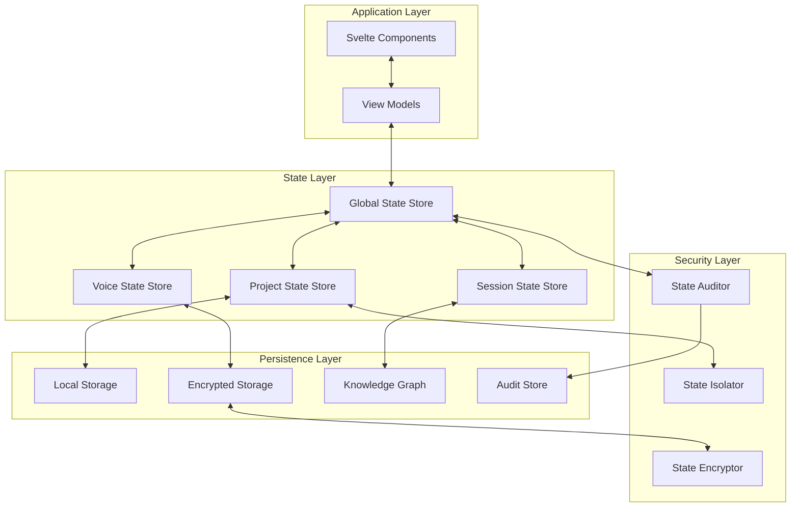

# State Management Architecture
## AlphanumericMango Project

Version: 1.0.0  
Last Updated: 2025-09-18  
Status: Phase 3 - Documentation Completion

---

## ADR-006: Comprehensive State Management Strategy

**Status**: Accepted  
**Decision**: Implement layered state management using Svelte stores with security-first design  
**Context**: Need centralized state management for voice-controlled terminal with multi-project context isolation

---

## 1. Executive Summary

The State Management Architecture defines a comprehensive strategy for managing application state in the AlphanumericMango voice-controlled terminal system. The architecture emphasizes security isolation, performance optimization, and maintainable state synchronization across multiple projects and voice interaction contexts.

### Key Architectural Principles
- **Isolation-First**: Strict boundaries between project contexts and user sessions
- **Reactive State**: Event-driven state updates with minimal re-renders
- **Security by Design**: Encrypted sensitive state with audit trails
- **Performance Optimized**: Lazy loading and efficient change detection
- **Recovery Resilient**: Session persistence and crash recovery capabilities

---

## 2. State Management Layers



---

## 3. Global Application State Design

### 3.1 Application State Interface

```typescript
interface ApplicationState {
  // Core application status
  system: SystemState;
  
  // User and authentication
  user: UserState;
  
  // Active projects and contexts
  projects: ProjectState[];
  activeProjectId: string | null;
  
  // Voice recognition and processing
  voice: VoiceState;
  
  // Terminal sessions
  terminals: TerminalState[];
  activeTerminalId: string | null;
  
  // UI and layout preferences
  ui: UIState;
  
  // Notifications and alerts
  notifications: NotificationState[];
  
  // AI conversation context
  aiContext: AIContextState;
  
  // Performance and diagnostics
  performance: PerformanceState;
}

interface SystemState {
  status: 'initializing' | 'ready' | 'error' | 'maintenance';
  version: string;
  environment: 'development' | 'production' | 'testing';
  lastHeartbeat: number;
  features: FeatureFlags;
  errors: SystemError[];
}

interface UserState {
  id: string;
  profile: UserProfile;
  preferences: UserPreferences;
  security: SecurityContext;
  session: SessionInfo;
  permissions: PermissionSet;
}

interface ProjectState {
  id: string;
  name: string;
  path: string;
  type: 'node' | 'python' | 'rust' | 'go' | 'generic';
  status: 'active' | 'inactive' | 'loading' | 'error';
  context: ProjectContext;
  terminals: string[]; // Terminal IDs
  lastAccessed: number;
  metadata: ProjectMetadata;
  security: ProjectSecurity;
}
```

### 3.2 Global State Store Implementation

```typescript
// /voice-terminal-hybrid/src/lib/stores/globalStore.ts
import { writable, derived, get } from 'svelte/store';
import type { Writable, Readable } from 'svelte/store';
import { stateEncryptor } from './security/stateEncryptor';
import { stateAuditor } from './security/stateAuditor';

class GlobalStateStore {
  private state: Writable<ApplicationState>;
  private persistenceStrategy: PersistenceStrategy;
  private securityLayer: StateSecurityLayer;
  
  constructor() {
    this.state = writable(this.initializeState());
    this.persistenceStrategy = new PersistenceStrategy();
    this.securityLayer = new StateSecurityLayer();
    this.setupMiddleware();
  }

  private initializeState(): ApplicationState {
    const restoredState = this.persistenceStrategy.restore();
    return this.validateAndSanitizeState(restoredState || this.getDefaultState());
  }

  private setupMiddleware() {
    // State change auditing
    this.state.subscribe((state) => {
      stateAuditor.logStateChange(state);
    });

    // Auto-persistence
    this.state.subscribe((state) => {
      this.persistenceStrategy.persist(state);
    });

    // Security validation
    this.state.subscribe((state) => {
      this.securityLayer.validateState(state);
    });
  }

  // Public API
  getState(): Readable<ApplicationState> {
    return this.state;
  }

  updateSystem(update: Partial<SystemState>) {
    this.state.update(state => ({
      ...state,
      system: { ...state.system, ...update }
    }));
  }

  updateUser(update: Partial<UserState>) {
    // Security check for user state changes
    this.securityLayer.validateUserUpdate(update);
    
    this.state.update(state => ({
      ...state,
      user: { ...state.user, ...update }
    }));
  }

  updateProject(projectId: string, update: Partial<ProjectState>) {
    // Isolation check
    this.securityLayer.validateProjectAccess(projectId);
    
    this.state.update(state => ({
      ...state,
      projects: state.projects.map(p => 
        p.id === projectId ? { ...p, ...update } : p
      )
    }));
  }
}

export const globalStateStore = new GlobalStateStore();
```

---

## 4. Project Context Isolation and Management

### 4.1 Project State Isolation Strategy

```typescript
interface ProjectContext {
  // Isolated execution environment
  environment: EnvironmentConfig;
  
  // Project-specific variables
  variables: Record<string, string>;
  
  // Active file and directory context
  workingDirectory: string;
  openFiles: OpenFile[];
  
  // Command history (project-specific)
  commandHistory: CommandHistoryEntry[];
  
  // AI conversation context (project-scoped)
  aiMemory: ProjectAIMemory;
  
  // Git context
  git: GitContext;
  
  // Dependencies and tools
  dependencies: DependencyInfo[];
  
  // Security sandbox configuration
  security: ProjectSecurityConfig;
}

interface ProjectSecurityConfig {
  allowedCommands: string[];
  restrictedPaths: string[];
  networkAccess: NetworkAccessPolicy;
  fileSystemAccess: FileSystemAccessPolicy;
  environmentVariables: EnvironmentVariablePolicy;
}
```

### 4.2 Project Isolation Implementation

```typescript
class ProjectStateManager {
  private projectStores: Map<string, ProjectStore> = new Map();
  private activeProject: string | null = null;
  
  createProject(projectConfig: ProjectConfig): string {
    const projectId = this.generateProjectId();
    const projectStore = new ProjectStore(projectId, projectConfig);
    
    // Apply security sandbox
    projectStore.applySecurity(projectConfig.security);
    
    this.projectStores.set(projectId, projectStore);
    return projectId;
  }

  switchProject(projectId: string): Promise<void> {
    // Security validation
    if (!this.hasProjectAccess(projectId)) {
      throw new SecurityError('Project access denied');
    }

    // Persist current project state
    if (this.activeProject) {
      await this.persistProjectState(this.activeProject);
    }

    // Restore new project state
    await this.restoreProjectState(projectId);
    
    this.activeProject = projectId;
    
    // Update global state
    globalStateStore.updateSystem({
      activeProjectId: projectId
    });
  }

  private async persistProjectState(projectId: string): Promise<void> {
    const projectStore = this.projectStores.get(projectId);
    if (!projectStore) return;

    const state = projectStore.getState();
    
    // Encrypt sensitive project data
    const encryptedState = await stateEncryptor.encryptProjectState(state);
    
    // Store in knowledge graph for cross-session persistence
    await knowledgeGraph.storeProjectContext(projectId, encryptedState);
  }

  getProjectState(projectId: string): Readable<ProjectState> {
    const projectStore = this.projectStores.get(projectId);
    if (!projectStore) {
      throw new Error(`Project ${projectId} not found`);
    }
    return projectStore.getState();
  }
}

export const projectStateManager = new ProjectStateManager();
```

---

## 5. Voice Recognition State Machine

### 5.1 Voice State Model

```typescript
interface VoiceState {
  // Current voice processing status
  status: VoiceStatus;
  
  // Voice recognition engine state
  recognition: RecognitionState;
  
  // Voice command processing
  command: CommandState;
  
  // Audio input configuration
  audio: AudioInputState;
  
  // Voice training and adaptation
  training: TrainingState;
  
  // Performance metrics
  performance: VoicePerformanceMetrics;
}

type VoiceStatus = 
  | 'idle'
  | 'listening'
  | 'processing'
  | 'understanding'
  | 'executing'
  | 'responding'
  | 'error';

interface RecognitionState {
  isActive: boolean;
  confidenceLevel: number;
  currentText: string;
  alternatives: string[];
  language: string;
  voiceActivityDetected: boolean;
  backgroundNoise: number;
}

interface CommandState {
  recognized: string | null;
  intent: CommandIntent | null;
  parameters: Record<string, any>;
  confidence: number;
  status: 'pending' | 'validated' | 'executing' | 'completed' | 'failed';
  executionTime?: number;
  result?: CommandResult;
}
```

### 5.2 Voice State Machine Implementation

```typescript
class VoiceStateMachine {
  private state: Writable<VoiceState>;
  private transitionMap: StateTransitionMap;
  
  constructor() {
    this.state = writable(this.getInitialState());
    this.transitionMap = this.buildTransitionMap();
    this.setupStateTransitions();
  }

  private buildTransitionMap(): StateTransitionMap {
    return {
      idle: {
        startListening: 'listening',
        error: 'error'
      },
      listening: {
        voiceDetected: 'processing',
        timeout: 'idle',
        cancel: 'idle',
        error: 'error'
      },
      processing: {
        textReady: 'understanding',
        processingFailed: 'listening',
        cancel: 'idle',
        error: 'error'
      },
      understanding: {
        intentRecognized: 'executing',
        intentUnclear: 'listening',
        invalidCommand: 'responding',
        cancel: 'idle',
        error: 'error'
      },
      executing: {
        commandCompleted: 'responding',
        commandFailed: 'responding',
        commandTimeout: 'responding',
        cancel: 'idle',
        error: 'error'
      },
      responding: {
        responseComplete: 'idle',
        continueListening: 'listening',
        error: 'error'
      },
      error: {
        recover: 'idle',
        retry: 'listening'
      }
    };
  }

  transition(event: VoiceEvent): void {
    this.state.update(currentState => {
      const currentStatus = currentState.status;
      const nextStatus = this.transitionMap[currentStatus]?.[event];
      
      if (!nextStatus) {
        console.warn(`Invalid transition: ${currentStatus} -> ${event}`);
        return currentState;
      }

      const newState = {
        ...currentState,
        status: nextStatus as VoiceStatus,
        lastTransition: {
          from: currentStatus,
          to: nextStatus,
          event,
          timestamp: Date.now()
        }
      };

      // Execute transition side effects
      this.executeTransitionEffects(currentStatus, nextStatus, event, newState);
      
      return newState;
    });
  }

  private executeTransitionEffects(
    from: VoiceStatus,
    to: VoiceStatus,
    event: VoiceEvent,
    state: VoiceState
  ): void {
    // Log transition for debugging and performance analysis
    stateAuditor.logVoiceTransition(from, to, event);
    
    // Update performance metrics
    this.updatePerformanceMetrics(from, to, state);
    
    // Trigger UI updates
    this.notifyUIComponents(to, state);
    
    // Handle error states
    if (to === 'error') {
      this.handleErrorState(state);
    }
  }
}

export const voiceStateMachine = new VoiceStateMachine();
```

---

## 6. Session Persistence Strategy

### 6.1 Session Recovery Design

```typescript
interface SessionPersistence {
  // Session identification
  sessionId: string;
  userId: string;
  startTime: number;
  lastActivity: number;
  
  // Application state snapshot
  applicationState: ApplicationStateSnapshot;
  
  // Project contexts
  projectContexts: Map<string, ProjectContextSnapshot>;
  
  // Voice training data
  voiceProfile: VoiceProfileSnapshot;
  
  // Terminal sessions
  terminalSessions: TerminalSessionSnapshot[];
  
  // UI state
  uiState: UIStateSnapshot;
  
  // Recovery metadata
  recoveryInfo: RecoveryMetadata;
}

interface RecoveryMetadata {
  crashDetected: boolean;
  lastSuccessfulSave: number;
  dataIntegrity: 'verified' | 'corrupted' | 'unknown';
  recoverableComponents: string[];
}
```

### 6.2 Session Recovery Implementation

```typescript
class SessionRecoveryManager {
  private static readonly RECOVERY_INTERVAL = 30000; // 30 seconds
  private static readonly MAX_RECOVERY_AGE = 24 * 60 * 60 * 1000; // 24 hours
  
  private recoveryTimer: NodeJS.Timeout | null = null;
  
  async initializeRecovery(): Promise<void> {
    const lastSession = await this.getLastSession();
    
    if (lastSession && this.shouldRecover(lastSession)) {
      await this.recoverSession(lastSession);
    }
    
    this.startPeriodicSave();
  }

  private shouldRecover(session: SessionPersistence): boolean {
    const age = Date.now() - session.lastActivity;
    const isRecentEnough = age < SessionRecoveryManager.MAX_RECOVERY_AGE;
    const hasValidData = session.recoveryInfo.dataIntegrity === 'verified';
    
    return isRecentEnough && hasValidData;
  }

  private async recoverSession(session: SessionPersistence): Promise<void> {
    try {
      // Decrypt session data
      const decryptedState = await stateEncryptor.decryptSessionData(session);
      
      // Validate data integrity
      if (!this.validateSessionIntegrity(decryptedState)) {
        throw new Error('Session data integrity check failed');
      }

      // Restore application state
      await globalStateStore.restoreState(decryptedState.applicationState);
      
      // Restore project contexts
      for (const [projectId, context] of decryptedState.projectContexts) {
        await projectStateManager.restoreProjectContext(projectId, context);
      }
      
      // Restore voice profile
      await voiceStateMachine.restoreVoiceProfile(decryptedState.voiceProfile);
      
      // Restore terminal sessions
      await this.restoreTerminalSessions(decryptedState.terminalSessions);
      
      // Restore UI state
      await this.restoreUIState(decryptedState.uiState);
      
      console.log('Session recovery completed successfully');
      
    } catch (error) {
      console.error('Session recovery failed:', error);
      await this.handleRecoveryFailure(session, error);
    }
  }

  private startPeriodicSave(): void {
    this.recoveryTimer = setInterval(async () => {
      try {
        await this.saveCurrentSession();
      } catch (error) {
        console.error('Session save failed:', error);
      }
    }, SessionRecoveryManager.RECOVERY_INTERVAL);
  }

  private async saveCurrentSession(): Promise<void> {
    const sessionData: SessionPersistence = {
      sessionId: this.generateSessionId(),
      userId: globalStateStore.getState().user.id,
      startTime: this.sessionStartTime,
      lastActivity: Date.now(),
      applicationState: await this.captureApplicationState(),
      projectContexts: await this.captureProjectContexts(),
      voiceProfile: await this.captureVoiceProfile(),
      terminalSessions: await this.captureTerminalSessions(),
      uiState: await this.captureUIState(),
      recoveryInfo: {
        crashDetected: false,
        lastSuccessfulSave: Date.now(),
        dataIntegrity: 'verified',
        recoverableComponents: this.getRecoverableComponents()
      }
    };

    // Encrypt session data
    const encryptedSession = await stateEncryptor.encryptSessionData(sessionData);
    
    // Store in persistent storage
    await this.persistSession(encryptedSession);
  }
}

export const sessionRecoveryManager = new SessionRecoveryManager();
```

---

## 7. Multi-Project State Management

### 7.1 Project State Isolation

```typescript
class ProjectStateIsolation {
  private projectSandboxes: Map<string, ProjectSandbox> = new Map();
  
  createProjectSandbox(projectId: string, config: ProjectConfig): ProjectSandbox {
    const sandbox = new ProjectSandbox({
      projectId,
      isolation: {
        fileSystem: this.createFileSystemIsolation(config),
        environment: this.createEnvironmentIsolation(config),
        network: this.createNetworkIsolation(config),
        process: this.createProcessIsolation(config)
      }
    });
    
    this.projectSandboxes.set(projectId, sandbox);
    return sandbox;
  }

  private createFileSystemIsolation(config: ProjectConfig): FileSystemIsolation {
    return {
      allowedPaths: [
        config.projectPath,
        ...config.allowedDirectories || []
      ],
      restrictedPaths: [
        '/etc',
        '/root',
        '/home/*/.ssh',
        ...config.restrictedPaths || []
      ],
      permissions: {
        read: config.permissions?.fileSystem?.read ?? true,
        write: config.permissions?.fileSystem?.write ?? false,
        execute: config.permissions?.fileSystem?.execute ?? false
      }
    };
  }

  switchToProject(projectId: string): Promise<void> {
    const sandbox = this.projectSandboxes.get(projectId);
    if (!sandbox) {
      throw new Error(`Project sandbox ${projectId} not found`);
    }

    return sandbox.activate();
  }
}

class ProjectSandbox {
  private isolation: IsolationConfig;
  private state: ProjectSandboxState;
  
  constructor(config: ProjectSandboxConfig) {
    this.isolation = config.isolation;
    this.state = {
      active: false,
      projectId: config.projectId,
      createdAt: Date.now(),
      lastAccessed: Date.now()
    };
  }

  async activate(): Promise<void> {
    // Apply file system restrictions
    await this.applyFileSystemIsolation();
    
    // Set environment variables
    await this.applyEnvironmentIsolation();
    
    // Configure network access
    await this.applyNetworkIsolation();
    
    // Set process limits
    await this.applyProcessIsolation();
    
    this.state.active = true;
    this.state.lastAccessed = Date.now();
  }

  async deactivate(): Promise<void> {
    // Clean up isolation settings
    await this.cleanupIsolation();
    
    this.state.active = false;
  }
}
```

---

## 8. Cross-Component State Synchronization

### 8.1 State Synchronization Strategy

```typescript
class StateSynchronization {
  private synchronizers: Map<string, ComponentSynchronizer> = new Map();
  private eventBus: EventBus;
  
  constructor() {
    this.eventBus = new EventBus();
    this.setupCoreSynchronizers();
  }

  private setupCoreSynchronizers(): void {
    // Voice ↔ UI synchronization
    this.registerSynchronizer('voice-ui', new VoiceUISynchronizer());
    
    // Terminal ↔ Project synchronization
    this.registerSynchronizer('terminal-project', new TerminalProjectSynchronizer());
    
    // AI ↔ Context synchronization
    this.registerSynchronizer('ai-context', new AIContextSynchronizer());
    
    // Theme ↔ Component synchronization
    this.registerSynchronizer('theme-components', new ThemeComponentSynchronizer());
  }

  registerSynchronizer(id: string, synchronizer: ComponentSynchronizer): void {
    this.synchronizers.set(id, synchronizer);
    synchronizer.initialize(this.eventBus);
  }
}

abstract class ComponentSynchronizer {
  protected eventBus: EventBus;
  
  abstract initialize(eventBus: EventBus): void;
  abstract handleStateChange(event: StateChangeEvent): void;
  abstract cleanup(): void;
}

class VoiceUISynchronizer extends ComponentSynchronizer {
  initialize(eventBus: EventBus): void {
    this.eventBus = eventBus;
    
    // Listen for voice state changes
    voiceStateMachine.subscribe(voiceState => {
      this.updateUIVoiceIndicators(voiceState);
      this.handleVoiceCommands(voiceState);
    });
    
    // Listen for UI events that affect voice
    eventBus.on('ui:voice-toggle', (enabled) => {
      voiceStateMachine.transition(enabled ? 'startListening' : 'cancel');
    });
  }

  private updateUIVoiceIndicators(voiceState: VoiceState): void {
    globalStateStore.updateUI({
      voiceIndicator: {
        status: voiceState.status,
        confidence: voiceState.recognition.confidenceLevel,
        isListening: voiceState.status === 'listening'
      }
    });
  }

  private handleVoiceCommands(voiceState: VoiceState): void {
    if (voiceState.command.status === 'completed' && voiceState.command.result) {
      this.eventBus.emit('voice:command-executed', voiceState.command.result);
    }
  }
}
```

---

## 9. State Security and Encryption

### 9.1 State Encryption Strategy

```typescript
class StateEncryption {
  private encryptionKey: CryptoKey;
  private sensitiveFields: Set<string>;
  
  constructor() {
    this.sensitiveFields = new Set([
      'user.apiKeys',
      'user.credentials',
      'projects.*.environment.secrets',
      'voice.training.voicePrint',
      'ai.context.conversationHistory'
    ]);
  }

  async encryptState(state: ApplicationState): Promise<EncryptedState> {
    const sensitiveData = this.extractSensitiveData(state);
    const publicData = this.removeSensitiveData(state);
    
    const encryptedSensitive = await this.encrypt(JSON.stringify(sensitiveData));
    
    return {
      publicData,
      encryptedData: encryptedSensitive,
      encryptionMetadata: {
        algorithm: 'AES-GCM',
        keyId: await this.getKeyId(),
        timestamp: Date.now()
      }
    };
  }

  async decryptState(encryptedState: EncryptedState): Promise<ApplicationState> {
    const decryptedSensitive = await this.decrypt(encryptedState.encryptedData);
    const sensitiveData = JSON.parse(decryptedSensitive);
    
    return this.mergeSensitiveData(encryptedState.publicData, sensitiveData);
  }

  private extractSensitiveData(state: ApplicationState): SensitiveStateData {
    const sensitiveData: SensitiveStateData = {};
    
    for (const field of this.sensitiveFields) {
      const value = this.getNestedValue(state, field);
      if (value !== undefined) {
        this.setNestedValue(sensitiveData, field, value);
      }
    }
    
    return sensitiveData;
  }

  private async encrypt(data: string): Promise<EncryptedData> {
    const encoder = new TextEncoder();
    const iv = crypto.getRandomValues(new Uint8Array(12));
    
    const encrypted = await crypto.subtle.encrypt(
      { name: 'AES-GCM', iv },
      this.encryptionKey,
      encoder.encode(data)
    );
    
    return {
      data: new Uint8Array(encrypted),
      iv,
      authTag: new Uint8Array(16) // GCM includes auth tag
    };
  }
}

export const stateEncryption = new StateEncryption();
```

---

## 10. Performance Optimization

### 10.1 State Update Optimization

```typescript
class StatePerformanceOptimizer {
  private updateBatcher: UpdateBatcher;
  private changeDetector: ChangeDetector;
  private memoryMonitor: MemoryMonitor;
  
  constructor() {
    this.updateBatcher = new UpdateBatcher({
      batchSize: 10,
      maxDelay: 16 // ~60fps
    });
    
    this.changeDetector = new ChangeDetector({
      deepCompare: false, // Use shallow comparison for performance
      ignoreFields: ['lastActivity', 'heartbeat']
    });
    
    this.memoryMonitor = new MemoryMonitor({
      maxStateSize: 50 * 1024 * 1024, // 50MB
      gcThreshold: 0.8
    });
  }

  optimizeStateUpdate<T>(
    store: Writable<T>,
    updater: (state: T) => T
  ): void {
    this.updateBatcher.batch(() => {
      store.update(currentState => {
        const newState = updater(currentState);
        
        // Skip update if no actual change
        if (!this.changeDetector.hasChanged(currentState, newState)) {
          return currentState;
        }
        
        // Check memory constraints
        this.memoryMonitor.checkMemoryUsage(newState);
        
        return newState;
      });
    });
  }
}

class UpdateBatcher {
  private pendingUpdates: (() => void)[] = [];
  private batchTimer: NodeJS.Timeout | null = null;
  private config: BatchConfig;
  
  constructor(config: BatchConfig) {
    this.config = config;
  }

  batch(update: () => void): void {
    this.pendingUpdates.push(update);
    
    if (this.pendingUpdates.length >= this.config.batchSize) {
      this.flushUpdates();
    } else if (!this.batchTimer) {
      this.batchTimer = setTimeout(() => {
        this.flushUpdates();
      }, this.config.maxDelay);
    }
  }

  private flushUpdates(): void {
    if (this.batchTimer) {
      clearTimeout(this.batchTimer);
      this.batchTimer = null;
    }
    
    const updates = this.pendingUpdates.splice(0);
    
    // Execute all batched updates
    for (const update of updates) {
      update();
    }
  }
}

export const statePerformanceOptimizer = new StatePerformanceOptimizer();
```

---

## 11. State Monitoring and Debugging

### 11.1 State Audit System

```typescript
class StateAuditor {
  private auditLog: StateAuditEntry[] = [];
  private maxLogSize: number = 1000;
  
  logStateChange(
    component: string,
    oldState: any,
    newState: any,
    metadata?: StateChangeMetadata
  ): void {
    const entry: StateAuditEntry = {
      id: this.generateId(),
      timestamp: Date.now(),
      component,
      changeType: this.detectChangeType(oldState, newState),
      oldState: this.sanitizeForLog(oldState),
      newState: this.sanitizeForLog(newState),
      metadata,
      stackTrace: this.captureStackTrace()
    };
    
    this.auditLog.push(entry);
    
    // Maintain log size
    if (this.auditLog.length > this.maxLogSize) {
      this.auditLog.shift();
    }
    
    // Check for potential issues
    this.analyzeStateChange(entry);
  }

  private analyzeStateChange(entry: StateAuditEntry): void {
    // Detect rapid state changes
    const recentChanges = this.auditLog
      .filter(e => e.component === entry.component && 
                   Date.now() - e.timestamp < 1000)
      .length;
      
    if (recentChanges > 10) {
      console.warn(`Rapid state changes detected in ${entry.component}`);
    }
    
    // Detect circular updates
    if (this.detectCircularUpdates(entry)) {
      console.error(`Circular state update detected in ${entry.component}`);
    }
    
    // Detect memory leaks
    if (this.detectMemoryLeak(entry)) {
      console.warn(`Potential memory leak in ${entry.component}`);
    }
  }

  getAuditReport(): StateAuditReport {
    return {
      totalChanges: this.auditLog.length,
      componentBreakdown: this.getComponentBreakdown(),
      performanceMetrics: this.getPerformanceMetrics(),
      issues: this.getDetectedIssues()
    };
  }
}

export const stateAuditor = new StateAuditor();
```

---

## 12. Implementation Timeline

### Phase 3.1: Core State Infrastructure (Week 3, Days 1-2)
- Implement GlobalStateStore with security middleware
- Create ProjectStateManager with isolation
- Set up StateEncryption system

### Phase 3.2: Voice and Session Management (Week 3, Days 3-4)
- Implement VoiceStateMachine
- Create SessionRecoveryManager
- Set up state synchronization framework

### Phase 3.3: Performance and Monitoring (Week 3, Days 5-7)
- Implement StatePerformanceOptimizer
- Create StateAuditor and monitoring
- Performance testing and optimization

---

## 13. Security Considerations

### 13.1 State Security Controls
- **Encryption**: All sensitive state data encrypted at rest
- **Isolation**: Project contexts fully isolated
- **Auditing**: Complete audit trail of state changes
- **Validation**: Input validation on all state updates
- **Access Control**: Role-based access to state components

### 13.2 Security Metrics
- State encryption time: <10ms
- Project isolation overhead: <5ms
- Audit log size: <100MB
- Security validation time: <1ms

---

## 14. Testing Strategy

### 14.1 State Testing Framework
```typescript
class StateTestingFramework {
  createTestState(overrides?: Partial<ApplicationState>): ApplicationState {
    return {
      ...this.getBaseTestState(),
      ...overrides
    };
  }

  async testStateTransition(
    initialState: ApplicationState,
    action: StateAction,
    expectedState: ApplicationState
  ): Promise<TestResult> {
    const store = writable(initialState);
    
    // Apply action
    await this.applyAction(store, action);
    
    // Verify result
    const finalState = get(store);
    return this.compareStates(finalState, expectedState);
  }

  testPerformance(
    testCase: string,
    operation: () => void,
    maxDuration: number
  ): PerformanceResult {
    const start = performance.now();
    operation();
    const duration = performance.now() - start;
    
    return {
      testCase,
      duration,
      passed: duration <= maxDuration,
      threshold: maxDuration
    };
  }
}

export const stateTestingFramework = new StateTestingFramework();
```

---

## Document History
- v1.0.0 (2025-09-18): Initial state management architecture documentation