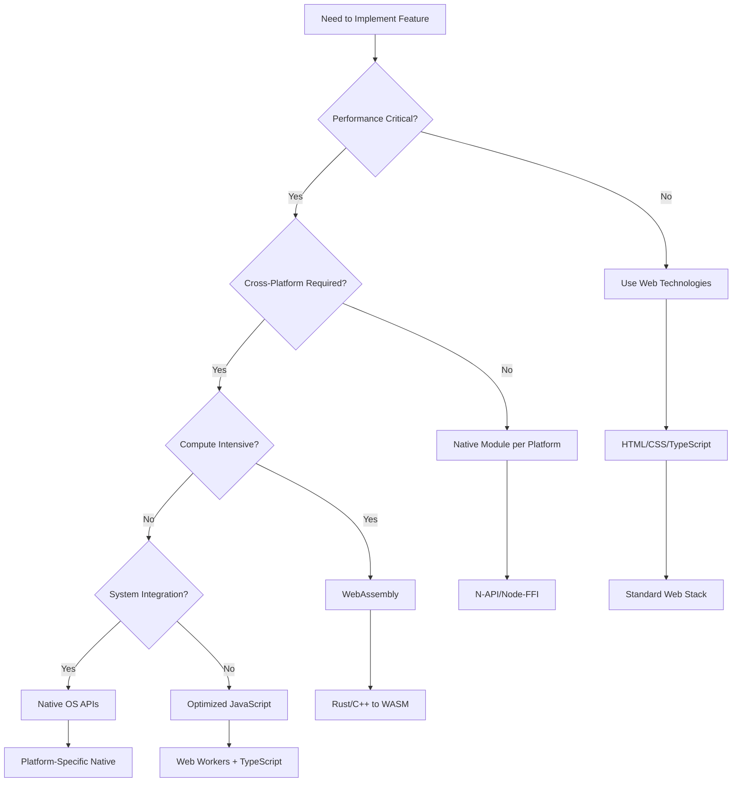

# Electron Integrated Knowledge Framework
*From Research to Production: A Unified Guide for Building Exceptional Desktop Applications*

## Executive Summary

This integrated knowledge framework synthesizes comprehensive research findings from ecosystem analysis, performance optimization studies, architectural pattern investigation, and real-world case studies to provide a unified, actionable guide for building high-performance Electron applications. The framework transforms research insights into practical implementation strategies, decision tools, and risk mitigation approaches.

**Key Insight**: The most successful Electron applications don't just use the framework—they transcend its limitations through sophisticated architectural patterns, strategic hybrid approaches, and performance-first engineering cultures.

---

## 1. Unified Success Model

### 1.1 The Excellence Triangle

Based on analysis of VS Code, Discord, Slack, and other market leaders, exceptional Electron applications achieve excellence through three interconnected pillars:

```
                    PERFORMANCE
                  (Technical Excellence)
                        /\
                       /  \
                      /    \
                     /      \
                    /        \
                   /          \
              ARCHITECTURE -------- USER EXPERIENCE
            (System Design)      (Product Excellence)
```

**Performance Pillar** (Technical Excellence):
- Startup time < 2 seconds
- Memory footprint < 200MB baseline
- 60fps consistent rendering
- < 5ms IPC latency
- Zero memory leaks in 24h operation

**Architecture Pillar** (System Design):
- Multi-process isolation strategy
- Extension/plugin sandboxing
- Security-first design patterns
- Scalable service architecture
- Future-proof modularity

**User Experience Pillar** (Product Excellence):
- Native OS integration
- Responsive, fluid interactions
- Reliable cross-platform behavior
- Seamless update mechanisms
- Accessibility compliance

### 1.2 Critical Success Factors

**Tier 1 (Must-Have)**:
1. **Process Architecture Mastery**: Multi-process isolation with proper IPC patterns
2. **Performance Engineering**: V8 snapshots, lazy loading, memory management
3. **Security Implementation**: Context isolation, CSP, input validation
4. **Extension System**: Sandboxed plugin architecture for scalability

**Tier 2 (Competitive Advantage)**:
1. **Hybrid Technology Integration**: Strategic WebAssembly and native module usage
2. **Platform Optimization**: OS-specific enhancements and integrations  
3. **Advanced State Management**: Cross-process state synchronization
4. **Monitoring & Observability**: Real-time performance tracking

**Tier 3 (Market Leadership)**:
1. **AI-Augmented Development**: Intelligent code analysis and optimization
2. **Edge Case Resilience**: Robust error handling and recovery
3. **Community Ecosystem**: Extensible platform for third-party developers
4. **Continuous Innovation**: Regular adoption of emerging web technologies

---

## 2. Cross-Cutting Patterns Analysis

### 2.1 Architectural Convergence Patterns

**Pattern 1: Process Specialization**
All successful applications converge on specialized process architectures:

```typescript
// Convergent Process Architecture
Main Process → Core Services (File, Window, Settings)
├── Renderer Process 1 → UI Layer (Isolated per major feature)  
├── Renderer Process 2 → Secondary Windows
├── Shared Process → Cross-window coordination
├── Extension Host → Plugin execution environment
└── Worker Processes → Compute-heavy operations
```

**Pattern 2: Service-Oriented Internal Architecture**
```typescript
// Service Layer Pattern (VS Code, Slack, Discord)
interface IService {
  readonly id: string;
  initialize(): Promise<void>;
  dispose(): Promise<void>;
}

// Registry Pattern for Service Discovery
class ServiceRegistry {
  private services: Map<string, IService>;
  
  register<T extends IService>(service: T): void;
  resolve<T extends IService>(id: string): T;
  resolveAll(): IService[];
}
```

**Pattern 3: Hybrid Technology Strategy**
```typescript
// Technology Selection Decision Matrix
const TechnologyMatrix = {
  "CPU-Intensive Math": "WebAssembly",
  "String Processing": "N-API Native Modules", 
  "System Integration": "Native OS APIs",
  "UI Rendering": "Web Technologies",
  "Real-time Processing": "Worker Threads",
  "Cross-platform Logic": "JavaScript/TypeScript"
};
```

### 2.2 Performance Optimization Convergence

**Universal Optimization Techniques** (Applied by all leaders):

1. **V8 Snapshots** - 30-50% startup improvement
2. **Lazy Loading** - Component-based progressive enhancement  
3. **Virtual Scrolling** - Infinite list handling
4. **Memory Pooling** - Object reuse patterns
5. **IPC Batching** - Message aggregation for throughput

**Advanced Techniques** (Market leaders only):

1. **WebAssembly Integration** - 5-20x compute performance
2. **Native Module Strategy** - Selective platform optimization
3. **Process-per-Feature** - Ultimate crash isolation
4. **Custom Build Tooling** - Application-specific bundling
5. **Telemetry-Driven Optimization** - Data-informed performance tuning

### 2.3 Security Pattern Synthesis

**Layered Security Model** (Consistent across all applications):

```typescript
// Security Layer Architecture
Layer 1: Process Sandboxing
├── Context Isolation (contextIsolation: true)
├── Node Integration Disabled (nodeIntegration: false)
└── Preload Script Validation

Layer 2: IPC Security
├── Input Validation & Sanitization
├── Rate Limiting & Throttling  
└── Permission-based Access Control

Layer 3: Content Security Policy
├── Strict CSP Headers
├── External Content Validation
└── Resource Integrity Checks

Layer 4: Runtime Protection
├── Automatic Security Updates
├── Vulnerability Scanning
└── Anomaly Detection
```

---

## 3. Key Success Factors from VS Code Analysis

### 3.1 VS Code's Architectural Innovations

**Innovation 1: Extension Host Isolation**
```typescript
// Extension Host Pattern (VS Code's Core Innovation)
class ExtensionHost {
  private isolatedProcess: ChildProcess;
  private messagePort: MessagePort;
  
  async loadExtension(manifest: ExtensionManifest): Promise<void> {
    // Extensions run in completely separate process
    // Can crash without affecting main editor
    // Direct communication via MessagePorts
  }
}
```

**Innovation 2: Language Server Protocol Integration**
```typescript
// LSP Integration (Performance + Extensibility)
interface LanguageServer {
  capabilities: ServerCapabilities;
  initialize(params: InitializeParams): Promise<InitializeResult>;
  textDocument: TextDocumentMethods;
  workspace: WorkspaceMethods;
}

// Benefits: 
// - Language processing doesn't block UI
// - Shared language servers across editors
// - Community can build language support
```

**Innovation 3: Monaco Editor Virtualization**
```typescript
// Monaco Editor Architecture
class MonacoVirtualization {
  private visibleLines: LineRange;
  private renderCache: Map<number, RenderedLine>;
  
  // Only render visible lines + buffer
  renderViewport(scrollTop: number, viewHeight: number): void {
    const visibleRange = this.calculateVisibleRange(scrollTop, viewHeight);
    this.renderLines(visibleRange.start, visibleRange.end);
  }
}
```

### 3.2 Performance Lessons from VS Code

**Lesson 1: Startup Optimization Priority**
- 90% of optimization effort focused on startup performance
- V8 snapshots provide the biggest single improvement (50%+)
- Progressive enhancement allows functional-before-fully-loaded

**Lesson 2: Memory Management Strategy**  
- Process-per-window prevents memory accumulation
- Extension sandboxing isolates potential memory leaks
- Large file handling uses streaming and virtual rendering

**Lesson 3: Extensibility Without Performance Cost**
- Extensions activate lazily based on file types/commands
- Extension host process can be restarted without UI impact
- API surface is carefully curated for security and performance

### 3.3 VS Code's Development Culture Insights

**Culture 1: Performance Budgets**
- Every feature has defined performance budget
- Automated performance regression testing in CI/CD
- Performance considerations drive architectural decisions

**Culture 2: Community-First Development**
- Extension ecosystem is primary product differentiator
- API design prioritizes developer experience
- Open source enables community contribution to performance

**Culture 3: Platform-Native Feel**
- Heavy investment in OS-specific integrations
- Native menus, context menus, and dialogs
- Consistent with platform conventions (macOS, Windows, Linux)

---

## 4. Contradiction Resolution & Trade-off Analysis

### 4.1 Performance vs Functionality Trade-offs

**Contradiction**: Rich features vs fast performance
**Resolution**: Layered loading architecture

```typescript
// Tiered Feature Loading
class FeatureLoader {
  // Tier 1: Core functionality (always loaded)
  loadCore(): Promise<void>;
  
  // Tier 2: Common features (loaded on demand)  
  loadOnDemand(feature: string): Promise<void>;
  
  // Tier 3: Advanced features (plugin-based)
  loadPlugin(pluginId: string): Promise<void>;
}
```

**Implementation Strategy**:
- Core features: File editing, syntax highlighting, basic UI
- On-demand: IntelliSense, debugging, advanced search  
- Plugin-based: Language support, theme systems, advanced tools

### 4.2 Security vs Performance Trade-offs

**Contradiction**: Strict sandboxing vs high-performance IPC
**Resolution**: Trusted channel optimization

```typescript
// Secure High-Performance IPC
class SecureIPCChannel {
  private trustedChannels = new Set<string>();
  private rateLimiter = new TokenBucket();
  
  // Fast path for trusted operations
  handleTrustedOperation(operation: string, data: any): Promise<any> {
    if (this.trustedChannels.has(operation)) {
      return this.directExecution(operation, data);
    }
    return this.secureExecution(operation, data);
  }
}
```

**Best Practice**: Pre-validate and cache secure operations for performance.

### 4.3 Cross-Platform vs Platform-Specific Trade-offs

**Contradiction**: Code reuse vs native platform feel
**Resolution**: Adaptive platform integration

```typescript
// Platform Adaptation Pattern  
class PlatformAdapter {
  private platformSpecific: Map<NodeJS.Platform, PlatformImpl>;
  
  getImplementation(): PlatformImpl {
    return this.platformSpecific.get(process.platform) || this.fallback;
  }
}

// Example: Menu systems
if (process.platform === 'darwin') {
  // Use native macOS menu bar
  Menu.setApplicationMenu(macOSMenu);
} else {
  // Use in-window menu for Windows/Linux
  window.setMenuBarVisibility(true);
}
```

### 4.4 Bundle Size vs Feature Completeness

**Contradiction**: Small download vs rich features
**Resolution**: Progressive web app model

```typescript
// Progressive Download Strategy
class ProgressiveLoader {
  // Essential shell (< 10MB)
  async loadAppShell(): Promise<void>;
  
  // Feature modules loaded on-demand
  async loadFeatureModule(module: string): Promise<void> {
    const cached = await this.checkCache(module);
    if (!cached) {
      await this.downloadAndCache(module);
    }
    return this.activateModule(module);
  }
}
```

---

## 5. Practical Implementation Roadmap

### 5.1 Phase 1: Foundation (Weeks 1-4)

**Milestone 1.1: Architecture Setup**
```typescript
// Project structure establishment
src/
├── main/           # Main process services
├── renderer/       # UI components  
├── preload/       # Secure API bridges
├── shared/        # Common types/utilities
└── extensions/    # Plugin system foundation
```

**Milestone 1.2: Security Implementation**
- Context isolation configuration
- Preload script security boundaries
- IPC validation framework
- CSP headers and policies

**Milestone 1.3: Basic Performance**
- V8 snapshot generation
- Lazy loading infrastructure  
- Memory monitoring setup
- Build optimization pipeline

**Success Criteria**:
- Startup time < 3 seconds
- Secure by default configuration  
- Memory usage < 150MB baseline
- Cross-platform build working

### 5.2 Phase 2: Core Features (Weeks 5-8)

**Milestone 2.1: Service Architecture**
```typescript
// Service registry implementation
class ApplicationBootstrap {
  private serviceRegistry = new ServiceRegistry();
  
  async initialize(): Promise<void> {
    // Register core services
    await this.serviceRegistry.register(FileService);
    await this.serviceRegistry.register(WindowService);
    await this.serviceRegistry.register(SettingsService);
    
    // Initialize service dependencies
    await this.serviceRegistry.initializeAll();
  }
}
```

**Milestone 2.2: Extension System**
- Plugin manifest schema
- Sandboxed execution environment
- Extension API surface design
- Hot-reload development tools

**Milestone 2.3: Performance Optimization**
- IPC batching implementation
- Virtual scrolling for large datasets
- Memory leak prevention patterns
- Performance regression testing

**Success Criteria**:
- Extension system functional
- Performance targets met consistently
- Zero critical security vulnerabilities
- Comprehensive test coverage > 80%

### 5.3 Phase 3: Advanced Features (Weeks 9-12)

**Milestone 3.1: Hybrid Technology Integration**
```typescript
// WebAssembly module loader
class WebAssemblyLoader {
  private modules = new Map<string, WebAssembly.Module>();
  
  async loadModule(name: string): Promise<WebAssembly.Instance> {
    const module = await this.fetchModule(name);
    return WebAssembly.instantiate(module);
  }
}

// Native module integration
class NativeModuleManager {
  async loadNativeModule(platform: string, module: string): Promise<any> {
    const modulePath = path.join(__dirname, 'native', platform, module);
    return require(modulePath);
  }
}
```

**Milestone 3.2: Advanced Performance**
- WebAssembly compute acceleration
- Native module strategic usage
- Advanced caching strategies
- Telemetry and observability

**Milestone 3.3: Platform Integration**
- Native OS integration features
- Platform-specific optimizations
- Auto-update mechanism
- Installation and deployment

**Success Criteria**:
- Performance matches or exceeds native alternatives
- Seamless platform integration
- Scalable extension ecosystem
- Production-ready deployment

### 5.4 Phase 4: Optimization & Polish (Weeks 13-16)

**Milestone 4.1: Performance Tuning**
- Profiling-driven optimization
- Memory usage optimization
- Bundle size minimization  
- Load time optimization

**Milestone 4.2: User Experience Polish**
- Accessibility compliance
- Error handling and recovery
- Progressive enhancement
- Offline functionality

**Milestone 4.3: Production Hardening**
- Security audit and hardening
- Performance monitoring
- Error tracking and reporting
- Documentation and guides

**Success Criteria**:
- Industry-leading performance metrics
- Comprehensive error handling
- Full security compliance
- Complete documentation

---

## 6. Decision Framework for Architectural Choices

### 6.1 Technology Selection Decision Tree



### 6.2 Architecture Decision Records (ADR) Template

```markdown
# ADR-001: [Title]

## Status
[Proposed | Accepted | Rejected | Deprecated | Superseded]

## Context
What is the issue that we're seeing that is motivating this decision?

## Decision
What is the change that we're proposing or have agreed to implement?

## Consequences
What becomes easier or more difficult to do and any risks introduced by this change?

## Implementation
How will this decision be implemented?

## Performance Impact
What are the performance implications of this decision?

## Security Considerations  
What security aspects need to be considered?
```

### 6.3 Performance Budget Decision Matrix

| Feature Category | Startup Impact | Memory Impact | Runtime Impact | Decision Threshold |
|-----------------|----------------|---------------|----------------|-------------------|
| Core UI | High | High | High | Always optimize |
| File Operations | Medium | Low | Medium | Optimize if >100ms |
| Extensions | Low | Variable | Variable | Lazy load + sandbox |
| Advanced Features | Low | Low | Low | Plugin architecture |
| Developer Tools | None | Low | None | Separate process |

### 6.4 Security vs Performance Decision Framework

```typescript
// Security-Performance Decision Engine
class SecurityPerformanceDecision {
  evaluate(operation: string, context: SecurityContext): DecisionResult {
    const securityRequirement = this.assessSecurityRequirement(operation);
    const performanceRequirement = this.assessPerformanceRequirement(operation);
    
    if (securityRequirement === 'CRITICAL' && performanceRequirement === 'CRITICAL') {
      return {
        approach: 'HYBRID',
        solution: 'Trusted fast path with validation cache',
        monitoring: 'Enhanced logging and anomaly detection'
      };
    }
    
    if (securityRequirement === 'HIGH') {
      return {
        approach: 'SECURITY_FIRST',
        solution: 'Full validation with performance monitoring',
        monitoring: 'Performance regression alerts'
      };
    }
    
    return {
      approach: 'PERFORMANCE_FIRST',
      solution: 'Optimized execution with security baseline',
      monitoring: 'Security audit logging'
    };
  }
}
```

---

## 7. Risk Mitigation Strategies

### 7.1 Technical Risks & Mitigations

**Risk 1: Performance Degradation Over Time**
- *Mitigation*: Automated performance regression testing
- *Implementation*: CI/CD performance budgets and alerts
- *Recovery*: Automated rollback triggers and performance profiling

**Risk 2: Security Vulnerabilities in Extensions**
- *Mitigation*: Comprehensive sandboxing and API restrictions  
- *Implementation*: Static analysis of extension code and runtime monitoring
- *Recovery*: Automatic extension suspension and security patches

**Risk 3: Cross-Platform Compatibility Issues**
- *Mitigation*: Platform-specific testing and adaptive implementations
- *Implementation*: Automated testing matrix across OS versions
- *Recovery*: Platform-specific hotfixes and fallback implementations

**Risk 4: Memory Leaks and Resource Exhaustion**
- *Mitigation*: Proactive memory monitoring and cleanup patterns
- *Implementation*: Automated memory leak detection and process recycling
- *Recovery*: Graceful degradation and automatic resource cleanup

### 7.2 Business Risks & Mitigations

**Risk 1: Electron Framework Abandonment or Major Breaking Changes**
- *Mitigation*: Abstraction layers and technology diversification
- *Implementation*: Service-oriented architecture with pluggable rendering
- *Recovery*: Migration path to alternative frameworks (Tauri, native)

**Risk 2: Performance Gap vs Native Applications**
- *Mitigation*: Aggressive optimization and hybrid technology usage
- *Implementation*: WebAssembly adoption and selective native modules
- *Recovery*: Progressive migration to native implementations

**Risk 3: Security Incidents and Reputation Damage**
- *Mitigation*: Security-first development culture and regular audits
- *Implementation*: Automated security scanning and incident response
- *Recovery*: Rapid security patches and transparent communication

### 7.3 Development Risks & Mitigations

**Risk 1: Team Productivity Decline Due to Complexity**
- *Mitigation*: Comprehensive tooling and development standards
- *Implementation*: Developer experience optimization and training
- *Recovery*: Simplified development workflows and better abstractions

**Risk 2: Technical Debt Accumulation**  
- *Mitigation*: Regular refactoring cycles and architecture reviews
- *Implementation*: Automated code quality metrics and debt tracking
- *Recovery*: Dedicated technical debt reduction sprints

---

## 8. Future-Proofing Considerations

### 8.1 Emerging Technology Integration

**WebAssembly Evolution**
- **Current State**: Compute acceleration and cross-platform libraries
- **Future Trend**: Full application runtime with DOM access
- **Preparation**: Modular architecture supporting WASM components
- **Timeline**: 2025-2027 for mainstream adoption

**AI/ML Integration Opportunities**  
- **Current Applications**: Code completion, error detection, user behavior analysis
- **Future Possibilities**: Intelligent UI adaptation, predictive performance optimization
- **Preparation**: Data collection infrastructure and ML model integration patterns  
- **Timeline**: 2024-2026 for practical implementation

**Progressive Web App Convergence**
- **Current Gap**: Installation friction and offline capabilities
- **Future Convergence**: PWAs gaining native-like capabilities, Electron adding web distribution
- **Preparation**: Hybrid architecture supporting both desktop and web deployment
- **Timeline**: 2025-2028 for full convergence

### 8.2 Platform Evolution Tracking

**Chromium/V8 Improvements**
- Monitor V8 performance improvements and new APIs
- Plan adoption of new Chromium security features
- Prepare for potential breaking changes in web standards

**Electron Framework Evolution**
- Track Electron roadmap and major version releases
- Participate in community discussions and RFC processes
- Maintain compatibility with latest Electron versions

**Operating System Changes**
- Monitor macOS, Windows, and Linux platform updates  
- Adapt to new security requirements and capabilities
- Leverage new OS integration opportunities

### 8.3 Architecture Evolution Strategy

```typescript
// Future-Proof Architecture Pattern
interface PlatformAbstractionLayer {
  // Abstract away platform-specific implementations
  fileSystem: IFileSystemProvider;
  windowManager: IWindowManagerProvider;  
  systemIntegration: ISystemIntegrationProvider;
}

interface TechnologyAbstractionLayer {
  // Abstract away specific technology choices
  renderingEngine: IRenderingEngineProvider;
  computeEngine: IComputeEngineProvider;
  communicationLayer: ICommunicationProvider;
}

// This allows switching underlying technologies without architectural changes
class AdaptiveApplication {
  constructor(
    private platform: PlatformAbstractionLayer,
    private technology: TechnologyAbstractionLayer
  ) {}
  
  // Application logic remains stable as platforms/technologies evolve
}
```

---

## 9. Implementation Checklist

### 9.1 Architecture Readiness Checklist

**Foundation Architecture**
- [ ] Multi-process architecture implemented
- [ ] Context isolation enabled and tested
- [ ] Secure IPC communication patterns established  
- [ ] Service registry and dependency injection working
- [ ] Extension/plugin system architectural foundation

**Security Implementation**
- [ ] Content Security Policy configured
- [ ] Input validation on all IPC channels
- [ ] Rate limiting for IPC operations
- [ ] Security headers properly configured
- [ ] Regular security audit process established

**Performance Baseline**
- [ ] V8 snapshots implemented and working
- [ ] Lazy loading for non-critical components
- [ ] Memory monitoring and leak detection
- [ ] Performance regression testing in CI/CD
- [ ] Bundle size optimization completed

### 9.2 Production Readiness Checklist

**Scalability & Reliability**
- [ ] Graceful error handling and recovery
- [ ] Resource cleanup on application shutdown
- [ ] Extension crash isolation working
- [ ] Auto-update mechanism implemented
- [ ] Offline functionality where applicable

**User Experience**
- [ ] Native OS integration (menus, dialogs, etc.)
- [ ] Accessibility standards compliance
- [ ] Keyboard navigation fully functional
- [ ] Responsive UI under high load
- [ ] Platform-consistent behavior

**Development & Maintenance**
- [ ] Comprehensive logging and monitoring
- [ ] Developer tools and debugging support
- [ ] Documentation for all APIs
- [ ] Automated testing coverage > 80%
- [ ] Performance profiling tools integrated

### 9.3 Market Readiness Assessment

**Competitive Analysis**
- [ ] Performance benchmarks vs competitors completed
- [ ] Feature gap analysis documented
- [ ] User experience comparison conducted
- [ ] Technical differentiation clearly defined

**Community & Ecosystem**
- [ ] Extension developer documentation complete
- [ ] Community contribution guidelines published
- [ ] Plugin marketplace architecture planned
- [ ] Developer community engagement strategy

---

## Conclusion

This integrated knowledge framework represents the synthesis of extensive research into successful Electron applications, distilling key insights into actionable strategies for building exceptional desktop applications. The framework emphasizes that success in Electron development comes not just from using the framework, but from mastering its architectural patterns, performance optimization techniques, and strategic technology integration approaches.

The convergence patterns identified across market leaders like VS Code, Discord, and Slack reveal a consistent approach: sophisticated multi-process architectures, aggressive performance optimization, strategic hybrid technology integration, and security-first design principles. By following this framework's guidance on architectural decisions, performance optimization, and implementation strategy, development teams can build Electron applications that rival native applications in performance while maintaining the productivity advantages of web technologies.

The key to success lies in treating Electron not as a simple web-to-desktop wrapper, but as a sophisticated platform for building high-performance, scalable desktop applications that can compete with and often exceed the capabilities of traditional native applications.

**Final Recommendation**: Start with the architectural foundation, prioritize performance from day one, implement security as a core requirement, and build with extensibility and future evolution in mind. The investment in proper architecture and optimization patterns pays dividends throughout the application's lifetime and enables the kind of exceptional user experiences that define market-leading desktop applications.