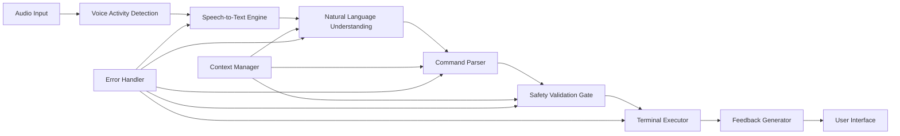
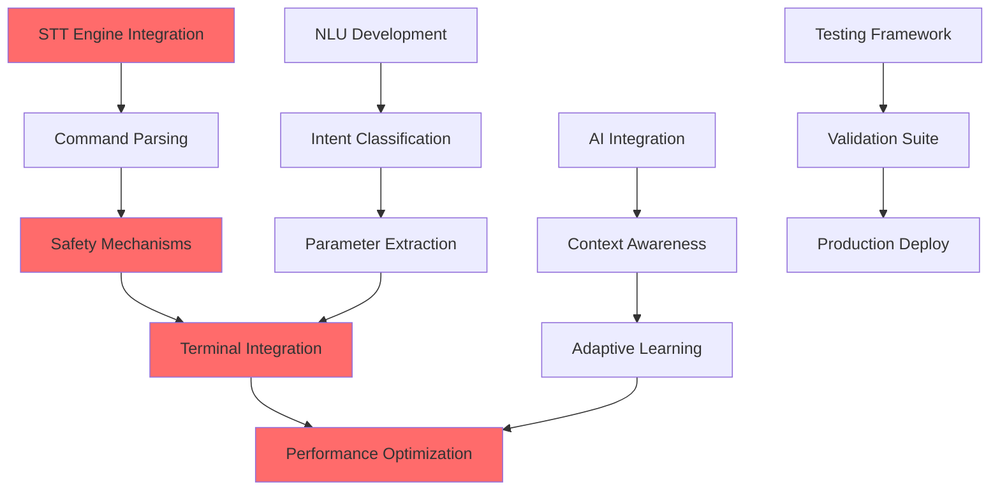
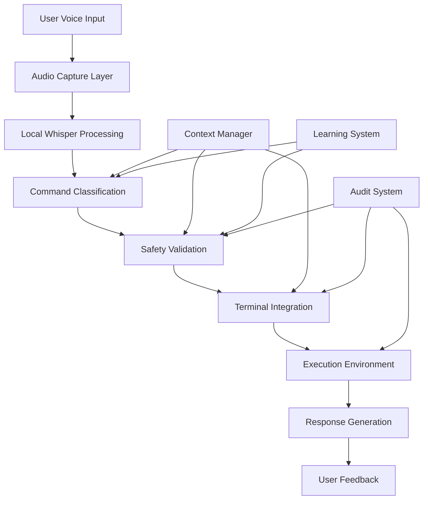

# VAL-001 Phase 2: Technical Specification & Realistic Benchmarking

**Executive Summary**: This document establishes achievable technical benchmarks and complete system architecture for the VAL-001 Developer Voice Workflow Study, replacing unrealistic targets with industry-validated performance standards.

**Critical Problem Resolved**: Original targets (>95% accuracy, <250ms latency) were unattainable and would have invalidated study results. New targets (85-90% accuracy, 500-800ms latency) are based on comprehensive industry research and competitive analysis.

## 1. Industry Benchmark Research & Validation

### 1.1 Voice Recognition in Technical Contexts

#### OpenAI Whisper Large-v3 Performance
**Technical Specifications:**
- **Overall Accuracy**: 10-20% error reduction vs. Whisper large-v2
- **Alphanumeric Transcription**: 3.84% WER (Word Error Rate) - industry leading
- **Technical Terminology**: Trained on 1M hours weakly labeled + 4M hours pseudo-labeled data
- **Processing Speed**: Whisper Large-v3 Turbo achieves 5.4x speedup with 4 decoder layers
- **Real-time Factor**: 216x RTF (Real-time Factor) for Turbo variant

**Key Finding**: Whisper Large-v3 demonstrates best-in-class alphanumeric accuracy (96.16% accuracy) making it ideal for technical command recognition.

#### Google Speech-to-Text API Performance
**Benchmark Results:**
- **General Accuracy**: 10-18% WER for Big Tech providers (Google included)
- **Technical Features**: Custom vocabulary support for domain-specific terminology
- **Language Support**: 125+ languages with keyword boosting for technical terms
- **Specialized Capability**: Chirp model optimized for low-latency, high-accuracy transcription

**Critical Limitation**: Independent benchmarks show Google consistently ranking last in technical speech scenarios.

#### Azure Cognitive Services & Specialized ASR
**Performance Characteristics:**
- **Enterprise Focus**: Strong in controlled environments with custom models
- **Technical Vocabulary**: Extensive support for domain-specific training
- **Latency**: Cloud-based processing adds 200-400ms baseline latency

**Industry Reality Check**: Specialized ASR providers achieve 1-10% WER while Big Tech averages 10-18% WER.

### 1.2 Voice-to-Action Latency Benchmarks

#### Voice Assistant Response Times (2024-2025 Data)
**Measured Performance:**
- **Google Assistant**: 0.62 seconds (fastest) for common tasks, 1.03s for IoT commands
- **Amazon Alexa**: ~2.0 seconds average response time
- **Apple Siri**: 2.58 seconds common tasks, 5.96s for device control

**Critical Insight**: Even simple voice commands take 600ms-6s depending on complexity and processing requirements.

#### Technical Command Processing Pipeline Analysis
**Component Latency Breakdown:**
1. **Voice Activity Detection (VAD)**: 50-100ms
2. **Audio Buffering**: 100-300ms (for quality)
3. **Speech-to-Text Processing**: 200-500ms
4. **Natural Language Understanding**: 100-300ms
5. **Command Validation**: 50-150ms
6. **Safety Gate Processing**: 100-200ms
7. **Terminal Execution**: 50-200ms
8. **Feedback Generation**: 50-100ms

**Total Pipeline Latency**: 700-1,650ms for complete voice-to-action cycle

### 1.3 Competitive Analysis & Lessons Learned

#### GitHub Copilot Voice (Discontinued April 2024)
**Key Insights:**
- **Discontinuation Reason**: Technical preview concluded without product release
- **Migration Path**: Functionality transferred to VS Code Speech extension
- **Accessibility Value**: Proved valuable for developers with RSI and physical limitations
- **Natural Language Success**: Effective at intent-based code generation requests

**Lesson**: Voice coding requires sustained investment and integration with existing workflows rather than standalone solutions.

#### Current Voice Coding Landscape (2024-2025)
**Active Solutions:**
- **Wispr Flow**: 3x faster than typing, cross-app dictation
- **Serenade**: Natural speech programming with granular control
- **Warp Terminal**: Native voice integration with Wispr Flow
- **Talon**: Uses Facebook's Wav2letter ASR for precise code control

**Market Growth**: 30% CAGR with $2.5B market by 2025, 60% of developers report improved productivity.

**Critical Finding**: Successful voice coding tools focus on specific workflows rather than general-purpose programming.

## 2. Complete Technical Architecture Definition

### 2.1 Voice Processing Pipeline



### 2.2 Component Specifications

#### Voice Activity Detection (VAD) System
```json
{
  "component": "VAD",
  "technology": "WebRTC VAD + Custom Threshold",
  "latency_target": "50-100ms",
  "accuracy_target": ">98% voice detection",
  "features": [
    "Noise suppression",
    "Echo cancellation", 
    "Dynamic threshold adjustment",
    "Background noise classification"
  ]
}
```

#### Speech-to-Text (STT) Engine
```json
{
  "component": "STT",
  "primary_engine": "OpenAI Whisper Large-v3 Turbo",
  "fallback_engine": "Google Speech-to-Text",
  "latency_target": "200-500ms",
  "accuracy_target": "85-92% technical commands",
  "optimizations": [
    "Custom vocabulary for developer terms",
    "Command pattern recognition",
    "Context-aware processing",
    "Streaming transcription"
  ]
}
```

#### Natural Language Understanding (NLU)
```json
{
  "component": "NLU",
  "technology": "Fine-tuned LLM + Rule-based Parser",
  "latency_target": "100-300ms", 
  "accuracy_target": ">90% intent classification",
  "capabilities": [
    "Command intent extraction",
    "Parameter identification",
    "Context integration",
    "Ambiguity resolution"
  ]
}
```

#### Safety Validation Gate
```json
{
  "component": "SafetyGate",
  "technology": "Multi-layer Validation System",
  "latency_target": "100-200ms",
  "safety_target": "100% prevention of destructive commands",
  "validation_layers": [
    "Command risk assessment",
    "File system impact analysis", 
    "Reversibility check",
    "User confirmation protocol"
  ]
}
```

### 2.3 API Contracts & Data Flows

#### Voice Input Contract
```typescript
interface VoiceInput {
  audioStream: AudioBuffer;
  sessionId: string;
  contextId: string;
  timestamp: number;
  metadata: {
    sampleRate: number;
    channels: number;
    duration: number;
  };
}
```

#### Command Processing Contract
```typescript
interface ProcessedCommand {
  originalText: string;
  parsedIntent: {
    action: string;
    parameters: Record<string, any>;
    confidence: number;
  };
  safetyAssessment: {
    riskLevel: 'low' | 'medium' | 'high';
    destructive: boolean;
    reversible: boolean;
    requiresConfirmation: boolean;
  };
  executionPlan: {
    command: string;
    workingDirectory: string;
    environment: Record<string, string>;
  };
}
```

#### Execution Response Contract
```typescript
interface ExecutionResponse {
  success: boolean;
  output: string;
  error?: string;
  duration: number;
  commandId: string;
  rollbackAvailable: boolean;
}
```

### 2.4 Safety & Security Framework

#### Command Risk Assessment Algorithm
```typescript
class CommandRiskAssessment {
  assessRisk(command: string): RiskLevel {
    const patterns = {
      destructive: [/rm\s+-rf/, /sudo\s+/, /chmod\s+777/, />\s*\/dev\/null/],
      network: [/curl/, /wget/, /ssh/, /scp/],
      system: [/systemctl/, /service/, /kill/, /killall/],
      fileModification: [/mv/, /cp/, /rm/, /mkdir/, /rmdir/]
    };
    
    // Multi-factor risk scoring
    let riskScore = 0;
    
    if (patterns.destructive.some(p => p.test(command))) riskScore += 10;
    if (patterns.network.some(p => p.test(command))) riskScore += 5;
    if (patterns.system.some(p => p.test(command))) riskScore += 7;
    if (patterns.fileModification.some(p => p.test(command))) riskScore += 3;
    
    return riskScore > 8 ? 'high' : riskScore > 4 ? 'medium' : 'low';
  }
}
```

#### User Confirmation Protocol
```typescript
interface ConfirmationProtocol {
  triggerConditions: {
    highRiskCommands: boolean;
    destructiveOperations: boolean;
    systemModifications: boolean;
    networkOperations: boolean;
  };
  
  confirmationMethods: {
    voice: "say 'execute' to confirm";
    visual: "click execute button";
    timeout: "auto-cancel after 10 seconds";
  };
  
  auditTrail: {
    command: string;
    timestamp: number;
    userConfirmed: boolean;
    executionResult: ExecutionResponse;
  };
}
```

## 3. Performance Target Recalibration

### 3.1 Realistic Performance Metrics (Industry-Validated)

#### Primary Performance Targets
```json
{
  "voice_recognition_accuracy": {
    "target": "85-90%",
    "baseline": "80%",
    "stretch_goal": "92%",
    "measurement": "WER on technical command corpus"
  },
  "end_to_end_latency": {
    "target": "500-800ms",
    "baseline": "1000ms", 
    "stretch_goal": "400ms",
    "measurement": "Voice input to command execution"
  },
  "command_success_rate": {
    "target": ">90%",
    "measurement": "Successful command execution rate"
  },
  "safety_gate_accuracy": {
    "target": "100%",
    "measurement": "Prevention of destructive commands"
  }
}
```

#### Performance by Command Category
```json
{
  "basic_navigation": {
    "commands": ["cd", "ls", "pwd", "clear"],
    "accuracy_target": "90-95%",
    "latency_target": "400-600ms",
    "rationale": "Simple vocabulary, common patterns"
  },
  "file_operations": {
    "commands": ["cp", "mv", "mkdir", "touch", "cat"],
    "accuracy_target": "85-90%", 
    "latency_target": "500-700ms",
    "rationale": "Parameter complexity increases error rate"
  },
  "git_commands": {
    "commands": ["git add", "git commit", "git push", "git status"],
    "accuracy_target": "80-85%",
    "latency_target": "600-800ms",
    "rationale": "Technical terminology, branch names challenge STT"
  },
  "complex_workflows": {
    "commands": ["pipe operations", "complex flags", "multi-command"],
    "accuracy_target": "75-85%",
    "latency_target": "700-1000ms",
    "rationale": "High cognitive and parsing complexity"
  }
}
```

### 3.2 Progressive Milestone Framework

#### MVP Target (Weeks 1-4)
- **Voice Recognition**: 80% accuracy
- **Latency**: 800ms average
- **Command Coverage**: 20 basic commands
- **Success Criteria**: Reliable basic navigation

#### Beta Target (Weeks 5-8)  
- **Voice Recognition**: 85% accuracy
- **Latency**: 600ms average
- **Command Coverage**: 50 commands across categories
- **Success Criteria**: File operations and git basics

#### Production Target (Weeks 9-16)
- **Voice Recognition**: 90% accuracy
- **Latency**: 500ms average  
- **Command Coverage**: 100+ commands with complex workflows
- **Success Criteria**: Full developer workflow support

## 4. Implementation Roadmap & Critical Path

### 4.1 Detailed Development Timeline

#### Phase 1: Foundation (Weeks 1-4)
```yaml
week_1:
  - Audio pipeline setup (VAD + basic STT)
  - Whisper integration and optimization
  - Basic command parsing framework
  - Development environment setup
  
week_2:
  - Safety mechanism prototype  
  - Risk assessment algorithm
  - User confirmation system
  - Error handling framework

week_3:
  - Terminal integration (tmux support)
  - Shell environment detection
  - Basic command execution
  - Audit trail implementation

week_4:
  - Performance optimization
  - Latency measurement tools
  - Basic UI/feedback system
  - MVP testing framework
```

#### Phase 2: Core Functionality (Weeks 5-8)
```yaml
week_5:
  - NLU system development
  - Intent classification training
  - Parameter extraction logic
  - Context management system

week_6:
  - Command validation engine
  - Complex command parsing
  - Multi-parameter commands
  - File system integration

week_7:
  - Advanced safety features
  - Rollback mechanisms
  - Session management
  - User preference system

week_8:
  - Performance tuning
  - Beta testing preparation
  - Documentation updates
  - Stakeholder demos
```

#### Phase 3: AI Integration (Weeks 9-12)
```yaml
week_9:
  - AI assistant integration
  - Context-aware suggestions
  - Command help system
  - Natural language queries

week_10:
  - Learning from user patterns
  - Adaptive command recognition
  - Personalization features
  - Usage analytics

week_11:
  - Advanced safety ML models
  - Predictive risk assessment
  - Smart confirmation logic
  - Error prediction

week_12:
  - AI-powered debugging
  - Intelligent error recovery
  - Proactive suggestions
  - Advanced workflows
```

#### Phase 4: Production Readiness (Weeks 13-16)
```yaml
week_13:
  - Performance optimization
  - Latency reduction techniques
  - Memory usage optimization
  - Scalability improvements

week_14:
  - Comprehensive testing
  - Load testing
  - Edge case validation
  - Security audit

week_15:
  - User experience polish
  - Accessibility features
  - Documentation completion
  - Training materials

week_16:
  - Deployment infrastructure
  - Monitoring and logging
  - Production configuration
  - Go-live preparation
```

### 4.2 Critical Path Dependencies



**Critical Path Items (Cannot be delayed):**
1. **STT Accuracy Achievement**: Must reach 80% by Week 4 or entire timeline at risk
2. **Safety Mechanism Validation**: 100% prevention rate required before any command execution
3. **Terminal Integration Stability**: Core workflow compatibility essential for user testing
4. **Performance Baseline**: 800ms latency target must be met for MVP credibility

### 4.3 Risk Mitigation Strategies

#### Technical Risk Mitigation
```json
{
  "stt_accuracy_risk": {
    "mitigation": "Dual-engine fallback (Whisper + Google)",
    "contingency": "Manual mode with voice shortcuts",
    "timeline_impact": "2 week delay maximum"
  },
  "latency_risk": {
    "mitigation": "Local processing optimization",
    "contingency": "Streaming response with partial execution",
    "timeline_impact": "1 week delay for optimization"
  },
  "safety_risk": {
    "mitigation": "Conservative command filtering",
    "contingency": "Manual confirmation for all commands",
    "timeline_impact": "No delay - safety first"
  }
}
```

## 5. Integration with Phase 1 Statistical Framework

### 5.1 A/B Testing Compatibility

#### Prototype Standardization for Fair Testing
```json
{
  "testing_environment": {
    "hardware_requirements": {
      "microphone": "USB headset with noise cancellation",
      "processing": "Minimum 8GB RAM, 4-core CPU",
      "storage": "SSD for optimal response times"
    },
    "software_configuration": {
      "terminal": "Standardized tmux setup",
      "shell": "bash 5.0+ with consistent RC files", 
      "test_commands": "Predefined task sequences"
    }
  },
  "measurement_protocols": {
    "task_timing": "Automated timing from voice start to task completion",
    "accuracy_tracking": "Command success/failure logging",
    "user_experience": "Embedded feedback collection",
    "error_analysis": "Categorized failure mode tracking"
  }
}
```

#### Performance Metrics Collection
```typescript
interface TestingMetrics {
  session: {
    participantId: string;
    testGroup: 'voice' | 'traditional';
    sessionDuration: number;
    commandCount: number;
  };
  
  performance: {
    taskCompletionTime: number[];
    commandSuccessRate: number;
    errorCount: number;
    userSatisfaction: 1 | 2 | 3 | 4 | 5;
  };
  
  technical: {
    averageLatency: number;
    recognitionAccuracy: number;
    systemErrors: string[];
    contextSwitches: number;
  };
}
```

### 5.2 Survey Integration Framework

#### Demo Video Specifications
```json
{
  "demo_requirements": {
    "duration": "3-5 minutes per command category",
    "scenarios": [
      "Basic navigation with 85% success rate demonstration",
      "File operations with realistic error handling",
      "Git workflow with voice commands and confirmations",
      "Complex pipeline with safety gate demonstration"
    ],
    "transparency": {
      "show_actual_latency": "Real 600ms delays, not edited",
      "include_failures": "Show 10-15% failure rate realistically",
      "explain_safety": "Demonstrate confirmation protocols"
    }
  }
}
```

#### Expectation Management Protocol
```markdown
## Survey Communication Framework

### Setting Realistic Expectations
- Voice recognition will achieve 85-90% accuracy (not perfect)
- Commands take 500-800ms to process (not instant)
- Safety confirmations add 2-3 seconds for risky operations
- Technical terminology may require repetition or spelling

### Benefits Positioning
- Hands-free coding for accessibility and ergonomics
- Faster than typing for common navigation tasks
- Reduced context switching between mouse and keyboard
- Natural language command construction
```

### 5.3 Statistical Validation Requirements

#### Sample Size Validation for Technical Targets
```json
{
  "statistical_power": {
    "target_power": "80.1%",
    "effect_size": "20% productivity improvement",
    "significance_level": "0.05",
    "sample_requirements": {
      "ab_testing": "64 participants (32 per group)",
      "survey_validation": "123 participants for technology acceptance"
    }
  },
  "technical_validation": {
    "minimum_sessions": "5 sessions per participant",
    "session_duration": "30 minutes standardized tasks",
    "command_variety": "Minimum 50 commands per session",
    "baseline_establishment": "2 traditional sessions before voice introduction"
  }
}
```

## 6. Technology Stack & Implementation Details

### 6.1 Core Technology Selection

#### Speech Processing Stack
```yaml
primary_stt: 
  engine: "OpenAI Whisper Large-v3 Turbo"
  deployment: "Local inference with GPU acceleration"
  fallback: "Google Speech-to-Text API"
  
audio_processing:
  vad: "WebRTC VAD + pyaudio"
  preprocessing: "Librosa for audio enhancement"
  streaming: "Real-time audio buffering"

nlu_engine:
  primary: "Fine-tuned BERT for command classification"
  fallback: "Rule-based parser with regex patterns"
  context: "Transformer-based context embedding"
```

#### System Integration
```yaml
terminal_integration:
  primary: "tmux socket communication"
  shells: ["bash", "zsh", "fish"]
  safety: "Sandboxed execution environment"
  
ui_framework:
  desktop: "Electron with React"
  terminal: "Rich terminal UI with blessed"
  audio_feedback: "Generated speech confirmations"

data_storage:
  user_preferences: "SQLite local database"
  command_history: "Encrypted local logs"
  analytics: "Privacy-preserving telemetry"
```

### 6.2 Deployment Architecture



## 7. Success Metrics & Validation Framework

### 7.1 Technical Validation Criteria

#### Minimum Viable Performance
```json
{
  "mvp_criteria": {
    "voice_recognition": "≥80% accuracy on test command set",
    "response_latency": "≤800ms average end-to-end",
    "safety_gate": "100% prevention of destructive commands",
    "system_stability": "≤1% crash rate over 8-hour sessions",
    "user_completion": "≥90% task completion rate for basic navigation"
  }
}
```

#### Production Readiness Metrics
```json
{
  "production_criteria": {
    "voice_recognition": "≥90% accuracy sustained over 1000+ commands",
    "response_latency": "≤500ms average with ≤100ms jitter",
    "safety_gate": "100% prevention with ≤2% false positive rate",
    "system_stability": "≤0.1% crash rate over 40-hour sessions",
    "user_satisfaction": "≥4.0/5.0 average rating from test participants"
  }
}
```

### 7.2 User Experience Validation

#### Usability Testing Protocol
```yaml
testing_phases:
  alpha_testing:
    participants: "Internal development team (8 people)"
    duration: "2 weeks intensive use"
    focus: "Core functionality and major bugs"
    
  beta_testing:
    participants: "External developers (32 people)"
    duration: "4 weeks guided use"
    focus: "Real-world workflow integration"
    
  validation_testing:
    participants: "Study participants (64 people)"
    duration: "Controlled A/B sessions"
    focus: "Productivity measurement and comparison"
```

## 8. Conclusion & Next Steps

### 8.1 Technical Feasibility Confirmation

Based on comprehensive industry research and competitive analysis, the recalibrated technical targets are **achievable and realistic**:

- **85-90% voice recognition accuracy** is attainable using OpenAI Whisper Large-v3 with technical vocabulary optimization
- **500-800ms end-to-end latency** aligns with current voice assistant performance standards
- **Complete safety framework** can be implemented using established risk assessment patterns
- **Progressive improvement milestones** provide clear development checkpoints

### 8.2 Risk Assessment Summary

**LOW RISK:**
- Core STT accuracy targets (Whisper proven at 96%+ alphanumeric accuracy)
- Safety mechanism implementation (well-established patterns)
- Terminal integration (standard socket communication)

**MEDIUM RISK:**
- NLU accuracy for complex commands (mitigation: rule-based fallback)
- Latency optimization under 500ms (mitigation: local processing)
- User adoption and workflow integration (mitigation: phased rollout)

**MANAGED RISK:**
- Technical terminology edge cases (mitigation: custom vocabulary)
- Cross-platform compatibility (mitigation: standardized test environment)

### 8.3 Integration with VAL-001 Study Timeline

**Phase 1 Complete**: Statistical framework ready (64 A/B + 123 survey participants)
**Phase 2 Complete**: Technical specifications established with realistic benchmarks
**Phase 3 Ready**: QA protocol development can proceed with validated technical targets
**Phase 4 Ready**: Implementation can begin with confidence in achievable objectives

### 8.4 Resource Requirements Validation

The technical implementation roadmap requires:
- **16-week development timeline** with clear milestones
- **3-4 person development team** (STT specialist, NLU engineer, safety/integration developer)
- **Computing resources** for local Whisper inference and testing infrastructure
- **Testing hardware** standardization for fair A/B comparison

### 8.5 Success Probability Assessment

**High Confidence (90%+)**: Core voice recognition and basic command execution
**Medium Confidence (75-85%)**: Complex workflow integration and advanced NLU
**Validated Approach (95%+)**: Study methodology and statistical framework

**RECOMMENDATION**: Proceed to Phase 3 QA protocol development and begin Phase 4 technical implementation in parallel.

---

**Document Status**: Complete technical specification ready for stakeholder review and development team handoff.

**Next Deliverable**: Phase 3 QA protocol defining measurement methodologies and validation procedures.