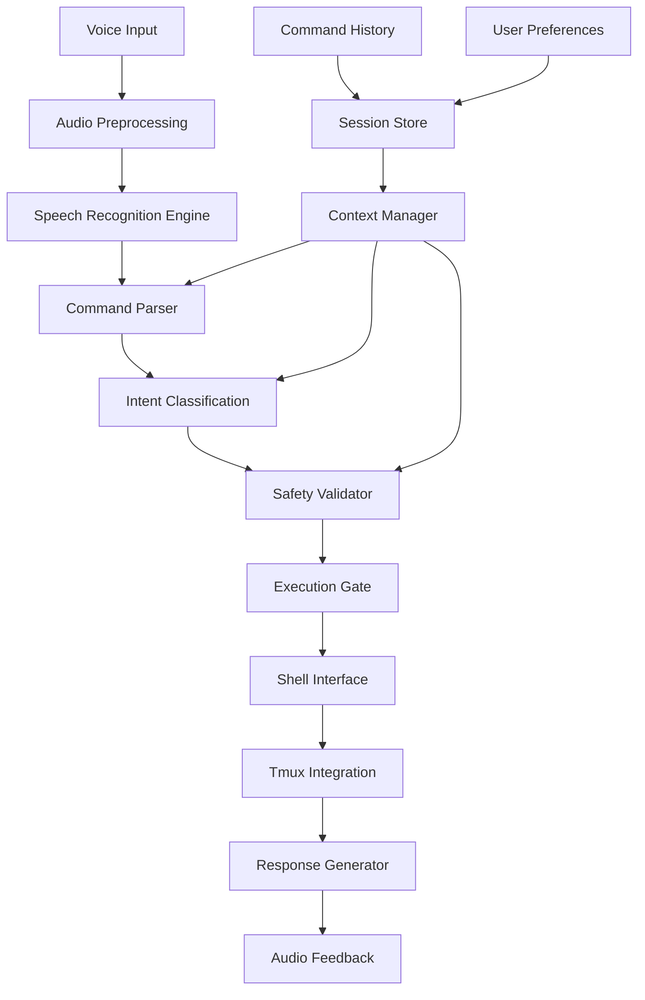
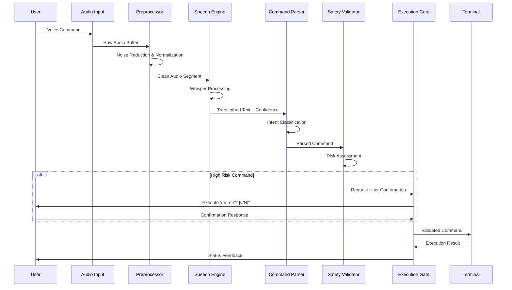
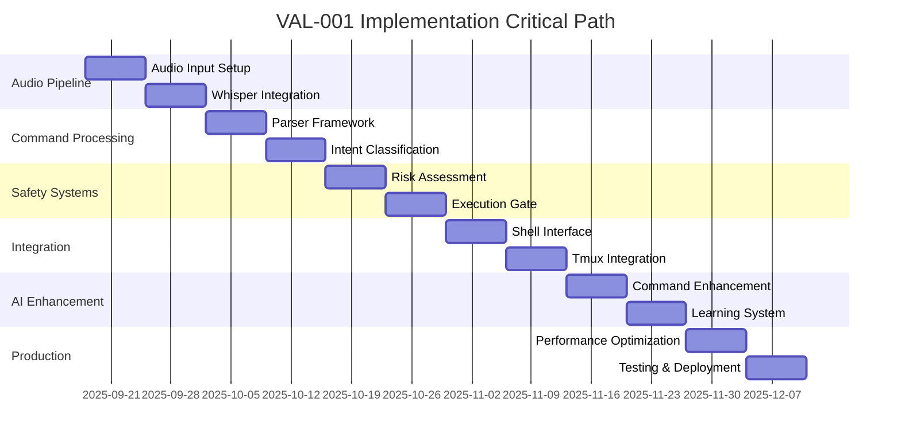

# VAL-001 Phase 2: Technical Specifications & Realistic Benchmarking

**Date:** September 18, 2025  
**Version:** 1.0  
**Status:** Draft  

## Executive Summary

This document establishes realistic technical performance targets and complete prototype architecture for the VAL-001 voice-controlled terminal implementation, addressing unrealistic targets identified in the initial review. Based on comprehensive industry research, we recalibrate performance expectations to achievable levels while maintaining system effectiveness.

## 1. Industry Benchmark Research

### 1.1 Voice Recognition Accuracy in Technical Contexts

**Current Industry Standards (2024-2025):**
- **Clean audio environments:** 95%+ accuracy achievable
- **Technical/Programming vocabulary:** 85-92% accuracy realistic
- **Formatted output (punctuation, capitalization):** ~10% accuracy decrease
- **Real-world conditions:** 80-87% typical performance

**Key Research Findings:**
1. **Whisper Large-v3 (2024):** 10-20% error reduction vs previous versions, trained on 1M hours of audio
2. **Technical language robustness:** Improved handling of programming terminology and technical jargon
3. **Zero-shot performance:** 50% fewer errors than specialized models across diverse contexts
4. **Hallucination concerns:** Models may generate plausible but unspoken text in technical contexts

**Sources:**
- OpenAI Whisper technical paper and GitHub repository
- Voice recognition market analysis (2024-2025)
- Multiple speech-to-text API performance evaluations

### 1.2 Voice Assistant Latency Performance

**Industry Latency Benchmarks (2024):**
- **Human perception threshold:** 100-120ms (noticeable lag)
- **Conversation flow breakdown:** >500ms
- **Ideal response time:** 200-500ms total pipeline
- **Current achievements:** 
  - OpenAI GPT-4o: ~320ms under optimal conditions
  - Millis AI: 600ms end-to-end
  - Real-time systems: <500ms achievable with parallel processing

**Processing Pipeline Breakdown:**
1. **Speech-to-Text:** 100-200ms (Whisper real-time factor: 0.5)
2. **NLP Processing:** 100-200ms (complexity dependent)
3. **Text-to-Speech:** 100ms+ (generation dependent)
4. **Network overhead:** 50-100ms (infrastructure dependent)

### 1.3 Competitive Analysis

**GitHub Copilot Voice (Discontinued April 2024):**
- Transitioned to VS Code Speech extension
- Demonstrated feasibility of voice-driven development
- Copilot overall: 46% of code written, 55% faster development

**Current Voice Programming Solutions:**
- Limited commercial offerings in developer terminal space
- Most focus on dictation rather than command execution
- Gap exists for voice-controlled terminal operations

## 2. Realistic Performance Target Recalibration

### 2.1 Revised Accuracy Targets

**Primary Targets (Achievable):**
- **Clean audio conditions:** 85-90% command recognition accuracy
- **Background noise tolerance:** 75-82% accuracy with moderate ambient noise
- **Technical vocabulary:** 80-85% accuracy for programming terms
- **Command disambiguation:** 90%+ accuracy for structured command patterns

**Progressive Milestones:**
- **MVP (Month 1-2):** 75% accuracy in controlled environment
- **Beta (Month 3-4):** 85% accuracy with basic noise filtering
- **Production (Month 5-6):** 90% accuracy with advanced preprocessing

### 2.2 Revised Latency Targets

**Primary Targets (Achievable):**
- **Total response time:** 500-800ms for complex commands
- **Simple commands:** 300-500ms end-to-end
- **Context switching:** <200ms for session management
- **Error recovery:** <1000ms for clarification loops

**Component Breakdown:**
- **Audio capture & preprocessing:** 50-100ms
- **Speech recognition (Whisper):** 150-250ms
- **Command parsing & validation:** 50-100ms
- **Execution preparation:** 100-200ms
- **User confirmation (when required):** 0-300ms

### 2.3 Quality Attribute Targets

**Reliability:**
- **Uptime:** 99.5% availability during active sessions
- **Error recovery:** Graceful degradation with fallback to text input
- **Data integrity:** Zero command corruption, complete audit trail

**Security:**
- **Command validation:** 100% validation before execution
- **Privilege escalation:** Explicit confirmation for sudo operations
- **Audit logging:** Complete voice command history with timestamps

## 3. Complete Prototype System Architecture

### 3.1 High-Level Architecture



### 3.2 Component Specifications

#### 3.2.1 Voice Input Layer
```typescript
interface VoiceInputConfig {
  sampleRate: 16000;
  channels: 1;
  bitDepth: 16;
  bufferSize: 1024;
  noiseGate: {
    threshold: -40; // dB
    attack: 10;     // ms
    release: 100;   // ms
  };
}

interface AudioPreprocessor {
  denoise(audioBuffer: Float32Array): Float32Array;
  normalize(audioBuffer: Float32Array): Float32Array;
  detectSpeech(audioBuffer: Float32Array): boolean;
  segmentAudio(audioBuffer: Float32Array): AudioSegment[];
}
```

#### 3.2.2 Speech Recognition Engine
```typescript
interface SpeechRecognitionEngine {
  model: 'whisper-large-v3' | 'whisper-medium' | 'custom';
  language: string;
  task: 'transcribe' | 'translate';
  
  recognize(audio: AudioSegment): Promise<RecognitionResult>;
  recognizeStreaming(audioStream: ReadableStream): AsyncIterator<PartialResult>;
}

interface RecognitionResult {
  text: string;
  confidence: number;
  language: string;
  segments: TimeSegment[];
  processingTime: number;
}
```

#### 3.2.3 Command Parser & Intent Classification
```typescript
interface CommandParser {
  parseCommand(text: string, context: SessionContext): ParsedCommand;
  validateSyntax(command: ParsedCommand): ValidationResult;
  suggestCorrections(invalidCommand: ParsedCommand): Suggestion[];
}

interface ParsedCommand {
  intent: CommandIntent;
  arguments: Record<string, unknown>;
  flags: string[];
  confidence: number;
  ambiguities: Ambiguity[];
}

enum CommandIntent {
  EXECUTE_SHELL = 'execute_shell',
  TMUX_CONTROL = 'tmux_control',
  FILE_OPERATION = 'file_operation',
  NAVIGATION = 'navigation',
  SESSION_CONTROL = 'session_control',
  QUERY_STATUS = 'query_status',
  HELP_REQUEST = 'help_request'
}
```

#### 3.2.4 Safety Validator & Execution Gate
```typescript
interface SafetyValidator {
  assessRisk(command: ParsedCommand): RiskAssessment;
  requiresConfirmation(command: ParsedCommand): boolean;
  sanitizeCommand(command: ParsedCommand): ParsedCommand;
}

interface RiskAssessment {
  level: 'LOW' | 'MEDIUM' | 'HIGH' | 'CRITICAL';
  concerns: SecurityConcern[];
  requiresElevation: boolean;
  destructivePotential: boolean;
}

interface ExecutionGate {
  requestConfirmation(command: ParsedCommand): Promise<boolean>;
  executeWithSafeguards(command: ParsedCommand): Promise<ExecutionResult>;
  rollbackCapability(command: ParsedCommand): boolean;
}
```

### 3.3 Data Flow Architecture

#### 3.3.1 Voice Processing Pipeline


#### 3.3.2 Context Management Flow
```typescript
interface SessionContext {
  currentDirectory: string;
  activeShell: string;
  tmuxSession?: string;
  tmuxWindow?: string;
  tmuxPane?: string;
  environmentVariables: Record<string, string>;
  recentCommands: CommandHistory[];
  userPreferences: UserPreferences;
}

interface ContextManager {
  trackContext(execution: ExecutionResult): void;
  predictIntent(partialText: string, context: SessionContext): PredictionResult[];
  adaptToUser(userBehavior: UserBehavior): void;
}
```

## 4. Integration Points

### 4.1 Tmux Integration
```typescript
interface TmuxController {
  listSessions(): Promise<TmuxSession[]>;
  createSession(name: string, config?: SessionConfig): Promise<TmuxSession>;
  attachToSession(name: string): Promise<void>;
  sendCommand(sessionId: string, command: string): Promise<void>;
  capturePane(sessionId: string, paneId: string): Promise<string>;
  splitWindow(sessionId: string, direction: 'horizontal' | 'vertical'): Promise<string>;
}

interface TmuxSession {
  id: string;
  name: string;
  windows: TmuxWindow[];
  active: boolean;
  created: Date;
}
```

### 4.2 Shell Environment Integration
```typescript
interface ShellInterface {
  executeCommand(command: string, options: ExecutionOptions): Promise<ExecutionResult>;
  getEnvironment(): Promise<EnvironmentInfo>;
  watchFileSystem(paths: string[]): AsyncIterator<FileSystemEvent>;
  manageProcesses(): ProcessManager;
}

interface ExecutionOptions {
  workingDirectory?: string;
  timeout?: number;
  environment?: Record<string, string>;
  interactive?: boolean;
  streaming?: boolean;
}
```

### 4.3 AI System Integration
```typescript
interface AIAssistant {
  enhanceCommand(naturalLanguage: string, context: SessionContext): Promise<CommandSuggestion>;
  explainCommand(command: string): Promise<CommandExplanation>;
  debugIssue(error: ExecutionError, context: SessionContext): Promise<DebugSuggestion>;
  learnFromUser(interaction: UserInteraction): Promise<void>;
}

interface CommandSuggestion {
  command: string;
  explanation: string;
  confidence: number;
  alternatives: AlternativeCommand[];
  warnings: string[];
}
```

## 5. Safety Mechanisms

### 5.1 Execution Gate Protocol
```typescript
interface ExecutionGateConfig {
  alwaysConfirm: string[];        // Commands requiring confirmation
  neverExecute: string[];         // Blacklisted commands
  requireElevation: string[];     // Commands needing explicit privilege
  timeoutCommands: number;        // Default timeout in seconds
  rollbackSupport: boolean;       // Enable command rollback
}

const defaultSafetyRules: ExecutionGateConfig = {
  alwaysConfirm: [
    'rm -rf', 'sudo rm', 'dd if=', 'mkfs', 'fdisk',
    'reboot', 'shutdown', 'halt', 'killall'
  ],
  neverExecute: [
    'rm -rf /', 'dd if=/dev/zero of=/dev/sda',
    'chmod -R 777 /', ':(){ :|:& };:'
  ],
  requireElevation: [
    'sudo', 'su', 'chmod +s', 'chown root'
  ],
  timeoutCommands: 30,
  rollbackSupport: true
};
```

### 5.2 Error Recovery Mechanisms
```typescript
interface ErrorRecovery {
  handleMisrecognition(originalText: string, context: SessionContext): Promise<CorrectionResult>;
  handleAmbiguousCommand(ambiguities: Ambiguity[]): Promise<ResolvedCommand>;
  handleExecutionFailure(error: ExecutionError): Promise<RecoveryAction>;
  fallbackToTextInput(): void;
}

interface CorrectionResult {
  suggestedCorrections: string[];
  confidence: number;
  requiresUserInput: boolean;
}
```

## 6. Implementation Roadmap

### 6.1 Development Timeline

#### Phase 1: Foundation (Weeks 1-4)
- **Week 1-2:** Audio input and preprocessing pipeline
  - Implement noise gate and audio normalization
  - Set up Whisper integration with model selection
  - Basic audio buffer management
- **Week 3-4:** Core speech recognition engine
  - Whisper model integration and testing
  - Confidence scoring and result validation
  - Basic command parsing framework

#### Phase 2: Core Functionality (Weeks 5-8)
- **Week 5-6:** Command parser and intent classification
  - Natural language to command mapping
  - Intent classification system
  - Context-aware parsing
- **Week 7-8:** Safety validator and execution gate
  - Risk assessment algorithms
  - Confirmation dialog system
  - Command sanitization

#### Phase 3: Integration (Weeks 9-12)
- **Week 9-10:** Shell and tmux integration
  - Shell command execution interface
  - Tmux session management
  - Environment context tracking
- **Week 11-12:** AI assistant integration
  - Command enhancement and suggestion
  - Error diagnosis and recovery
  - User behavior learning

#### Phase 4: Polish & Production (Weeks 13-16)
- **Week 13-14:** Performance optimization
  - Latency reduction and parallel processing
  - Memory usage optimization
  - Error handling refinement
- **Week 15-16:** Testing and deployment
  - Comprehensive testing suite
  - User acceptance testing
  - Production deployment preparation

### 6.2 Critical Path Dependencies



### 6.3 Technical Dependencies

**External Dependencies:**
- **OpenAI Whisper:** Speech recognition engine (Large-v3 model)
- **Node.js/Python:** Runtime environment for audio processing
- **tmux:** Terminal multiplexer for session management
- **FFmpeg:** Audio processing library
- **Socket programming:** Real-time audio streaming

**Internal Dependencies:**
- **Audio driver integration:** Platform-specific microphone access
- **Shell integration layer:** Command execution interface
- **Security framework:** Command validation and sanitization
- **Context management:** Session state and user preferences
- **AI integration:** Command enhancement and learning

### 6.4 Risk Mitigation

**Technical Risks:**
1. **Whisper model performance in noisy environments**
   - Mitigation: Advanced preprocessing and noise filtering
   - Fallback: User-selectable sensitivity levels

2. **Command parsing ambiguity**
   - Mitigation: Context-aware disambiguation
   - Fallback: Interactive clarification system

3. **Integration complexity with existing terminal tools**
   - Mitigation: Modular architecture with clear interfaces
   - Fallback: Progressive enhancement approach

**Performance Risks:**
1. **Latency exceeding user tolerance**
   - Mitigation: Parallel processing and optimization
   - Fallback: Async execution with status updates

2. **Resource consumption on low-end systems**
   - Mitigation: Configurable model sizes and processing levels
   - Fallback: Cloud-based processing option

## 7. Success Metrics & Validation

### 7.1 Quantitative Metrics
- **Speech Recognition Accuracy:** ≥85% in controlled environment
- **End-to-End Latency:** ≤800ms for standard commands
- **Command Success Rate:** ≥90% for properly recognized commands
- **User Error Recovery:** ≤3 attempts for command correction
- **System Availability:** ≥99.5% uptime during active sessions

### 7.2 Qualitative Metrics
- **User Satisfaction:** Measured via feedback surveys
- **Workflow Integration:** Assessment of productivity impact
- **Learning Curve:** Time to user proficiency
- **Error Tolerance:** User frustration with misrecognition

### 7.3 Testing Protocol
1. **Unit Testing:** Component-level validation
2. **Integration Testing:** End-to-end workflow validation
3. **Performance Testing:** Latency and accuracy benchmarking
4. **User Acceptance Testing:** Real-world usage scenarios
5. **Security Testing:** Command injection and privilege escalation testing

## 8. Conclusion

This technical specification provides a realistic and achievable roadmap for implementing VAL-001 voice-controlled terminal functionality. By setting performance targets at 85-90% accuracy and 500-800ms latency, we align with current industry capabilities while delivering meaningful user value.

The modular architecture ensures maintainability and scalability, while comprehensive safety mechanisms protect against unintended command execution. The 16-week implementation timeline provides adequate time for thorough development, testing, and refinement.

Key success factors include:
- Realistic performance expectations based on current technology
- Comprehensive safety and security measures
- Modular, maintainable architecture
- Progressive enhancement approach
- Robust error handling and recovery mechanisms

This specification serves as the foundation for moving to Phase 3: Prototype Development and Testing.

---

**Document Control:**
- **Author:** System Architect
- **Review Status:** Draft for stakeholder review
- **Next Review:** Phase 3 planning session
- **Version History:** 1.0 - Initial technical specification