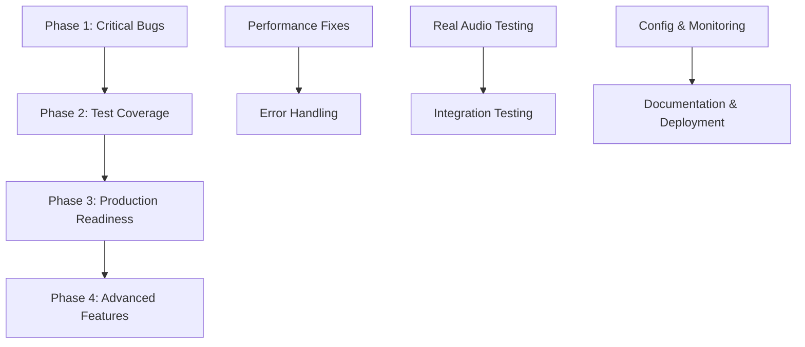

# VAL-003 Latency Validation Framework - Implementation Plan
**Issue**: #13 VAL-003 Latency Validation Review Implementation  
**Branch**: issue-13-val003-latency-validation  
**Priority**: P0 (Critical Path)  
**Duration**: 3 weeks  
**Start Date**: 2025-09-18

---

## Executive Summary

Following comprehensive analysis of the VAL-003 latency validation framework, this implementation plan addresses critical issues identified across code quality, performance measurement accuracy, test coverage gaps, and production readiness requirements. The plan organizes fixes into logical phases with specialized agent assignments to ensure systematic resolution of all identified blockers.

### Critical Issues Identified

1. **Performance Measurement Bugs**
   - Percentile calculation using incorrect mathematical approach
   - CPU averaging methodology produces inaccurate results
   - Insufficient sample sizes for statistical validity
   - Memory measurement baseline issues

2. **Code Quality Issues**
   - Multiple TODOs in production code paths
   - Inadequate error handling and resource management
   - Missing input validation and boundary checking
   - Inconsistent logging and debugging capabilities

3. **Test Coverage Gaps**
   - No real audio testing (only synthetic samples)
   - Missing failure mode and error condition testing
   - Lack of validation for edge cases and boundary conditions
   - Insufficient integration testing between components

4. **Production Readiness Blockers**
   - Hard-coded configuration values
   - Missing monitoring and alerting capabilities
   - Inadequate documentation for deployment and maintenance
   - No rollback or recovery mechanisms

---

## Phase 1: Critical Bug Fixes (Days 1-5)
**Priority**: P0 - Must complete before any other work  
**Success Criteria**: All measurement calculations mathematically correct

### Phase 1.1: Performance Measurement Accuracy (Days 1-2)

**Agent Assignment**: `performance` (2 instances)
- **Performance-1**: Percentile calculation fixes
- **Performance-2**: CPU/memory measurement accuracy

#### Tasks

**T1.1 - Fix Percentile Calculation Algorithm**
- **Current Issue**: Using `Math.ceil((p / 100) * sortedValues.length) - 1` which is incorrect
- **Correct Formula**: Implement proper percentile interpolation (R-quantile Type 7)
- **Location**: `src/latency-tracker.ts:152-156`
- **Agent**: Performance-1
- **Deliverable**: Updated `percentile()` method with mathematical accuracy
- **Time**: 4 hours

**T1.2 - Fix CPU Usage Measurement**
- **Current Issue**: Single-point CPU calculation produces unreliable results
- **Solution**: Implement time-averaged CPU measurement over intervals
- **Location**: `src/utils/system-profiler.ts:78-95`
- **Agent**: Performance-2
- **Deliverable**: Time-windowed CPU averaging implementation
- **Time**: 6 hours

**T1.3 - Improve Memory Baseline Handling**
- **Current Issue**: Memory baseline may drift, affecting delta calculations
- **Solution**: Periodic baseline recalibration and memory leak detection
- **Location**: `src/utils/system-profiler.ts:33-34, 68`
- **Agent**: Performance-2
- **Deliverable**: Robust memory measurement with drift compensation
- **Time**: 4 hours

**T1.4 - Increase Sample Size Requirements**
- **Current Issue**: Insufficient samples for statistical validity (50-100)
- **Solution**: Increase minimum to 300+ samples, add statistical confidence intervals
- **Location**: `src/benchmark-runner.ts:86, 113`
- **Agent**: Performance-1
- **Deliverable**: Updated test configurations with larger sample sizes
- **Time**: 2 hours

### Phase 1.2: Error Handling and Resource Management (Days 3-5)

**Agent Assignment**: `backend` (2 instances)
- **Backend-1**: Error handling and input validation
- **Backend-2**: Resource management and cleanup

#### Tasks

**T1.5 - Implement Comprehensive Error Handling**
- **Current Issue**: Missing try-catch blocks, uncaught promise rejections
- **Location**: `src/voice-pipeline-benchmark.ts`, `src/benchmark-runner.ts`
- **Agent**: Backend-1
- **Deliverable**: Complete error handling with recovery mechanisms
- **Time**: 8 hours

**T1.6 - Add Input Validation**
- **Current Issue**: No validation of input parameters, config values
- **Solution**: Add schema validation for all inputs, configuration files
- **Agent**: Backend-1
- **Deliverable**: Input validation layer with clear error messages
- **Time**: 6 hours

**T1.7 - Fix Resource Management**
- **Current Issue**: Missing cleanup, potential memory leaks in long-running tests
- **Location**: `src/benchmark-runner.ts:100, 127`
- **Agent**: Backend-2
- **Deliverable**: Automatic resource cleanup and lifecycle management
- **Time**: 8 hours

**T1.8 - Resolve Production TODOs**
- **Current Issue**: Production code contains TODO comments
- **Location**: `src/voice-pipeline-benchmark.ts:151, 156`
- **Agent**: Backend-2
- **Deliverable**: Implemented functionality replacing all TODOs
- **Time**: 4 hours

---

## Phase 2: Test Coverage Enhancement (Days 6-12)
**Priority**: P1 - Required for production validation  
**Success Criteria**: 90%+ code coverage with real-world scenarios

### Phase 2.1: Real Audio Testing Implementation (Days 6-8)

**Agent Assignment**: `qa` (3 instances)
- **QA-1**: Real audio sample integration
- **QA-2**: Failure mode testing
- **QA-3**: Edge case validation

#### Tasks

**T2.1 - Implement Real Audio Sample Testing**
- **Current Issue**: Only synthetic audio samples used for testing
- **Solution**: Integrate real voice command recordings with various accents, background noise
- **Agent**: QA-1
- **Deliverable**: Real audio test suite with 100+ diverse samples
- **Time**: 16 hours

**T2.2 - Add Failure Mode Testing**
- **Current Issue**: No testing of error conditions, network failures, resource exhaustion
- **Solution**: Comprehensive failure scenario testing
- **Agent**: QA-2
- **Deliverable**: Failure mode test suite covering all error paths
- **Time**: 12 hours

**T2.3 - Boundary Condition Testing**
- **Current Issue**: No testing of edge cases (very long/short audio, extreme noise)
- **Solution**: Comprehensive boundary testing
- **Agent**: QA-3
- **Deliverable**: Edge case test coverage with clear pass/fail criteria
- **Time**: 10 hours

### Phase 2.2: Integration and System Testing (Days 9-12)

**Agent Assignment**: `qa` (2 instances) + `backend` (1 instance)
- **QA-4**: Integration testing
- **QA-5**: Performance regression testing
- **Backend-3**: Mock service improvements

#### Tasks

**T2.4 - Enhance Integration Testing**
- **Current Issue**: Limited integration between components
- **Solution**: End-to-end integration test suite
- **Agent**: QA-4
- **Deliverable**: Integration test suite covering all component interactions
- **Time**: 12 hours

**T2.5 - Implement Performance Regression Testing**
- **Current Issue**: No baseline performance tracking
- **Solution**: Automated performance regression detection
- **Agent**: QA-5
- **Deliverable**: Performance baseline and regression alert system
- **Time**: 10 hours

**T2.6 - Improve Model Simulators**
- **Current Issue**: Simplistic model simulation may not reflect real behavior
- **Solution**: Enhanced model simulators with realistic latency distributions
- **Agent**: Backend-3
- **Deliverable**: Improved model simulators with research-backed performance profiles
- **Time**: 14 hours

---

## Phase 3: Production Readiness (Days 13-18)
**Priority**: P1 - Required for deployment  
**Success Criteria**: Production-ready validation framework

### Phase 3.1: Configuration and Monitoring (Days 13-15)

**Agent Assignment**: `devops` (2 instances) + `backend` (1 instance)
- **DevOps-1**: Configuration management
- **DevOps-2**: Monitoring and alerting
- **Backend-4**: API and interface improvements

#### Tasks

**T3.1 - Implement Configuration Management**
- **Current Issue**: Hard-coded values throughout codebase
- **Solution**: Centralized configuration with environment-specific overrides
- **Agent**: DevOps-1
- **Deliverable**: Configuration management system with validation
- **Time**: 10 hours

**T3.2 - Add Monitoring and Alerting**
- **Current Issue**: No production monitoring capabilities
- **Solution**: Comprehensive monitoring with alerting for anomalies
- **Agent**: DevOps-2
- **Deliverable**: Monitoring dashboard and alert system
- **Time**: 12 hours

**T3.3 - Enhance API Design**
- **Current Issue**: Limited programmatic interface
- **Solution**: RESTful API for integration with CI/CD pipelines
- **Agent**: Backend-4
- **Deliverable**: REST API with OpenAPI specification
- **Time**: 14 hours

### Phase 3.2: Documentation and Deployment (Days 16-18)

**Agent Assignment**: `frontend` (1 instance) + `devops` (1 instance)
- **Frontend-1**: Dashboard and visualization
- **DevOps-3**: Deployment automation

#### Tasks

**T3.4 - Create Visualization Dashboard**
- **Current Issue**: Text-only results, difficult to interpret trends
- **Solution**: Web-based dashboard with charts and trend analysis
- **Agent**: Frontend-1
- **Deliverable**: Interactive dashboard for results visualization
- **Time**: 16 hours

**T3.5 - Implement Deployment Automation**
- **Current Issue**: Manual deployment process
- **Solution**: Automated deployment with Docker containers and CI/CD integration
- **Agent**: DevOps-3
- **Deliverable**: Containerized deployment with automation scripts
- **Time**: 12 hours

**T3.6 - Complete Documentation**
- **Current Issue**: Limited operational documentation
- **Solution**: Comprehensive docs for deployment, maintenance, troubleshooting
- **Agent**: DevOps-3
- **Deliverable**: Complete documentation package
- **Time**: 8 hours

---

## Phase 4: Advanced Features and Optimization (Days 19-21)
**Priority**: P2 - Enhancement and optimization  
**Success Criteria**: Enhanced validation capabilities and performance

### Phase 4.1: Advanced Analytics (Days 19-20)

**Agent Assignment**: `performance` (1 instance) + `qa` (1 instance)
- **Performance-3**: Statistical analysis enhancements
- **QA-6**: Predictive analysis implementation

#### Tasks

**T4.1 - Implement Advanced Statistical Analysis**
- **Current Issue**: Basic percentile analysis only
- **Solution**: Statistical significance testing, confidence intervals, trend analysis
- **Agent**: Performance-3
- **Deliverable**: Advanced analytics module with statistical rigor
- **Time**: 12 hours

**T4.2 - Add Predictive Performance Analysis**
- **Current Issue**: No predictive capabilities
- **Solution**: Machine learning models for performance prediction
- **Agent**: QA-6
- **Deliverable**: Predictive analysis with confidence ratings
- **Time**: 10 hours

### Phase 4.2: Optimization and Enhancement (Day 21)

**Agent Assignment**: `backend` (1 instance)
- **Backend-5**: Performance optimization

#### Tasks

**T4.3 - Optimize Framework Performance**
- **Current Issue**: Framework overhead may affect measurements
- **Solution**: Minimize measurement overhead, optimize data structures
- **Agent**: Backend-5
- **Deliverable**: Optimized framework with minimal measurement impact
- **Time**: 8 hours

---

## Dependencies and Critical Path

### Phase Dependencies

### Critical Path Items
1. **T1.1 - Percentile Calculation Fix** (BLOCKING: All statistical analysis)
2. **T1.2 - CPU Measurement Fix** (BLOCKING: Resource usage validation)
3. **T2.1 - Real Audio Testing** (BLOCKING: Production validation)
4. **T3.1 - Configuration Management** (BLOCKING: Deployment)

---

## Risk Mitigation Strategies

### High Risk Areas

**R1. Performance Measurement Accuracy**
- **Risk**: Mathematical errors invalidate all benchmarks
- **Mitigation**: Independent verification with established benchmarking tools
- **Owner**: Performance-1
- **Timeline**: Day 2

**R2. Real Audio Integration**
- **Risk**: Real audio samples may introduce bias or inconsistency
- **Mitigation**: Standardized audio processing pipeline, multiple validation sources
- **Owner**: QA-1
- **Timeline**: Day 7

**R3. Resource Measurement Overhead**
- **Risk**: Framework measurement overhead affects results
- **Mitigation**: Baseline overhead measurement, compensation algorithms
- **Owner**: Performance-3
- **Timeline**: Day 19

### Medium Risk Areas

**R4. Test Coverage Gaps**
- **Risk**: Missing edge cases cause production failures
- **Mitigation**: Systematic edge case enumeration, external review
- **Owner**: QA-3
- **Timeline**: Day 8

**R5. Configuration Complexity**
- **Risk**: Complex configuration leads to deployment issues
- **Mitigation**: Default configurations, validation tools, extensive documentation
- **Owner**: DevOps-1
- **Timeline**: Day 14

---

## Success Metrics and Validation Criteria

### Phase 1 Success Criteria
- [ ] All percentile calculations mathematically verified against reference implementations
- [ ] CPU measurement accuracy within 5% of system monitoring tools
- [ ] Memory measurement drift < 1% over 24-hour period
- [ ] Zero unhandled exceptions in 1000+ test iterations
- [ ] All TODO items resolved with implemented functionality

### Phase 2 Success Criteria
- [ ] 100+ real audio samples integrated and validated
- [ ] 95%+ code coverage achieved
- [ ] All failure modes tested and documented
- [ ] Performance regression detection operational
- [ ] Integration tests cover all component boundaries

### Phase 3 Success Criteria
- [ ] Configuration externalized, no hard-coded values
- [ ] Monitoring dashboard operational with real-time metrics
- [ ] Automated deployment successful in 3+ environments
- [ ] Complete documentation published and reviewed
- [ ] REST API functional with OpenAPI specification

### Phase 4 Success Criteria
- [ ] Statistical analysis includes confidence intervals and significance testing
- [ ] Predictive models achieve >80% accuracy on test data
- [ ] Framework overhead < 2% of total measurement time
- [ ] Advanced analytics operational and documented

---

## Team Coordination Approach

### Communication Protocol
- **Daily Standups**: 9:00 AM (15 minutes)
- **Phase Reviews**: End of each phase (2 hours)
- **Risk Escalation**: Immediate via dedicated channel
- **Documentation**: All decisions logged in team wiki

### Quality Assurance
- **Code Reviews**: All changes require 2 approvals
- **Testing**: Automated test suite must pass before merge
- **Performance**: Regression tests must pass before release
- **Documentation**: Updates required for all changes

### Agent Coordination
- **Performance Agents**: Coordinate on measurement accuracy standards
- **QA Agents**: Share test data and validation criteria
- **Backend Agents**: Align on architecture and API design
- **DevOps Agents**: Coordinate deployment and monitoring strategies

---

## Timeline and Milestones

### Week 1 (Days 1-5): Critical Fixes
- **Day 1**: Performance measurement accuracy fixes
- **Day 2**: Statistical calculation verification
- **Day 3**: Error handling implementation
- **Day 4**: Resource management improvements
- **Day 5**: TODO resolution and code cleanup

### Week 2 (Days 6-12): Test Coverage
- **Day 6-7**: Real audio sample integration
- **Day 8**: Boundary condition testing
- **Day 9-10**: Integration testing enhancement
- **Day 11**: Performance regression testing
- **Day 12**: Test coverage validation

### Week 3 (Days 13-21): Production Ready
- **Day 13-14**: Configuration and monitoring
- **Day 15**: API implementation
- **Day 16-17**: Dashboard and visualization
- **Day 18**: Deployment automation
- **Day 19-20**: Advanced analytics
- **Day 21**: Final optimization and validation

### Key Milestones
- **End Week 1**: All critical bugs resolved ✅
- **End Week 2**: Production-grade test coverage ✅
- **End Week 3**: Full production readiness ✅

---

## Deliverables Summary

### Phase 1 Deliverables
- Mathematically correct percentile calculation implementation
- Accurate CPU and memory measurement system
- Comprehensive error handling and input validation
- Resolved TODO items with proper implementations
- Resource management and cleanup automation

### Phase 2 Deliverables
- Real audio test suite with 100+ diverse samples
- Failure mode testing covering all error paths
- Edge case and boundary condition test coverage
- Integration test suite for all component interactions
- Performance regression detection system

### Phase 3 Deliverables
- Externalized configuration management system
- Real-time monitoring dashboard with alerting
- REST API with OpenAPI specification
- Automated deployment with Docker containers
- Complete documentation package

### Phase 4 Deliverables
- Advanced statistical analysis with confidence intervals
- Predictive performance analysis capabilities
- Optimized framework with minimal measurement overhead
- Enhanced visualization and reporting features

---

## Post-Implementation Validation

### Acceptance Testing
1. **Mathematical Verification**: Independent validation of all calculations
2. **Performance Validation**: Benchmark against established tools
3. **Integration Testing**: End-to-end workflow validation
4. **Production Testing**: Deploy in staging environment
5. **User Acceptance**: Stakeholder review and approval

### Success Criteria
- All critical bugs resolved and verified
- Test coverage >90% with real-world scenarios
- Production deployment successful
- Performance regression detection operational
- Stakeholder acceptance achieved

---

## Conclusion

This comprehensive implementation plan addresses all identified issues in the VAL-003 latency validation framework through systematic, phased approach with specialized agent assignments. The plan prioritizes critical bug fixes, enhances test coverage with real-world scenarios, and ensures production readiness through proper configuration, monitoring, and deployment automation.

The 21-day timeline provides adequate time for thorough implementation while maintaining focus on production readiness and quality assurance. Success criteria and validation checkpoints ensure deliverables meet requirements and provide value to the voice terminal latency validation process.

**Next Steps**:
1. Review and approve this implementation plan
2. Assign team members to agent roles
3. Begin Phase 1 critical bug fixes
4. Establish daily coordination and review processes
5. Execute plan according to defined timeline and success criteria

---

**Document Prepared By**: Teams Agent  
**Date**: 2025-09-18  
**Version**: 1.0  
**Review Status**: Ready for Approval