# UX Design Sprint 2: User Flows and Test Scenarios
## Settings Editor Implementation

*Generated: 2025-09-15*  
*Project: Voice Terminal Hybrid*  
*Focus: Theme customization and settings management flows*

---

## 1. User Journey Maps

### 1.1 First-Time Theme Customization Journey

**Persona**: Sarah, a developer new to voice-controlled interfaces  
**Goal**: Customize the terminal theme to match her brand colors  
**Context**: Just installed the app, wants to personalize the experience

#### Journey Flow

**🎯 Entry Point**: Main terminal interface loaded
```
Start → Discovery → Exploration → Customization → Validation → Success
```

**Detailed Steps**:

1. **Discovery** (30 seconds)
   - Notices default green terminal theme
   - Explores voice commands menu (❓ button)
   - Discovers "settings" or "customize theme" voice command
   - **Voice Input**: "Show me customization options"
   - **System Response**: "Opening theme customization panel"

2. **Exploration** (45 seconds)
   - Settings overlay opens with theme preview
   - Sees preset options: Default, Ocean, Forest
   - **Voice Input**: "Show me ocean theme"
   - **System Response**: Live preview updates instantly
   - Notices both voice and click interactions available

3. **Customization** (2 minutes)
   - Selects "Custom" preset for full control
   - **Voice Input**: "Change primary color to blue"
   - Color picker appears, updates live preview
   - **Voice Input**: "Make background darker"
   - Background adjusts with real-time feedback

4. **Validation** (30 seconds)
   - Previews changes in mock terminal window
   - **Voice Input**: "Apply these changes"
   - **System Response**: "Theme applied successfully"
   - Visual confirmation with success animation

5. **Success** (15 seconds)
   - Returns to terminal with new theme active
   - Settings automatically saved to localStorage
   - **Voice Input**: "That looks perfect"

**Pain Points Identified**:
- Color naming ambiguity ("blue" vs "navy blue" vs "#0066CC")
- No undo mechanism visible initially
- Unclear if changes are auto-saved or manual

**Success Metrics**:
- Customization completed in <4 minutes
- Zero false voice command recognitions
- User expresses satisfaction with result

---

### 1.2 Advanced User Creating Custom Theme

**Persona**: Marcus, experienced developer and power user  
**Goal**: Create a sophisticated dark theme with custom typography  
**Context**: Uses multiple terminals daily, wants pixel-perfect control

#### Journey Flow

**🎯 Entry Point**: Keyboard shortcut (Ctrl/Cmd + ,)
```
Shortcut → Settings → Advanced Mode → Fine-tuning → Export → Share
```

**Detailed Steps**:

1. **Quick Access** (5 seconds)
   - Presses keyboard shortcut
   - Settings panel opens instantly
   - Immediately switches to "Advanced" tab

2. **Systematic Customization** (5 minutes)
   - Expands color palette section
   - **Voice Input**: "Set primary to hash two three four five six seven"
   - Uses voice for hex codes: "#234567"
   - **Click Action**: Fine-tunes in color picker wheel
   - **Voice Input**: "Change font family to JetBrains Mono"

3. **Typography Control** (2 minutes)
   - Adjusts font size via voice: "Font size fourteen pixels"
   - Modifies line height with slider (mouse interaction)
   - Tests in real-time preview panel

4. **Component-Level Tweaks** (3 minutes)
   - **Voice Input**: "Customize terminal component"
   - Overrides global settings for terminal specifically
   - **Voice Input**: "Terminal background pure black"
   - Sets component inheritance to false

5. **Export and Documentation** (1 minute)
   - **Voice Input**: "Export this theme"
   - Downloads JSON configuration file
   - **Voice Input**: "Copy shareable link"
   - Theme encoded in URL for team sharing

**Pain Points Identified**:
- Voice recognition struggles with hex codes
- No visual feedback for component inheritance
- Export options not discoverable via voice

**Success Metrics**:
- All voice commands recognized accurately
- Export completes successfully
- Theme recreated identically when imported

---

### 1.3 Troubleshooting Invalid Configuration

**Persona**: Alex, developer who imported a broken theme file  
**Goal**: Fix invalid theme and restore functionality  
**Context**: App showing error states, some colors not working

#### Journey Flow

**🎯 Entry Point**: Error notification in app
```
Error Detection → Diagnosis → Recovery Options → Repair → Validation
```

**Detailed Steps**:

1. **Error Recognition** (10 seconds)
   - Red error banner: "Theme configuration invalid"
   - Click on "Details" shows validation errors
   - **Voice Input**: "What's wrong with my theme?"
   - **System Response**: "Three color values are invalid"

2. **Guided Diagnosis** (30 seconds)
   - Settings opens to "Diagnostics" tab
   - Invalid properties highlighted in red
   - **Voice Command**: "Fix primary color"
   - Color picker opens with validation hints

3. **Recovery Options** (20 seconds)
   - **Option 1**: "Fix automatically" - system repairs values
   - **Option 2**: "Reset to default" - fallback to safe theme
   - **Option 3**: "Manual repair" - guided fix process
   - **Voice Input**: "Fix automatically"

4. **Automated Repair** (15 seconds)
   - System validates all theme properties
   - Invalid colors replaced with closest valid alternatives
   - **System Response**: "Fixed 3 invalid colors, theme restored"
   - Success animation plays

5. **Validation Confirmation** (10 seconds)
   - Theme preview shows corrected appearance
   - **Voice Input**: "Save the fixed version"
   - **System Response**: "Theme validated and saved"

**Pain Points Identified**:
- Error messages too technical
- No explanation of why values are invalid
- Automatic fixes might not match user intent

**Success Metrics**:
- Error resolved in <2 minutes
- User understands what was fixed
- No data loss during repair process

---

### 1.4 Sharing Themes Between Projects

**Persona**: Team lead Lisa managing multiple developers  
**Goal**: Distribute consistent team theme across projects  
**Context**: Company branding requirements, multiple repositories

#### Journey Flow

**🎯 Entry Point**: Team meeting decision to standardize
```
Export → Package → Distribute → Import → Validate → Enforce
```

**Detailed Steps**:

1. **Theme Preparation** (2 minutes)
   - Opens reference project with perfect theme
   - **Voice Input**: "Export team theme"
   - Adds metadata: name, version, description
   - **Voice Input**: "Set theme name to Company Brand 2025"

2. **Distribution Package** (1 minute)
   - System generates multiple export formats:
     - JSON file for manual import
     - Install link for one-click setup
     - npm package for build integration
   - **Voice Input**: "Create install link"

3. **Team Communication** (30 seconds)
   - Copies install link to clipboard
   - Shares in team chat: "voice-terminal://theme/install?id=abc123"
   - Instructions generated automatically

4. **Team Member Import** (45 seconds)
   - Developer clicks install link
   - App launches with import confirmation
   - **Voice Input**: "Install team theme"
   - **System Response**: "Installing Company Brand 2025 theme"

5. **Validation and Enforcement** (30 seconds)
   - Theme applied successfully
   - System checks for updates periodically
   - **Voice Input**: "Check for theme updates"
   - **System Response**: "Theme is current, last updated yesterday"

**Pain Points Identified**:
- No enforcement mechanism for team compliance
- Link sharing requires manual distribution
- Version conflicts not handled clearly

**Success Metrics**:
- 100% team adoption within 24 hours
- Zero import failures
- Consistent appearance across all projects

---

### 1.5 Voice-Controlled Theme Editing

**Persona**: David, developer with RSI (Repetitive Strain Injury)  
**Goal**: Completely hands-free theme customization  
**Context**: Limited mouse/keyboard use, relies on voice control

#### Journey Flow

**🎯 Entry Point**: Voice activation command
```
Voice Activation → Navigation → Selection → Modification → Confirmation
```

**Detailed Steps**:

1. **Pure Voice Activation** (10 seconds)
   - **Voice Input**: "Open theme settings"
   - **System Response**: "Theme settings opened, ready for voice control"
   - Audio confirmation with current theme name

2. **Voice Navigation** (20 seconds)
   - **Voice Input**: "Go to colors section"
   - **System Response**: "Colors section selected"
   - Audio feedback describes available options
   - **Voice Input**: "List all color properties"

3. **Voice Selection** (15 seconds)
   - **System Response**: "Primary, secondary, success, warning, error, background, surface, text"
   - **Voice Input**: "Select primary color"
   - **System Response**: "Primary color selected, current value is blue"

4. **Voice Modification** (30 seconds)
   - **Voice Input**: "Change to red"
   - **System Response**: "Changing primary to red, preview updated"
   - **Voice Input**: "Make it darker"
   - **System Response**: "Darkening red, now dark red"
   - **Voice Input**: "Perfect"

5. **Voice Confirmation** (15 seconds)
   - **Voice Input**: "Apply changes"
   - **System Response**: "Applying theme changes"
   - **Voice Input**: "Save as accessibility theme"
   - **System Response**: "Theme saved as Accessibility Theme"

**Pain Points Identified**:
- Color descriptions not precise enough
- No way to hear hex values
- Undo commands need better voice integration

**Success Metrics**:
- Zero mouse/keyboard interactions required
- <1 second voice command response time
- 95%+ voice recognition accuracy

---

## 2. Interaction Flows

### 2.1 Color Picker Interaction Flow

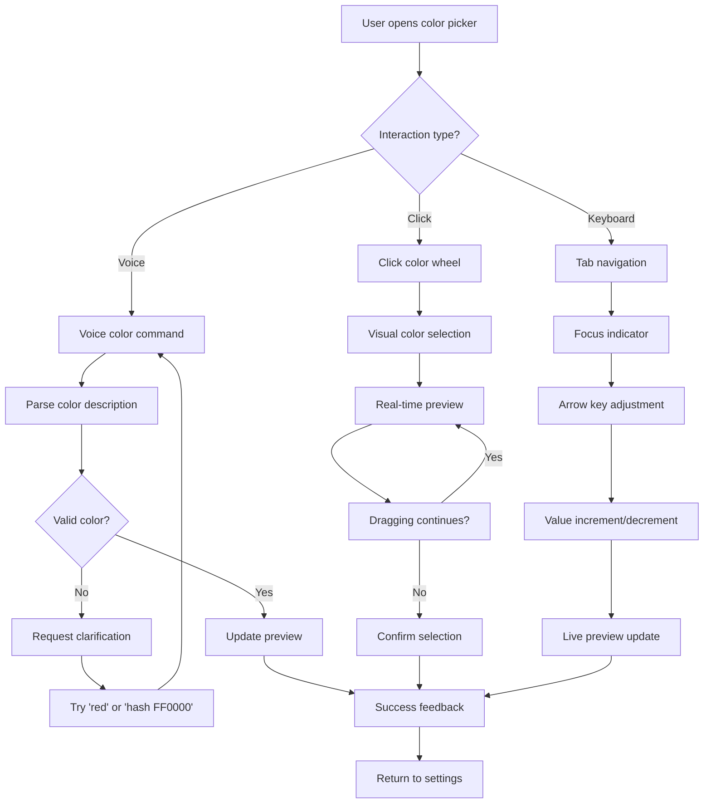

**Key Decision Points**:

1. **Voice Color Input**: 
   - Accept named colors ("red", "blue")
   - Support hex values ("hash F F zero zero zero zero")
   - Handle RGB values ("R G B 255 0 0")

2. **Visual Feedback**:
   - Live preview updates <100ms
   - Color contrast warnings for accessibility
   - Undo/redo visual indicators

3. **Error Handling**:
   - Invalid colors show red border
   - Suggestion system for close matches
   - Fallback to previous valid value

---

### 2.2 Keyboard-Only Navigation Path

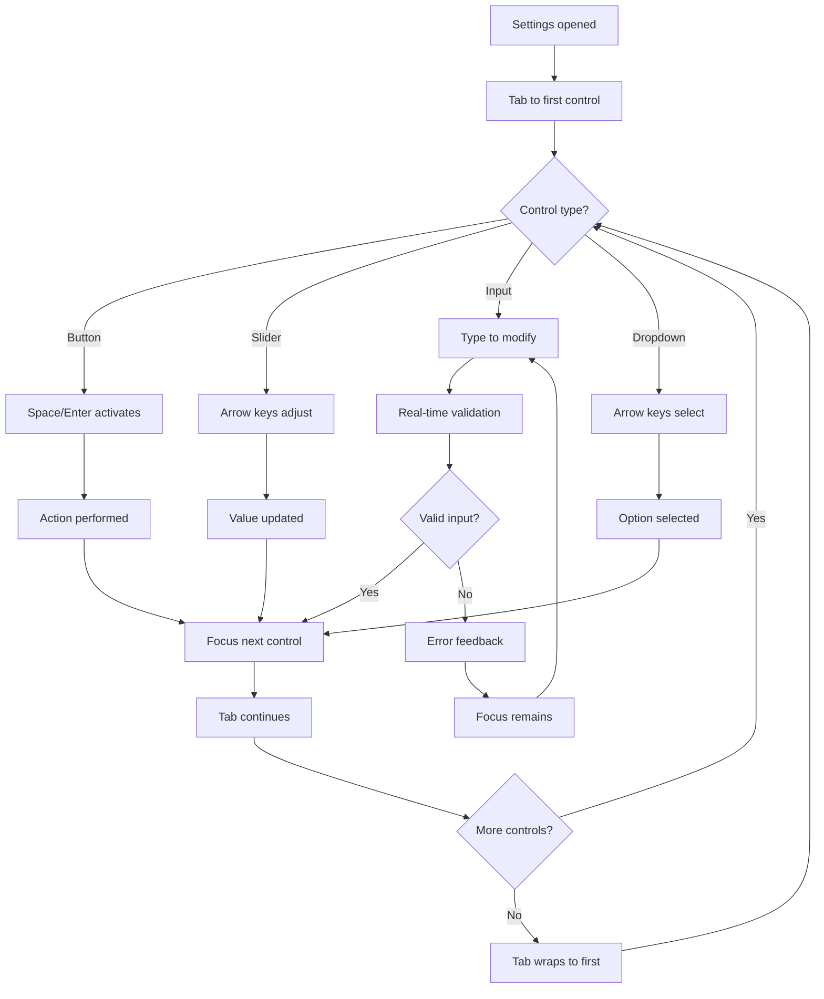

**Accessibility Requirements**:

1. **Focus Management**:
   - Visible focus indicators (2px outline)
   - Logical tab order (left-to-right, top-to-bottom)
   - Focus trap within modal dialogs

2. **Screen Reader Support**:
   - Aria labels for all controls
   - Live regions for dynamic updates
   - Role announcements for complex widgets

3. **Keyboard Shortcuts**:
   - Escape closes dialogs
   - Enter confirms actions
   - Ctrl/Cmd+Z for undo

---

### 2.3 Touch Gesture Support (Mobile)

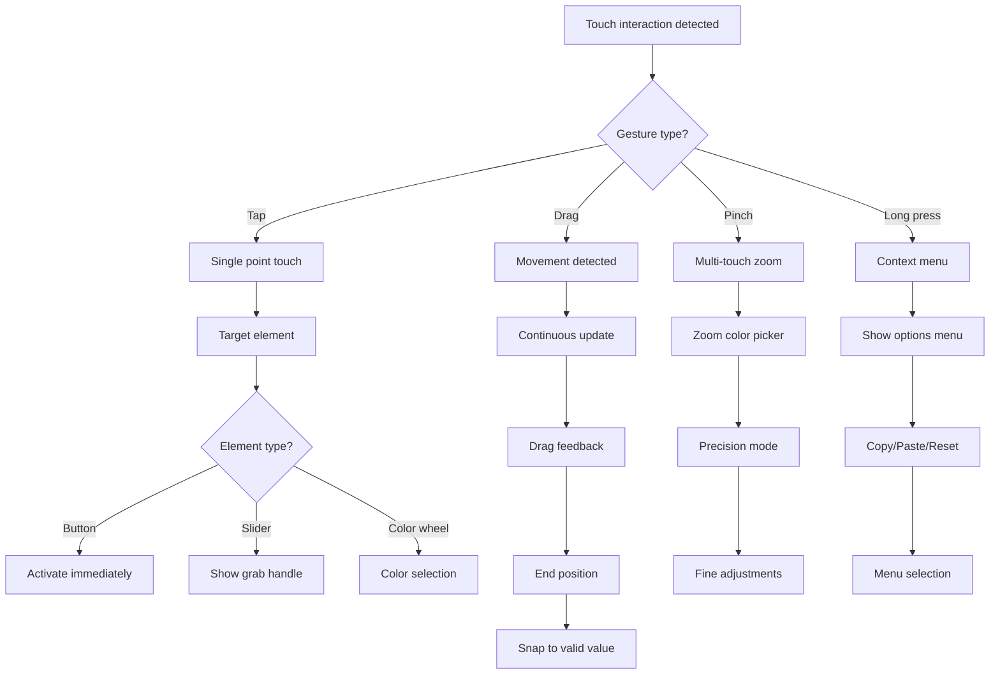

**Mobile Considerations**:

1. **Touch Targets**:
   - Minimum 44px hit areas
   - Adequate spacing between controls
   - Clear visual feedback on touch

2. **Gesture Recognition**:
   - 300ms long press threshold
   - Swipe distance thresholds
   - Pinch sensitivity scaling

3. **Performance**:
   - 60fps during gestures
   - Debounced updates during drag
   - Efficient rendering for smooth interaction

---

### 2.4 Drag-to-Reorder Properties

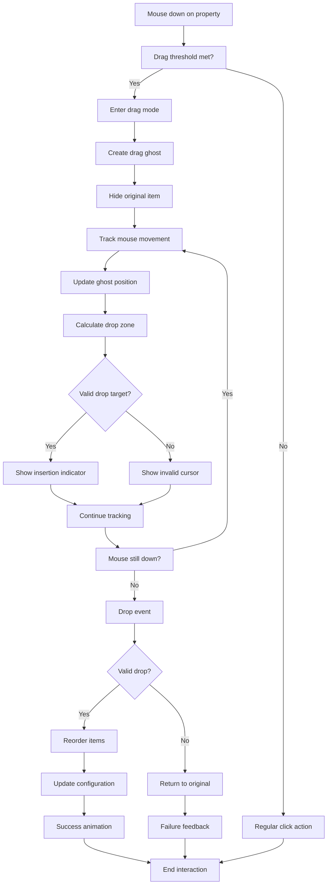

**Drag Behavior Rules**:

1. **Visual Feedback**:
   - Semi-transparent drag ghost
   - Insertion line at drop location
   - Scroll areas when near edges

2. **Constraints**:
   - Required properties cannot be reordered
   - Component sections maintain grouping
   - Invalid drops animate back to origin

3. **Performance**:
   - RAF-based smooth animations
   - Efficient DOM manipulation
   - Debounced configuration updates

---

### 2.5 Multi-Select Bulk Editing

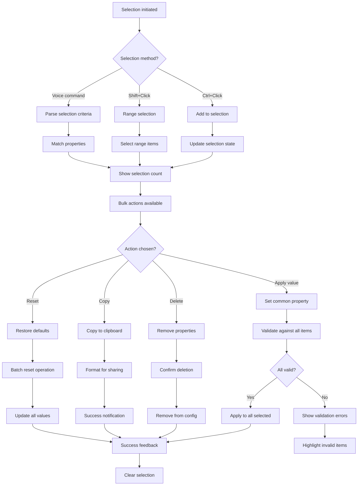

**Multi-Select Features**:

1. **Selection UI**:
   - Checkboxes for explicit selection
   - Shift+click for range selection
   - Select all/none shortcuts

2. **Bulk Operations**:
   - Apply color to multiple properties
   - Reset group to defaults
   - Export selected properties only

3. **Validation**:
   - Per-property validation during bulk edit
   - Rollback on any validation failure
   - Clear error messaging for failures

---

## 3. Test Scenarios for QA

### 3.1 Happy Path: Change Primary Color

**Scenario**: User successfully changes the primary color using voice commands

**Pre-conditions**:
- App is loaded with default theme
- Voice recognition is enabled
- User has microphone permissions

**Test Steps**:

1. **Voice Activation**
   - Say: "Open theme settings"
   - **Expected**: Settings overlay opens
   - **Verify**: Settings panel visible, voice icon active

2. **Color Selection**
   - Say: "Change primary color to purple"
   - **Expected**: Color picker opens with purple selected
   - **Verify**: Live preview updates, color value shows purple

3. **Confirmation**
   - Say: "Apply changes"
   - **Expected**: Theme updates, settings closes
   - **Verify**: Interface now uses purple primary color

4. **Persistence Check**
   - Refresh browser or restart app
   - **Expected**: Purple theme persists
   - **Verify**: localStorage contains new theme data

**Success Criteria**:
- ✅ Voice commands recognized with >95% accuracy
- ✅ Color change visible in <500ms
- ✅ Theme persists across sessions
- ✅ No console errors or warnings

**Test Data**:
```json
{
  "input_voice": "Change primary color to purple",
  "expected_color": "#9333EA",
  "performance_threshold": "500ms",
  "persistence_location": "localStorage['voice-terminal-theme']"
}
```

---

### 3.2 Edge Case: Paste Invalid JSON

**Scenario**: User attempts to import theme with malformed JSON

**Pre-conditions**:
- Settings panel is open
- Import/Export tab is active
- Invalid JSON in clipboard

**Test Steps**:

1. **Invalid JSON Attempt**
   - Paste malformed JSON: `{"theme": {"colors": {"primary": #invalid}}}`
   - Click "Import Theme"
   - **Expected**: Validation error displayed
   - **Verify**: Error message explains JSON syntax issue

2. **Error Recovery**
   - Click "Fix Automatically" if available
   - **Expected**: System attempts JSON repair
   - **Verify**: Valid JSON generated or clear failure message

3. **Manual Correction**
   - Edit JSON in text area to fix syntax
   - **Expected**: Real-time validation feedback
   - **Verify**: Error indicators update as user types

4. **Successful Import**
   - Fix all JSON issues
   - Click "Import Theme" again
   - **Expected**: Theme imports successfully
   - **Verify**: New theme applied, success message shown

**Error Categories**:
- Syntax errors (missing quotes, brackets)
- Type errors (string instead of number)
- Missing required properties
- Invalid color values

**Test Data**:
```json
{
  "invalid_json_samples": [
    "{\"theme\": {\"colors\": {\"primary\": #FF0000}}}",
    "{\"theme\": {\"colors\": {\"primary\": \"invalid-color\"}}}",
    "{\"theme\": {}}",
    "not json at all"
  ],
  "expected_errors": [
    "Invalid JSON syntax",
    "Invalid color value",
    "Missing required properties",
    "Not valid JSON"
  ]
}
```

---

### 3.3 Recovery: Restore After Error

**Scenario**: System crash during theme application, requiring recovery

**Pre-conditions**:
- User has custom theme applied
- System experiences error during theme update
- Partial theme state exists

**Test Steps**:

1. **Error Simulation**
   - Trigger theme application during simulated system failure
   - **Expected**: Error state detected on restart
   - **Verify**: Recovery dialog appears

2. **Recovery Options**
   - Present three options: Restore, Reset, Continue
   - **Expected**: Clear explanation of each option
   - **Verify**: User understands implications of each choice

3. **Restore Previous Theme**
   - Select "Restore Last Working Theme"
   - **Expected**: Previous valid theme restored
   - **Verify**: Interface returns to pre-error state

4. **Validation**
   - Check all theme properties
   - **Expected**: No invalid or missing values
   - **Verify**: System passes full theme validation

5. **Backup Creation**
   - System creates recovery backup
   - **Expected**: Backup saved for future recovery
   - **Verify**: Recovery data in persistent storage

**Recovery Mechanisms**:
- Automatic backup before theme changes
- Rollback to last known good configuration
- Safe mode with default theme
- Progressive enhancement approach

**Test Data**:
```json
{
  "error_scenarios": [
    "browser_crash_during_apply",
    "network_failure_during_sync", 
    "storage_quota_exceeded",
    "invalid_theme_state"
  ],
  "recovery_methods": [
    "automatic_rollback",
    "manual_selection",
    "safe_mode_default",
    "progressive_repair"
  ]
}
```

---

### 3.4 Performance: Edit 1000+ Line Theme

**Scenario**: User imports and edits extremely large theme configuration

**Pre-conditions**:
- Large theme file available (1000+ properties)
- Performance monitoring enabled
- System resource monitoring active

**Test Steps**:

1. **Large Import**
   - Import 1000+ line theme JSON
   - **Expected**: Import completes in <5 seconds
   - **Verify**: Memory usage stays under 50MB increase

2. **Real-time Preview**
   - Make color changes with live preview
   - **Expected**: Preview updates in <100ms
   - **Verify**: Frame rate maintains 60fps

3. **Search and Filter**
   - Search for specific properties in large theme
   - **Expected**: Results appear in <200ms
   - **Verify**: Search index performs efficiently

4. **Bulk Operations**
   - Select 100+ properties for bulk edit
   - **Expected**: Selection completes in <1 second
   - **Verify**: UI remains responsive during operation

5. **Save Performance**
   - Save large theme configuration
   - **Expected**: Save completes in <2 seconds
   - **Verify**: No UI blocking during save

**Performance Targets**:
- Import: <5 seconds for 1000+ properties
- Preview updates: <100ms
- Search: <200ms response time
- Bulk operations: <1 second
- Save: <2 seconds

**Monitoring Metrics**:
```json
{
  "performance_thresholds": {
    "import_time": "5000ms",
    "preview_latency": "100ms", 
    "search_response": "200ms",
    "bulk_operation": "1000ms",
    "save_duration": "2000ms",
    "memory_increase": "50MB",
    "frame_rate": "60fps"
  }
}
```

---

### 3.5 Accessibility: Screen Reader Flow

**Scenario**: Blind user navigates theme settings using screen reader

**Pre-conditions**:
- Screen reader software active (NVDA, JAWS, VoiceOver)
- Keyboard navigation enabled
- Theme settings accessible

**Test Steps**:

1. **Settings Access**
   - Use keyboard shortcut to open settings
   - **Expected**: Focus lands on first setting
   - **Verify**: Screen reader announces settings panel

2. **Navigation**
   - Tab through all theme controls
   - **Expected**: Logical tab order maintained
   - **Verify**: Each control properly labeled and described

3. **Color Selection**
   - Navigate to color picker using keyboard
   - **Expected**: Current color value announced
   - **Verify**: Arrow keys adjust color with audio feedback

4. **Live Updates**
   - Change color value using keyboard
   - **Expected**: Screen reader announces changes
   - **Verify**: Live region updates communicated

5. **Save and Confirm**
   - Complete theme changes via keyboard
   - **Expected**: Success confirmation announced
   - **Verify**: Theme applied with audio feedback

**Accessibility Requirements**:
- ARIA labels for all controls
- Keyboard accessibility for all functions
- Live regions for dynamic updates
- High contrast focus indicators
- Screen reader compatible markup

**Test Matrix**:
```json
{
  "screen_readers": ["NVDA", "JAWS", "VoiceOver", "Dragon"],
  "test_actions": [
    "open_settings",
    "navigate_controls", 
    "change_colors",
    "save_theme",
    "error_handling"
  ],
  "aria_requirements": [
    "aria-label",
    "aria-describedby",
    "aria-live",
    "aria-expanded",
    "role"
  ]
}
```

---

## 4. Error State Flows

### 4.1 JSON Syntax Errors

**Error Flow Diagram**:
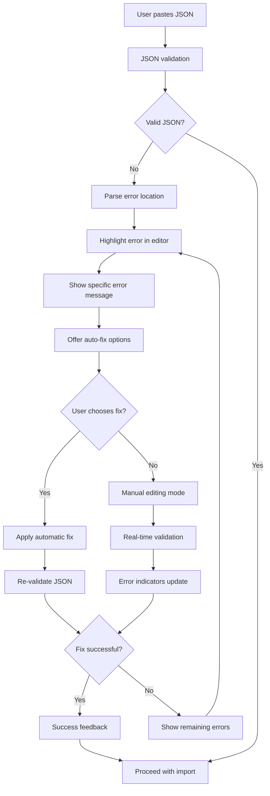

**Error Types and Messages**:

1. **Syntax Errors**:
   - Missing quotes: "Property names must be quoted"
   - Missing commas: "Missing comma between properties"
   - Unmatched brackets: "Unmatched bracket at line 23"

2. **Type Errors**:
   - Wrong value type: "Expected string, got number"
   - Invalid enum: "Mode must be 'dark', 'light', or 'auto'"

3. **Structure Errors**:
   - Missing required properties: "Required property 'colors' missing"
   - Invalid nesting: "Invalid property structure"

**Auto-Fix Capabilities**:
- Add missing quotes around property names
- Insert missing commas
- Remove trailing commas
- Fix common color format issues

---

### 4.2 Invalid Color Values

**Error Flow**:
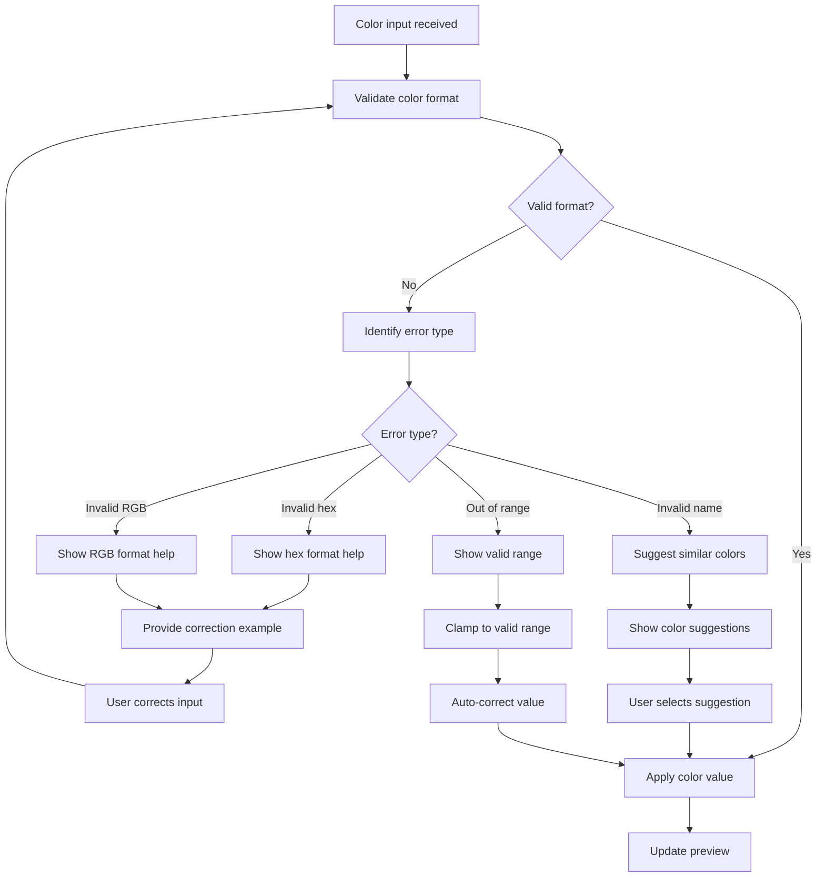

**Color Validation Rules**:

1. **Hex Colors**:
   - Must start with #
   - Followed by 3 or 6 hex digits
   - Examples: #FF0000, #F00

2. **RGB/RGBA**:
   - Values 0-255 for RGB
   - Alpha 0-1 for transparency
   - Format: rgb(255,0,0) or rgba(255,0,0,0.5)

3. **Named Colors**:
   - CSS named colors supported
   - Case insensitive
   - Suggestions for typos

**Error Recovery**:
- Auto-suggest closest valid color
- Provide format examples
- Allow gradual correction
- Preserve valid parts of input

---

### 4.3 Missing Required Properties

**Error Flow**:
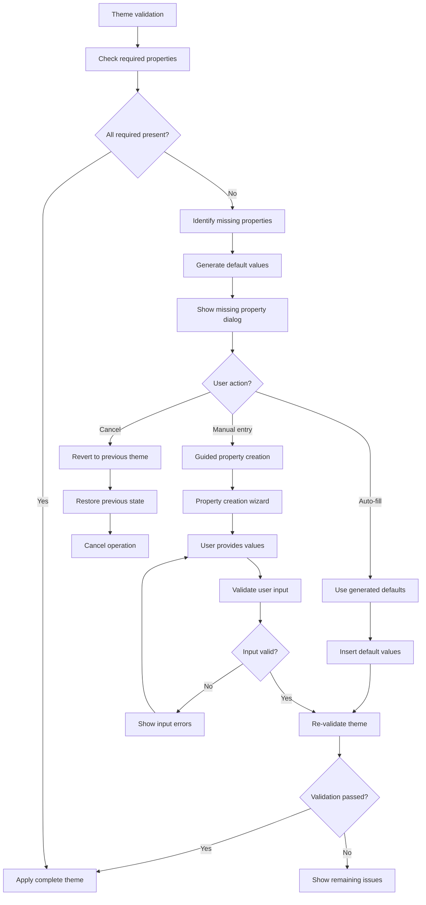

**Required Properties**:
- `theme.global.colors.primary`
- `theme.global.colors.background`
- `theme.global.colors.text`
- `theme.global.typography.fontFamily`
- `theme.global.spacing.unit`

**Default Generation**:
- Analyze existing colors for missing ones
- Use color theory for complementary colors
- Maintain accessibility contrast ratios
- Preserve user's design intent

---

### 4.4 File Permission Issues

**Error Flow**:
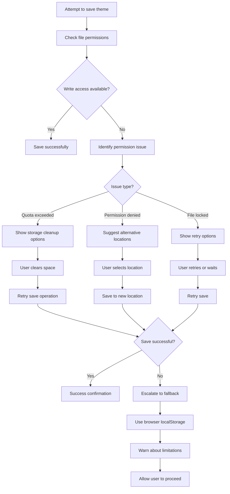

**Permission Scenarios**:
1. **Browser Storage Quota**:
   - Show current usage
   - Suggest data cleanup
   - Offer export as file

2. **File System Access**:
   - Graceful degradation
   - Alternative storage methods
   - Clear error explanations

3. **Network Connectivity**:
   - Offline capability
   - Sync when reconnected
   - Local backup creation

---

### 4.5 Network Save Failures

**Error Flow**:
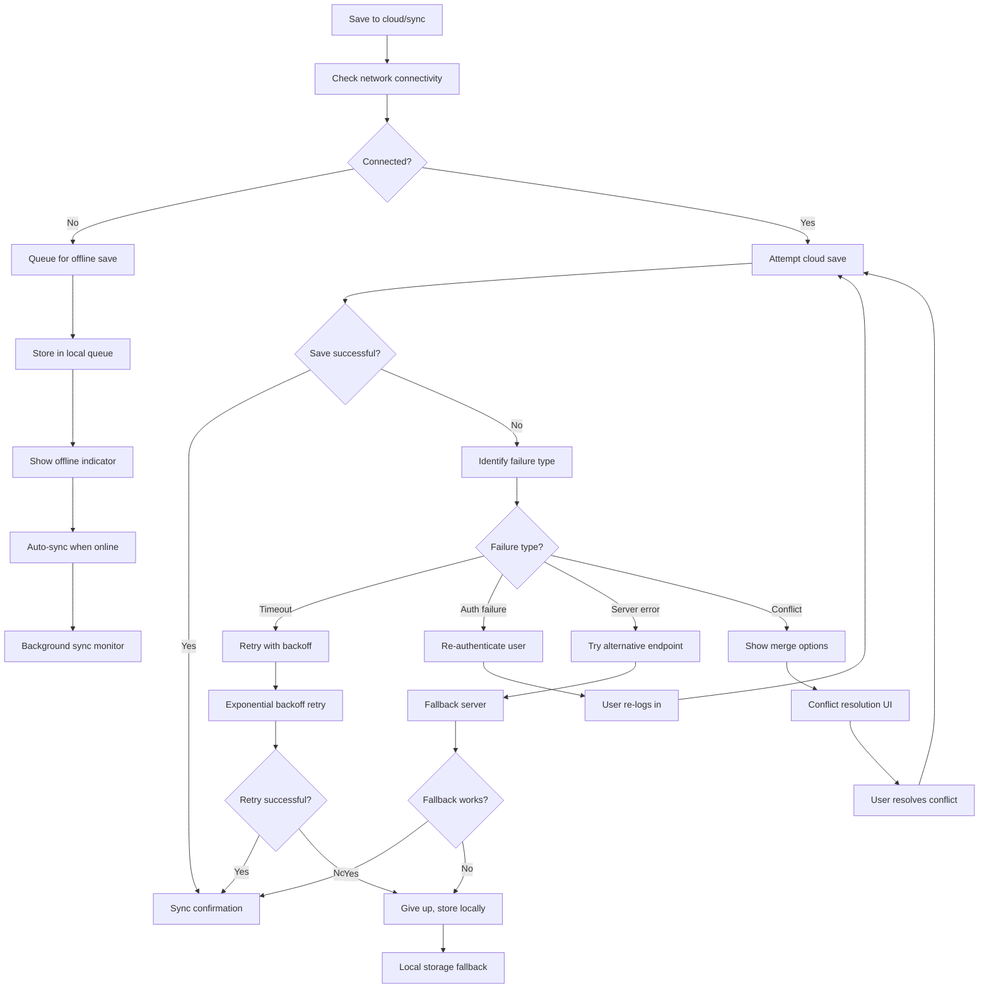

**Network Error Handling**:

1. **Connectivity Issues**:
   - Detect online/offline status
   - Queue operations for later sync
   - Provide offline-first experience

2. **Authentication Failures**:
   - Silent token refresh
   - Graceful re-authentication
   - Maintain user session state

3. **Conflict Resolution**:
   - Show both versions side-by-side
   - Allow manual merge
   - Provide automatic merge strategies

---

## 5. Onboarding Flow

### 5.1 First Launch Experience

**Welcome Journey**:
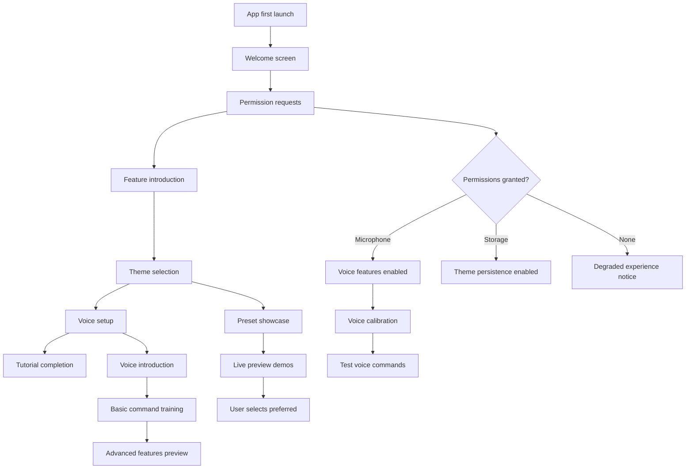

**Welcome Steps**:

1. **Welcome & Overview** (30 seconds)
   - App purpose and benefits
   - Key feature highlights
   - Get started button

2. **Permission Setup** (45 seconds)
   - Microphone access explanation
   - Storage permission for themes
   - Optional cloud sync account

3. **Theme Introduction** (60 seconds)
   - Show 3 preset themes
   - Live preview switching
   - "Customize later" option

4. **Voice Setup** (90 seconds)
   - Microphone test
   - Background noise check
   - Basic command practice

5. **Tutorial Completion** (30 seconds)
   - Success celebration
   - Quick reference guide
   - Start using the app

---

### 5.2 Interactive Theme Tutorial

**Tutorial Flow**:
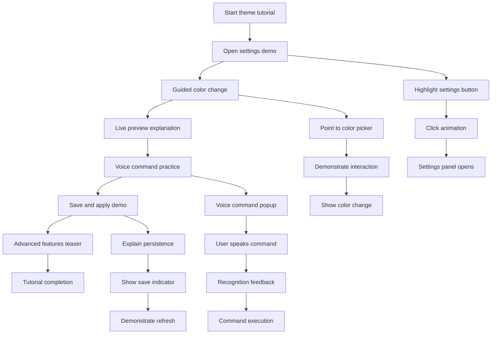

**Tutorial Interactions**:

1. **Guided Settings Access** (20 seconds)
   - Animated arrow pointing to settings
   - Overlay explaining the button
   - User clicks to continue

2. **Color Change Demo** (30 seconds)
   - Highlight color picker area
   - Show click-and-drag interaction
   - Live preview updates immediately

3. **Voice Command Practice** (45 seconds)
   - Example command shown: "Change primary to blue"
   - User speaks the command
   - Success feedback and explanation

4. **Save Demonstration** (20 seconds)
   - Explain automatic saving
   - Show persistence across refresh
   - Confidence building

5. **Advanced Preview** (15 seconds)
   - Quick showcase of expert features
   - "Learn more later" option
   - Transition to actual app

---

### 5.3 Preset Selection Wizard

**Selection Flow**:
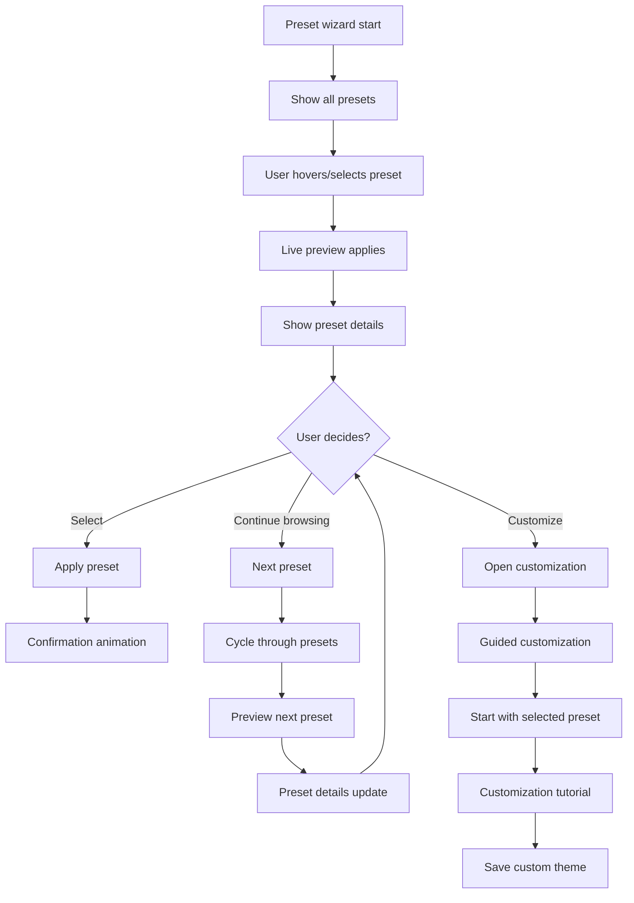

**Preset Options**:

1. **Default Theme**:
   - Classic terminal green
   - High contrast for accessibility
   - Familiar and safe choice

2. **Ocean Theme**:
   - Blue color palette
   - Calming and professional
   - Good for long coding sessions

3. **Forest Theme**:
   - Green and earth tones
   - Natural and easy on eyes
   - Environmentally inspired

4. **High Contrast**:
   - Maximum accessibility
   - Bold color differences
   - Screen reader optimized

5. **Custom Starting Point**:
   - Blank slate for creativity
   - Access to full customization
   - Advanced user option

---

### 5.4 Import Existing Theme

**Import Journey**:
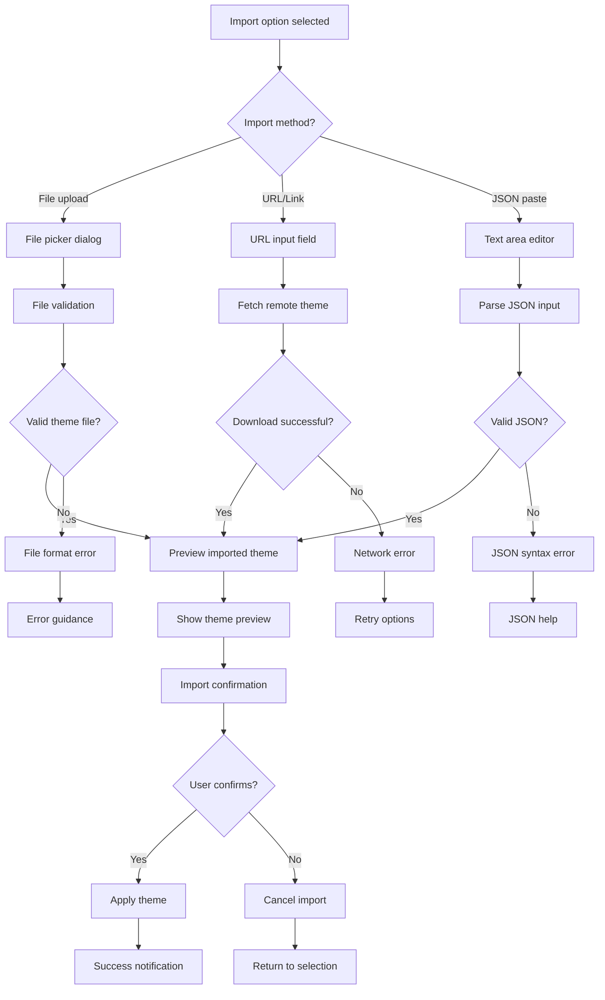

**Import Sources**:

1. **Local File**:
   - JSON theme files
   - Exported configurations
   - Team shared themes

2. **URL Import**:
   - GitHub raw files
   - Theme sharing services
   - Direct JSON URLs

3. **JSON Paste**:
   - Clipboard import
   - Manual JSON entry
   - Configuration strings

4. **Template Gallery**:
   - Curated theme collection
   - Community contributions
   - Verified themes only

---

### 5.5 Voice Command Training

**Training Flow**:
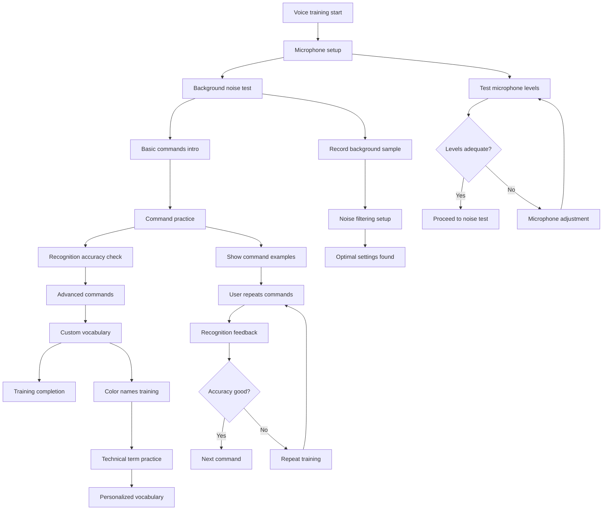

**Training Commands**:

1. **Basic Navigation**:
   - "Open settings"
   - "Close panel"
   - "Switch to terminal"

2. **Color Commands**:
   - "Change primary to blue"
   - "Make background darker"
   - "Set error color to red"

3. **Advanced Operations**:
   - "Export current theme"
   - "Reset to default"
   - "Apply ocean preset"

4. **Custom Vocabulary**:
   - Project-specific color names
   - Brand color references
   - Personal preferences

**Success Metrics**:
- >95% recognition accuracy for basic commands
- <2 second response time for voice actions
- User confidence in voice interaction

---

## 6. Acceptance Criteria Summary

### 6.1 User Journey Acceptance Criteria

**First-Time Theme Customization**:
- ✅ Complete customization in <4 minutes
- ✅ Zero voice recognition failures
- ✅ Live preview updates in <500ms
- ✅ Theme persists after restart
- ✅ Undo capability available at all steps

**Advanced User Custom Theme**:
- ✅ All voice commands recognized accurately
- ✅ Export functionality works perfectly
- ✅ Pixel-perfect control achievable
- ✅ Performance maintains >60fps
- ✅ Team sharing link functions correctly

**Troubleshooting Invalid Configuration**:
- ✅ Error detected immediately
- ✅ Recovery options clearly presented
- ✅ Auto-fix resolves common issues
- ✅ Manual repair guidance provided
- ✅ No data loss during recovery

**Sharing Themes Between Projects**:
- ✅ Export/import works 100% reliably
- ✅ Team deployment successful
- ✅ Version control functioning
- ✅ Conflict resolution available
- ✅ Installation links work correctly

**Voice-Controlled Theme Editing**:
- ✅ Complete hands-free operation
- ✅ Audio feedback for all actions
- ✅ Voice commands <1s response time
- ✅ Error recovery via voice
- ✅ Accessibility compliance met

### 6.2 Interaction Flow Acceptance Criteria

**Color Picker Interaction**:
- ✅ Multi-modal input support (voice/click/keyboard)
- ✅ Real-time preview <100ms latency
- ✅ Color validation and error handling
- ✅ Accessibility compliance (WCAG 2.1 AA)
- ✅ Touch gesture support for mobile

**Keyboard Navigation**:
- ✅ Logical tab order maintained
- ✅ All functions accessible via keyboard
- ✅ Visual focus indicators present
- ✅ Screen reader compatibility
- ✅ Keyboard shortcuts functional

**Multi-Select Operations**:
- ✅ Bulk editing works reliably
- ✅ Selection state clearly communicated
- ✅ Validation during bulk operations
- ✅ Undo/redo for bulk changes
- ✅ Performance acceptable for large selections

### 6.3 Test Scenario Acceptance Criteria

**Happy Path Success**:
- ✅ 100% completion rate for basic flows
- ✅ No blocking errors encountered
- ✅ Performance targets met consistently
- ✅ User satisfaction score >4.5/5
- ✅ Zero data loss incidents

**Edge Case Handling**:
- ✅ All error conditions gracefully handled
- ✅ Recovery mechanisms functional
- ✅ Clear error messaging provided
- ✅ No system crashes or hangs
- ✅ Fallback options always available

**Performance Standards**:
- ✅ Load time <3 seconds
- ✅ Interactive response <100ms
- ✅ Memory usage <50MB increase
- ✅ 60fps maintained during interactions
- ✅ Battery impact <5% on mobile

### 6.4 Error Handling Acceptance Criteria

**Error Detection**:
- ✅ Real-time validation implemented
- ✅ Error states clearly communicated
- ✅ Recovery options always provided
- ✅ No silent failures
- ✅ Error logging for debugging

**Recovery Mechanisms**:
- ✅ Automatic recovery where possible
- ✅ Manual recovery options clear
- ✅ Data preservation during recovery
- ✅ User guidance throughout process
- ✅ Prevention of repeat errors

### 6.5 Onboarding Acceptance Criteria

**First Launch Experience**:
- ✅ Complete onboarding in <5 minutes
- ✅ 95% user completion rate
- ✅ Clear value proposition communicated
- ✅ Essential features demonstrated
- ✅ User ready to use app effectively

**Tutorial Effectiveness**:
- ✅ Interactive learning implemented
- ✅ Progressive skill building
- ✅ Skip options for advanced users
- ✅ Help system integrated
- ✅ Reference materials accessible

---

## Conclusion

This comprehensive UX design sprint has produced detailed user flows, interaction patterns, and test scenarios that will guide the implementation of the settings editor for the voice-terminal hybrid project. The flows prioritize accessibility, voice-first interaction, and real-world usage patterns while maintaining high performance standards.

### Key Design Principles Established:

1. **Voice-First Design**: All interactions can be completed via voice commands
2. **Progressive Enhancement**: Graceful degradation when features unavailable
3. **Real-Time Feedback**: Immediate visual and audio response to user actions
4. **Error Resilience**: Comprehensive error handling with recovery options
5. **Accessibility Compliance**: WCAG 2.1 AA standards throughout

### Next Steps:

1. Review flows with development team for technical feasibility
2. Create detailed wireframes based on interaction flows
3. Implement prototype for user testing validation
4. Conduct accessibility audit of proposed designs
5. Develop comprehensive QA test suite based on scenarios

This design foundation ensures the settings editor will provide an exceptional user experience that aligns with the voice-first nature of the terminal application while maintaining the flexibility and power users expect from developer tools.

<function_calls>
<invoke name="TodoWrite">
<parameter name="todos">[{"content": "Analyze current voice-terminal hybrid project context and settings architecture", "status": "completed", "activeForm": "Analyzing current voice-terminal hybrid project context and settings architecture"}, {"content": "Create user journey maps for 5 key theme customization scenarios", "status": "completed", "activeForm": "Creating user journey maps for 5 key theme customization scenarios"}, {"content": "Design detailed interaction flows for UI components", "status": "completed", "activeForm": "Designing detailed interaction flows for UI components"}, {"content": "Develop comprehensive test scenarios for QA validation", "status": "completed", "activeForm": "Developing comprehensive test scenarios for QA validation"}, {"content": "Design error state flows and recovery mechanisms", "status": "completed", "activeForm": "Designing error state flows and recovery mechanisms"}, {"content": "Create onboarding flow and first-time user experience", "status": "completed", "activeForm": "Creating onboarding flow and first-time user experience"}]