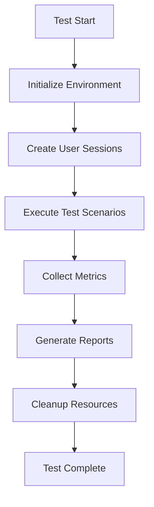

# E2E System Validation Framework

This comprehensive End-to-End (E2E) testing framework validates the complete browser → WebSocket proxy → tmux backend flow under production conditions. It ensures the system meets all critical requirements including performance, reliability, security, and accessibility.

## Framework Overview

### Test Suites

1. **SystemIntegrationTests.ts** - Complete user journeys from browser to terminal execution
2. **BrowserCompatibilityTests.ts** - Cross-browser validation (Chrome, Firefox, Safari, Edge, Mobile)
3. **NetworkResilienceTests.ts** - Connection handling, network conditions, and resilience
4. **MultiUserScenarios.ts** - Concurrent session management and user isolation
5. **FailureRecoveryTests.ts** - System resilience under various failure scenarios

### Success Criteria

The framework validates these critical requirements:

- ✅ **100% User Journey Completion Rate**
- ✅ **<65ms End-to-End Latency maintained**
- ✅ **Zero Data Loss during failures**
- ✅ **<5 Second Recovery from outages**
- ✅ **>98% Cross-Browser Feature Parity**

## Quick Start

### Prerequisites

```bash
# Install dependencies
npm install

# Install Playwright browsers
npx playwright install
```

### Running Tests

```bash
# Run all critical tests
npm run validation:system

# Run full validation suite
npm run validation:full

# Run specific test suite
npm run test:e2e:system
npm run test:e2e:browser
npm run test:e2e:network
npm run test:e2e:multiuser
npm run test:e2e:recovery

# Run with specific focus
npm run validation:performance  # Performance & scalability
npm run validation:reliability  # Network & recovery tests
npm run validation:ci          # CI-optimized critical tests
```

### Test Categories

```bash
# Smoke tests (basic functionality)
npm run test:e2e:smoke

# Critical path tests only
npm run test:e2e:critical

# Generate reports only
npm run test:e2e:report
```

## Test Configuration

### Environment Configuration

Tests adapt to different environments automatically:

- **Development**: Full debugging, slower execution, all browsers
- **CI**: Headless, faster execution, limited browsers  
- **Staging**: Production-like conditions, extended timeouts
- **Production**: Read-only validation, security-focused

Configure via environment variables:
```bash
export NODE_ENV=staging
export CI=true
export ENABLE_NETWORK_TESTS=true
export ENABLE_MOBILE_TESTS=true
```

### Custom Configuration

Override default settings in `tests/e2e/config/e2e.config.ts`:

```typescript
export const customConfig = createTestConfig({
  performance: {
    maxLatency: 50,        // Stricter latency requirement
    maxMemoryUsage: 150    // Lower memory limit
  },
  multiUser: {
    maxConcurrentUsers: 50 // Test higher concurrency
  }
});
```

## Test Architecture

### Core Components

1. **TestEnvironment** - Manages test setup, user sessions, and cleanup
2. **TestReporter** - Generates comprehensive reports with metrics
3. **TestDataManager** - Handles test data generation and management
4. **TestRunner** - Orchestrates test execution and reporting

### Test Flow



### Session Management

Each test creates isolated user sessions:

```typescript
const session = await testEnv.createUserSession(browser, {
  sessionId: 'test_001',
  userId: 'test_user',
  permissions: ['microphone'],
  viewport: { width: 1920, height: 1080 }
});

await testEnv.connectUserSession('test_001');
```

## Test Scenarios

### System Integration Tests

- **Basic Terminal Operations**: Login → Create session → Execute commands → View output
- **Multi-Session Management**: Create multiple sessions → Switch between → Concurrent operations  
- **Voice Integration**: Voice commands → Terminal execution → Audio feedback
- **Security Validation**: Malicious input → Security blocking → Audit logging
- **Performance Under Load**: Many users → Response time validation → Resource usage

### Browser Compatibility Tests

- **Desktop Browsers**: Chrome, Firefox, Safari, Edge
- **Mobile Browsers**: iOS Safari, Android Chrome, Samsung Internet
- **Feature Parity**: WebSocket support, JavaScript compatibility, Audio APIs
- **Accessibility**: Screen readers, keyboard navigation, WCAG compliance
- **Performance Variance**: Cross-browser performance comparison

### Network Resilience Tests

- **Connection Recovery**: WebSocket drops → Automatic reconnection → State preservation
- **Network Conditions**: 3G, 4G, WiFi, Poor connectivity simulation
- **Packet Loss**: Intermittent packet loss → Tolerance testing → Data integrity
- **Offline/Online**: Network partition → Queue operations → Sync on recovery

### Multi-User Scenarios

- **Concurrent Sessions**: 10-25 simultaneous users → Resource sharing → Session isolation
- **Load Testing**: Burst traffic → Response time under load → Fair resource distribution
- **User Isolation**: Security boundaries → Permission enforcement → Data protection
- **Cross-Browser Multi-User**: Different browsers → Same server → Consistent experience

### Failure Recovery Tests

- **Server Failures**: WebSocket crash → Backend failure → Database connection loss
- **Resource Exhaustion**: Memory pressure → CPU overload → Disk space full
- **Network Partitions**: Split-brain scenarios → Partition healing → Data consistency
- **Client Failures**: Browser crashes → Tab reloads → JavaScript errors

## Metrics and Reporting

### Performance Metrics

- **Latency**: End-to-end command execution time
- **Throughput**: Commands processed per second
- **Memory Usage**: Peak and average memory consumption
- **Connection Stability**: WebSocket connection uptime

### Reliability Metrics

- **Connection Drops**: Number of disconnection events
- **Recovery Time**: Time to restore functionality after failure
- **Data Loss Events**: Instances of data corruption or loss
- **Error Rate**: Percentage of failed operations

### Test Reports

The framework generates multiple report formats:

1. **HTML Report**: Interactive browser-based report with charts
2. **JSON Report**: Machine-readable detailed metrics
3. **Markdown Report**: Human-readable summary for documentation
4. **JUnit XML**: CI/CD integration format

### Report Locations

```
test-results/
├── system-validation-report.html    # Main HTML report
├── system-validation-report.json    # Detailed JSON data
├── system-validation-report.md      # Markdown summary
├── playwright-report/               # Playwright HTML reports
├── screenshots/                     # Failure screenshots
├── videos/                         # Test execution videos
└── traces/                         # Detailed execution traces
```

## CI/CD Integration

### GitHub Actions Workflow

The framework includes a comprehensive GitHub Actions workflow (`.github/workflows/e2e-system-validation.yml`) that:

- Runs tests across multiple browsers and conditions
- Generates performance analysis and security reports
- Creates GitHub PR comments with results
- Uploads artifacts for investigation
- Sends Slack notifications for scheduled runs

### Workflow Triggers

- **Push to main/develop**: Critical tests only
- **Pull Requests**: Full compatibility validation
- **Scheduled**: Daily complete validation at 2 AM UTC
- **Manual**: Configurable test types and conditions

### Workflow Inputs

```yaml
test_type: [critical, full, smoke, performance, reliability]
browser_matrix: true/false
network_tests: true/false
```

## Troubleshooting

### Common Issues

1. **Test Timeouts**
   ```bash
   # Increase timeout for slow environments
   export TEST_TIMEOUT=60000
   ```

2. **Browser Launch Failures**
   ```bash
   # Install system dependencies
   npx playwright install-deps
   ```

3. **Memory Issues**
   ```bash
   # Reduce concurrent workers
   export PLAYWRIGHT_WORKERS=1
   ```

4. **Network Test Failures**
   ```bash
   # Disable network simulation in unstable environments
   export ENABLE_NETWORK_TESTS=false
   ```

### Debug Mode

Enable detailed logging and slower execution:

```bash
# Enable debug mode
export DEBUG=pw:api,pw:browser
export PWDEBUG=1

# Run with UI for debugging
npm run test:e2e:ui
```

### Performance Analysis

Analyze performance issues:

```bash
# Generate performance report
npm run validation:performance

# Analyze specific results
node scripts/analyze-performance.js test-results/
```

## Contributing

### Adding New Tests

1. Create test file in appropriate suite
2. Follow naming convention: `describe('Feature Name', () => {})`
3. Use `@critical`, `@performance`, or other tags for categorization
4. Include proper cleanup in `afterEach` hooks

### Test Guidelines

- **Isolation**: Each test should be independent
- **Cleanup**: Always clean up resources
- **Assertions**: Use meaningful assertion messages
- **Performance**: Consider test execution time
- **Documentation**: Comment complex test logic

### Example Test Structure

```typescript
test.describe('Feature Tests', () => {
  let testEnv: TestEnvironment;

  test.beforeEach(async () => {
    testEnv = new TestEnvironment(config);
    await testEnv.initialize();
  });

  test.afterEach(async () => {
    if (testEnv) {
      await testEnv.cleanup();
    }
  });

  test('should perform basic operation @critical', async ({ browser }) => {
    // Test implementation
  });
});
```

## Advanced Usage

### Custom Test Environment

```typescript
const customEnv = new TestEnvironment({
  baseUrl: 'https://custom.example.com',
  wsProxyUrl: 'wss://custom-ws.example.com', 
  testTimeout: 45000,
  retryAttempts: 3,
  networkConditions: {
    downloadThroughput: 1024 * 1024, // 1 Mbps
    uploadThroughput: 512 * 1024,    // 512 Kbps
    latency: 100                     // 100ms
  }
});
```

### Performance Monitoring

```typescript
// Measure performance during test
const startTime = Date.now();
const result = await testEnv.executeCommand(sessionId, command);
const latency = Date.now() - startTime;

expect(latency).toBeLessThan(65); // Latency requirement
```

### Multi-User Test Pattern

```typescript
// Create multiple concurrent users
const userCount = 10;
const sessions = [];

for (let i = 0; i < userCount; i++) {
  const session = await testEnv.createUserSession(browser, {
    sessionId: `user_${i}`,
    userId: `test_user_${i}`
  });
  sessions.push(session);
}

// Execute operations concurrently
const results = await Promise.all(
  sessions.map(session => 
    testEnv.executeCommand(session.sessionId, 'echo "concurrent test"')
  )
);

// Verify all operations succeeded
results.forEach(result => {
  expect(result.success).toBe(true);
});
```

## Support

For issues, questions, or contributions:

1. Check existing issues in the repository
2. Review test logs and reports for detailed error information
3. Use debug mode for detailed execution traces
4. Submit issues with reproduction steps and environment details

---

*This framework ensures the voice-terminal-hybrid system meets all production requirements through comprehensive automated validation.*